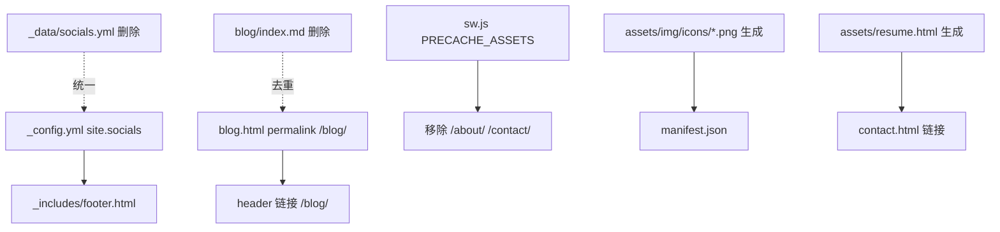

## 用户需求

修复 halfism.github.io 仓库检索发现的 8 项待修问题，全部修复。

## 核心修复项与已确认决策

1. **占位凭证**：GA tracking_id、giscus repo_id/category_id、Formspree form_id 均为占位符且无法接入。按用户决策**保留 _config.yml 原值不动**，仅在占位处补充注释说明待填。
2. **缺失资源**：manifest 图标（8 个 PNG）、avatar.png、og-image.png、resume.pdf 均缺失。按用户决策**生成占位资源**：用无第三方依赖的 Python 脚本生成 PNG 图标/头像/og-image；resume 改用 HTML 占位说明页，使所有引用不再失效。
3. **重复页面**：blog.html 与 blog/index.md 均输出博客列表。按用户决策**保留 blog.html，删除 blog/index.md**，并给 blog.html 增加 `permalink: /blog/` 以避免导航 `/blog/` 断链。
4. **社交双数据源**：_config.yml 的 `site.socials` 与 `_data/socials.yml` 并存。按用户决策**统一到 _config**：footer 改写遍历 `site.socials`，删除 `_data/socials.yml`。
5. **sw.js 预缓存**：PRECACHE_ASSETS 含不存在的 `/about/`、`/contact/`，移除这两项。
6. **未使用字段**：清理 `_data/skills.yml` 的 `languages.color` 与 `_data/certificates.yml` 的 `color`（经确认对应 section 未引用）。
7. **过时文档**：AGENTS.md 描述的是已废弃的拟态版本，重写为当前真实架构。
8. **双体系差异**：index.html（独立静态单页）与 en/index.html（Jekyll 组件页）差异属设计选择，仅在文档中说明，不改动代码。

## 功能性说明

修复后站点无失效引用、无重复页面、无冗余数据、PWA 预缓存路径有效，文档与代码一致；凭证类功能保持占位待用户填真实值后启用。

## 技术栈

- 静态站点生成器：Jekyll 3.9 + GitHub Pages（Ruby 3.2，`bundle exec jekyll build`）
- 前端：原生 HTML/CSS/JS（无构建步骤，纯静态资源）
- 占位图片生成：Python 3 标准库（zlib + struct 手写最小 PNG），零第三方依赖

## 实现方案

### 总体策略

以"最小改动、不破坏现有双体系"为原则，分三条线并行处理：(1) 资源补齐（脚本生成 PNG + HTML 占位页）；(2) 结构去重与统一（blog 页、socials 数据源）；(3) 配置与文档修正（sw.js、数据字段、AGENTS.md）。所有改动均不影响独立静态首页 `index.html` + `styles/main.css` 体系。

### 关键技术决策

1. **占位 PNG 用 Python 脚本生成**：手写 PNG（IHDR+IDAT+zlib）生成纯色底 + 居中 "H" 字样的图标，避免引入 Pillow/ImageMagick 等不确定依赖，可重复执行、可纳入版本库。
2. **resume 用 HTML 页而非 PDF**：生成 `assets/resume.html` / `assets/resume_en.html` 占位说明页，修改 `contact.html` 下载链接指向它们，规避无 PDF 生成库的环境限制。
3. **blog 去重采用 permalink 接管**：给 `blog.html` 加 `permalink: /blog/`，删除 `blog/index.md`，使原 `/blog/` 路由由 blog.html 提供，header 中 `/blog/` 链接零改动。
4. **socials 统一到 _config**：footer 改为遍历 `site.socials` 哈希（github/twitter/linkedin/email），去掉对 `hover_class` 的依赖，使用统一 hover 样式，删除 `_data/socials.yml`。
5. **凭证占位保留**：严格遵循用户决策，不修改 GA/giscus/Formspree 字段值，仅在 `_config.yml` 对应行上方加注释标注"待填真实值后启用"。

### 实现注意（防回归）

- 生成 PNG 后需确认 `manifest.json` 的 8 个图标路径（`/assets/img/icons/icon-NxN.png`）与实际文件一一对应。
- `contact.html` 两处 resume 链接（`/assets/resume.pdf`、`/assets/resume_en.pdf`）需同步改为 HTML 页，保留下载语义。
- `sw.js` 移除 `/about/`、`/contact/` 后，`/blog/`（由 blog.html 提供）应保留在预缓存。
- 清理 `color` 字段前，需 `grep` 确认 `sections/skills.html`、`sections/github-stats.html`、`sections/certificates.html` 确实未使用 `color`/`languages.color`。
- 验证方式：`bundle exec jekyll build` 无报错，且 `python -m http.server` 本地访问 `/blog/`、`/en/`、`/gallery.html` 与首页均正常、无 404 资源。

## 架构设计

维持现有"双体系并存"结构不变：

- **体系 A（Jekyll 组件化）**：`_config.yml` → `_data/*.yml` → `_includes/sections/*.html` → `_layouts/default.html` → `assets/css/style.css` + `assets/js/main.js`，服务 `en/index.html`、`blog.html`、`gallery.html`、`_posts/*`。
- **体系 B（独立静态单页）**：`index.html`（内联 JS）+ `styles/main.css`，作为真实对外首页，本次不触碰。



## 目录结构与改动清单

```
halfism.github.io/
├── _config.yml                 # [MODIFY] 占位凭证处加"待填真实值"注释（值不变）
├── AGENTS.md                   # [MODIFY] 重写为真实双体系架构说明
├── sw.js                       # [MODIFY] PRECACHE_ASSETS 移除 /about/、/contact/
├── blog.html                   # [MODIFY] 增加 front matter permalink: /blog/
├── blog/index.md               # [DELETE] 删除，去重博客页
├── _data/
│   ├── socials.yml             # [DELETE] 删除，统一到 _config site.socials
│   ├── skills.yml              # [MODIFY] 删除 languages[].color 字段
│   └── certificates.yml        # [MODIFY] 删除各项 color 字段
├── _includes/
│   ├── footer.html             # [MODIFY] 遍历 site.socials 输出社交链接（去 hover_class）
│   └── sections/contact.html   # [MODIFY] resume 下载链接改指向 HTML 占位页
├── assets/
│   ├── img/
│   │   ├── avatar.png          # [NEW] 占位头像（脚本生成）
│   │   ├── og-image.png        # [NEW] 占位 OG 图（脚本生成）
│   │   └── icons/
│   │       ├── icon-72x72.png  # [NEW] 占位 PWA 图标
│   │       ├── icon-96x96.png  # [NEW]
│   │       ├── icon-128x128.png# [NEW]
│   │       ├── icon-144x144.png# [NEW]
│   │       ├── icon-152x152.png# [NEW]
│   │       ├── icon-192x192.png# [NEW]
│   │       ├── icon-384x384.png# [NEW]
│   │       └── icon-512x512.png# [NEW]
│   ├── resume.html             # [NEW] 中文简历占位说明页
│   └── resume_en.html          # [NEW] 英文简历占位说明页
└── tools/
    └── gen_placeholder_assets.py # [NEW] 生成 PNG 图标/头像/og-image 的脚本（可重复执行）
```