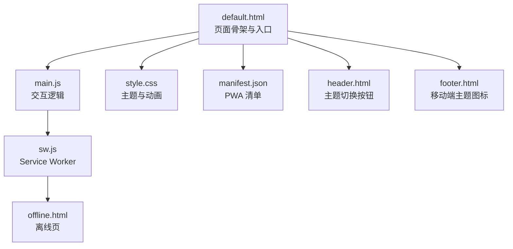
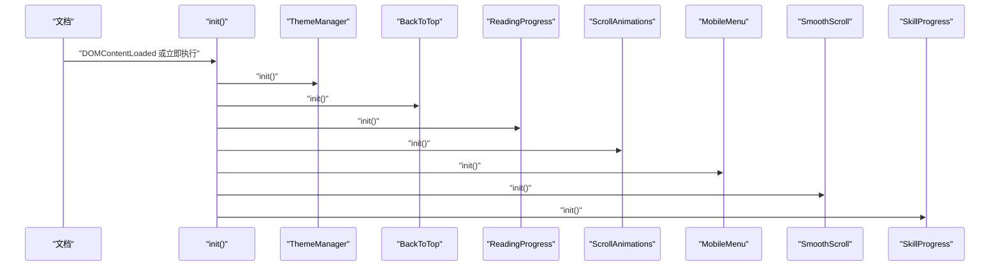
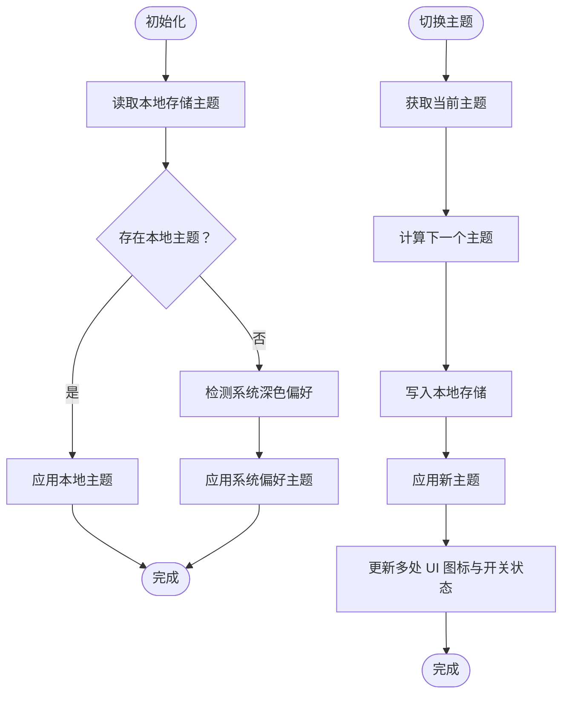
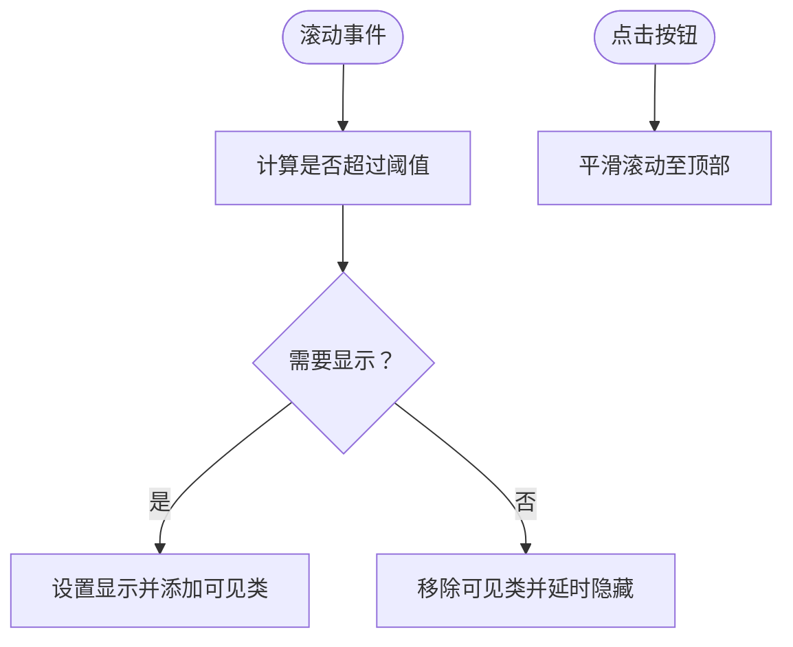
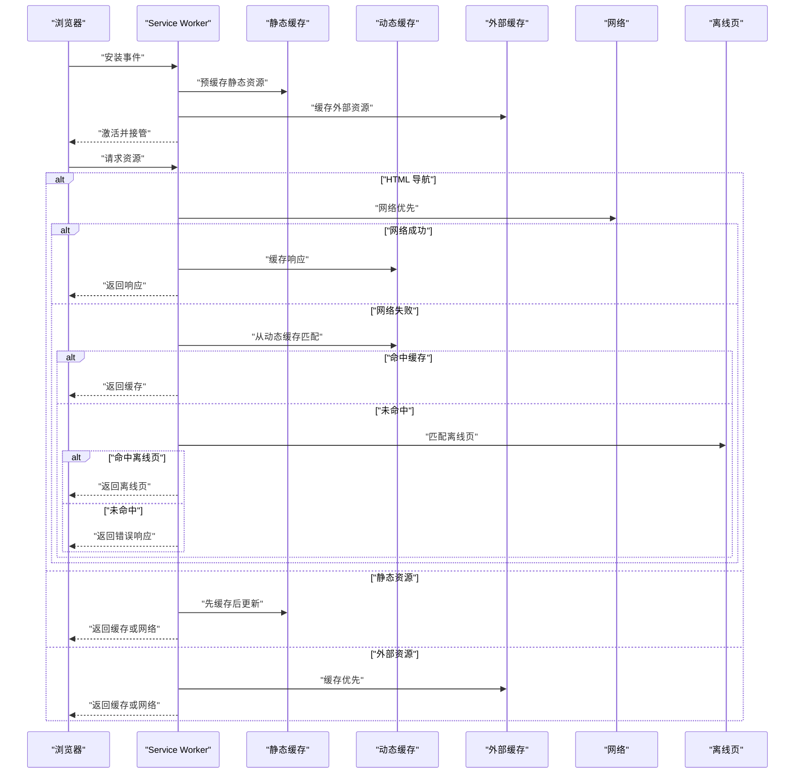
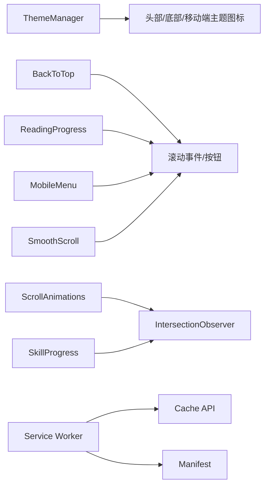

# JavaScript 交互系统

<cite>
**本文档引用的文件**
- [main.js](file://assets/js/main.js)
- [sw.js](file://sw.js)
- [manifest.json](file://manifest.json)
- [offline.html](file://offline.html)
- [default.html](file://_layouts/default.html)
- [header.html](file://_includes/header.html)
- [footer.html](file://_includes/footer.html)
- [style.css](file://assets/css/style.css)
- [_config.yml](file://_config.yml)
</cite>

## 目录
1. [简介](#简介)
2. [项目结构](#项目结构)
3. [核心组件](#核心组件)
4. [架构总览](#架构总览)
5. [详细组件分析](#详细组件分析)
6. [依赖关系分析](#依赖关系分析)
7. [性能考量](#性能考量)
8. [故障排查指南](#故障排查指南)
9. [结论](#结论)
10. [附录](#附录)

## 简介
本文件面向 halfism.github.io 的 JavaScript 交互系统，围绕 main.js 的模块化设计（IIFE 模式与模块间依赖）、主题管理器（本地存储、系统偏好检测与切换动画）、滚动动画系统（Intersection Observer API 与视口检测）、平滑滚动（含兼容性处理）、以及 PWA 功能（Service Worker 注册、缓存策略与离线处理）进行深入解析。文档同时提供事件监听器管理与内存泄漏防护建议、调试技巧与性能优化实践，帮助开发者理解与扩展交互功能。

## 项目结构
该站点采用 Jekyll 构建，前端交互主要集中在单个 JS 文件与配套 CSS 中；PWA 能力由 Service Worker 与清单文件共同实现。核心文件分布如下：
- 主交互脚本：assets/js/main.js
- PWA 相关：sw.js、manifest.json、offline.html
- 页面骨架与入口：_layouts/default.html
- 头部与底部组件：_includes/header.html、_includes/footer.html
- 样式与动画：assets/css/style.css
- 站点配置：_config.yml

图表来源
- [default.html](file://_layouts/default.html)
- [main.js](file://assets/js/main.js)
- [style.css](file://assets/css/style.css)
- [manifest.json](file://manifest.json)
- [sw.js](file://sw.js)
- [offline.html](file://offline.html)
- [header.html](file://_includes/header.html)
- [footer.html](file://_includes/footer.html)

章节来源
- [default.html](file://_layouts/default.html)
- [main.js](file://assets/js/main.js)
- [style.css](file://assets/css/style.css)
- [manifest.json](file://manifest.json)
- [sw.js](file://sw.js)
- [offline.html](file://offline.html)
- [header.html](file://_includes/header.html)
- [footer.html](file://_includes/footer.html)

## 核心组件
本节概述 main.js 中的核心模块及其职责：
- 主题管理器（ThemeManager）：负责主题初始化、切换、UI 同步与本地持久化。
- 回到顶部（BackToTop）：基于滚动阈值显示/隐藏按钮，并执行平滑滚动至顶部。
- 阅读进度（ReadingProgress）：根据文档高度与视口计算滚动进度条宽度。
- 滚动动画（ScrollAnimations）：使用 Intersection Observer 在元素进入视口时添加可见类。
- 移动菜单（MobileMenu）：控制移动端导航菜单的展开/收起与图标同步。
- 平滑滚动（SmoothScroll）：对内部锚点链接执行平滑滚动，并在移动端关闭菜单。
- 技能进度（SkillProgress）：使用 Intersection Observer 触发技能条动画。
- 公共 API：对外暴露 toggleTheme 方法供页面调用。

章节来源
- [main.js](file://assets/js/main.js)

## 架构总览
下图展示页面加载后各模块的初始化顺序与相互依赖关系：

图表来源
- [main.js](file://assets/js/main.js)

## 详细组件分析

### 模块化设计与 IIFE 模式
- 使用自执行函数包裹所有逻辑，避免全局污染，形成“命名空间”隔离。
- 内部定义工具函数（如选择器封装与防抖），减少重复代码。
- 将功能拆分为多个“子模块对象”，每个对象维护自身状态与方法，通过统一的 init() 调用进行装配。
- 优点：结构清晰、可测试性强、易于扩展；缺点：全局仅暴露 toggleTheme，其他模块无直接外部接口。

章节来源
- [main.js](file://assets/js/main.js)

### 主题管理器（ThemeManager）
- 初始化策略
  - 优先读取本地存储的主题键值；若不存在则检测系统深色偏好；否则默认浅色。
  - 应用主题到根元素的 data-theme 属性，触发 CSS 变量切换。
- 切换流程
  - 切换当前主题并写入本地存储。
  - 更新多处 UI 图标与开关状态（移动端、页脚、桌面端），并设置 ARIA 属性以提升可访问性。
- 动画与可访问性
  - 通过类名切换与内联样式颜色变化实现视觉反馈。
  - 使用 aria-pressed 标注开关状态，便于屏幕阅读器识别。

图表来源
- [main.js](file://assets/js/main.js)

章节来源
- [main.js](file://assets/js/main.js)
- [header.html](file://_includes/header.html)
- [footer.html](file://_includes/footer.html)

### 回到顶部（BackToTop）
- 事件绑定：窗口滚动事件经防抖处理，降低高频触发成本。
- 显示/隐藏逻辑：超过阈值显示，否则渐隐并延时隐藏，避免频繁 DOM 操作。
- 平滑滚动：点击按钮执行平滑滚动至顶部。

图表来源
- [main.js](file://assets/js/main.js)

章节来源
- [main.js](file://assets/js/main.js)

### 阅读进度（ReadingProgress）
- 基于文档总高度与视口高度计算百分比进度，实时更新进度条宽度。
- 使用防抖优化滚动事件频率，保证流畅体验。

章节来源
- [main.js](file://assets/js/main.js)

### 滚动动画（ScrollAnimations）
- 降级处理：若不支持 Intersection Observer，则为所有目标元素直接添加可见类，确保基础可用性。
- 观察策略：阈值极小，元素一进入视口即触发；触发后取消对该元素的观察，避免重复触发。
- 触发时机：与页面布局解耦，适合懒加载与分节展示场景。

章节来源
- [main.js](file://assets/js/main.js)

### 移动菜单（MobileMenu）
- 控制移动端导航菜单的展开/收起，同步切换按钮图标与 aria-expanded 状态。
- 子项点击后自动关闭菜单，提升移动端交互效率。

章节来源
- [main.js](file://assets/js/main.js)

### 平滑滚动（SmoothScroll）
- 对内部锚点链接进行拦截，计算目标元素相对视口的偏移并执行平滑滚动。
- 移动端关闭菜单，避免遮挡与不必要的滚动距离。

章节来源
- [main.js](file://assets/js/main.js)

### 技能进度（SkillProgress）
- 使用 Intersection Observer 在元素进入视口时触发动画，逐步展现技能条宽度。
- 阈值适中，确保用户关注区域内的元素被观察到。

章节来源
- [main.js](file://assets/js/main.js)

### PWA 功能（Service Worker 与清单）
- 清单文件（manifest.json）声明应用名称、图标、启动路径、显示模式等，用于安装与展示。
- Service Worker（sw.js）实现多缓存策略：
  - 安装阶段预缓存静态资源与外部 CDN 资源。
  - 激活阶段清理旧缓存并接管页面。
  - 请求阶段采用不同策略：
    - HTML 导航采用网络优先，失败回退到动态缓存，最终回退到离线页。
    - 静态资源采用“先缓存后更新”策略，后台异步刷新。
    - 外部资源采用缓存优先策略，提升稳定性。
- 离线页（offline.html）提供本地化提示与重载能力，监听 online 事件自动刷新。

图表来源
- [sw.js](file://sw.js)
- [manifest.json](file://manifest.json)
- [offline.html](file://offline.html)

章节来源
- [sw.js](file://sw.js)
- [manifest.json](file://manifest.json)
- [offline.html](file://offline.html)

## 依赖关系分析
- 模块内聚与耦合
  - 各模块通过 init() 统一装配，彼此独立，低耦合。
  - ThemeManager 与 UI 组件（头部、底部、移动端）存在 DOM 依赖，但通过选择器与属性同步实现弱耦合。
- 外部依赖
  - CSS 主题变量与动画类（data-theme、animate-on-scroll、is-visible）。
  - 浏览器特性：Intersection Observer、matchMedia、scrollTo、localStorage。
  - PWA：Service Worker、Cache API、Manifest。

图表来源
- [main.js](file://assets/js/main.js)
- [style.css](file://assets/css/style.css)
- [sw.js](file://sw.js)
- [manifest.json](file://manifest.json)

章节来源
- [main.js](file://assets/js/main.js)
- [style.css](file://assets/css/style.css)
- [sw.js](file://sw.js)
- [manifest.json](file://manifest.json)

## 性能考量
- 事件节流与防抖
  - 滚动事件使用防抖，显著降低回调执行频率，避免主线程阻塞。
- Intersection Observer
  - 以异步回调形式工作，不阻塞主线程；合理阈值避免过度触发。
- CSS 过渡与动画
  - 使用 CSS 变量与过渡，减少 JS 计算；在高对比度或减少动画偏好下自动降级。
- 缓存策略
  - 静态资源采用“先缓存后更新”，提升二次访问速度；外部资源缓存优先，增强稳定性。
- 本地存储
  - 主题偏好本地持久化，避免每次加载都进行系统检测。

章节来源
- [main.js](file://assets/js/main.js)
- [sw.js](file://sw.js)
- [style.css](file://assets/css/style.css)

## 故障排查指南
- 主题切换无效
  - 检查 data-theme 属性是否正确设置；确认本地存储键值是否存在；验证 UI 图标类名与开关状态是否同步。
- 滚动动画不触发
  - 确认元素是否包含 animate-on-scroll 类；检查浏览器是否支持 Intersection Observer；核对阈值与元素可见性。
- 平滑滚动异常
  - 检查锚点链接是否正确；确认目标元素存在；移动端菜单是否影响滚动距离。
- PWA 无法离线访问
  - 检查 Service Worker 是否注册成功；确认清单文件路径与内容；验证缓存策略与离线页是否命中。
- 内存泄漏与性能问题
  - 确保移除不再使用的事件监听器；避免在回调中创建闭包导致的强引用；使用防抖/节流控制高频事件。

章节来源
- [main.js](file://assets/js/main.js)
- [sw.js](file://sw.js)
- [default.html](file://_layouts/default.html)

## 结论
halfism.github.io 的交互系统以单一主脚本为核心，采用 IIFE 模式与模块化对象组织功能，结合 CSS 变量与 Intersection Observer 实现高性能、可访问的用户体验。PWA 通过 Service Worker 与多策略缓存提供离线能力与安装体验。整体设计注重可维护性与扩展性，适合进一步引入更复杂的交互与状态管理方案。

## 附录
- 调试技巧
  - 使用浏览器开发者工具的 Performance 面板观测滚动与动画帧率；利用 Console 查看 Service Worker 生命周期日志。
- 最佳实践
  - 保持模块职责单一；为高频事件添加防抖/节流；优先使用 CSS 过渡与硬件加速动画；在关键路径上启用缓存与预连接。
- 扩展建议
  - 引入集中式事件总线或轻量状态管理；为模块增加生命周期钩子；对关键交互增加可访问性标签与键盘导航支持。