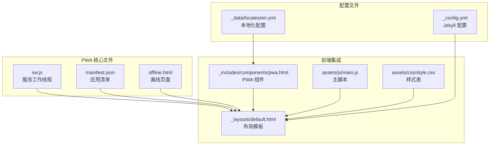
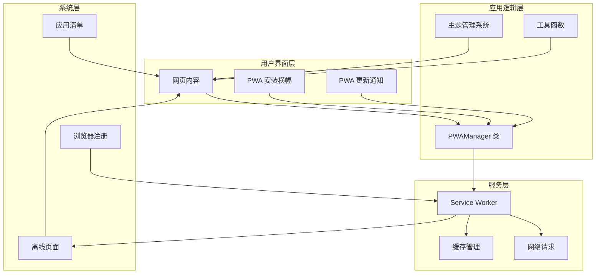
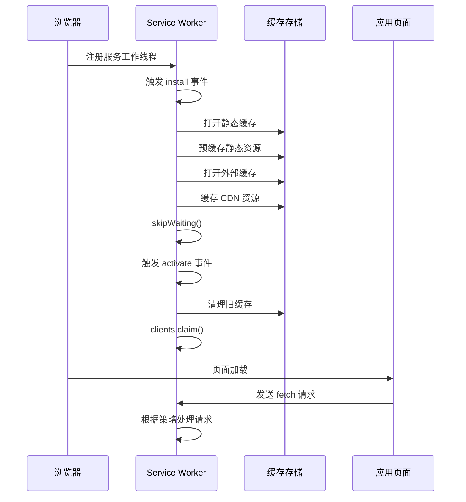
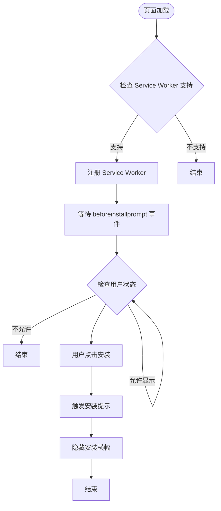
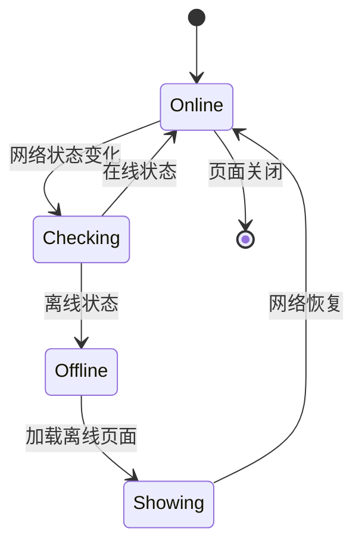
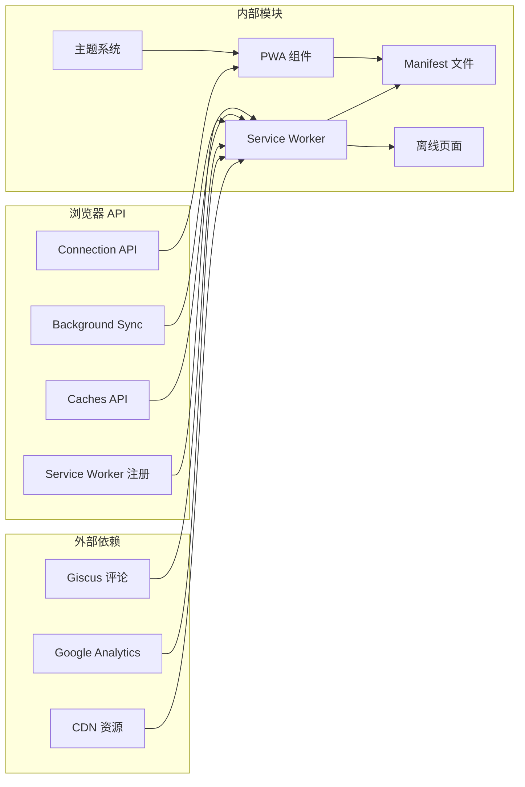

# PWA 集成

<cite>
**本文档引用的文件**
- [sw.js](file://sw.js)
- [manifest.json](file://manifest.json)
- [offline.html](file://offline.html)
- [main.js](file://assets/js/main.js)
- [_config.yml](file://_config.yml)
- [default.html](file://_layouts/default.html)
- [pwa.html](file://_includes/components/pwa.html)
- [en.yml](file://_data/locales/en.yml)
- [style.css](file://assets/css/style.css)
</cite>

## 目录
1. [简介](#简介)
2. [项目结构](#项目结构)
3. [核心组件](#核心组件)
4. [架构概览](#架构概览)
5. [详细组件分析](#详细组件分析)
6. [依赖关系分析](#依赖关系分析)
7. [性能考虑](#性能考虑)
8. [故障排除指南](#故障排除指南)
9. [结论](#结论)
10. [附录](#附录)

## 简介

本项目实现了完整的 Progressive Web App (PWA) 集成，提供了离线访问、快速加载和原生应用体验。该 PWA 集成包含了服务工作线程注册与生命周期管理、多层缓存策略（预缓存、运行时缓存、网络降级）、离线页面处理机制、应用清单配置以及 Web App 安装提示功能。

该项目基于 Jekyll 静态站点生成器构建，采用现代化的前端技术栈，确保在各种网络环境下都能提供优秀的用户体验。

## 项目结构

PWA 相关的核心文件分布如下：

**图表来源**
- [sw.js:1-237](file://sw.js#L1-L237)
- [manifest.json:1-79](file://manifest.json#L1-L79)
- [offline.html:1-82](file://offline.html#L1-L82)
- [default.html:1-152](file://_layouts/default.html#L1-L152)

**章节来源**
- [sw.js:1-237](file://sw.js#L1-L237)
- [manifest.json:1-79](file://manifest.json#L1-L79)
- [offline.html:1-82](file://offline.html#L1-L82)
- [default.html:1-152](file://_layouts/default.html#L1-L152)

## 核心组件

### 服务工作线程 (Service Worker)

服务工作线程是 PWA 的核心组件，负责拦截网络请求、管理缓存和提供离线支持。

**主要特性：**
- 多级缓存策略：预缓存、静态资源缓存、动态缓存、外部资源缓存
- 智能请求路由：根据请求类型选择不同的缓存策略
- 离线页面支持：自动提供友好的离线体验
- 版本更新通知：检测新版本并提示用户更新

**章节来源**
- [sw.js:28-81](file://sw.js#L28-L81)
- [sw.js:83-114](file://sw.js#L83-L114)

### 应用清单 (Manifest)

应用清单文件定义了 PWA 的元数据，包括名称、图标、显示模式等。

**关键配置：**
- 应用名称和描述
- 图标集（支持多种尺寸）
- 显示模式为 standalone
- 主题色和背景色
- 快捷方式配置

**章节来源**
- [manifest.json:1-79](file://manifest.json#L1-L79)

### 离线页面

专门设计的离线页面提供用户友好的离线体验，包含多语言支持和交互功能。

**功能特性：**
- 响应式设计和动画效果
- 多语言支持（中英文）
- 自动网络状态检测
- 重新加载按钮

**章节来源**
- [offline.html:1-82](file://offline.html#L1-L82)

### PWA 安装组件

集成的安装提示系统提供无缝的应用安装体验。

**核心功能：**
- 安装横幅显示控制
- 更新通知机制
- 本地存储状态管理
- 用户交互响应

**章节来源**
- [pwa.html:1-192](file://_includes/components/pwa.html#L1-L192)

## 架构概览

PWA 系统的整体架构采用分层设计，确保各组件之间的清晰分离和高内聚低耦合。

**图表来源**
- [pwa.html:94-184](file://_includes/components/pwa.html#L94-L184)
- [sw.js:83-114](file://sw.js#L83-L114)
- [default.html:72-78](file://_layouts/default.html#L72-L78)

## 详细组件分析

### 服务工作线程生命周期管理

服务工作线程的生命周期包括安装、激活和事件监听三个主要阶段。

**图表来源**
- [sw.js:28-60](file://sw.js#L28-L60)
- [sw.js:62-81](file://sw.js#L62-L81)
- [sw.js:83-114](file://sw.js#L83-L114)

#### 缓存策略实现

系统实现了四种主要的缓存策略：

1. **预缓存策略 (Pre-cache)**：在安装阶段缓存关键资源
2. **网络优先策略 (Network-first)**：优先使用网络，失败时回退到缓存
3. **静态资源缓存策略 (Stale-while-revalidate)**：立即返回缓存，后台更新
4. **外部资源缓存策略 (Cache-first)**：优先使用缓存，失败时回退到网络

**章节来源**
- [sw.js:116-194](file://sw.js#L116-L194)

### PWA 安装系统

安装系统采用渐进式增强的方式，在合适的时机向用户展示安装提示。

**图表来源**
- [pwa.html:102-131](file://_includes/components/pwa.html#L102-L131)
- [pwa.html:118-124](file://_includes/components/pwa.html#L118-L124)

**章节来源**
- [pwa.html:94-184](file://_includes/components/pwa.html#L94-L184)

### 离线页面处理机制

离线页面提供优雅的离线体验，包含多语言支持和自动网络恢复检测。

**图表来源**
- [offline.html:67-79](file://offline.html#L67-L79)

**章节来源**
- [offline.html:1-82](file://offline.html#L1-L82)

## 依赖关系分析

PWA 功能的依赖关系展现了清晰的模块化架构。

**图表来源**
- [sw.js:21-26](file://sw.js#L21-L26)
- [default.html:72-78](file://_layouts/default.html#L72-L78)
- [pwa.html:102-116](file://_includes/components/pwa.html#L102-L116)

**章节来源**
- [sw.js:21-26](file://sw.js#L21-L26)
- [default.html:72-78](file://_layouts/default.html#L72-L78)
- [pwa.html:102-116](file://_includes/components/pwa.html#L102-L116)

## 性能考虑

### 缓存策略优化

系统采用了智能的缓存策略组合来平衡性能和内容新鲜度：

1. **预缓存优化**：只缓存关键的导航页面和核心资源
2. **静态资源缓存**：使用 Stale-while-Revalidate 确保快速响应
3. **外部资源处理**：CDN 资源使用 Cache-first 策略
4. **动态内容处理**：HTML 页面使用 Network-first 策略

### 网络降级策略

当网络不可用时，系统提供多层次的降级方案：

1. **即时缓存回退**：优先使用缓存内容
2. **离线页面**：提供友好的离线体验
3. **错误状态码**：返回适当的 HTTP 状态码
4. **用户提示**：显示网络状态和操作建议

### 内存和存储管理

- **缓存清理**：定期清理过期缓存
- **存储配额**：合理使用存储空间
- **内存优化**：避免内存泄漏
- **并发控制**：限制同时进行的操作数量

## 故障排除指南

### 常见问题诊断

1. **Service Worker 无法注册**
   - 检查 HTTPS 连接
   - 验证 sw.js 文件路径正确性
   - 查看浏览器控制台错误信息

2. **缓存未更新**
   - 确认激活事件正常执行
   - 检查缓存键名版本号
   - 验证 skipWaiting 调用

3. **安装提示不显示**
   - 确认 beforeinstallprompt 事件触发
   - 检查用户交互要求
   - 验证应用清单配置

**章节来源**
- [sw.js:102-116](file://_includes/components/pwa.html#L102-L116)
- [sw.js:213-224](file://sw.js#L213-L224)

### 调试工具使用

1. **浏览器开发者工具**
   - Application 面板查看 Service Worker 状态
   - Cache Storage 面板检查缓存内容
   - Network 面板分析请求路由

2. **PWA 扩展工具**
   - Chrome PWA Helper 扩展
   - Lighthouse PWA 测试
   - WebPageTest 在线测试

3. **日志监控**
   - Service Worker 控制台输出
   - 缓存命中率统计
   - 错误报告收集

## 结论

本项目的 PWA 集成实现了现代化的渐进式 Web 应用功能，提供了：

- **完整的离线支持**：通过多层缓存策略确保在网络不佳时仍能提供良好体验
- **流畅的安装流程**：智能的安装提示系统提升用户转化率
- **高性能的资源管理**：合理的缓存策略平衡了性能和内容新鲜度
- **优雅的错误处理**：完善的离线页面和网络降级机制

该实现为 Jekyll 静态站点提供了强大的 PWA 能力，既保持了静态站点的简洁性，又具备了现代 Web 应用的功能特性。

## 附录

### 部署注意事项

1. **HTTPS 要求**
   - 生产环境必须使用 HTTPS
   - Service Worker 只能在安全上下文中注册

2. **文件路径配置**
   - 确保 sw.js、manifest.json 的相对路径正确
   - 验证静态资源的完整路径

3. **缓存版本管理**
   - 更新缓存版本号以强制刷新
   - 合理设置缓存过期时间

### 最佳实践建议

1. **性能优化**
   - 使用 HTTP/2 或 HTTP/3 提升传输效率
   - 实施资源压缩和图片优化
   - 合理使用懒加载技术

2. **用户体验**
   - 提供清晰的加载状态指示
   - 实现快速的页面切换动画
   - 保持一致的主题和交互模式

3. **维护策略**
   - 定期更新应用清单
   - 监控缓存命中率和存储使用情况
   - 建立错误报告和监控系统