# 主题管理系统

<cite>
**本文档引用的文件**
- [main.js](file://assets/js/main.js)
- [style.css](file://assets/css/style.css)
- [default.html](file://_layouts/default.html)
- [header.html](file://_includes/header.html)
- [footer.html](file://_includes/footer.html)
- [_config.yml](file://_config.yml)
- [sw.js](file://sw.js)
</cite>

## 目录
1. [简介](#简介)
2. [项目结构](#项目结构)
3. [核心组件](#核心组件)
4. [架构概览](#架构概览)
5. [详细组件分析](#详细组件分析)
6. [依赖关系分析](#依赖关系分析)
7. [性能考虑](#性能考虑)
8. [故障排除指南](#故障排除指南)
9. [结论](#结论)
10. [附录](#附录)

## 简介

本主题管理系统是一个现代化的单页应用主题切换解决方案，采用纯JavaScript实现，无需任何外部框架依赖。系统通过CSS自定义属性和data-theme属性实现主题切换，支持本地存储持久化、系统偏好检测和完整的无障碍访问支持。

该系统的核心设计理念是"最小化依赖、最大化性能"，通过精心设计的CSS变量体系和高效的JavaScript模块化架构，实现了流畅的主题切换体验和优秀的跨设备兼容性。

## 项目结构

主题管理系统主要由以下核心文件组成：

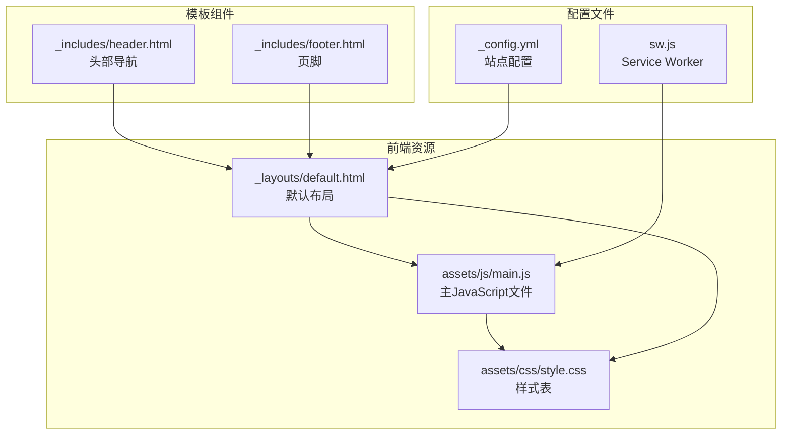

**图表来源**
- [main.js:1-279](file://assets/js/main.js#L1-L279)
- [style.css:1-1015](file://assets/css/style.css#L1-L1015)
- [default.html:1-152](file://_layouts/default.html#L1-L152)

**章节来源**
- [main.js:1-279](file://assets/js/main.js#L1-L279)
- [style.css:1-1015](file://assets/css/style.css#L1-L1015)
- [default.html:1-152](file://_layouts/default.html#L1-L152)

## 核心组件

### ThemeManager 模块

ThemeManager 是整个主题系统的核心控制器，采用立即执行函数模式创建独立的作用域，避免全局污染。

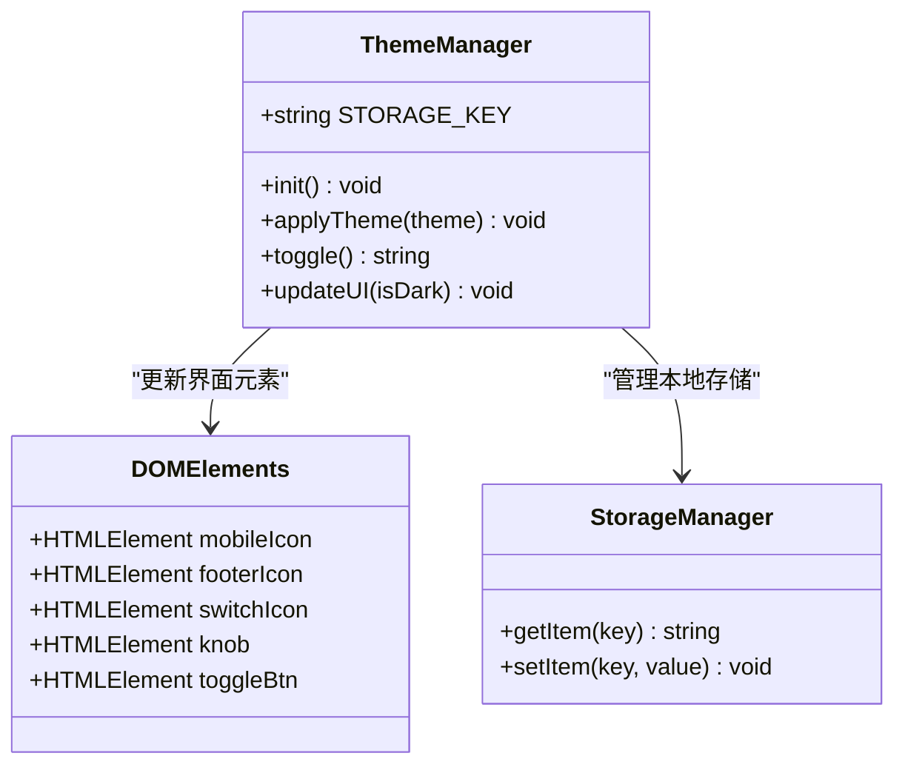

**图表来源**
- [main.js:27-75](file://assets/js/main.js#L27-L75)

### 数据流架构

系统采用单向数据流设计，确保主题状态的一致性和可预测性：

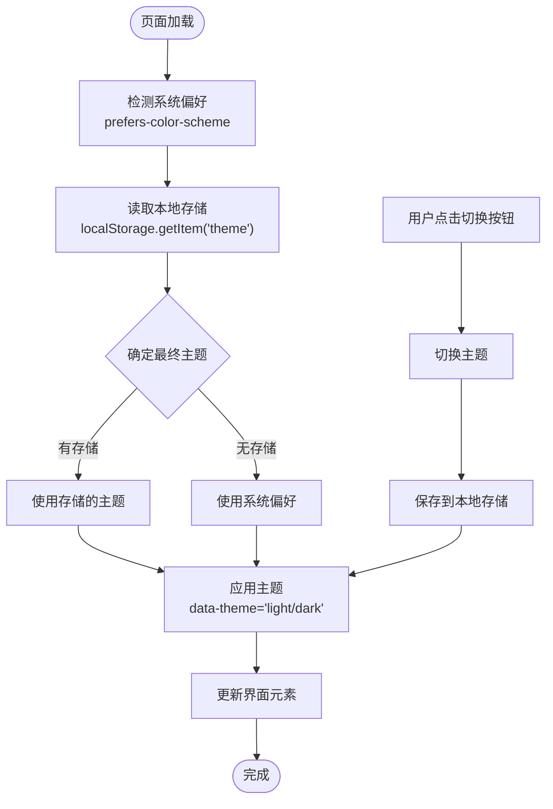

**图表来源**
- [main.js:30-52](file://assets/js/main.js#L30-L52)

**章节来源**
- [main.js:27-75](file://assets/js/main.js#L27-L75)

## 架构概览

### 整体架构设计

系统采用分层架构，每个层次职责明确，耦合度低：

```mermaid
graph TB
subgraph "表现层"
UI[用户界面<br/>HTML + CSS]
Icons[主题图标<br/>Font Awesome]
end
subgraph "控制层"
TM[ThemeManager<br/>主题控制器]
MA[MobileMenu<br/>移动端菜单]
BT[BackToTop<br/>回到顶部]
end
subgraph "数据层"
LS[localStorage<br/>本地存储]
CSSVars[CSS变量<br/>:root + [data-theme]]
end
subgraph "事件层"
Events[DOM事件<br/>click/toggle]
MediaQuery[媒体查询<br/>prefers-color-scheme]
end
UI --> TM
Icons --> TM
TM --> LS
TM --> CSSVars
Events --> TM
MediaQuery --> TM
MA --> UI
BT --> UI
```

**图表来源**
- [main.js:27-75](file://assets/js/main.js#L27-L75)
- [style.css:10-145](file://assets/css/style.css#L10-L145)

### 初始化流程

系统在页面加载时执行初始化序列：

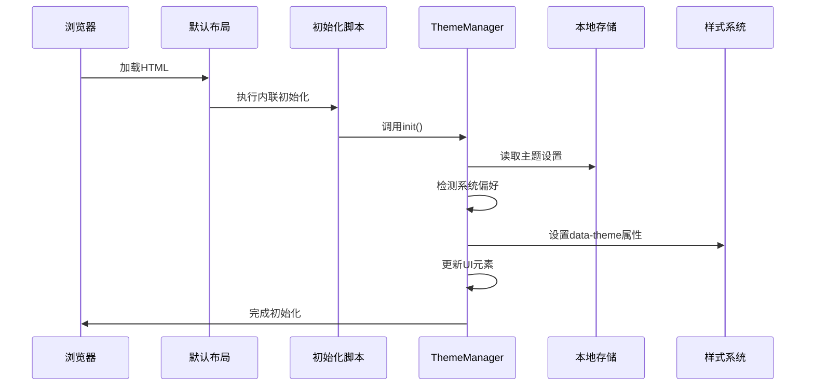

**图表来源**
- [default.html:59-67](file://_layouts/default.html#L59-L67)
- [main.js:30-39](file://assets/js/main.js#L30-L39)

**章节来源**
- [default.html:59-67](file://_layouts/default.html#L59-L67)
- [main.js:30-39](file://assets/js/main.js#L30-L39)

## 详细组件分析

### CSS 自定义属性系统

系统使用CSS自定义属性作为设计令牌，实现主题切换的核心机制：

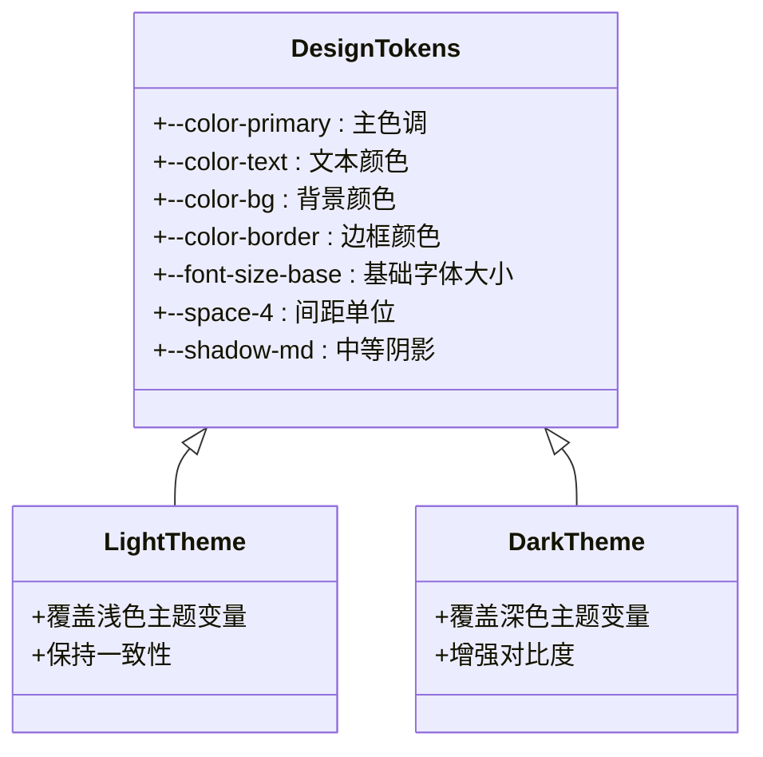

**图表来源**
- [style.css:10-145](file://assets/css/style.css#L10-L145)

#### 变量定义策略

系统采用"基础变量 + 主题覆盖"的设计模式：

1. **基础变量定义**：在 `:root` 选择器中定义所有设计令牌
2. **主题覆盖**：在 `[data-theme="dark"]` 选择器中仅覆盖需要改变的变量
3. **继承机制**：未覆盖的变量自动继承基础值

**章节来源**
- [style.css:10-145](file://assets/css/style.css#L10-L145)

### 主题切换逻辑

#### 切换算法实现

```mermaid
flowchart TD
Start([调用 toggle()]) --> GetCurrent["获取当前主题<br/>data-theme属性"]
GetCurrent --> CheckCurrent{"当前主题是dark?"}
CheckCurrent --> |是| SetLight["设置为light"]
CheckCurrent --> |否| SetDark["设置为dark"]
SetLight --> SaveStorage["保存到localStorage"]
SetDark --> SaveStorage
SaveStorage --> ApplyTheme["应用新主题"]
ApplyTheme --> UpdateIcons["更新图标状态"]
UpdateIcons --> UpdateKnob["更新开关位置"]
UpdateKnob --> UpdateARIA["更新ARIA属性"]
UpdateARIA --> ReturnTheme["返回新主题"]
ReturnTheme --> End([完成])
```

**图表来源**
- [main.js:41-52](file://assets/js/main.js#L41-L52)

#### 图标动态切换机制

系统实现了多处图标的状态同步：

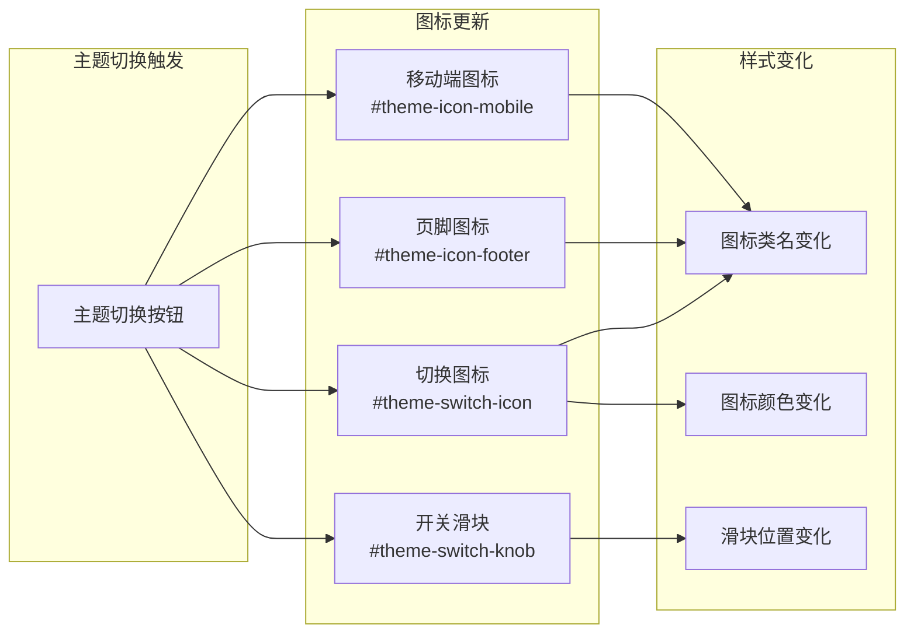

**图表来源**
- [main.js:54-74](file://assets/js/main.js#L54-L74)

**章节来源**
- [main.js:41-74](file://assets/js/main.js#L41-L74)

### 无障碍支持实现

#### ARIA 属性管理

系统实现了完整的无障碍支持：

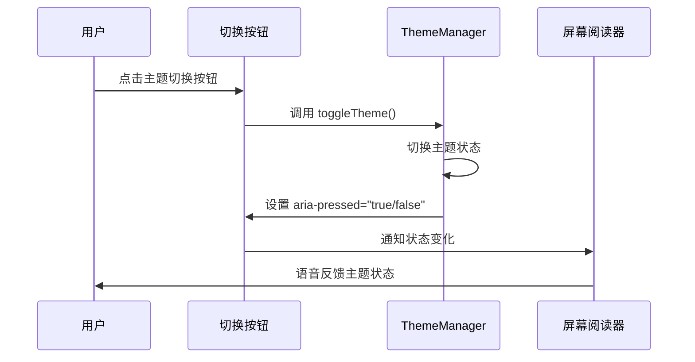

**图表来源**
- [header.html:59](file://_includes/header.html#L59)
- [main.js:47-49](file://assets/js/main.js#L47-L49)

#### 键盘导航支持

系统支持完整的键盘操作：

- **Enter/Space键**：激活主题切换按钮
- **Tab键**：在导航元素间循环
- **屏幕阅读器**：提供状态变化通知

**章节来源**
- [header.html:59](file://_includes/header.html#L59)
- [main.js:47-49](file://assets/js/main.js#L47-L49)

### 移动端适配

#### 响应式图标系统

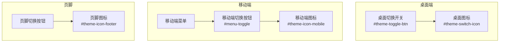

**图表来源**
- [header.html:58-64](file://_includes/header.html#L58-L64)
- [header.html:102-105](file://_includes/header.html#L102-L105)
- [footer.html:41-44](file://_includes/footer.html#L41-L44)

**章节来源**
- [header.html:58-64](file://_includes/header.html#L58-L64)
- [header.html:102-105](file://_includes/header.html#L102-L105)
- [footer.html:41-44](file://_includes/footer.html#L41-L44)

## 依赖关系分析

### 外部依赖管理

系统采用极简的外部依赖策略：

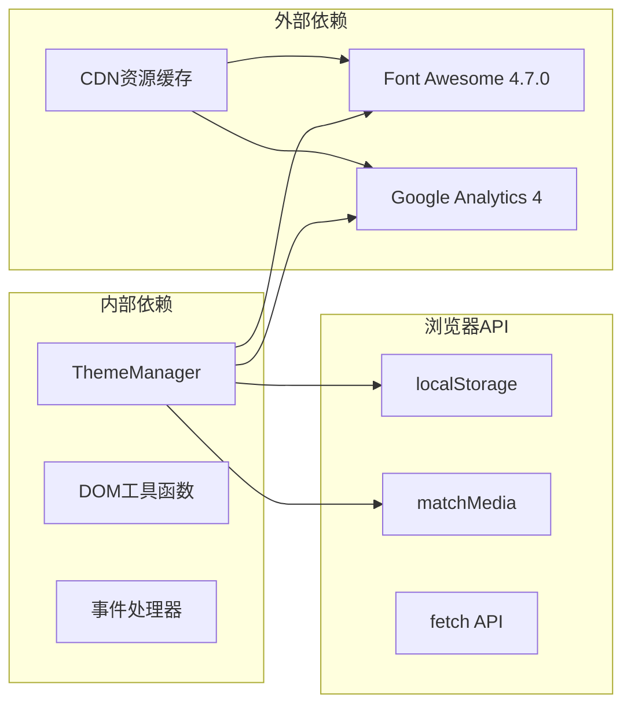

**图表来源**
- [default.html:55-57](file://_layouts/default.html#L55-L57)
- [sw.js:23-26](file://sw.js#L23-L26)

### 缓存策略

Service Worker 实现了智能缓存策略：

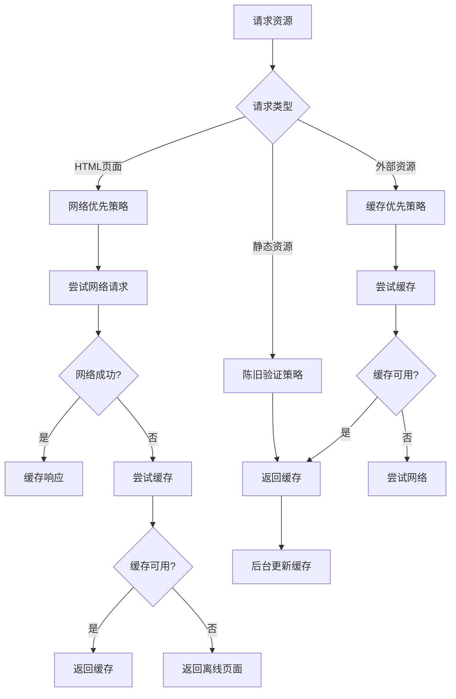

**图表来源**
- [sw.js:83-114](file://sw.js#L83-L114)

**章节来源**
- [sw.js:83-114](file://sw.js#L83-L114)

## 性能考虑

### 加载优化

系统采用了多项性能优化措施：

1. **FOUC预防**：在HTML头部直接注入初始化脚本，避免闪烁
2. **懒加载**：主要JavaScript延迟加载
3. **缓存策略**：Service Worker智能缓存
4. **CSS变量**：避免重复计算和重排

### 内存管理

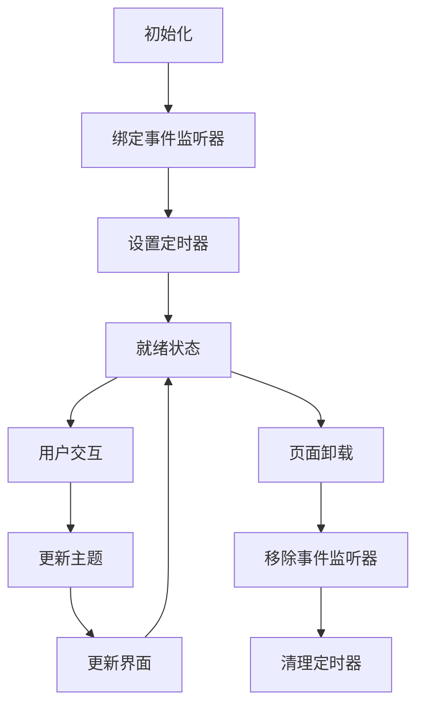

**图表来源**
- [main.js:263-278](file://assets/js/main.js#L263-L278)

### 动画性能

系统使用CSS硬件加速优化动画性能：

- **transform属性**：使用translate替代top/left定位
- **will-change属性**：预分配GPU加速
- **减少重绘**：通过CSS变量避免样式重算

**章节来源**
- [main.js:263-278](file://assets/js/main.js#L263-L278)

## 故障排除指南

### 常见问题诊断

#### 主题不持久化

**症状**：刷新页面后主题恢复默认

**排查步骤**：
1. 检查浏览器是否禁用localStorage
2. 验证localStorage容量限制
3. 确认没有同源策略问题

**解决方案**：
```javascript
// 检查localStorage可用性
try {
    localStorage.setItem('test', 'test');
    localStorage.removeItem('test');
} catch (e) {
    console.error('localStorage不可用:', e);
}
```

#### 图标不同步

**症状**：主题切换但图标状态不正确

**排查步骤**：
1. 检查DOM元素是否存在
2. 验证CSS类名拼写
3. 确认JavaScript执行顺序

**解决方案**：
```javascript
// 添加元素存在性检查
var mobileIcon = $('#theme-icon-mobile');
if (mobileIcon) {
    mobileIcon.className = isDark ? 'fa fa-sun-o' : 'fa fa-moon-o';
}
```

#### ARIA属性失效

**症状**：屏幕阅读器无法识别主题状态

**排查步骤**：
1. 检查aria-pressed属性设置
2. 验证按钮的role属性
3. 确认语义化HTML结构

**解决方案**：
```javascript
// 确保ARIA属性正确更新
var toggleBtn = document.getElementById('theme-toggle-btn');
if (toggleBtn) {
    toggleBtn.setAttribute('aria-pressed', next === 'dark');
}
```

**章节来源**
- [main.js:47-49](file://assets/js/main.js#L47-L49)

### 调试技巧

#### 开发者工具使用

1. **Application面板**：检查localStorage内容
2. **Elements面板**：查看data-theme属性
3. **Console面板**：监控主题切换日志
4. **Network面板**：分析缓存命中情况

#### 性能分析

使用Chrome DevTools的Performance面板：
- 记录主题切换过程
- 分析重绘和回流
- 识别性能瓶颈

## 结论

本主题管理系统展现了现代前端开发的最佳实践：

### 设计优势

1. **架构清晰**：模块化设计，职责分离
2. **性能优秀**：零依赖，轻量级实现
3. **用户体验**：流畅的动画和完整的无障碍支持
4. **可维护性**：简洁的代码结构和完善的注释

### 技术亮点

- **CSS变量驱动**：实现真正的主题切换
- **本地存储持久化**：用户偏好记忆
- **系统偏好检测**：智能主题选择
- **Service Worker缓存**：提升加载性能
- **完整无障碍支持**：包容性设计

### 扩展建议

1. **多语言支持**：国际化主题标签
2. **自定义主题**：允许用户创建个人主题
3. **跨设备同步**：实现多设备主题同步
4. **高级动画**：添加更丰富的过渡效果

该系统为构建现代化主题管理提供了完整的参考实现，既适合学习前端主题技术，也适合作为基础进行功能扩展。

## 附录

### 最佳实践清单

#### 主题状态持久化

- 使用localStorage存储用户偏好
- 提供"跟随系统"选项
- 支持手动重置到系统默认

#### 跨设备同步方案

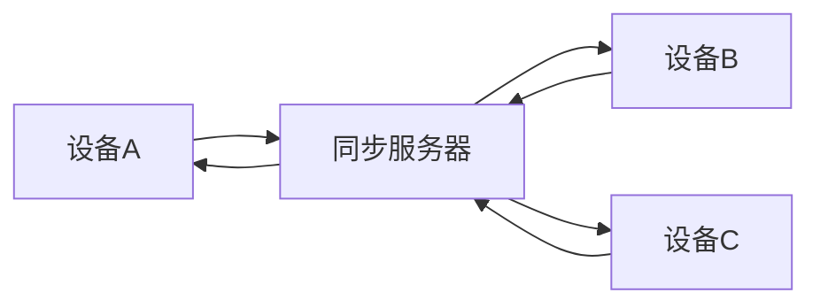

#### 性能优化建议

1. **代码分割**：按需加载主题切换功能
2. **缓存策略**：合理设置HTTP缓存头
3. **图片优化**：使用现代格式和响应式图片
4. **懒加载**：延迟加载非关键资源