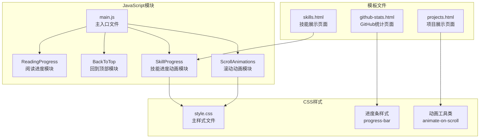
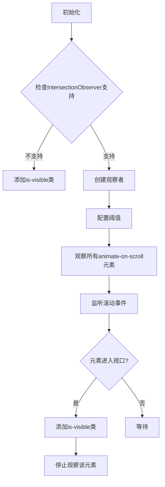
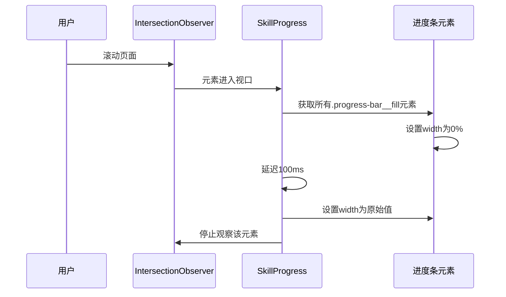
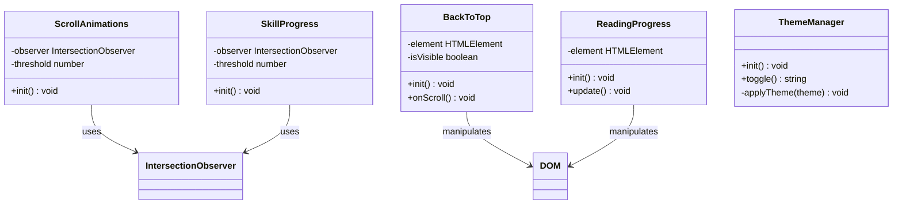
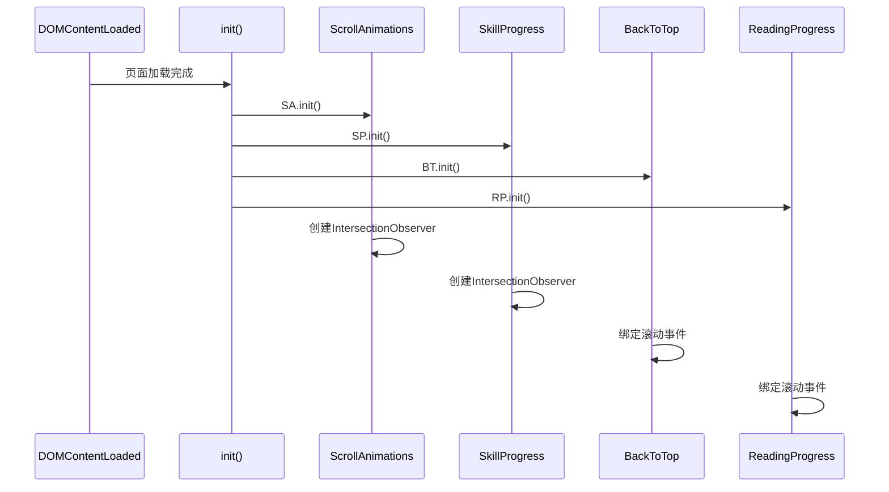
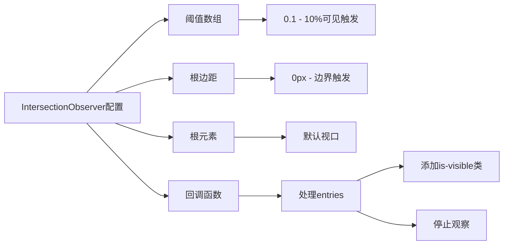
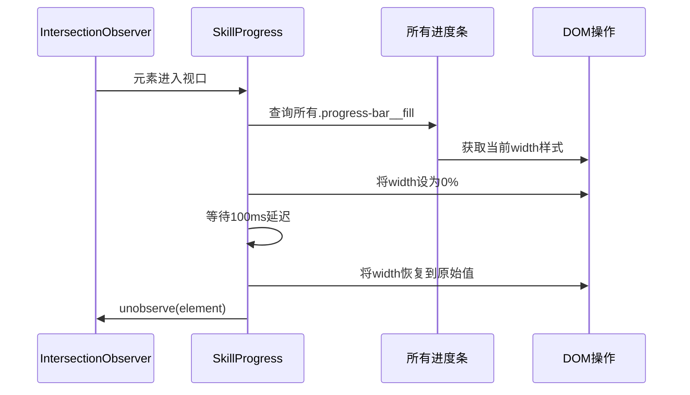
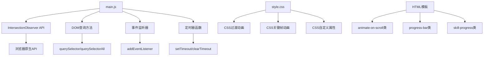

# 动画系统

<cite>
**本文档引用的文件**
- [main.js](file://assets/js/main.js)
- [style.css](file://assets/css/style.css)
- [skills.html](file://_includes/sections/skills.html)
- [github-stats.html](file://_includes/sections/github-stats.html)
- [projects.html](file://_includes/sections/projects.html)
</cite>

## 目录
1. [简介](#简介)
2. [项目结构](#项目结构)
3. [核心组件](#核心组件)
4. [架构概览](#架构概览)
5. [详细组件分析](#详细组件分析)
6. [依赖关系分析](#依赖关系分析)
7. [性能考虑](#性能考虑)
8. [故障排除指南](#故障排除指南)
9. [结论](#结论)

## 简介

本项目实现了一个现代化的动画系统，专注于提供流畅、高性能的用户体验。动画系统基于现代Web标准，包括Intersection Observer API、CSS过渡动画和响应式设计原则。系统主要包含两个核心模块：ScrollAnimations（滚动动画）和SkillProgress（技能进度条动画），以及相关的辅助功能如BackToTop（回到顶部）、ReadingProgress（阅读进度）等。

动画系统的设计哲学是"优雅降级"和"性能优先"，确保在不支持现代API的旧浏览器中仍能提供基本的用户体验。

## 项目结构

动画系统主要分布在以下文件中：



**图表来源**
- [main.js:147-253](file://assets/js/main.js#L147-L253)
- [style.css:490-504](file://assets/css/style.css#L490-L504)

**章节来源**
- [main.js:1-279](file://assets/js/main.js#L1-L279)
- [style.css:1-1015](file://assets/css/style.css#L1-L1015)

## 核心组件

### ScrollAnimations 模块

ScrollAnimations 是整个动画系统的核心，负责处理元素进入视口时的动画触发。

#### 主要特性
- 基于 Intersection Observer API 实现高性能检测
- 支持多种动画阈值配置
- 自动取消观察者以优化性能
- 优雅降级到基础CSS类

#### 关键实现细节



**图表来源**
- [main.js:147-165](file://assets/js/main.js#L147-L165)

#### 配置参数
- **阈值 (ANIMATION_THRESHOLD)**: 0.1 - 当10%的元素可见时触发动画
- **延迟 (SCROLL_THRESHOLD)**: 300px - 滚动超过300px后显示回到顶部按钮

**章节来源**
- [main.js:9-10](file://assets/js/main.js#L9-L10)
- [main.js:147-165](file://assets/js/main.js#L147-L165)

### SkillProgress 模块

SkillProgress 专门处理技能进度条的渐进动画效果。

#### 主要特性
- 基于 Intersection Observer 触发进度动画
- 使用setTimeout实现渐进式宽度变化
- 支持多个进度条同时动画
- 半阈值触发确保更好的用户体验

#### 动画流程



**图表来源**
- [main.js:235-253](file://assets/js/main.js#L235-L253)

**章节来源**
- [main.js:235-253](file://assets/js/main.js#L235-L253)

### CSS 动画系统

#### 动画工具类

```css
.animate-on-scroll {
    opacity: 0;
    transform: translateY(20px);
    transition: opacity var(--transition-slow), transform var(--transition-slow);
}

.animate-on-scroll.is-visible {
    opacity: 1;
    transform: translateY(0);
}
```

#### 进度条样式

```css
.progress-bar {
    width: 100%;
    height: 0.5rem;
    background-color: var(--color-bg-tertiary);
    border-radius: var(--radius-full);
    overflow: hidden;
}

.progress-bar__fill {
    height: 100%;
    background-color: var(--color-primary);
    border-radius: var(--radius-full);
    transition: width var(--transition-slow);
}
```

**章节来源**
- [style.css:779-788](file://assets/css/style.css#L779-L788)
- [style.css:490-504](file://assets/css/style.css#L490-L504)

## 架构概览

动画系统的整体架构采用模块化设计，每个功能模块都是独立的JavaScript对象，具有清晰的职责分离。



**图表来源**
- [main.js:147-253](file://assets/js/main.js#L147-L253)

### 初始化流程



**图表来源**
- [main.js:263-278](file://assets/js/main.js#L263-L278)

**章节来源**
- [main.js:263-278](file://assets/js/main.js#L263-L278)

## 详细组件分析

### ScrollAnimations 模块深度解析

#### Intersection Observer 配置



**图表来源**
- [main.js:154-161](file://assets/js/main.js#L154-L161)

#### 动画触发机制

当元素进入视口时，系统执行以下步骤：
1. 检查元素是否处于相交状态
2. 添加 `is-visible` CSS类
3. 停止对该元素的观察以释放资源
4. 利用CSS过渡动画实现平滑效果

**章节来源**
- [main.js:147-165](file://assets/js/main.js#L147-L165)

### SkillProgress 模块深度解析

#### 渐进动画实现



**图表来源**
- [main.js:238-249](file://assets/js/main.js#L238-L249)

#### 延迟执行策略

延迟执行的目的是：
- **视觉效果**：给用户一个"清零"的视觉反馈
- **性能优化**：避免连续动画造成的重绘压力
- **用户体验**：创造更自然的动画节奏

**章节来源**
- [main.js:235-253](file://assets/js/main.js#L235-L253)

### CSS 动画系统

#### 动画工具类体系

```css
/* 基础滚动动画 */
.animate-on-scroll {
    opacity: 0;
    transform: translateY(20px);
    transition: opacity var(--transition-slow), transform var(--transition-slow);
}

.animate-on-scroll.is-visible {
    opacity: 1;
    transform: translateY(0);
}

/* 延迟动画 */
.animate-delay-100 { transition-delay: 100ms; }
.animate-delay-200 { transition-delay: 200ms; }
.animate-delay-300 { transition-delay: 300ms; }

/* 特殊动画效果 */
.animate-pulse-gentle { animation: pulse-gentle 3s ease-in-out infinite; }
.animate-float { animation: float-bounce 3s ease-in-out infinite; }
```

**章节来源**
- [style.css:779-810](file://assets/css/style.css#L779-L810)

#### 进度条动画系统

```css
.progress-bar {
    width: 100%;
    height: 0.5rem;
    background-color: var(--color-bg-tertiary);
    border-radius: var(--radius-full);
    overflow: hidden;
}

.progress-bar__fill {
    height: 100%;
    background-color: var(--color-primary);
    border-radius: var(--radius-full);
    transition: width var(--transition-slow);
}
```

**章节来源**
- [style.css:490-504](file://assets/css/style.css#L490-L504)

## 依赖关系分析

动画系统的主要依赖关系如下：



**图表来源**
- [main.js:12-13](file://assets/js/main.js#L12-L13)
- [style.css:779-788](file://assets/css/style.css#L779-L788)

### 外部依赖

| 依赖类型 | 用途 | 兼容性 |
|---------|------|--------|
| IntersectionObserver | 元素可见性检测 | 现代浏览器 |
| CSS Transition | 平滑动画过渡 | 所有现代浏览器 |
| CSS Custom Properties | 设计令牌 | 现代浏览器 |
| DOM API | 元素操作 | 所有浏览器 |

**章节来源**
- [main.js:149-151](file://assets/js/main.js#L149-L151)

## 性能考虑

### Intersection Observer 优势

1. **性能优化**：使用异步回调，避免主线程阻塞
2. **批量处理**：一次回调处理多个元素
3. **自动优化**：浏览器内核级别的性能优化

### 内存管理

```javascript
// 取消观察者以释放内存
observer.unobserve(targetElement);

// 优雅降级
if (!('IntersectionObserver' in window)) {
    // 回退到基础CSS类
    elements.forEach(el => el.classList.add('is-visible'));
}
```

### 动画性能最佳实践

1. **使用 transform 和 opacity**：这些属性不会触发布局计算
2. **合理设置阈值**：避免过于频繁的触发
3. **控制动画数量**：限制同时运行的动画数量
4. **利用硬件加速**：通过 will-change 属性提示浏览器

**章节来源**
- [main.js:158-159](file://assets/js/main.js#L158-L159)
- [main.js:246-247](file://assets/js/main.js#L246-L247)

## 故障排除指南

### 常见问题及解决方案

#### 问题1：元素无法触发动画
**症状**：添加 `animate-on-scroll` 类但动画不生效
**原因**：浏览器不支持 IntersectionObserver
**解决方案**：检查浏览器兼容性或手动添加 `is-visible` 类

#### 问题2：进度条动画不显示
**症状**：技能进度条没有动画效果
**原因**：元素未进入视口或阈值设置不当
**解决方案**：调整阈值或检查元素位置

#### 问题3：动画卡顿
**症状**：动画过程中出现卡顿
**原因**：过多元素同时动画或复杂CSS属性
**解决方案**：减少同时动画的元素数量或简化CSS

### 调试技巧

1. **开发者工具**：使用 Performance 面板监控动画性能
2. **控制台日志**：添加简单的 console.log 来跟踪动画触发
3. **CSS检查**：验证 CSS 类是否正确应用
4. **网络面板**：检查是否有资源加载阻塞

### 性能监控建议

```javascript
// 添加性能监控
const observer = new PerformanceObserver((list) => {
    for (const entry of list.getEntries()) {
        console.log(`${entry.name}: ${entry.duration}ms`);
    }
});
observer.observe({entryTypes: ['measure']});
```

**章节来源**
- [main.js:149-151](file://assets/js/main.js#L149-L151)

## 结论

本动画系统通过精心设计的模块化架构和现代Web技术，实现了高性能、可维护的动画体验。系统的核心优势包括：

1. **性能优先**：基于 Intersection Observer 的高效检测机制
2. **优雅降级**：在不支持现代API的环境中仍能提供基本功能
3. **模块化设计**：清晰的职责分离便于维护和扩展
4. **响应式支持**：完整的移动设备适配

通过合理的阈值配置、延迟执行策略和CSS硬件加速，系统能够在各种设备上提供流畅的动画体验。开发者可以基于现有架构轻松扩展新的动画效果，同时保持系统的性能和可维护性。