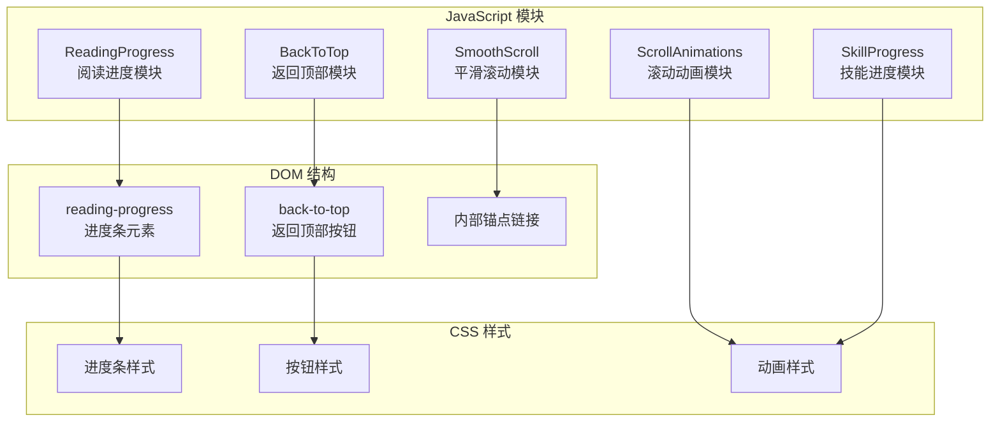
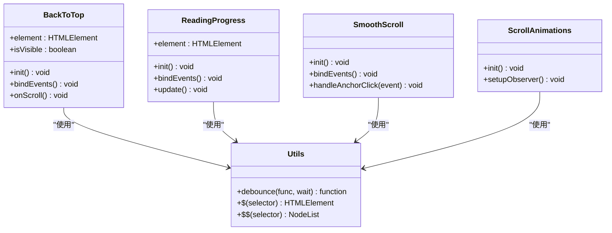
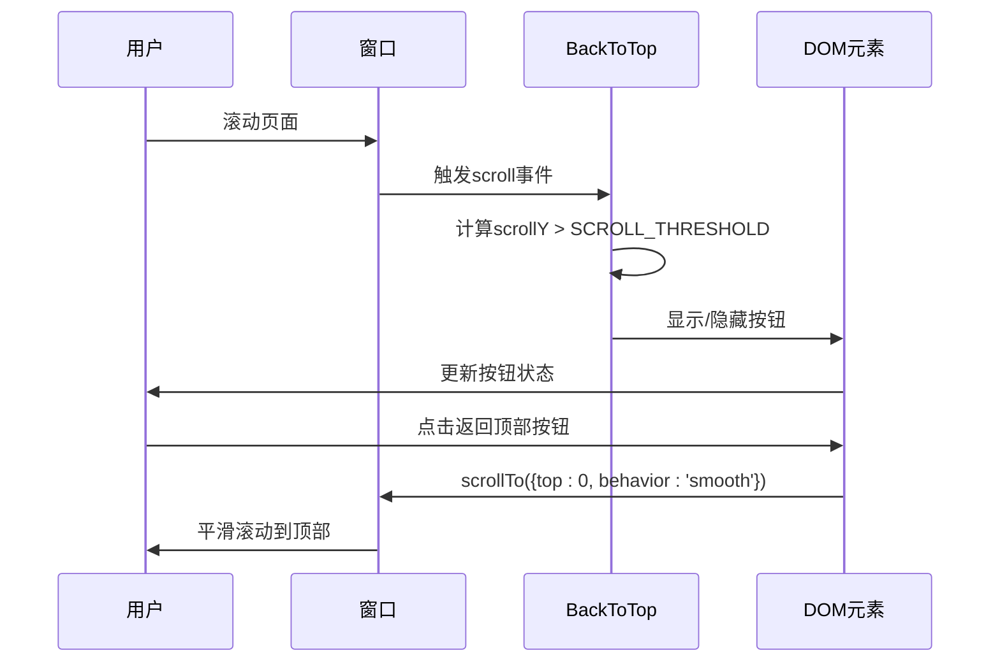
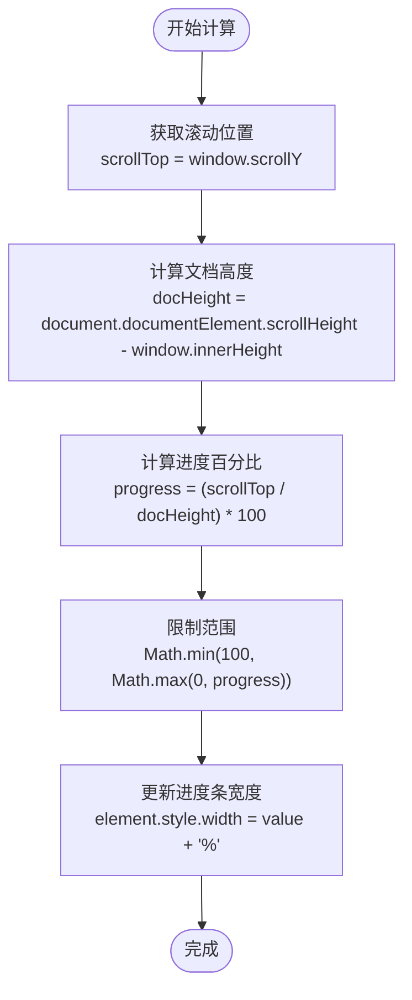
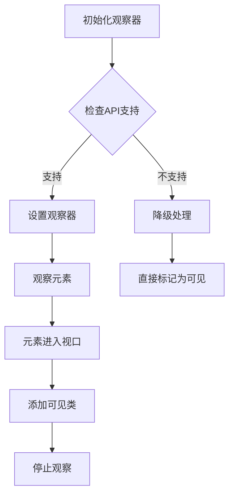
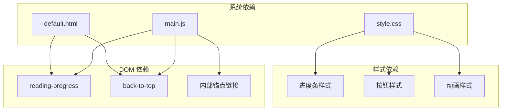

# 滚动行为控制系统

<cite>
**本文档引用的文件**
- [main.js](file://assets/js/main.js)
- [style.css](file://assets/css/style.css)
- [default.html](file://_layouts/default.html)
- [header.html](file://_includes/header.html)
- [about.html](file://_includes/sections/about.html)
</cite>

## 目录
1. [简介](#简介)
2. [项目结构](#项目结构)
3. [核心组件](#核心组件)
4. [架构概览](#架构概览)
5. [详细组件分析](#详细组件分析)
6. [依赖关系分析](#依赖关系分析)
7. [性能考虑](#性能考虑)
8. [故障排除指南](#故障排除指南)
9. [结论](#结论)

## 简介

滚动行为控制系统是现代网页中不可或缺的用户体验组件，负责管理页面滚动过程中的各种交互行为。本系统实现了三个核心滚动功能：返回顶部按钮（BackToTop）、阅读进度条（ReadingProgress）和平滑滚动（SmoothScroll）。这些组件通过原生JavaScript实现，无需依赖任何外部框架，确保了轻量级和高性能的特性。

该系统采用了渐进增强的设计理念，基础功能优先，同时为支持现代浏览器的用户提供更丰富的交互体验。系统充分考虑了无障碍性和性能优化，为不同设备和网络环境提供了良好的兼容性。

## 项目结构

滚动行为控制系统位于项目的前端资源中，采用模块化架构设计：



**图表来源**
- [main.js:77-230](file://assets/js/main.js#L77-L230)
- [style.css:510-520](file://assets/css/style.css#L510-L520)
- [default.html:124-140](file://_layouts/default.html#L124-L140)

**章节来源**
- [main.js:1-279](file://assets/js/main.js#L1-L279)
- [style.css:1-1015](file://assets/css/style.css#L1-L1015)

## 核心组件

滚动行为控制系统包含四个主要组件，每个组件都有其独特的职责和实现方式：

### BackToTop - 返回顶部功能
负责在用户滚动页面时显示/隐藏返回顶部按钮，并提供平滑的回到顶部交互。

### ReadingProgress - 阅读进度条
实时显示用户的阅读进度，通过计算页面滚动位置与总高度的比例来更新进度条宽度。

### SmoothScroll - 平滑滚动
为页面内的锚点链接提供平滑滚动效果，支持偏移量调整以避免固定导航栏遮挡内容。

### ScrollAnimations - 滚动动画
使用 Intersection Observer API 实现元素进入视口时的动画效果，提供流畅的滚动体验。

**章节来源**
- [main.js:77-230](file://assets/js/main.js#L77-L230)

## 架构概览

系统采用模块化设计，每个功能模块都是独立的JavaScript对象，具有清晰的初始化和事件绑定机制：



**图表来源**
- [main.js:77-230](file://assets/js/main.js#L77-L230)

系统的核心架构特点：
- **模块化设计**：每个功能独立封装为JavaScript对象
- **事件驱动**：通过DOM事件监听实现响应式交互
- **性能优化**：使用防抖函数减少事件处理开销
- **无障碍支持**：遵循WCAG标准，提供键盘导航支持

**章节来源**
- [main.js:6-279](file://assets/js/main.js#L6-L279)

## 详细组件分析

### BackToTop 组件分析

BackToTop组件实现了智能的返回顶部功能，通过滚动阈值控制按钮的显示和隐藏。

#### 核心实现原理



**图表来源**
- [main.js:98-116](file://assets/js/main.js#L98-L116)

#### 滚动阈值设置与显示逻辑

组件使用固定的滚动阈值常量来控制按钮的显示时机：

| 参数 | 值 | 描述 |
|------|-----|------|
| SCROLL_THRESHOLD | 300px | 触发按钮显示的滚动距离 |
| ANIMATION_THRESHOLD | 0.1 | Intersection Observer 的阈值 |

显示/隐藏逻辑的关键实现：
1. 监听窗口滚动事件
2. 比较当前滚动位置与阈值
3. 动态更新按钮的可见性状态
4. 使用CSS类实现平滑过渡效果

#### 性能优化策略

- **防抖处理**：滚动事件使用10ms防抖延迟
- **条件渲染**：仅在需要时修改DOM属性
- **CSS过渡**：利用硬件加速的CSS动画

**章节来源**
- [main.js:9-116](file://assets/js/main.js#L9-L116)

### ReadingProgress 组件分析

ReadingProgress组件提供了精确的阅读进度跟踪功能，通过计算页面滚动比例来更新进度条。

#### 进度计算算法



**图表来源**
- [main.js:136-142](file://assets/js/main.js#L136-L142)

#### 百分比更新机制

进度条更新采用线性插值算法，确保进度显示的准确性：

1. **动态高度计算**：实时获取文档总高度
2. **边界值处理**：防止进度超过100%或低于0%
3. **平滑更新**：使用CSS transition实现流畅的宽度变化

#### 样式实现细节

进度条的视觉效果通过CSS变量实现主题适配：

```css
#reading-progress {
    position: fixed;
    top: 0;
    left: 0;
    height: 3px;
    background: linear-gradient(90deg, var(--color-primary), var(--color-secondary));
    z-index: var(--z-tooltip);
    width: 0%;
    transition: width 0.1s linear;
}
```

**章节来源**
- [main.js:121-142](file://assets/js/main.js#L121-L142)
- [style.css:510-520](file://assets/css/style.css#L510-L520)

### SmoothScroll 组件分析

SmoothScroll组件为页面内锚点链接提供平滑滚动体验，支持偏移量调整以适配固定导航栏。

#### 平滑滚动实现方式

```mermaid
sequenceDiagram
participant User as 用户
participant Link as 锚点链接
participant SS as SmoothScroll
participant Target as 目标元素
participant Window as 窗口
User->>Link : 点击内部链接
Link->>SS : 触发点击事件
SS->>SS : 获取href属性
SS->>Target : 查找目标元素
Target->>SS : 返回元素位置
SS->>Window : scrollTo({top : offset, behavior : 'smooth'})
Window->>User : 平滑滚动到目标位置
```

**图表来源**
- [main.js:212-230](file://assets/js/main.js#L212-L230)

#### 偏移量调整机制

组件通过以下公式计算目标偏移量：

```
offset = target.getBoundingClientRect().top + window.pageYOffset - 80
```

偏移量设置为80像素，用于避免固定导航栏遮挡滚动到的内容。

#### 兼容性处理

- **现代浏览器**：使用原生 `scrollTo({behavior: 'smooth'})`
- **旧版浏览器**：降级为立即滚动，保持基本功能
- **触摸设备**：自动适应触摸滚动行为

**章节来源**
- [main.js:212-230](file://assets/js/main.js#L212-L230)

### ScrollAnimations 组件分析

ScrollAnimations组件使用 Intersection Observer API 实现元素进入视口时的动画效果。

#### Intersection Observer API 应用



**图表来源**
- [main.js:147-165](file://assets/js/main.js#L147-L165)

#### 动画触发机制

- **阈值设置**：ANIMATION_THRESHOLD = 0.1，允许元素10%可见时触发
- **一次性观察**：元素动画完成后自动取消观察
- **渐进增强**：不支持Observer的浏览器直接显示元素

#### CSS 动画配合

```css
.animate-on-scroll {
    opacity: 0;
    transform: translateY(20px);
    transition: opacity var(--transition-slow), transform var(--transition-slow);
}

.animate-on-scroll.is-visible {
    opacity: 1;
    transform: translateY(0);
}
```

**章节来源**
- [main.js:147-165](file://assets/js/main.js#L147-L165)
- [style.css:779-788](file://assets/css/style.css#L779-L788)

## 依赖关系分析

滚动行为控制系统与其他组件的依赖关系如下：



**图表来源**
- [main.js:77-230](file://assets/js/main.js#L77-L230)
- [style.css:510-520](file://assets/css/style.css#L510-L520)
- [default.html:124-140](file://_layouts/default.html#L124-L140)

**章节来源**
- [main.js:263-279](file://assets/js/main.js#L263-L279)

## 性能考虑

### 防抖处理策略

系统在多个关键位置使用防抖函数来优化性能：

| 组件 | 事件类型 | 防抖延迟 | 作用 |
|------|----------|----------|------|
| BackToTop | scroll | 10ms | 控制按钮显示/隐藏频率 |
| ReadingProgress | scroll | 10ms | 优化进度条更新性能 |
| ScrollAnimations | scroll | 16ms | 减少Intersection Observer回调次数 |

### 内存管理

- **事件解绑**：组件初始化时正确绑定事件监听器
- **观察器管理**：动画完成后自动取消元素观察
- **DOM 引用**：及时释放不再使用的DOM引用

### 浏览器兼容性

系统采用渐进增强策略，确保在不同浏览器环境下的可用性：

```javascript
// 检查 Intersection Observer 支持
if ('IntersectionObserver' in window) {
    // 使用现代API
} else {
    // 降级处理
    $$('.animate-on-scroll').forEach(el => {
        el.classList.add('is-visible');
    });
}
```

### 性能监控建议

- **滚动性能**：使用 `requestAnimationFrame` 优化动画
- **内存使用**：定期检查DOM节点数量
- **事件监听**：避免重复绑定相同的事件处理器

## 故障排除指南

### 常见问题及解决方案

#### 返回顶部按钮不显示

**可能原因**：
- 滚动阈值设置过高
- CSS 样式冲突
- JavaScript 初始化失败

**解决方法**：
1. 检查 `SCROLL_THRESHOLD` 常量值
2. 验证按钮的CSS类是否正确应用
3. 确认组件初始化顺序

#### 阅读进度条显示异常

**可能原因**：
- 文档高度计算错误
- CSS transition 影响
- 元素定位问题

**解决方法**：
1. 检查 `document.documentElement.scrollHeight` 计算
2. 验证 `position: fixed` 样式应用
3. 确认 z-index 层级设置

#### 平滑滚动效果不工作

**可能原因**：
- 浏览器不支持 `scrollTo` API
- 目标元素不存在
- CSS `scroll-behavior` 冲突

**解决方法**：
1. 检查浏览器兼容性
2. 验证锚点链接的正确性
3. 确认没有其他滚动样式覆盖

### 调试技巧

1. **开发者工具**：使用 Performance 面板监控滚动性能
2. **控制台日志**：添加必要的调试信息
3. **元素检查**：验证DOM结构和CSS类的应用

**章节来源**
- [main.js:9-279](file://assets/js/main.js#L9-L279)

## 结论

滚动行为控制系统通过精心设计的模块化架构，为用户提供了流畅、直观的滚动体验。系统的核心优势包括：

### 技术优势
- **轻量级实现**：纯原生JavaScript，无外部依赖
- **高性能优化**：防抖处理和硬件加速动画
- **无障碍支持**：符合WCAG标准的交互设计
- **跨浏览器兼容**：渐进增强策略确保广泛支持

### 用户体验优化
- **智能阈值控制**：合理的触发时机提升可用性
- **平滑过渡效果**：CSS硬件加速保证流畅体验
- **响应式设计**：适配不同设备和屏幕尺寸
- **性能优先**：最小化资源消耗和等待时间

### 扩展性考虑
系统的设计为未来的功能扩展预留了空间，可以轻松添加新的滚动相关功能，如滚动到特定区域、滚动同步等高级特性。

通过持续的性能监控和用户体验测试，该系统能够为用户提供稳定可靠的滚动交互体验，成为现代Web应用中滚动行为控制的优秀范例。