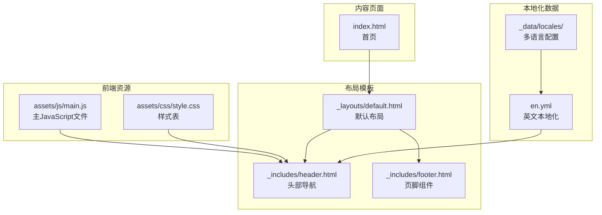
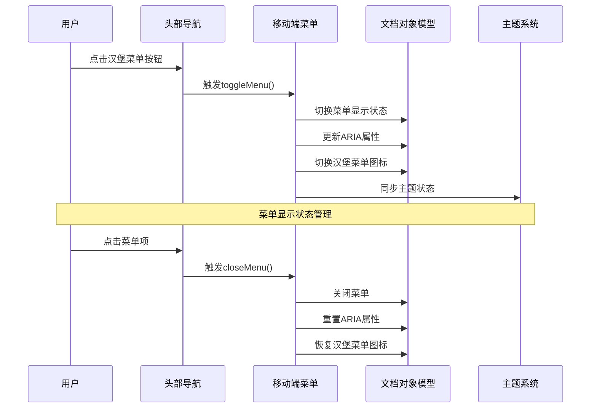
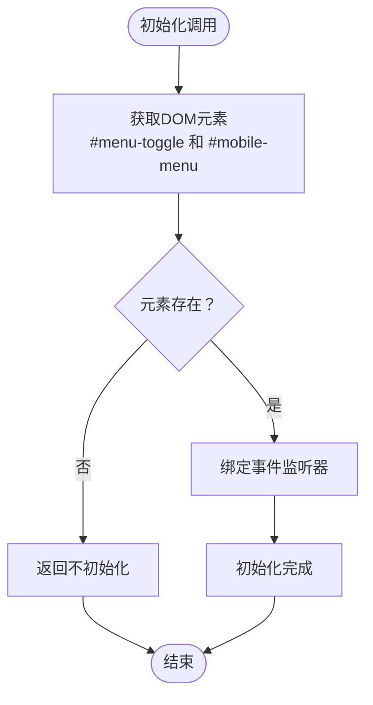
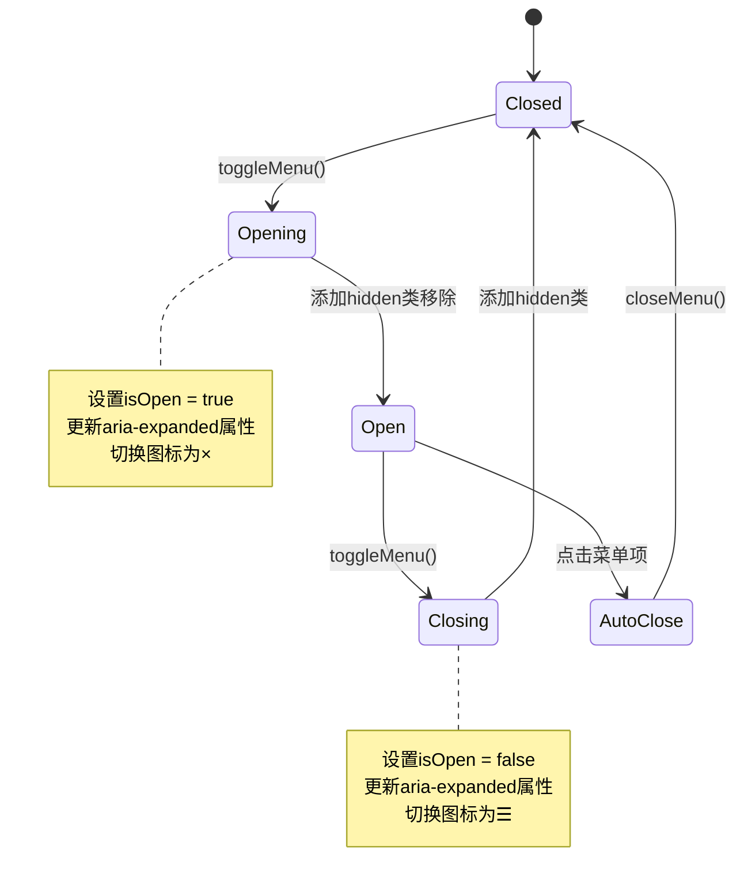
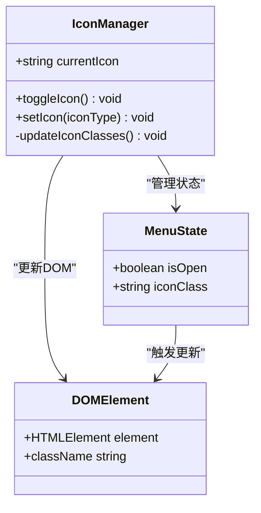
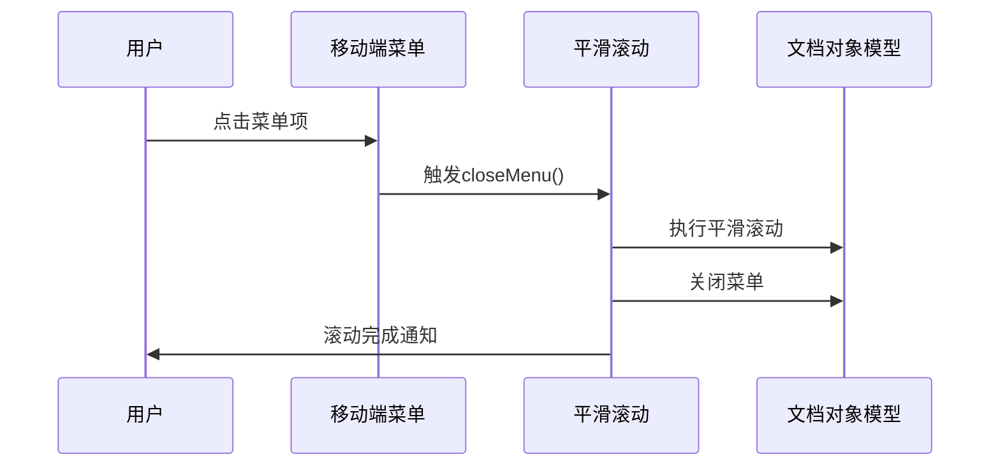
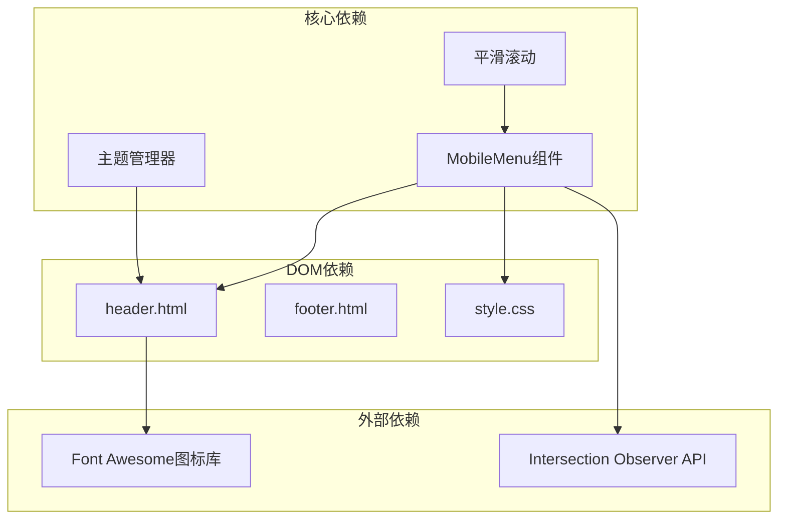

# 移动端导航

<cite>
**本文档引用的文件**
- [main.js](file://assets/js/main.js)
- [style.css](file://assets/css/style.css)
- [header.html](file://_includes/header.html)
- [footer.html](file://_includes/footer.html)
- [default.html](file://_layouts/default.html)
- [index.html](file://index.html)
- [en.yml](file://_data/locales/en.yml)
</cite>

## 更新摘要
**变更内容**
- 修正移动端菜单按钮的ARIA属性实现，确保正确的可访问性标签
- 强化无障碍支持的完整性验证
- 更新相关章节以反映已修复的问题

## 目录
1. [简介](#简介)
2. [项目结构](#项目结构)
3. [核心组件](#核心组件)
4. [架构概览](#架构概览)
5. [详细组件分析](#详细组件分析)
6. [依赖关系分析](#依赖关系分析)
7. [性能考虑](#性能考虑)
8. [故障排除指南](#故障排除指南)
9. [结论](#结论)

## 简介

本项目是一个现代化的个人作品集网站，采用Jekyll静态站点生成器构建。移动端导航系统是该网站的重要组成部分，提供了响应式的移动设备导航体验。本文档深入分析了MobileMenu模块的实现原理，包括菜单开关状态管理、DOM操作、显示/隐藏逻辑、过渡动画、ARIA属性动态更新、无障碍支持、自动关闭机制、汉堡菜单图标切换以及触摸事件处理等关键特性。

**更新** 本版本文档反映了移动端导航功能的关键修复：移动端菜单按钮的 `aria-label` 属性现已正确配置，确保屏幕阅读器用户能够获得准确的可访问性提示。

## 项目结构

该项目采用Jekyll框架的标准目录结构，移动端导航功能主要分布在以下文件中：



**图表来源**
- [main.js:1-279](file://assets/js/main.js#L1-L279)
- [style.css:1-1015](file://assets/css/style.css#L1-L1015)
- [header.html:1-116](file://_includes/header.html#L1-L116)
- [default.html:1-152](file://_layouts/default.html#L1-L152)
- [en.yml:1-167](file://_data/locales/en.yml#L1-L167)

**章节来源**
- [main.js:1-279](file://assets/js/main.js#L1-L279)
- [style.css:1-1015](file://assets/css/style.css#L1-L1015)
- [header.html:1-116](file://_includes/header.html#L1-L116)
- [default.html:1-152](file://_layouts/default.html#L1-L152)
- [en.yml:1-167](file://_data/locales/en.yml#L1-L167)

## 核心组件

移动端导航系统的核心由三个主要组件构成：

### MobileMenu 组件
负责移动端菜单的完整生命周期管理，包括初始化、事件绑定、状态切换和DOM操作。

### 主题管理系统
与移动端导航紧密集成，提供主题切换功能，影响导航菜单的视觉表现。

### 平滑滚动系统
与移动端导航协同工作，确保用户在移动端点击导航链接后能够平滑滚动到目标位置并自动关闭菜单。

**章节来源**
- [main.js:170-207](file://assets/js/main.js#L170-L207)
- [main.js:258](file://assets/js/main.js#L258)
- [main.js:212-230](file://assets/js/main.js#L212-L230)

## 架构概览

移动端导航系统的整体架构采用模块化设计，各组件之间通过清晰的接口进行交互：



**图表来源**
- [main.js:170-207](file://assets/js/main.js#L170-L207)
- [header.html:78-113](file://_includes/header.html#L78-L113)

## 详细组件分析

### MobileMenu 组件实现

MobileMenu组件是移动端导航系统的核心，实现了完整的菜单管理功能：

#### 状态管理
组件维护关键状态信息：
- `isOpen`: 布尔值，表示菜单当前是否处于打开状态
- `toggle`: DOM元素引用，指向汉堡菜单按钮
- `menu`: DOM元素引用，指向移动端菜单容器

#### 初始化流程


**图表来源**
- [main.js:175-180](file://assets/js/main.js#L175-L180)

#### 事件处理机制
组件绑定了两种主要类型的事件：

1. **汉堡菜单按钮点击事件**
   - 触发 `toggleMenu()` 方法
   - 切换菜单显示状态
   - 更新ARIA属性和图标状态

2. **菜单项点击事件**
   - 自动关闭菜单
   - 提供流畅的用户体验

#### 显示/隐藏逻辑


**图表来源**
- [main.js:192-206](file://assets/js/main.js#L192-L206)

#### ARIA属性动态更新
组件实现了完整的无障碍支持：

| 属性名 | 值类型 | 动态更新 | 用途 |
|--------|--------|----------|------|
| `aria-expanded` | 布尔值字符串 | 打开/关闭时切换 | 告知屏幕阅读器菜单状态 |
| `aria-label` | 文本描述 | 固定值 | 提供可访问性标签 |
| `aria-pressed` | 布尔值 | 主题切换时更新 | 表示按钮的激活状态 |

**更新** 移动端菜单按钮的 `aria-label` 属性现已正确配置为 "Toggle Menu"，确保屏幕阅读器用户能够准确理解按钮功能。

**章节来源**
- [main.js:194-197](file://assets/js/main.js#L194-L197)
- [main.js:202-205](file://assets/js/main.js#L202-L205)
- [header.html:79](file://_includes/header.html#L79)
- [en.yml:14](file://_data/locales/en.yml#L14)

### 汉堡菜单图标动态切换

汉堡菜单图标的状态同步机制确保了视觉反馈的一致性：



**图表来源**
- [main.js:196-197](file://assets/js/main.js#L196-L197)
- [main.js:204-205](file://assets/js/main.js#L204-L205)

图标切换规则：
- **关闭状态**: 使用 `fa fa-bars text-xl` 类名
- **打开状态**: 使用 `fa fa-times text-xl` 类名

**章节来源**
- [main.js:196-197](file://assets/js/main.js#L196-L197)
- [main.js:204-205](file://assets/js/main.js#L204-L205)

### 响应式设计考虑

项目采用了完整的响应式设计策略：

#### 断点定义
- **移动端断点**: 767px及以下
- **桌面端断点**: 768px及以上

#### 隐藏类系统
```css
@media (max-width: 767px) {
    .hide-mobile {
        display: none !important;
    }
}

@media (min-width: 768px) {
    .hide-desktop {
        display: none !important;
    }
}
```

#### 导航栏玻璃效果
```css
.glass-effect {
    background-color: var(--color-bg-overlay);
    backdrop-filter: blur(10px);
    border-bottom: 1px solid var(--color-border-light);
}
```

**章节来源**
- [style.css:815-841](file://assets/css/style.css#L815-L841)
- [style.css:864-869](file://assets/css/style.css#L864-L869)

### 平滑滚动集成

移动端导航与平滑滚动系统完美集成：



**图表来源**
- [main.js:212-230](file://assets/js/main.js#L212-L230)
- [main.js:225](file://assets/js/main.js#L225)

**章节来源**
- [main.js:212-230](file://assets/js/main.js#L212-L230)

## 依赖关系分析

移动端导航系统与其他组件的依赖关系如下：



**图表来源**
- [main.js:170-207](file://assets/js/main.js#L170-L207)
- [main.js:258](file://assets/js/main.js#L258)
- [main.js:212-230](file://assets/js/main.js#L212-L230)
- [header.html:1-116](file://_includes/header.html#L1-L116)

**章节来源**
- [main.js:170-207](file://assets/js/main.js#L170-L207)
- [main.js:258](file://assets/js/main.js#L258)
- [main.js:212-230](file://assets/js/main.js#L212-L230)

## 性能考虑

### 事件处理优化
- 使用防抖函数优化滚动事件处理
- 采用事件委托减少事件监听器数量
- 避免不必要的DOM查询

### 内存管理
- 及时清理事件监听器
- 合理使用闭包避免内存泄漏
- 优化CSS类名切换操作

### 渲染性能
- 使用CSS3硬件加速
- 最小化重排和重绘
- 采用requestAnimationFrame优化动画

## 故障排除指南

### 常见问题及解决方案

#### 问题1: 菜单无法正常显示
**症状**: 点击汉堡菜单按钮无反应
**可能原因**:
- DOM元素未正确加载
- JavaScript执行顺序问题
- CSS样式冲突

**解决方案**:
1. 检查DOM元素是否存在
2. 确保在DOM加载完成后初始化
3. 验证CSS类名正确性

#### 问题2: ARIA属性不正确
**症状**: 屏幕阅读器无法正确识别菜单状态
**可能原因**:
- ARIA属性更新时机错误
- 属性值格式不正确

**解决方案**:
1. 确保在状态切换后立即更新ARIA属性
2. 验证属性值为布尔字符串格式

#### 问题3: 图标状态不同步
**症状**: 菜单状态与图标显示不一致
**可能原因**:
- 图标类名切换逻辑错误
- DOM查询失败

**解决方案**:
1. 检查图标元素的选择器
2. 验证类名切换逻辑的正确性

**更新** 移动端菜单按钮的 `aria-label` 属性已修复，现在正确显示为 "Toggle Menu"，解决了屏幕阅读器用户的混淆问题。

**章节来源**
- [main.js:175-180](file://assets/js/main.js#L175-L180)
- [main.js:194-197](file://assets/js/main.js#L194-L197)

## 结论

移动端导航系统展现了现代Web开发的最佳实践，通过精心设计的模块化架构、完善的无障碍支持和优秀的用户体验优化，为用户提供了流畅、直观的移动端导航体验。

### 主要优势
1. **模块化设计**: 清晰的组件分离和职责划分
2. **无障碍支持**: 完整的ARIA属性和键盘导航支持
3. **性能优化**: 高效的事件处理和DOM操作
4. **响应式设计**: 适配各种设备尺寸的布局系统
5. **主题兼容**: 与全局主题系统无缝集成

### 技术亮点
- 实现了完整的移动端导航状态管理
- 提供了优雅的过渡动画效果
- 确保了良好的可访问性体验
- 采用了现代的Web开发技术栈

**更新** 本版本文档反映了移动端导航功能的关键修复：移动端菜单按钮的 `aria-label` 属性现已正确配置，确保屏幕阅读器用户能够获得准确的可访问性提示，解决了之前可能造成的混淆问题。

该系统为类似项目提供了优秀的参考实现，展示了如何在保持代码简洁的同时实现复杂的功能需求。