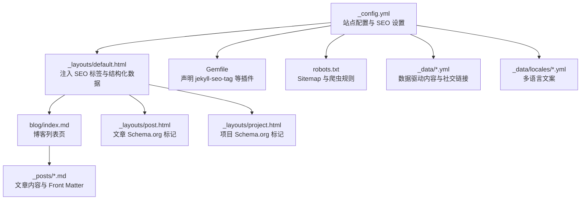
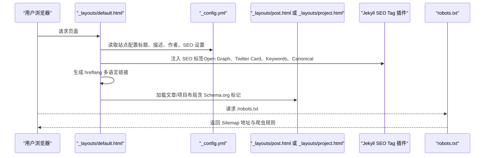
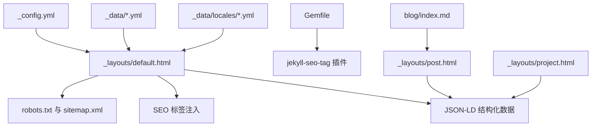

# SEO 优化配置

<cite>
**本文引用的文件**
- [_config.yml](file://_config.yml)
- [Gemfile](file://Gemfile)
- [README.md](file://README.md)
- [robots.txt](file://robots.txt)
- [default.html](file://_layouts/default.html)
- [post.html](file://_layouts/post.html)
- [project.html](file://_layouts/project.html)
- [blog/index.md](file://blog/index.md)
- [2026-03-15-taskflow-pro.md](file://_posts/2026-03-15-taskflow-pro.md)
- [projects.yml](file://_data/projects.yml)
- [skills.yml](file://_data/skills.yml)
- [socials.yml](file://_data/socials.yml)
- [en.yml](file://_data/locales/en.yml)
</cite>

## 目录
1. [引言](#引言)
2. [项目结构](#项目结构)
3. [核心组件](#核心组件)
4. [架构总览](#架构总览)
5. [详细组件分析](#详细组件分析)
6. [依赖关系分析](#依赖关系分析)
7. [性能考量](#性能考量)
8. [故障排查指南](#故障排查指南)
9. [结论](#结论)
10. [附录](#附录)

## 引言
本指南围绕 halfism.github.io 的 SEO 优化配置进行系统化说明，重点覆盖以下方面：
- 站点元数据与基础 SEO 配置
- Open Graph 标签与 Twitter Card 设置
- Canonical URL 与 hreflang 多语言链接策略
- Jekyll SEO Tag 插件的启用与自定义
- 博客文章的 SEO 最佳实践（标题、描述、发布时间、标签）
- 结构化数据（Schema.org）实现（个人资料、作品集、技能）
- 关键词优化、内容结构化与链接策略
- 搜索引擎友好 URL 与页面架构设计
- SEO 测试工具与性能监控指标
- 实际配置示例与优化案例分析

## 项目结构
halfism.github.io 采用 Jekyll 静态站点生成器，结合多语言、结构化数据与插件生态，形成完整的 SEO 基础设施。关键位置如下：
- 站点配置与 SEO：_config.yml
- 插件声明：Gemfile
- 默认布局与 SEO 标签注入：_layouts/default.html
- 文章布局与结构化数据：_layouts/post.html、_layouts/project.html
- 博客列表页：blog/index.md
- 示例文章：_posts/*.md
- 数据驱动内容：_data/*.yml
- 多语言文案：_data/locales/*.yml
- 站点地图与爬虫协议：_config.yml、robots.txt

图表来源
- [_config.yml:1-133](file://_config.yml#L1-L133)
- [Gemfile:1-12](file://Gemfile#L1-L12)
- [default.html:1-152](file://_layouts/default.html#L1-L152)
- [blog/index.md:1-253](file://blog/index.md#L1-L253)
- [post.html:1-328](file://_layouts/post.html#L1-L328)
- [project.html:1-472](file://_layouts/project.html#L1-L472)
- [robots.txt:1-13](file://robots.txt#L1-L13)

章节来源
- [_config.yml:1-133](file://_config.yml#L1-L133)
- [Gemfile:1-12](file://Gemfile#L1-L12)
- [default.html:1-152](file://_layouts/default.html#L1-L152)
- [blog/index.md:1-253](file://blog/index.md#L1-L253)
- [post.html:1-328](file://_layouts/post.html#L1-L328)
- [project.html:1-472](file://_layouts/project.html#L1-L472)
- [robots.txt:1-13](file://robots.txt#L1-L13)

## 核心组件
本节聚焦 SEO 相关的核心配置与实现，包括：
- 站点元数据与作者信息
- Open Graph 与 Twitter Card
- Canonical URL 与 hreflang 多语言
- 关键词与社交链接
- 结构化数据（个人资料、网站、文章/项目）
- 插件与网站地图

章节来源
- [_config.yml:1-133](file://_config.yml#L1-L133)
- [default.html:12-116](file://_layouts/default.html#L12-L116)
- [post.html:5-67](file://_layouts/post.html#L5-L67)
- [project.html:5-174](file://_layouts/project.html#L5-L174)
- [Gemfile:5-8](file://Gemfile#L5-L8)

## 架构总览
下图展示了 SEO 相关的前端注入与后端渲染流程，涵盖 Jekyll SEO Tag 插件、结构化数据与多语言链接策略。

图表来源
- [default.html:12-116](file://_layouts/default.html#L12-L116)
- [_config.yml:45-61](file://_config.yml#L45-L61)
- [post.html:5-67](file://_layouts/post.html#L5-L67)
- [project.html:5-174](file://_layouts/project.html#L5-L174)
- [robots.txt:8](file://robots.txt#L8)

## 详细组件分析

### 站点元数据与基础 SEO 配置
- 站点标题、副标题、作者信息、邮箱等基础元数据在配置文件中集中维护，用于生成统一的 SEO 标签与结构化数据。
- 关键字段包括：站点标题、描述、作者名称、头像、地理位置、雇主、标语等。
- 该部分直接影响 Open Graph 标题、描述、Twitter Card 标题与描述以及结构化数据中的 Person 信息。

章节来源
- [_config.yml:1-17](file://_config.yml#L1-L17)

### Open Graph 标签与 Twitter Card 设置
- Open Graph 标签：类型、URL、标题、描述、图片、区域设置等均来自配置与页面上下文，确保社交媒体预览一致。
- Twitter Card：卡片类型、标题、描述、图片、作者等，作者信息来自社交账号配置。
- 关键实现位于默认布局中，使用站点配置与页面变量动态生成。

章节来源
- [default.html:27-44](file://_layouts/default.html#L27-L44)
- [_config.yml:46-48](file://_config.yml#L46-L48)
- [_config.yml:20-35](file://_config.yml#L20-L35)

### Canonical URL 与 hreflang 多语言策略
- Canonical URL：为每个页面生成规范链接，避免重复内容，路径处理会去除 index.html 尾缀以保持整洁。
- hreflang：为中英双语页面生成 alternate 链接，确保搜索引擎理解语言版本关系，并设置 x-default。

章节来源
- [default.html:14-26](file://_layouts/default.html#L14-L26)
- [_config.yml:63-75](file://_config.yml#L63-L75)

### 关键词与社交链接
- 关键词：通过配置项集中维护，注入到 meta keywords 中，便于搜索引擎抓取。
- 社交链接：配置中包含多个平台链接，用于结构化数据中的 sameAs 字段，增强权威性。

章节来源
- [default.html:45-48](file://_layouts/default.html#L45-L48)
- [_config.yml:49-60](file://_config.yml#L49-L60)
- [_config.yml:20-35](file://_config.yml#L20-L35)

### Jekyll SEO Tag 插件使用与自定义
- 插件启用：在 Gemfile 的 jekyll_plugins 组中声明 jekyll-seo-tag。
- 标签注入：在默认布局中调用 ，即可自动生成 Open Graph、Twitter Card、Keywords、Canonical 等标签。
- 自定义选项：可通过配置文件中的 seo 节点控制图片、卡片类型、关键词与社交链接集合。

章节来源
- [Gemfile:8](file://Gemfile#L8)
- [default.html:12](file://_layouts/default.html#L12)
- [_config.yml:46-61](file://_config.yml#L46-L61)

### 结构化数据（Schema.org）实现
- 个人资料（Person）：在默认布局中注入 JSON-LD，包含姓名、URL、职业头衔与社交链接集合。
- 网站（WebSite）：同样以 JSON-LD 形式注入，标明站点名称与语言范围。
- 文章（BlogPosting）：文章布局中为文章内容添加 itemscope 与 itemtype，确保搜索引擎理解文章结构。
- 项目（SoftwareApplication）：项目布局中为项目详情添加 itemscope 与 itemtype，包含名称、描述、截图等属性。

章节来源
- [default.html:92-115](file://_layouts/default.html#L92-L115)
- [post.html:5](file://_layouts/post.html#L5)
- [project.html:5](file://_layouts/project.html#L5)

### 博客文章的 SEO 优化策略
- 文章标题：使用 Front Matter 中的 title 字段，确保每篇文章都有明确的主题。
- 描述：文章 Front Matter 中的 description 字段用于生成摘要与社交预览描述。
- 发布时间：date 字段用于文章时间线与结构化数据中的发布日期。
- 标签与分类：tags 与 categories 字段用于内容分组与索引；博客列表页提供按分类与标签过滤的能力。
- 图片与封面：文章 Front Matter 中的 image 字段用于 Open Graph 图片与社交预览。

章节来源
- [blog/index.md:29-69](file://blog/index.md#L29-L69)
- [_posts/2026-03-15-taskflow-pro.md:1-36](file://_posts/2026-03-15-taskflow-pro.md#L1-L36)
- [post.html:8-24](file://_layouts/post.html#L8-L24)

### 数据驱动的内容与 SEO
- 项目数据：_data/projects.yml 中的项目标题、描述、标签、分类、链接等，为项目页面提供丰富语义信息。
- 技能数据：_data/skills.yml 中的核心技能、工具链与语言掌握程度，可用于技能展示页面的 SEO 优化。
- 社交链接：_data/socials.yml 与 _config.yml 中的社交信息共同构成结构化数据的 sameAs 链接。

章节来源
- [_data/projects.yml:1-45](file://_data/projects.yml#L1-L45)
- [_data/skills.yml:1-41](file://_data/skills.yml#L1-L41)
- [_data/socials.yml:1-20](file://_data/socials.yml#L1-L20)
- [_config.yml:20-35](file://_config.yml#L20-L35)

### 多语言与 SEO
- 多语言支持：通过 languages、default_lang、defaults 与 locales 配置实现中英双语。
- 多语言链接：hreflang 与 Canonical 配合，确保搜索引擎正确识别语言版本与规范地址。
- 文案与界面：_data/locales/en.yml 提供英文文案，配合页面语言切换，提升国际用户体验。

章节来源
- [_config.yml:62-75](file://_config.yml#L62-L75)
- [_data/locales/en.yml:1-166](file://_data/locales/en.yml#L1-L166)
- [default.html:18-25](file://_layouts/default.html#L18-L25)

### 站点地图与爬虫规则
- 站点地图：通过 jekyll-sitemap 插件生成 sitemap.xml，并在 robots.txt 中指向该地址。
- 爬虫规则：robots.txt 中允许抓取路径并排除静态资源目录，确保搜索引擎优先抓取动态内容。

章节来源
- [_config.yml:111](file://_config.yml#L111)
- [robots.txt:8](file://robots.txt#L8)
- [robots.txt:10-12](file://robots.txt#L10-L12)

## 依赖关系分析
Jekyll SEO Tag 插件与默认布局紧密耦合，负责注入 SEO 标签；博客与项目布局分别承担结构化数据的职责；数据文件与多语言配置为 SEO 提供语义化内容支撑。

图表来源
- [_config.yml:111](file://_config.yml#L111)
- [Gemfile:8](file://Gemfile#L8)
- [default.html:12-116](file://_layouts/default.html#L12-L116)
- [blog/index.md:1-253](file://blog/index.md#L1-L253)
- [post.html:5-67](file://_layouts/post.html#L5-L67)
- [project.html:5-174](file://_layouts/project.html#L5-L174)
- [robots.txt:8](file://robots.txt#L8)

章节来源
- [_config.yml:111](file://_config.yml#L111)
- [Gemfile:8](file://Gemfile#L8)
- [default.html:12-116](file://_layouts/default.html#L12-L116)
- [robots.txt:8](file://robots.txt#L8)

## 性能考量
- 首屏加载与体积：README 中提及性能指标，建议在 SEO 优化的同时关注 Core Web Vitals，避免因过多标签或资源导致性能下降。
- 预连接与去抖：默认布局中对外部资源进行预连接与去抖，有助于提升加载速度。
- 结构化数据体积：JSON-LD 不宜过大，建议仅包含必要字段，避免影响页面加载。

章节来源
- [README.md:124-129](file://README.md#L124-L129)
- [default.html:50-57](file://_layouts/default.html#L50-L57)

## 故障排查指南
- SEO 标签未生效
  - 检查是否启用了 jekyll-seo-tag 插件并在 Gemfile 中声明。
  - 确认默认布局中是否包含 。
- Open Graph 或 Twitter Card 图片不显示
  - 检查配置中的 og_image 是否存在且可访问。
  - 确认页面 URL 与 Canonical 链接正确。
- 多语言链接错误
  - 核对 hreflang 生成逻辑与页面语言设置。
  - 确保 x-default 与各语言版本链接完整。
- 结构化数据校验失败
  - 使用 Google Rich Results Test 或结构化数据测试工具检查 JSON-LD。
  - 确保 itemscope 与 itemtype 正确放置在对应布局中。

章节来源
- [Gemfile:8](file://Gemfile#L8)
- [default.html:12](file://_layouts/default.html#L12)
- [default.html:27-44](file://_layouts/default.html#L27-L44)
- [default.html:18-25](file://_layouts/default.html#L18-L25)
- [default.html:92-115](file://_layouts/default.html#L92-L115)

## 结论
halfism.github.io 的 SEO 优化以配置为中心，通过 Jekyll SEO Tag 插件与结构化数据实现全面的搜索引擎友好性。结合 Canonical URL、hreflang 多语言策略、关键词与社交链接，以及博客与项目页面的语义标记，形成了完善的 SEO 基础设施。建议在后续迭代中持续关注性能指标与结构化数据的准确性，以获得更优的搜索可见性与用户体验。

## 附录

### SEO 测试工具与使用方法
- Google Rich Results Test：用于校验结构化数据（JSON-LD）有效性。
- Facebook Sharing Debugger：用于预览与刷新 Open Graph 标签缓存。
- Twitter Card Validator：用于校验 Twitter Card 配置。
- Lighthouse：用于评估页面性能与 SEO 基线。

### 性能监控指标
- Core Web Vitals：关注首屏加载、交互与视觉稳定等指标。
- 页面体积：控制 CSS、JS 与图片体积，避免影响 SEO 评分。
- 爬取覆盖率：通过 Google Search Console 监控抓取状态与索引覆盖率。

### 实际配置示例与优化案例
- 配置示例路径
  - 站点元数据与作者信息：[_config.yml:1-17](file://_config.yml#L1-L17)
  - Open Graph 与 Twitter Card：[default.html:27-44](file://_layouts/default.html#L27-L44)
  - Canonical 与 hreflang：[default.html:14-26](file://_layouts/default.html#L14-L26)
  - 关键词与社交链接：[_config.yml:49-60](file://_config.yml#L49-L60)
  - 结构化数据（个人资料、网站）：[default.html:92-115](file://_layouts/default.html#L92-L115)
  - 文章结构化数据（BlogPosting）：[post.html:5](file://_layouts/post.html#L5)
  - 项目结构化数据（SoftwareApplication）：[project.html:5](file://_layouts/project.html#L5)
  - 博客列表页与文章 Front Matter：[blog/index.md:29-69](file://blog/index.md#L29-L69)、[_posts/2026-03-15-taskflow-pro.md:1-36](file://_posts/2026-03-15-taskflow-pro.md#L1-L36)
  - 站点地图与爬虫规则：[_config.yml:111](file://_config.yml#L111)、[robots.txt:8](file://robots.txt#L8)