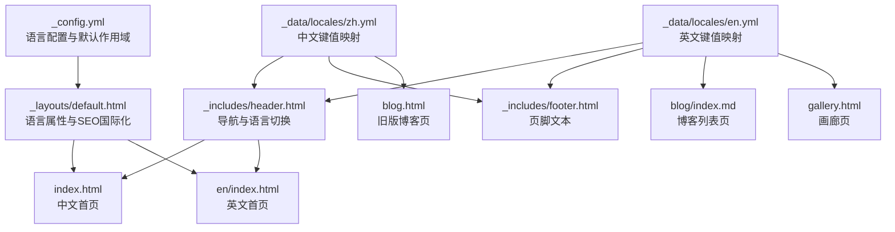
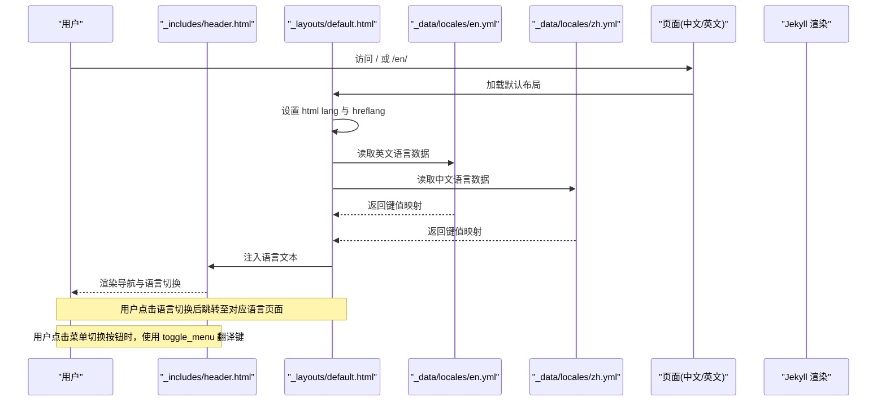
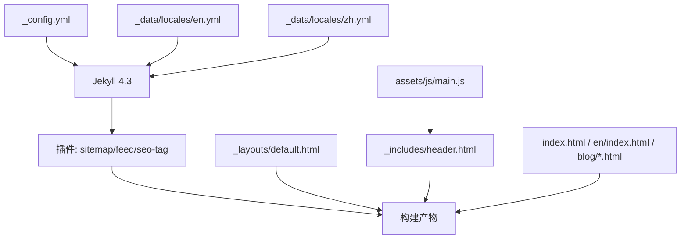

# 多语言支持系统

<cite>
**本文引用的文件**
- [_config.yml](file://_config.yml)
- [_data/locales/en.yml](file://_data/locales/en.yml)
- [_data/locales/zh.yml](file://_data/locales/zh.yml)
- [index.html](file://index.html)
- [en/index.html](file://en/index.html)
- [_includes/header.html](file://_includes/header.html)
- [_includes/footer.html](file://_includes/footer.html)
- [_layouts/default.html](file://_layouts/default.html)
- [assets/js/main.js](file://assets/js/main.js)
- [blog/index.md](file://blog/index.md)
- [blog.html](file://blog.html)
- [gallery.html](file://gallery.html)
- [_data/projects.yml](file://_data/projects.yml)
- [_data/socials.yml](file://_data/socials.yml)
- [Gemfile](file://Gemfile)
- [README.md](file://README.md)
</cite>

## 更新摘要
**变更内容**
- 新增 `toggle_menu` 翻译键，完善导航菜单切换功能的国际化支持
- 更新导航菜单的无障碍属性，增强用户体验
- 完善中英文版本在菜单切换功能上的一致性

## 目录
1. [引言](#引言)
2. [项目结构](#项目结构)
3. [核心组件](#核心组件)
4. [架构总览](#架构总览)
5. [详细组件分析](#详细组件分析)
6. [依赖关系分析](#依赖关系分析)
7. [性能考量](#性能考量)
8. [故障排查指南](#故障排查指南)
9. [结论](#结论)
10. [附录](#附录)

## 引言
本文件系统性梳理 halfism.github.io 的多语言支持机制，覆盖语言切换逻辑、内容渲染策略、URL 结构设计、本地化数据管理、Jekyll 多语言处理、用户体验设计与无障碍支持，并提供新增语言的扩展指南、维护策略与常见问题解决方案。目标是帮助维护者与贡献者以一致的方式扩展与维护多语言内容。

**更新** 本次更新重点关注导航菜单功能的国际化增强，特别是 `toggle_menu` 翻译键的引入，确保中英文版本在菜单切换功能上的一致性和完整性。

## 项目结构
该站点采用 Jekyll 数据驱动与组件化架构，多语言能力通过配置与模板层协同实现：
- 配置层：在站点配置中声明语言集合与默认语言，并通过默认作用域为不同路径设置语言。
- 数据层：在 _data/locales 下维护各语言的键值映射，供模板直接读取。
- 模板层：在布局与包含文件中按 page.lang 选择对应语言文本；导航与链接根据语言动态生成。
- 资源层：静态页面与博客列表页分别在根路径与 en 子路径下提供双语入口。

**图表来源**
- [_config.yml:62-76](file://_config.yml#L62-L76)
- [_layouts/default.html:2-26](file://_layouts/default.html#L2-L26)
- [_data/locales/en.yml:1-167](file://_data/locales/en.yml#L1-L167)
- [_data/locales/zh.yml:1-167](file://_data/locales/zh.yml#L1-L167)
- [_includes/header.html:1-116](file://_includes/header.html#L1-L116)
- [_includes/footer.html:1-49](file://_includes/footer.html#L1-L49)
- [blog/index.md:1-253](file://blog/index.md#L1-L253)
- [blog.html:1-50](file://blog.html#L1-L50)
- [gallery.html:1-138](file://gallery.html#L1-L138)
- [index.html:1-17](file://index.html#L1-L17)
- [en/index.html:1-22](file://en/index.html#L1-L22)

**章节来源**
- [_config.yml:62-76](file://_config.yml#L62-L76)
- [_layouts/default.html:2-26](file://_layouts/default.html#L2-L26)
- [_data/locales/en.yml:1-167](file://_data/locales/en.yml#L1-L167)
- [_data/locales/zh.yml:1-167](file://_data/locales/zh.yml#L1-L167)
- [_includes/header.html:1-116](file://_includes/header.html#L1-L116)
- [_includes/footer.html:1-49](file://_includes/footer.html#L1-L49)
- [blog/index.md:1-253](file://blog/index.md#L1-L253)
- [blog.html:1-50](file://blog.html#L1-L50)
- [gallery.html:1-138](file://gallery.html#L1-L138)
- [index.html:1-17](file://index.html#L1-L17)
- [en/index.html:1-22](file://en/index.html#L1-L22)

## 核心组件
- 站点语言配置与默认作用域
  - languages 与 default_lang 定义可用语言与默认语言。
  - defaults 为根路径与 en 子路径分别设置 lang 值，确保页面模板能正确读取 page.lang。
- 本地化数据文件
  - _data/locales/en.yml 与 _data/locales/zh.yml 提供中英文键值映射，键空间覆盖导航、英雄区、关于、项目、技能、日志、证书、联系、博客、画廊、搜索、PWA、页脚、文章与通用等模块。
- 模板中的语言选择与渲染
  - 在布局与包含文件中通过 site.data.locales[page.lang][page.lang] 获取当前语言文本。
  - 导航中的语言切换按钮根据 page.lang 动态生成跳转链接。
- URL 结构与 SEO
  - 中文首页位于根路径，英文首页位于 /en/，并通过 rel="alternate" hreflang 与 canonical 链接实现国际化 SEO。

**更新** 新增 `toggle_menu` 翻译键，完善导航菜单切换功能的国际化支持，确保中英文版本在菜单切换按钮的无障碍属性上保持一致。

**章节来源**
- [_config.yml:62-76](file://_config.yml#L62-L76)
- [_data/locales/en.yml:1-167](file://_data/locales/en.yml#L1-L167)
- [_data/locales/zh.yml:1-167](file://_data/locales/zh.yml#L1-L167)
- [_includes/header.html:1-116](file://_includes/header.html#L1-L116)
- [_layouts/default.html:17-26](file://_layouts/default.html#L17-L26)

## 架构总览
下图展示了从配置到模板渲染再到用户交互的多语言处理链路。

**图表来源**
- [_layouts/default.html:2-26](file://_layouts/default.html#L2-L26)
- [_data/locales/en.yml:1-167](file://_data/locales/en.yml#L1-L167)
- [_data/locales/zh.yml:1-167](file://_data/locales/zh.yml#L1-L167)
- [_includes/header.html:1-116](file://_includes/header.html#L1-L116)
- [index.html:1-17](file://index.html#L1-L17)
- [en/index.html:1-22](file://en/index.html#L1-L22)

## 详细组件分析

### 语言配置与默认作用域
- languages 与 default_lang
  - 在配置中声明 ["zh", "en"] 作为可用语言，default_lang 指定 "zh" 为默认语言。
- defaults 作用域
  - 对根路径设置 lang: "zh"，对 "en" 子路径设置 lang: "en"，确保每个页面的 page.lang 正确传递给模板。
- 影响范围
  - 以上配置直接影响模板中 page.lang 的取值，从而决定语言数据读取键与 hreflang 生成。

**章节来源**
- [_config.yml:62-76](file://_config.yml#L62-L76)

### 本地化数据管理（_data/locales/）
- 文件组织
  - 包含英文数据文件 en.yml 和中文数据文件 zh.yml，键空间覆盖导航、英雄区、关于、项目、技能、日志、证书、联系、博客、画廊、搜索、PWA、页脚、文章与通用等模块。
- 字段映射
  - 采用嵌套键结构，例如 t.nav.home、t.hero.welcome 等，便于模板统一访问。
  - 新增 `toggle_menu` 翻译键，中英文分别对应 "Toggle Menu" 和 "切换菜单"。
- 扩展建议
  - 新增语言时需在同目录创建对应语言代码的 YAML 文件，并保持键空间一致，避免模板层出现未匹配键。

**更新** 新增 `toggle_menu` 翻译键，确保导航菜单切换按钮在中英文版本中都有对应的无障碍标签。

**章节来源**
- [_data/locales/en.yml:1-167](file://_data/locales/en.yml#L1-L167)
- [_data/locales/zh.yml:1-167](file://_data/locales/zh.yml#L1-L167)

### Jekyll 多语言处理机制
- 页面前言（front matter）
  - index.html 与 en/index.html 分别设置 lang: "zh" 与 lang: "en"，确保页面模板读取正确的语言上下文。
  - 博客列表页 blog/index.md 与 blog.html 同样设置 lang 与 permalink，保证列表页的国际化行为一致。
- 条件渲染语法
  - 模板中通过 ...... 控制导航链接与文案显示。
  - 语言切换按钮根据当前语言动态生成跳转链接，如 / 与 /en/。
- SEO 与 hreflang
  - 布局中根据 page.lang 输出不同的 hreflang 与 og:locale，实现搜索引擎的国际化索引。

**章节来源**
- [index.html:1-17](file://index.html#L1-L17)
- [en/index.html:1-22](file://en/index.html#L1-L22)
- [blog/index.md:1-253](file://blog/index.md#L1-L253)
- [blog.html:1-50](file://blog.html#L1-L50)
- [_layouts/default.html:17-34](file://_layouts/default.html#L17-L34)

### 语言切换逻辑与用户体验
- 切换逻辑
  - 导航中的语言切换按钮在移动端与桌面端均提供，根据当前语言显示对应的目标语言链接。
  - 切换后跳转至 / 或 /en/，保持页面内容与 URL 的一致性。
- 状态保持
  - 主题切换使用 localStorage 保存用户偏好，语言切换未见持久化存储逻辑，建议在新增语言时补充本地存储与恢复逻辑。
- 无障碍支持
  - 导航与按钮包含 aria-label、aria-haspopup、aria-expanded、aria-selected 等属性，提升键盘导航与屏幕阅读器体验。
  - **新增** 菜单切换按钮使用 `toggle_menu` 翻译键作为 aria-label，确保中英文版本的无障碍支持一致。
- 无障碍改进建议
  - 为语言切换按钮增加 aria-current 以标识当前语言；为切换菜单增加键盘焦点管理。

**更新** 新增 `toggle_menu` 翻译键的无障碍支持，确保菜单切换按钮在中英文版本中都有合适的无障碍标签。

**章节来源**
- [_includes/header.html:30-56](file://_includes/header.html#L30-L56)
- [_includes/header.html:107-112](file://_includes/header.html#L107-L112)
- [_includes/footer.html:41-45](file://_includes/footer.html#L41-L45)
- [_layouts/default.html:119-122](file://_layouts/default.html#L119-L122)

### 内容渲染策略
- 组件化渲染
  - 首页与各模块通过  组合，语言文本通过 t 变量注入，确保模块级可复用与语言一致。
- 文章与项目数据的多语言
  - 项目数据文件 _data/projects.yml 提供 title_zh/title_en 与 description_zh/description_en 字段，用于在组件中按语言选择显示。
- 搜索与过滤
  - 博客列表页与画廊页在模板中使用 t.* 键进行本地化文案输出，过滤与标签显示逻辑与语言无关。

**章节来源**
- [index.html:7-16](file://index.html#L7-L16)
- [en/index.html:8-21](file://en/index.html#L8-L21)
- [_includes/header.html:1-116](file://_includes/header.html#L1-L116)
- [_includes/footer.html:1-49](file://_includes/footer.html#L1-L49)
- [_data/projects.yml:1-45](file://_data/projects.yml#L1-L45)
- [blog/index.md:8-79](file://blog/index.md#L8-L79)
- [gallery.html:7-138](file://gallery.html#L7-L138)

### URL 结构设计
- 中文首页：根路径 /
- 英文首页：/en/
- 博客列表页：中文 /blog/，英文通过 en 子路径提供（当前 en 子路径未设置 permalink，可能影响 SEO）。
- 导航与跳转
  - 导航中根据 page.lang 生成相对路径，确保跨语言跳转正确。

**章节来源**
- [index.html:1-17](file://index.html#L1-L17)
- [en/index.html:1-22](file://en/index.html#L1-L22)
- [blog/index.md:1-6](file://blog/index.md#L1-L6)
- [_includes/header.html:7-13](file://_includes/header.html#L7-L13)

### 语言切换的用户体验设计
- 状态保持
  - 主题切换已通过 localStorage 保持偏好；语言切换建议增加类似机制，以提升连续访问体验。
- 跳转逻辑
  - 语言切换按钮在移动端与桌面端均提供，跳转至对应语言根路径，避免重复加载。
- 无障碍支持
  - 已包含必要的 ARIA 属性；建议补充语言切换菜单的键盘可达性与当前语言标识。
  - **新增** 菜单切换按钮使用 `toggle_menu` 翻译键，确保中英文版本的无障碍体验一致。

**更新** 新增 `toggle_menu` 翻译键的无障碍支持，提升中英文版本在菜单切换功能上的用户体验一致性。

**章节来源**
- [_includes/header.html:30-56](file://_includes/header.html#L30-L56)
- [_includes/header.html:107-112](file://_includes/header.html#L107-L112)
- [_layouts/default.html:119-122](file://_layouts/default.html#L119-L122)

### 新增语言扩展指南
- 创建数据文件
  - 在 _data/locales/ 下新增对应语言代码的 YAML 文件，保持与 en.yml 和 zh.yml 一致的键空间。
  - **重要** 确保包含 `toggle_menu` 翻译键，以支持导航菜单切换功能的国际化。
- 更新配置
  - 在 _config.yml 的 languages 中加入新语言代码，并在需要时调整 default_lang。
  - 如需为新语言设置特定路径的默认语言，可在 defaults 中追加相应作用域。
- 页面复制与语言设置
  - 将现有页面（如首页、博客列表页、画廊页）复制到 en 子路径，并在 front matter 中设置 lang 与 permalink。
  - 更新导航与链接，确保语言切换按钮指向新语言页面。
- 模板适配
  - 在模板中使用 ... 条件渲染，确保新语言的文案与链接正确显示。
- SEO 与 hreflang
  - 在布局中为新语言补充 hreflang 与 og:locale，确保搜索引擎正确索引。

**更新** 新增语言时必须包含 `toggle_menu` 翻译键，确保导航菜单切换功能的完整国际化支持。

**章节来源**
- [_config.yml:62-76](file://_config.yml#L62-L76)
- [_data/locales/en.yml:1-167](file://_data/locales/en.yml#L1-L167)
- [_data/locales/zh.yml:1-167](file://_data/locales/zh.yml#L1-L167)
- [index.html:1-17](file://index.html#L1-L17)
- [en/index.html:1-22](file://en/index.html#L1-L22)
- [_layouts/default.html:17-34](file://_layouts/default.html#L17-L34)

### 多语言内容维护策略与翻译工作流
- 键空间一致性
  - 所有语言的数据文件必须保持相同的键空间，避免模板层出现未匹配键导致的渲染异常。
  - **新增要求** 所有语言必须包含 `toggle_menu` 翻译键，确保导航菜单功能的国际化完整性。
- 数据驱动与组件化
  - 项目与技能等数据采用 YAML 文件管理，便于在不同语言间共享结构化信息；在组件中按语言选择显示。
- 翻译工作流建议
  - 使用版本控制追踪翻译变更；为每个语言维护独立的审阅流程；定期校验 hreflang 与 SEO 标签。
- 无障碍与可访问性
  - 保持 ARIA 属性与键盘导航的一致性，确保多语言环境下仍具备良好的可访问性。
  - **新增** 确保 `toggle_menu` 翻译键在所有语言版本中都提供准确的无障碍标签。

**更新** 新增 `toggle_menu` 翻译键的维护要求，确保导航菜单功能在所有语言版本中的一致性。

**章节来源**
- [_data/projects.yml:1-45](file://_data/projects.yml#L1-L45)
- [_data/socials.yml:1-20](file://_data/socials.yml#L1-L20)
- [_includes/header.html:30-56](file://_includes/header.html#L30-L56)
- [_includes/footer.html:41-45](file://_includes/footer.html#L41-L45)

## 依赖关系分析
- Jekyll 版本与插件
  - 使用 jekyll 4.3，启用 jekyll-sitemap、jekyll-feed、jekyll-seo-tag 等插件，为多语言站点提供站点地图、订阅与 SEO 支持。
- 样式与脚本
  - 样式通过 CSS 变量实现主题系统；JavaScript 提供主题切换、滚动进度、平滑滚动等交互，语言切换按钮与主题切换按钮共享无障碍设计。
  - **新增** JavaScript 中的 MobileMenu 组件使用 `toggle_menu` 翻译键作为菜单切换按钮的无障碍标签。

**图表来源**
- [Gemfile:1-12](file://Gemfile#L1-L12)
- [_config.yml:1-133](file://_config.yml#L1-L133)
- [_layouts/default.html:1-152](file://_layouts/default.html#L1-L152)
- [_includes/header.html:1-116](file://_includes/header.html#L1-L116)
- [_includes/footer.html:1-49](file://_includes/footer.html#L1-L49)
- [index.html:1-17](file://index.html#L1-L17)
- [en/index.html:1-22](file://en/index.html#L1-L22)
- [blog/index.md:1-253](file://blog/index.md#L1-L253)
- [assets/js/main.js:175-207](file://assets/js/main.js#L175-L207)

**章节来源**
- [Gemfile:1-12](file://Gemfile#L1-L12)
- [_config.yml:1-133](file://_config.yml#L1-L133)
- [_layouts/default.html:1-152](file://_layouts/default.html#L1-L152)
- [_includes/header.html:1-116](file://_includes/header.html#L1-L116)
- [_includes/footer.html:1-49](file://_includes/footer.html#L1-L49)
- [index.html:1-17](file://index.html#L1-L17)
- [en/index.html:1-22](file://en/index.html#L1-L22)
- [blog/index.md:1-253](file://blog/index.md#L1-L253)
- [assets/js/main.js:175-207](file://assets/js/main.js#L175-L207)

## 性能考量
- 构建与加载
  - 采用数据驱动与组件化架构，减少重复代码，有利于构建体积与加载性能。
- SEO 与可访问性
  - 已实现 hreflang 与 SEO 标签，建议在新增语言时同步完善这些元数据，避免重复请求与索引分散。
- 代码精简
  - 主题切换与交互逻辑集中在单一脚本中，减少额外依赖，有利于性能优化。
  - **新增** `toggle_menu` 翻译键的使用提升了无障碍性能，无需额外的 JavaScript 逻辑即可实现国际化支持。

## 故障排查指南
- 语言文本未生效
  - 检查页面 front matter 是否设置 lang，确认 _config.yml 的 defaults 是否覆盖该路径。
  - 确认 _data/locales/ 下对应语言文件存在且键空间与 en.yml 和 zh.yml 一致。
- 语言切换跳转错误
  - 检查导航中语言切换按钮的链接是否与页面 lang 匹配，确保 / 与 /en/ 的路径正确。
- SEO 与 hreflang 异常
  - 检查布局中 hreflang 与 og:locale 的生成逻辑，确保中文与英文页面分别输出正确的语言标识。
- 无障碍问题
  - 确保语言切换菜单与按钮具备 aria-* 属性，必要时补充 aria-current 与键盘可达性。
  - **新增** 检查 `toggle_menu` 翻译键是否正确加载，确保菜单切换按钮的无障碍标签在中英文版本中都正常显示。
- **新增** 翻译键缺失问题
  - 如果发现菜单切换按钮缺少无障碍标签，检查对应语言的 `toggle_menu` 翻译键是否存在。
  - 确保所有新增语言都包含 `toggle_menu` 翻译键，以支持导航菜单功能的国际化。

**更新** 新增 `toggle_menu` 翻译键相关的故障排查指南，帮助识别和解决导航菜单功能的国际化问题。

**章节来源**
- [_config.yml:62-76](file://_config.yml#L62-L76)
- [_data/locales/en.yml:1-167](file://_data/locales/en.yml#L1-L167)
- [_data/locales/zh.yml:1-167](file://_data/locales/zh.yml#L1-L167)
- [_includes/header.html:30-56](file://_includes/header.html#L30-L56)
- [_layouts/default.html:17-34](file://_layouts/default.html#L17-L34)

## 结论
halfism.github.io 的多语言支持以 Jekyll 配置与数据驱动为核心，结合模板层的条件渲染与导航逻辑，实现了中英双语的稳定运行。通过规范的键空间管理、URL 结构设计与 SEO 优化，系统在可维护性与可扩展性方面表现良好。

**更新** 本次更新重点完善了导航菜单功能的国际化支持，新增的 `toggle_menu` 翻译键确保了中英文版本在菜单切换功能上的一致性和无障碍体验。建议在后续扩展新语言时，遵循本文提供的流程与最佳实践，特别注意包含 `toggle_menu` 翻译键，确保一致的用户体验与无障碍支持。

## 附录
- 实际配置示例路径
  - 站点配置与语言设置：[_config.yml:62-76](file://_config.yml#L62-L76)
  - 英文本地化数据：[_data/locales/en.yml:1-167](file://_data/locales/en.yml#L1-L167)
  - 中文本地化数据：[_data/locales/zh.yml:1-167](file://_data/locales/zh.yml#L1-L167)
  - 首页与英文首页：[index.html:1-17](file://index.html#L1-L17)、[en/index.html:1-22](file://en/index.html#L1-L22)
  - 布局与 SEO：[_layouts/default.html:17-34](file://_layouts/default.html#L17-L34)
  - 导航与语言切换：[_includes/header.html:30-56](file://_includes/header.html#L30-L56)
  - JavaScript 菜单切换：[assets/js/main.js:175-207](file://assets/js/main.js#L175-L207)
  - 项目数据的多语言字段：[_data/projects.yml:1-45](file://_data/projects.yml#L1-L45)
  - 插件与 Jekyll 版本：[Gemfile:1-12](file://Gemfile#L1-L12)
  - 项目说明与开发指南：[README.md:1-214](file://README.md#L1-L214)