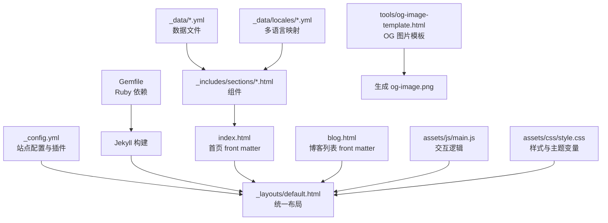
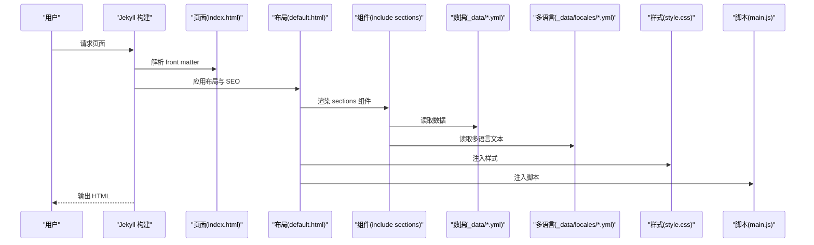
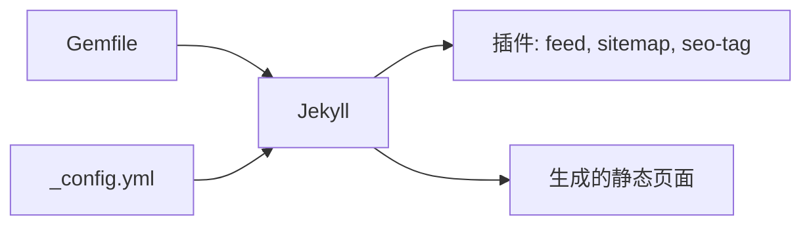

# 开发指南

<cite>
**本文引用的文件**
- [README.md](file://README.md)
- [_config.yml](file://_config.yml)
- [Gemfile](file://Gemfile)
- [_layouts/default.html](file://_layouts/default.html)
- [_includes/header.html](file://_includes/header.html)
- [_includes/footer.html](file://_includes/footer.html)
- [_includes/sections/about.html](file://_includes/sections/about.html)
- [_includes/sections/projects.html](file://_includes/sections/projects.html)
- [_includes/sections/skills.html](file://_includes/sections/skills.html)
- [_data/locales/en.yml](file://_data/locales/en.yml)
- [_data/projects.yml](file://_data/projects.yml)
- [_data/skills.yml](file://_data/skills.yml)
- [tools/og-image-template.html](file://tools/og-image-template.html)
- [_posts/2026-03-15-taskflow-pro.md](file://_posts/2026-03-15-taskflow-pro.md)
- [assets/js/main.js](file://assets/js/main.js)
- [assets/css/style.css](file://assets/css/style.css)
- [index.html](file://index.html)
- [blog.html](file://blog.html)
</cite>

## 目录
1. [引言](#引言)
2. [项目结构](#项目结构)
3. [核心组件](#核心组件)
4. [架构总览](#架构总览)
5. [详细组件分析](#详细组件分析)
6. [依赖分析](#依赖分析)
7. [性能考虑](#性能考虑)
8. [故障排查指南](#故障排查指南)
9. [结论](#结论)
10. [附录](#附录)

## 引言
本指南面向半成品（Jekyll）个人作品集站点的维护与扩展开发者，目标是帮助你以一致、可维护的方式添加新页面、创建组件、管理数据、生成 OG 图片、接入工具与第三方服务，并遵循统一的代码规范与最佳实践。文档中的所有说明均来自仓库现有实现，避免凭空假设。

## 项目结构
该站点采用 Jekyll 的“数据驱动 + 组件化”组织方式：
- 配置与构建：通过配置文件集中管理站点元信息、主题、SEO、评论、分析等；Gemfile 管理 Ruby 依赖与插件。
- 布局与模板：统一布局负责 SEO、结构、脚本注入；页面通过 front matter 选择布局与语言。
- 组件化：页面由多个可复用的 sections 组件拼装而成，便于维护与扩展。
- 数据层：通过 _data 下的 YAML 文件承载内容，支持多语言键位映射。
- 工具与资源：工具页面用于生成 OG 图片；JS/CSS 负责交互与主题切换、滚动进度等。

图表来源
- [_config.yml:1-133](file://_config.yml#L1-L133)
- [_layouts/default.html:1-152](file://_layouts/default.html#L1-L152)
- [Gemfile:1-12](file://Gemfile#L1-L12)
- [index.html:1-17](file://index.html#L1-L17)
- [blog.html:1-50](file://blog.html#L1-L50)
- [_includes/sections/about.html:1-48](file://_includes/sections/about.html#L1-L48)
- [_data/projects.yml:1-45](file://_data/projects.yml#L1-L45)
- [_data/locales/en.yml:1-166](file://_data/locales/en.yml#L1-L166)
- [assets/js/main.js:1-279](file://assets/js/main.js#L1-L279)
- [assets/css/style.css:1-200](file://assets/css/style.css#L1-L200)
- [tools/og-image-template.html:1-275](file://tools/og-image-template.html#L1-L275)

章节来源
- [README.md:26-63](file://README.md#L26-L63)
- [_config.yml:1-133](file://_config.yml#L1-L133)
- [Gemfile:1-12](file://Gemfile#L1-L12)

## 核心组件
- 布局与 SEO：统一布局负责语言、SEO 标签、canonical、hreflang、OG/Twitter Card、结构化数据、Google Analytics 注入、PWA 清单与主题初始化脚本。
- 导航与页脚：导航栏包含语言切换、主题切换、搜索入口、GitHub 链接与移动端菜单；页脚包含社交链接、版权与隐私条款。
- 组件化页面：首页通过 include 引入多个 sections 组件；博客列表页遍历文章集合渲染摘要。
- 数据驱动：组件通过 Jekyll 的 site.data 访问 YAML 数据；多语言通过 locales 映射实现。
- 交互与主题：JS 负责主题切换、回到顶部、滚动进度条、平滑滚动、技能进度动画、移动端菜单等。
- 样式与主题：CSS 使用自定义属性作为设计令牌，dark 主题仅覆盖必要变量，实现轻量切换。

章节来源
- [_layouts/default.html:1-152](file://_layouts/default.html#L1-L152)
- [_includes/header.html:1-116](file://_includes/header.html#L1-L116)
- [_includes/footer.html:1-49](file://_includes/footer.html#L1-L49)
- [index.html:1-17](file://index.html#L1-L17)
- [blog.html:1-50](file://blog.html#L1-L50)
- [assets/js/main.js:1-279](file://assets/js/main.js#L1-L279)
- [assets/css/style.css:1-200](file://assets/css/style.css#L1-L200)

## 架构总览
下图展示了从页面请求到最终渲染的关键路径：front matter -> 布局 -> include 组件 -> 数据文件 -> 多语言映射 -> 样式与脚本。

图表来源
- [index.html:1-17](file://index.html#L1-L17)
- [_layouts/default.html:1-152](file://_layouts/default.html#L1-L152)
- [_includes/sections/about.html:1-48](file://_includes/sections/about.html#L1-L48)
- [_data/projects.yml:1-45](file://_data/projects.yml#L1-L45)
- [_data/locales/en.yml:1-166](file://_data/locales/en.yml#L1-L166)
- [assets/css/style.css:1-200](file://assets/css/style.css#L1-L200)
- [assets/js/main.js:1-279](file://assets/js/main.js#L1-L279)

## 详细组件分析

### 页面与 front matter 配置
- front matter 字段建议：layout、title、lang。默认布局会根据 lang 设置 html lang 与 SEO 语言、hreflang。
- 页面引用组件：通过 include 将 sections 组件拼装成完整页面。
- 示例路径：首页与博客列表页均采用该模式。

章节来源
- [index.html:1-17](file://index.html#L1-L17)
- [blog.html:1-50](file://blog.html#L1-L50)
- [_layouts/default.html:1-152](file://_layouts/default.html#L1-L152)

### 布局与 SEO（default.html）
- 语言与 hreflang：根据 page.lang 生成 alternate hreflang 与 x-default。
- SEO 标签：使用 jekyll-seo-tag 生成 title/description/keywords/OG/Twitter Card。
- 结构化数据：Person/WebSite Schema.org。
- 分析与 PWA：可选 GA4 注入、manifest、Apple 移动端元信息。
- 主题初始化：客户端脚本根据 localStorage 或系统偏好设置 data-theme，避免 FOUC。

章节来源
- [_layouts/default.html:1-152](file://_layouts/default.html#L1-L152)

### 导航栏与页脚（header/footer）
- 导航栏：包含内联锚点跳转、语言切换、主题切换、搜索入口、GitHub 链接；移动端菜单支持展开/收起与无障碍属性。
- 页脚：品牌信息、社交链接（遍历 site.data.socials）、版权与隐私条款。

章节来源
- [_includes/header.html:1-116](file://_includes/header.html#L1-L116)
- [_includes/footer.html:1-49](file://_includes/footer.html#L1-L49)

### 组件：关于我（about）
- 多语言：通过 site.data.locales[page.lang][page.lang] 获取文案。
- 结构：标题、三块能力卡片、装饰图标与描述。
- 样式：使用 CSS 变量与卡片类，保持与主题一致。

章节来源
- [_includes/sections/about.html:1-48](file://_includes/sections/about.html#L1-L48)
- [_data/locales/en.yml:1-166](file://_data/locales/en.yml#L1-L166)

### 组件：项目展示（projects）
- 数据来源：site.data.projects。
- 多语言标题/描述：根据 page.lang 选择中文或英文字段。
- 展示：网格布局、标签云、星级与 fork 数、GitHub 链接。

章节来源
- [_includes/sections/projects.html:1-50](file://_includes/sections/projects.html#L1-L50)
- [_data/projects.yml:1-45](file://_data/projects.yml#L1-L45)

### 组件：技能展示（skills）
- 数据来源：site.data.skills（核心技能、后端工具、开发工具）。
- 展示：核心技能百分比进度条、标签云分组。
- 动画：IntersectionObserver 触发进度条动画。

章节来源
- [_includes/sections/skills.html:1-61](file://_includes/sections/skills.html#L1-L61)
- [_data/skills.yml:1-41](file://_data/skills.yml#L1-L41)

### 博客列表（blog.html）
- 遍历 site.posts，输出日期、标签、摘要与跳转链接。
- 多语言：通过 locales 映射标题与文案。

章节来源
- [blog.html:1-50](file://blog.html#L1-L50)
- [_data/locales/en.yml:1-166](file://_data/locales/en.yml#L1-L166)

### OG 图片模板（tools/og-image-template.html）
- 用途：生成符合 1200x630 规范的站点 OG 图片。
- 使用步骤：替换头像、截图保存到 assets/img/og-image.png。
- 说明：模板内含使用指引与样式，便于快速定制。

章节来源
- [tools/og-image-template.html:1-275](file://tools/og-image-template.html#L1-L275)

### 文章示例（_posts/2026-03-15-taskflow-pro.md）
- front matter：layout、title、date、category、description、image、demo_url、repo_url、stars、forks、technologies、features、related_projects。
- 正文：Markdown 结构化内容，包含多级标题、代码块、表格、图示等。

章节来源
- [_posts/2026-03-15-taskflow-pro.md:1-292](file://_posts/2026-03-15-taskflow-pro.md#L1-L292)

### 交互与主题（assets/js/main.js）
- 主题管理：localStorage + 系统偏好，data-theme 属性切换，更新 UI 图标与状态。
- 回到顶部：滚动阈值触发显示/隐藏。
- 阅读进度：计算文档高度比例更新进度条宽度。
- 平滑滚动：锚点跳转平滑滚动。
- 技能进度动画：进入视口后触发动画。
- 移动端菜单：展开/收起与图标切换。

章节来源
- [assets/js/main.js:1-279](file://assets/js/main.js#L1-L279)

### 样式与主题（assets/css/style.css）
- 设计令牌：CSS 自定义属性定义颜色、字体、间距、圆角、阴影、过渡与层级。
- 深色模式：仅覆盖必要变量，避免重复声明。
- 可访问性：尊重 reduce-motion；跳过链接定位；语义化结构。

章节来源
- [assets/css/style.css:1-200](file://assets/css/style.css#L1-L200)

## 依赖分析
- Ruby 与 Jekyll：Jekyll 版本与插件通过 Gemfile 管理，启用 sitemap/feed/seo。
- 配置中心：_config.yml 集中管理站点元信息、主题设置、SEO、评论、分析、默认语言与页面默认值、插件与排除项。

图表来源
- [Gemfile:1-12](file://Gemfile#L1-L12)
- [_config.yml:110-133](file://_config.yml#L110-L133)

章节来源
- [Gemfile:1-12](file://Gemfile#L1-L12)
- [_config.yml:110-133](file://_config.yml#L110-L133)

## 性能考虑
- 轻量化：移除外部 CDN，减少体积；CSS 变量与原生 JS，避免重型框架。
- 加载优化：预连接与 DNS 预取；图片懒加载；滚动节流与 IntersectionObserver。
- 可访问性：跳过链接、ARIA 标签、键盘导航、尊重 reduce-motion。
- SEO：结构化数据、OG/Twitter Card、canonical、hreflang、关键词。

章节来源
- [_layouts/default.html:50-57](file://_layouts/default.html#L50-L57)
- [assets/js/main.js:15-22](file://assets/js/main.js#L15-L22)
- [assets/css/style.css:177-187](file://assets/css/style.css#L177-L187)

## 故障排查指南
- 页面未按预期显示组件
  - 检查页面是否正确 include 对应 sections 组件。
  - 确认组件文件存在且命名与 include 路径一致。
- 多语言不生效
  - 确认 page.lang 与 _config.yml 中 languages/default_lang 一致。
  - 检查 _data/locales 下是否存在对应语言文件与键位。
- OG 图片未更新
  - 使用 tools/og-image-template.html 重新生成并保存为 og-image.png 至 assets/img/。
- 主题切换无效
  - 检查 data-theme 属性是否被正确设置；确认 localStorage 未被覆盖。
- 博客列表为空
  - 确认 _posts 下文章命名格式与 front matter 完整。
- 构建失败
  - 使用 Gemfile 安装依赖并执行 jekyll serve；检查插件与配置。

章节来源
- [index.html:7-16](file://index.html#L7-L16)
- [_data/locales/en.yml:1-166](file://_data/locales/en.yml#L1-166)
- [tools/og-image-template.html:220-229](file://tools/og-image-template.html#L220-L229)
- [assets/js/main.js:27-75](file://assets/js/main.js#L27-L75)
- [_posts/2026-03-15-taskflow-pro.md:1-36](file://_posts/2026-03-15-taskflow-pro.md#L1-L36)
- [Gemfile:1-12](file://Gemfile#L1-L12)

## 结论
本指南总结了在 halfism.github.io 项目中进行二次开发的关键路径：以 front matter 与布局为中心，通过 include 组件组合页面，利用 _data 与 _data/locales 管理内容与多语言，借助 tools 与 assets/js、assets/css 实现工具与交互体验。遵循本文的流程与规范，可以高效、稳定地扩展新页面、组件与功能。

## 附录

### 添加新页面（从零到一）
- 创建页面文件（例如 new-page.html），在 front matter 中指定 layout、title、lang。
- 在页面内容区通过 include 引入 sections 组件。
- 如需国际化，确保 _data/locales 下存在对应键位。

章节来源
- [index.html:1-17](file://index.html#L1-L17)
- [_layouts/default.html:1-152](file://_layouts/default.html#L1-L152)
- [_data/locales/en.yml:1-166](file://_data/locales/en.yml#L1-L166)

### 创建新组件（从文件到数据绑定）
- 在 _includes/sections/ 下创建 .html 文件。
- 使用 Jekyll 语法访问数据：例如 site.data.projects。
- 支持多语言：通过 site.data.locales[page.lang][page.lang] 获取文案。
- 在页面中通过 include 引入组件。

章节来源
- [_includes/sections/projects.html:1-50](file://_includes/sections/projects.html#L1-L50)
- [_data/projects.yml:1-45](file://_data/projects.yml#L1-L45)
- [_data/locales/en.yml:1-166](file://_data/locales/en.yml#L1-L166)

### 数据文件管理策略（YAML 规范、校验与版本控制）
- 字段规范：建议为每个实体提供 id；多语言字段采用 _zh/_en 后缀；布尔/数值字段明确类型。
- 字段校验：在组件中对缺失字段进行降级处理（例如回退到默认文案或隐藏区块）。
- 版本控制：每次变更记录在变更日志中；复杂字段（如数组/对象）建议在 PR 中说明结构变化。

章节来源
- [_data/projects.yml:1-45](file://_data/projects.yml#L1-L45)
- [_data/skills.yml:1-41](file://_data/skills.yml#L1-L41)

### 工具文件使用（OG 图片模板）
- 替换头像与文案后，截图 1200x630 区域，保存为 og-image.png 至 assets/img/。
- 该模板用于生成站点默认 OG 图片，便于 SEO 与社交分享。

章节来源
- [tools/og-image-template.html:220-229](file://tools/og-image-template.html#L220-L229)

### 代码规范与最佳实践
- 文件命名：组件文件使用小写短横线命名；数据文件同理。
- 注释标准：在组件与 JS 中为关键逻辑添加注释，说明职责与边界。
- 性能优化：使用 IntersectionObserver 控制动画；对滚动事件进行节流；懒加载图片。
- 可访问性：为交互元素提供 aria-* 属性；保留键盘可达性；避免仅用颜色传达信息。

章节来源
- [assets/js/main.js:15-22](file://assets/js/main.js#L15-L22)
- [assets/css/style.css:177-187](file://assets/css/style.css#L177-L187)

### 调试技巧与开发工具
- 本地开发：使用 bundle 安装依赖后执行 jekyll serve。
- 浏览器调试：检查 data-theme 属性、网络面板（CDN 预连接）、控制台错误。
- SEO 校验：使用 jekyll-seo-tag 生成的标签核对 title/description/keywords/OG/Twitter Card。

章节来源
- [README.md:80-94](file://README.md#L80-L94)
- [_layouts/default.html:50-57](file://_layouts/default.html#L50-L57)

### 扩展新功能（第三方集成、API 接入、自定义组件）
- 第三方评论：已在配置中启用 giscus；如需更换，调整 comments.provider 与相关参数。
- 分析：启用 GA4 并填入 tracking_id。
- 自定义组件：在 _includes/sections/ 下创建组件，通过 site.data 与 locales 获取数据与文案。
- API 接入：若需动态数据，可在前端通过 fetch 或服务端渲染（Jekyll 插件）实现，但需注意静态站点的限制。

章节来源
- [_config.yml:82-99](file://_config.yml#L82-L99)
- [_config.yml:77-80](file://_config.yml#L77-L80)
- [_includes/sections/about.html:1-48](file://_includes/sections/about.html#L1-L48)

### 实际开发示例与常见问题
- 示例：在首页新增一个 sections 组件，先在 _includes/sections/ 创建文件，再在 index.html 中 include。
- 常见问题：组件未显示、多语言键缺失、OG 图片未更新、主题切换异常、博客列表为空、构建失败。

章节来源
- [index.html:7-16](file://index.html#L7-L16)
- [_data/locales/en.yml:1-166](file://_data/locales/en.yml#L1-166)
- [tools/og-image-template.html:220-229](file://tools/og-image-template.html#L220-L229)
- [assets/js/main.js:27-75](file://assets/js/main.js#L27-L75)
- [_posts/2026-03-15-taskflow-pro.md:1-36](file://_posts/2026-03-15-taskflow-pro.md#L1-L36)
- [Gemfile:1-12](file://Gemfile#L1-L12)