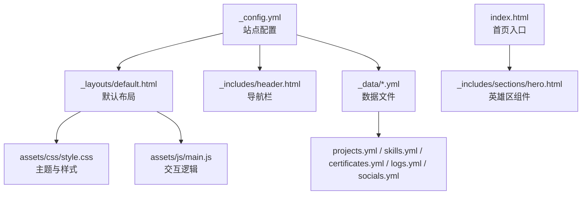
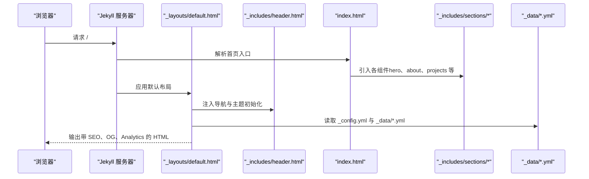
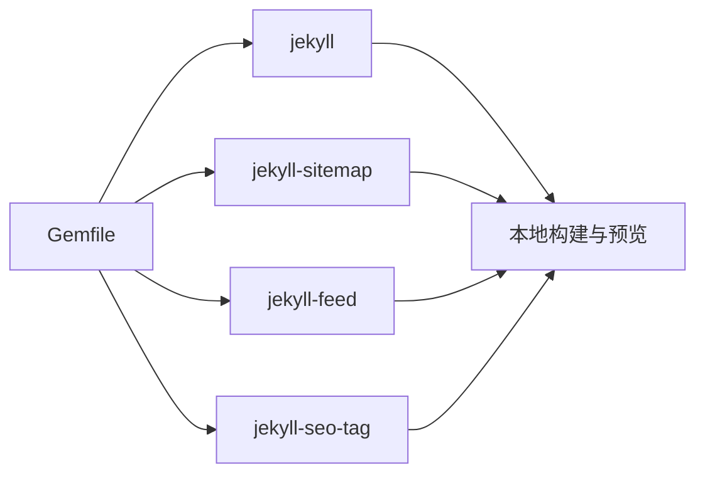

# 快速开始

<cite>
**本文引用的文件**   
- [_config.yml](file://_config.yml)
- [Gemfile](file://Gemfile)
- [README.md](file://README.md)
- [index.html](file://index.html)
- [_layouts/default.html](file://_layouts/default.html)
- [_includes/header.html](file://_includes/header.html)
- [_includes/sections/hero.html](file://_includes/sections/hero.html)
- [_data/projects.yml](file://_data/projects.yml)
- [_data/skills.yml](file://_data/skills.yml)
- [_data/certificates.yml](file://_data/certificates.yml)
- [_data/logs.yml](file://_data/logs.yml)
- [_data/socials.yml](file://_data/socials.yml)
- [_data/locales/en.yml](file://_data/locales/en.yml)
- [assets/css/style.css](file://assets/css/style.css)
- [assets/js/main.js](file://assets/js/main.js)
</cite>

## 目录
1. [简介](#简介)
2. [项目结构](#项目结构)
3. [核心组件](#核心组件)
4. [架构总览](#架构总览)
5. [详细组件分析](#详细组件分析)
6. [依赖分析](#依赖分析)
7. [性能考虑](#性能考虑)
8. [故障排查指南](#故障排查指南)
9. [结论](#结论)
10. [附录](#附录)

## 简介
本指南面向新手开发者，帮助你在约 15 分钟内完成 halfism.github.io 项目的本地开发环境搭建、基础配置与本地预览。你将学会：
- 安装 Ruby 与 Bundler（用于管理 Ruby 依赖）
- 安装 Jekyll 并启动本地服务器
- 修改站点配置（个人信息、社交链接、主题颜色等）
- 编辑数据文件（projects.yml、skills.yml、certificates.yml、logs.yml 等）
- 了解多语言与 SEO 设置
- 掌握常见问题的排查方法

## 项目结构
该项目基于 Jekyll，采用“数据驱动 + 组件化”的组织方式。关键目录与文件如下：
- 根配置：_config.yml
- 依赖声明：Gemfile
- 首页入口：index.html
- 默认布局：_layouts/default.html
- 头部导航：_includes/header.html
- 英文本地化：_data/locales/en.yml
- 数据文件：_data/projects.yml、_data/skills.yml、_data/certificates.yml、_data/logs.yml、_data/socials.yml
- 样式与脚本：assets/css/style.css、assets/js/main.js

图表来源
- [_config.yml:1-133](file://_config.yml#L1-L133)
- [_layouts/default.html:1-152](file://_layouts/default.html#L1-L152)
- [_includes/header.html:1-116](file://_includes/header.html#L1-L116)
- [index.html:1-17](file://index.html#L1-L17)
- [_includes/sections/hero.html:1-56](file://_includes/sections/hero.html#L1-L56)
- [assets/css/style.css:1-200](file://assets/css/style.css#L1-L200)
- [assets/js/main.js:1-200](file://assets/js/main.js#L1-L200)
- [_data/projects.yml:1-45](file://_data/projects.yml#L1-L45)
- [_data/skills.yml:1-41](file://_data/skills.yml#L1-L41)
- [_data/certificates.yml:1-24](file://_data/certificates.yml#L1-L24)
- [_data/logs.yml:1-31](file://_data/logs.yml#L1-L31)
- [_data/socials.yml:1-20](file://_data/socials.yml#L1-L20)

章节来源
- [README.md:26-63](file://README.md#L26-L63)

## 核心组件
- 站点配置（_config.yml）：包含站点标题、描述、作者信息、社交链接、主题设置、SEO、多语言、评论系统、联系表单、构建参数与插件等。
- 依赖声明（Gemfile）：声明 Jekyll 版本与插件组，以及本地调试服务器依赖。
- 首页入口（index.html）：通过 include 将多个 sections 组件拼装为完整页面。
- 默认布局（default.html）：注入 SEO、OG/Twitter 卡片、Google Analytics、JSON-LD 结构化数据、PWA 清单、主题初始化脚本等。
- 导航栏（header.html）：提供语言切换、主题切换、搜索、移动端菜单等交互。
- 数据文件（_data/*.yml）：以 YAML 管理项目、技能、证书、日志与社交链接等数据。

章节来源
- [_config.yml:1-133](file://_config.yml#L1-L133)
- [Gemfile:1-12](file://Gemfile#L1-L12)
- [index.html:1-17](file://index.html#L1-L17)
- [_layouts/default.html:1-152](file://_layouts/default.html#L1-L152)
- [_includes/header.html:1-116](file://_includes/header.html#L1-L116)

## 架构总览
下图展示了从浏览器访问到页面渲染的关键路径，以及数据与组件的流向。

图表来源
- [index.html:1-17](file://index.html#L1-L17)
- [_layouts/default.html:1-152](file://_layouts/default.html#L1-L152)
- [_includes/header.html:1-116](file://_includes/header.html#L1-L116)
- [_includes/sections/hero.html:1-56](file://_includes/sections/hero.html#L1-L56)
- [_data/projects.yml:1-45](file://_data/projects.yml#L1-L45)
- [_data/skills.yml:1-41](file://_data/skills.yml#L1-L41)
- [_data/certificates.yml:1-24](file://_data/certificates.yml#L1-L24)
- [_data/logs.yml:1-31](file://_data/logs.yml#L1-L31)
- [_data/socials.yml:1-20](file://_data/socials.yml#L1-L20)
- [_config.yml:1-133](file://_config.yml#L1-L133)

## 详细组件分析

### 本地开发环境搭建
- 系统要求
  - Ruby（用于运行 Jekyll）
  - Bundler（用于安装与锁定依赖）
- 安装步骤
  1) 安装 Ruby 与 Bundler（参考官方安装指南）
  2) 在项目根目录执行依赖安装：bundle install
  3) 启动本地服务器：bundle exec jekyll serve
  4) 浏览器访问 http://localhost:4000 查看效果
- 注意事项
  - 若提示缺少某些平台依赖，请按错误提示安装对应系统包
  - 如需更换端口，可在启动时指定 --port 参数

章节来源
- [README.md:80-94](file://README.md#L80-L94)
- [Gemfile:1-12](file://Gemfile#L1-L12)

### 自定义配置指南
- 站点基本信息
  - 标题、副标题、站点地址、基础路径等
  - 参考：[_config.yml:1-7](file://_config.yml#L1-L7)
- 作者信息
  - 姓名、头像、个人简介（中/英）、所在城市、公司、标签等
  - 参考：[_config.yml:8-17](file://_config.yml#L8-L17)
- 社交链接
  - GitHub、Twitter、LinkedIn、邮箱等，包含用户名、URL 与图标
  - 参考：[_config.yml:19-35](file://_config.yml#L19-L35)
- 主题设置
  - 默认主题模式（auto/light/dark）、主色、强调色、字体族、代码字体
  - 参考：[_config.yml:37-43](file://_config.yml#L37-L43)
- SEO 与社交媒体
  - OG 图片、Twitter 卡片、关键词、社交账号集合
  - 参考：[_config.yml:45-60](file://_config.yml#L45-L60)
- 多语言设置
  - languages 与 default_lang；默认语言映射
  - 参考：[_config.yml:62-75](file://_config.yml#L62-L75)
- 分析与评论
  - Google Analytics（GA4）开启与 Tracking ID
  - 评论系统（giscus）仓库、分类、主题、语言等
  - 参考：[_config.yml:77-98](file://_config.yml#L77-L98)
- 联系表单
  - Formspree 表单 ID
  - 参考：[_config.yml:100-102](file://_config.yml#L100-L102)
- 构建与插件
  - Markdown、高亮、永久链接格式
  - 插件：sitemap、feed、seo-tag
  - 参考：[_config.yml:104-113](file://_config.yml#L104-L113)
- 排除项
  - 不参与构建的文件与目录
  - 参考：[_config.yml:115-133](file://_config.yml#L115-L133)

章节来源
- [_config.yml:1-133](file://_config.yml#L1-L133)

### 数据文件结构与修改方法
- projects.yml（项目展示）
  - 字段示例：id、title_zh/title_en、description_zh/description_en、image、tags、category、url、stars、forks
  - 参考：[_data/projects.yml:1-45](file://_data/projects.yml#L1-L45)
- skills.yml（技能展示）
  - 字段示例：core_skills（name、level）、backend_tools、dev_tools、languages（name、percentage、color）
  - 参考：[_data/skills.yml:1-41](file://_data/skills.yml#L1-L41)
- certificates.yml（证书）
  - 字段示例：title_zh/title_en、issuer、date、icon、color、url
  - 参考：[_data/certificates.yml:1-24](file://_data/certificates.yml#L1-L24)
- logs.yml（开发日志）
  - 字段示例：date、type、title_zh/title_en、desc_zh/desc_en
  - 参考：[_data/logs.yml:1-31](file://_data/logs.yml#L1-L31)
- socials.yml（社交链接）
  - 字段示例：name、icon、url、hover_class
  - 参考：[_data/socials.yml:1-20](file://_data/socials.yml#L1-L20)

章节来源
- [_data/projects.yml:1-45](file://_data/projects.yml#L1-L45)
- [_data/skills.yml:1-41](file://_data/skills.yml#L1-L41)
- [_data/certificates.yml:1-24](file://_data/certificates.yml#L1-L24)
- [_data/logs.yml:1-31](file://_data/logs.yml#L1-L31)
- [_data/socials.yml:1-20](file://_data/socials.yml#L1-L20)

### 多语言与本地化
- 默认语言与语言列表
  - 参考：[_config.yml:62-75](file://_config.yml#L62-L75)
- 英文本地化键值
  - 参考：[_data/locales/en.yml:1-166](file://_data/locales/en.yml#L1-L166)
- 组件中如何使用
  - 通过 site.data.locales[page.lang][page.lang].key 访问对应文案
  - 示例：[_includes/sections/hero.html:1](file://_includes/sections/hero.html#L1-L1)

章节来源
- [_config.yml:62-75](file://_config.yml#L62-L75)
- [_data/locales/en.yml:1-166](file://_data/locales/en.yml#L1-L166)
- [_includes/sections/hero.html:1](file://_includes/sections/hero.html#L1-L1)

### 主题与样式定制
- CSS 变量体系
  - 根变量与深色模式覆盖变量集中于 assets/css/style.css
  - 参考：[assets/css/style.css:10-145](file://assets/css/style.css#L10-L145)
- 主题切换逻辑
  - 通过 data-theme 属性与 localStorage 实现
  - 参考：[_layouts/default.html:59-67](file://_layouts/default.html#L59-L67)、[assets/js/main.js:27-75](file://assets/js/main.js#L27-L75)
- 图标与字体
  - Font Awesome 4.7 通过 CDN 引入
  - 参考：[_layouts/default.html:54-57](file://_layouts/default.html#L54-L57)

章节来源
- [assets/css/style.css:10-145](file://assets/css/style.css#L10-L145)
- [_layouts/default.html:59-67](file://_layouts/default.html#L59-L67)
- [assets/js/main.js:27-75](file://assets/js/main.js#L27-L75)
- [_layouts/default.html:54-57](file://_layouts/default.html#L54-L57)

### SEO 与结构化数据
- SEO 标签与 OG/Twitter 卡片
  - 由 jekyll-seo-tag 与手动 meta 标签共同生成
  - 参考：[_layouts/default.html:12-48](file://_layouts/default.html#L12-L48)
- 结构化数据（JSON-LD）
  - Person 与 WebSite 的 schema
  - 参考：[_layouts/default.html:92-115](file://_layouts/default.html#L92-L115)

章节来源
- [_layouts/default.html:12-48](file://_layouts/default.html#L12-L48)
- [_layouts/default.html:92-115](file://_layouts/default.html#L92-L115)

### 评论系统与联系表单
- 评论系统（giscus）
  - 仓库、分类、主题、语言等配置
  - 参考：[_config.yml:82-98](file://_config.yml#L82-L98)
- 联系表单（Formspree）
  - 表单 ID 配置
  - 参考：[_config.yml:100-102](file://_config.yml#L100-L102)

章节来源
- [_config.yml:82-98](file://_config.yml#L82-L98)
- [_config.yml:100-102](file://_config.yml#L100-L102)

## 依赖分析
- Ruby 生态与 Jekyll
  - 使用 Gemfile 声明 jekyll 与插件组，webrick 作为本地服务器
  - 参考：[Gemfile:1-12](file://Gemfile#L1-L12)
- 站点构建与处理
  - jekyll-sitemap、jekyll-feed、jekyll-seo-tag 提供站点地图、RSS、SEO
  - 参考：[_config.yml:109-113](file://_config.yml#L109-L113)

图表来源
- [Gemfile:1-12](file://Gemfile#L1-L12)
- [_config.yml:109-113](file://_config.yml#L109-L113)

章节来源
- [Gemfile:1-12](file://Gemfile#L1-L12)
- [_config.yml:109-113](file://_config.yml#L109-L113)

## 性能考虑
- 轻量化与加载优化
  - 项目强调性能优先，减少外部依赖，优化加载速度
  - 参考：[README.md:124-129](file://README.md#L124-L129)
- 样式与脚本
  - CSS 变量集中管理，JS 采用原生实现，避免重型框架
  - 参考：[assets/css/style.css:1-200](file://assets/css/style.css#L1-L200)、[assets/js/main.js:1-200](file://assets/js/main.js#L1-L200)

章节来源
- [README.md:124-129](file://README.md#L124-L129)
- [assets/css/style.css:1-200](file://assets/css/style.css#L1-L200)
- [assets/js/main.js:1-200](file://assets/js/main.js#L1-L200)

## 故障排查指南
- 依赖安装失败
  - 确认 Ruby 与 Bundler 已正确安装
  - 在项目根目录执行 bundle install
  - 参考：[README.md:86-89](file://README.md#L86-L89)
- 本地服务器无法启动
  - 使用 bundle exec jekyll serve 启动
  - 参考：[README.md:90-91](file://README.md#L90-L91)
- 主题切换无效
  - 检查 data-theme 初始化脚本是否生效
  - 参考：[_layouts/default.html:59-67](file://_layouts/default.html#L59-L67)、[assets/js/main.js:27-75](file://assets/js/main.js#L27-L75)
- 社交链接或导航不显示
  - 检查 _config.yml 中 socials 字段与 _includes/header.html 的引用
  - 参考：[_config.yml:19-35](file://_config.yml#L19-L35)、[_includes/header.html:66-70](file://_includes/header.html#L66-L70)
- 多语言文案未生效
  - 确认 _config.yml 的 languages 与 default_lang 设置
  - 确认 _data/locales/en.yml 键值存在
  - 参考：[_config.yml:62-75](file://_config.yml#L62-L75)、[_data/locales/en.yml:1-166](file://_data/locales/en.yml#L1-L166)

章节来源
- [README.md:86-91](file://README.md#L86-L91)
- [_layouts/default.html:59-67](file://_layouts/default.html#L59-L67)
- [assets/js/main.js:27-75](file://assets/js/main.js#L27-L75)
- [_config.yml:19-35](file://_config.yml#L19-L35)
- [_includes/header.html:66-70](file://_includes/header.html#L66-L70)
- [_config.yml:62-75](file://_config.yml#L62-L75)
- [_data/locales/en.yml:1-166](file://_data/locales/en.yml#L1-L166)

## 结论
通过本指南，你可以在 15 分钟内完成 halfism.github.io 的本地环境搭建、基础配置与预览。建议后续进一步：
- 完善数据文件中的项目、技能、证书与日志内容
- 自定义主题颜色与字体
- 配置 GA4、giscus 与 Formspree
- 本地测试多语言与深色模式

## 附录

### 快速操作清单（15 分钟）
- 安装 Ruby 与 Bundler
- 在项目根目录执行 bundle install
- 启动本地服务器：bundle exec jekyll serve
- 浏览器访问 http://localhost:4000
- 修改 _config.yml 中的作者信息与社交链接
- 在 _data 下添加/修改 projects.yml、skills.yml、certificates.yml、logs.yml
- 在 assets/css/style.css 中调整主题颜色
- 在 assets/js/main.js 中确认主题切换逻辑正常
- 在 _data/locales/en.yml 中完善英文文案
- 在 _includes/header.html 中核对导航与语言切换

章节来源
- [README.md:80-94](file://README.md#L80-L94)
- [_config.yml:1-133](file://_config.yml#L1-L133)
- [_data/projects.yml:1-45](file://_data/projects.yml#L1-L45)
- [_data/skills.yml:1-41](file://_data/skills.yml#L1-L41)
- [_data/certificates.yml:1-24](file://_data/certificates.yml#L1-L24)
- [_data/logs.yml:1-31](file://_data/logs.yml#L1-L31)
- [assets/css/style.css:10-145](file://assets/css/style.css#L10-L145)
- [assets/js/main.js:27-75](file://assets/js/main.js#L27-L75)
- [_data/locales/en.yml:1-166](file://_data/locales/en.yml#L1-L166)
- [_includes/header.html:1-116](file://_includes/header.html#L1-L116)