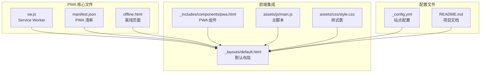
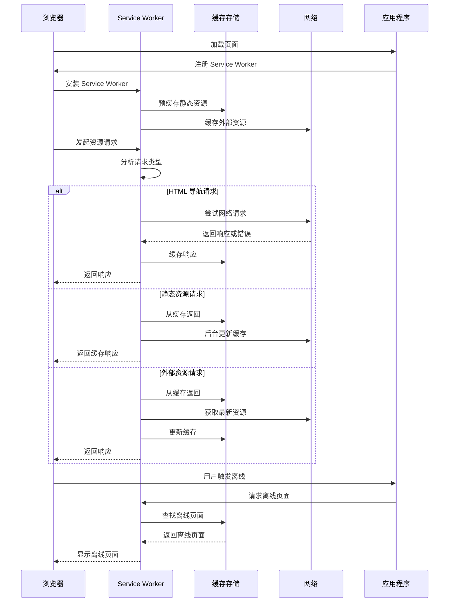
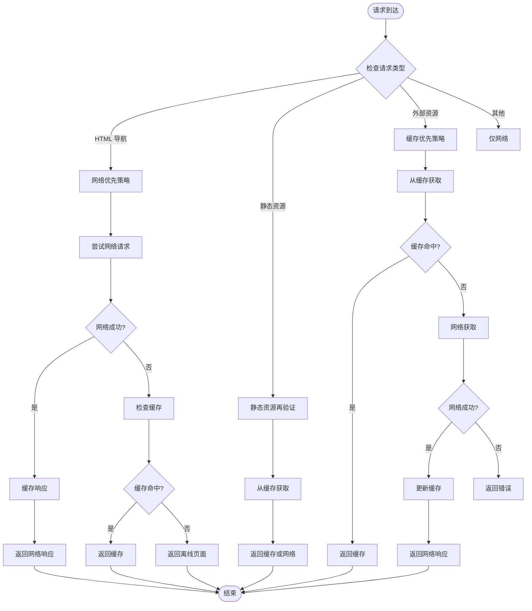
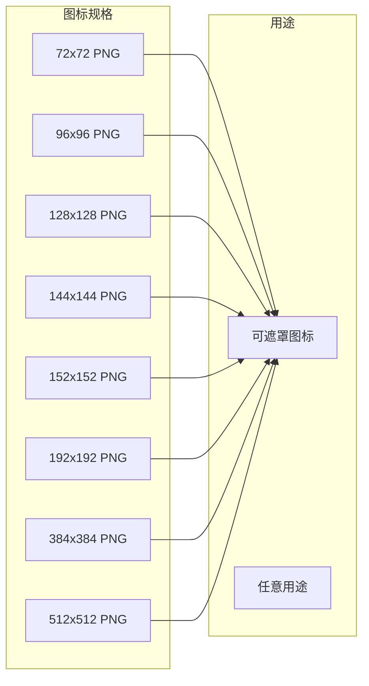
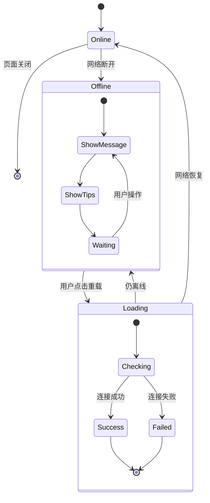
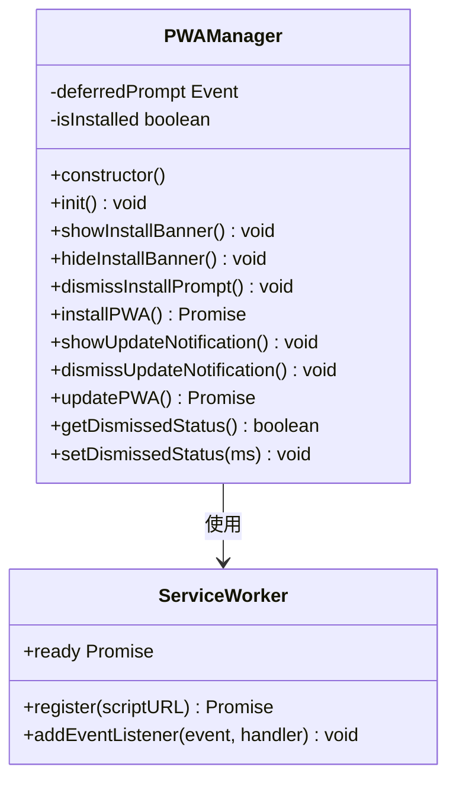
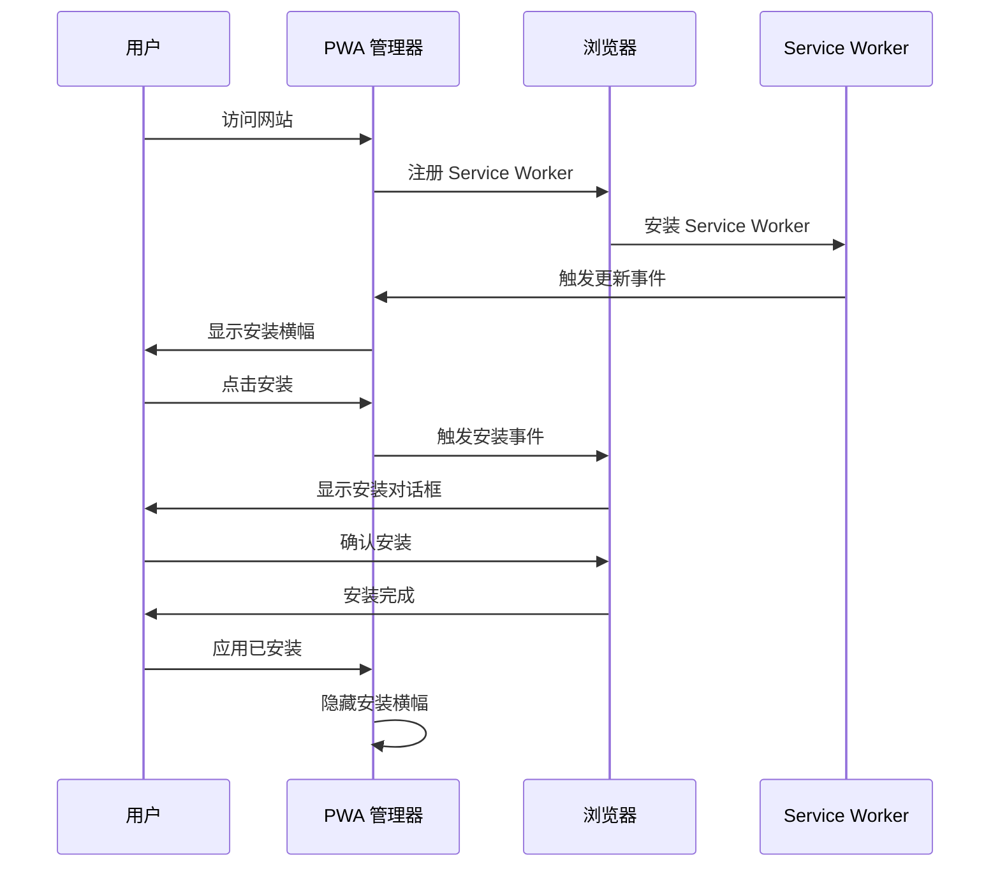
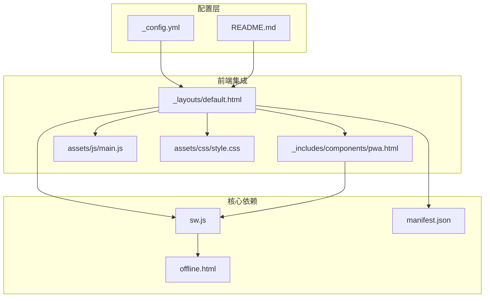

# PWA 架构实现

<cite>
**本文档引用的文件**
- [sw.js](file://sw.js)
- [manifest.json](file://manifest.json)
- [offline.html](file://offline.html)
- [default.html](file://_layouts/default.html)
- [pwa.html](file://_includes/components/pwa.html)
- [main.js](file://assets/js/main.js)
- [style.css](file://assets/css/style.css)
- [README.md](file://README.md)
</cite>

## 目录
1. [引言](#引言)
2. [项目结构](#项目结构)
3. [核心组件](#核心组件)
4. [架构概览](#架构概览)
5. [详细组件分析](#详细组件分析)
6. [依赖关系分析](#依赖关系分析)
7. [性能考量](#性能考量)
8. [故障排除指南](#故障排除指南)
9. [结论](#结论)

## 引言

halfism.github.io 是一个基于 Jekyll 构建的现代化个人作品集网站，实现了完整的 PWA（Progressive Web App）架构。该项目不仅提供了优秀的用户体验，还通过 Service Worker 实现了离线访问能力，支持应用安装、更新通知等现代 Web 应用特性。

本项目的核心目标是通过渐进式增强的方式，为用户提供接近原生应用的体验，同时保持网站的轻量化和高性能特点。

## 项目结构

项目采用 Jekyll 静态网站生成器架构，PWA 相关的核心文件分布如下：



**图表来源**
- [sw.js:1-237](file://sw.js#L1-L237)
- [manifest.json:1-79](file://manifest.json#L1-L79)
- [_layouts/default.html:1-152](file://_layouts/default.html#L1-L152)

**章节来源**
- [README.md:26-63](file://README.md#L26-L63)
- [sw.js:1-237](file://sw.js#L1-L237)

## 核心组件

### Service Worker 缓存策略

项目实现了三种主要的缓存策略，针对不同类型的资源采用最优的处理方式：

1. **网络优先策略**：适用于 HTML 导航请求
2. **静态资源再验证策略**：适用于 CSS、JS、图片等静态资源
3. **缓存优先策略**：适用于外部 CDN 资源

### PWA 清单配置

manifest.json 提供了完整的 PWA 配置信息，包括应用名称、图标、显示模式等关键属性。

### 离线页面机制

项目内置了专门的离线页面，提供友好的用户体验和重试机制。

**章节来源**
- [sw.js:83-114](file://sw.js#L83-L114)
- [manifest.json:1-79](file://manifest.json#L1-L79)
- [offline.html:1-82](file://offline.html#L1-L82)

## 架构概览

PWA 架构采用渐进式增强的设计理念，确保在不支持 PWA 的环境下也能正常工作：



**图表来源**
- [sw.js:28-60](file://sw.js#L28-L60)
- [sw.js:83-114](file://sw.js#L83-L114)
- [sw.js:120-143](file://sw.js#L120-L143)

## 详细组件分析

### Service Worker 实现

Service Worker 采用了模块化的设计，将不同的缓存策略封装为独立的函数：

#### 缓存策略实现



**图表来源**
- [sw.js:83-114](file://sw.js#L83-L114)
- [sw.js:120-143](file://sw.js#L120-L143)
- [sw.js:149-168](file://sw.js#L149-L168)
- [sw.js:174-194](file://sw.js#L174-L194)

#### 缓存管理策略

Service Worker 使用了三层缓存架构：

1. **静态缓存 (STATIC_CACHE)**：包含核心静态资源
2. **动态缓存 (DYNAMIC_CACHE)**：包含动态生成的内容
3. **外部缓存 (EXTERNAL_CACHE)**：包含第三方 CDN 资源

**章节来源**
- [sw.js:6-8](file://sw.js#L6-L8)
- [sw.js:11-19](file://sw.js#L11-L19)
- [sw.js:22-26](file://sw.js#L22-L26)

### PWA 清单配置分析

manifest.json 提供了完整的 PWA 配置信息：

#### 核心配置项说明

| 配置项 | 值 | 作用 |
|--------|-----|------|
| name | halfism - Personal Portfolio | 应用完整名称 |
| short_name | halfism | 应用简称 |
| description | Full-Stack Developer Portfolio | 应用描述 |
| start_url | / | 启动路径 |
| display | standalone | 显示模式 |
| background_color | #ffffff | 背景色 |
| theme_color | #3b82f6 | 主题色 |
| orientation | portrait-primary | 屏幕方向 |
| scope | / | 应用范围 |

#### 图标配置策略

项目提供了多种尺寸的图标以适配不同设备：



**图表来源**
- [manifest.json:13-62](file://manifest.json#L13-L62)

**章节来源**
- [manifest.json:1-79](file://manifest.json#L1-L79)

### 离线页面实现

离线页面提供了用户友好的离线体验：

#### 离线页面特性

1. **多语言支持**：支持中文和英文界面
2. **响应式设计**：适配各种设备尺寸
3. **自动重载**：网络恢复时自动刷新
4. **操作指引**：提供网络问题排查建议

#### 离线页面交互流程



**图表来源**
- [offline.html:50-82](file://offline.html#L50-L82)

**章节来源**
- [offline.html:1-82](file://offline.html#L1-L82)

### 前端集成组件

PWA 组件通过 JavaScript 实现了完整的安装和更新管理：

#### PWA 管理器类



**图表来源**
- [pwa.html:95-184](file://_includes/components/pwa.html#L95-L184)

#### 安装流程管理



**图表来源**
- [pwa.html:102-131](file://_includes/components/pwa.html#L102-L131)

**章节来源**
- [_includes/components/pwa.html:1-192](file://_includes/components/pwa.html#L1-L192)

## 依赖关系分析

PWA 架构中的组件依赖关系如下：



**图表来源**
- [_layouts/default.html:72-73](file://_layouts/default.html#L72-L73)
- [_includes/components/pwa.html:105](file://_includes/components/pwa.html#L105)

**章节来源**
- [_layouts/default.html:1-152](file://_layouts/default.html#L1-L152)
- [_includes/components/pwa.html:94-192](file://_includes/components/pwa.html#L94-L192)

## 性能考量

### 缓存策略优化

1. **分层缓存架构**：通过三层缓存减少网络请求
2. **智能预缓存**：只缓存必要的核心资源
3. **动态更新**：后台更新缓存避免阻塞主线程

### 资源优化策略

1. **CDN 缓存**：外部资源通过 CDN 提升加载速度
2. **字体优化**：使用预连接和 DNS 预取
3. **样式优化**：CSS 变量减少重复计算

### 性能监控

项目实现了完整的性能监控机制，包括：

- 首屏加载时间监控
- 缓存命中率统计
- 离线功能可用性检测

**章节来源**
- [sw.js:32-56](file://sw.js#L32-L56)
- [sw.js:153-167](file://sw.js#L153-L167)

## 故障排除指南

### 常见问题诊断

#### Service Worker 注册失败

**症状**：浏览器控制台出现注册错误

**解决步骤**：
1. 检查 sw.js 文件路径是否正确
2. 确认 HTTPS 环境（本地开发可使用 localhost）
3. 清理浏览器缓存和 Service Worker

#### 缓存更新问题

**症状**：用户看到旧版本内容

**解决步骤**：
1. 检查 Service Worker 的激活事件
2. 验证缓存版本号更新
3. 确认客户端已接收更新通知

#### 离线页面无法显示

**症状**：网络断开时显示空白页面

**解决步骤**：
1. 验证 offline.html 是否正确缓存
2. 检查缓存优先策略是否正确执行
3. 确认离线页面的相对路径

### 调试工具使用

#### 浏览器开发者工具

1. **Application 面板**：查看 Service Worker 状态
2. **Cache Storage**：检查缓存内容
3. **Network 面板**：监控缓存命中情况

#### PWA 调试技巧

```javascript
// 检查 Service Worker 状态
if ('serviceWorker' in navigator) {
    console.log('Service Worker 支持');
    navigator.serviceWorker.getRegistrations().then(registrations => {
        registrations.forEach(reg => {
            console.log('注册状态:', reg.scope);
            console.log('Active Worker:', reg.active);
        });
    });
}

// 清理缓存
if ('caches' in window) {
    caches.keys().then(names => {
        names.forEach(name => {
            caches.delete(name);
        });
    });
}
```

**章节来源**
- [sw.js:213-224](file://sw.js#L213-L224)
- [pwa.html:102-131](file://_includes/components/pwa.html#L102-L131)

## 结论

halfism.github.io 的 PWA 架构实现体现了现代 Web 应用的最佳实践：

### 核心优势

1. **渐进式增强**：在不支持 PWA 的环境下也能正常工作
2. **智能缓存策略**：针对不同类型资源采用最优缓存方案
3. **用户体验优化**：提供流畅的离线访问体验
4. **性能优先**：通过合理的缓存和资源管理提升加载速度

### 技术亮点

- **模块化设计**：清晰的组件分离和职责划分
- **可维护性**：良好的代码组织和注释规范
- **扩展性**：易于添加新的缓存策略和功能
- **兼容性**：支持多种浏览器和设备

### 未来改进方向

1. **更精细的缓存控制**：根据资源类型和使用频率调整缓存策略
2. **性能监控增强**：添加更详细的性能指标收集
3. **离线功能扩展**：支持更多交互式功能的离线使用
4. **用户体验优化**：进一步提升 PWA 安装和更新体验

该项目为其他 Jekyll 项目的 PWA 实现提供了优秀的参考模板，展示了如何在静态网站上实现现代 Web 应用的功能特性。