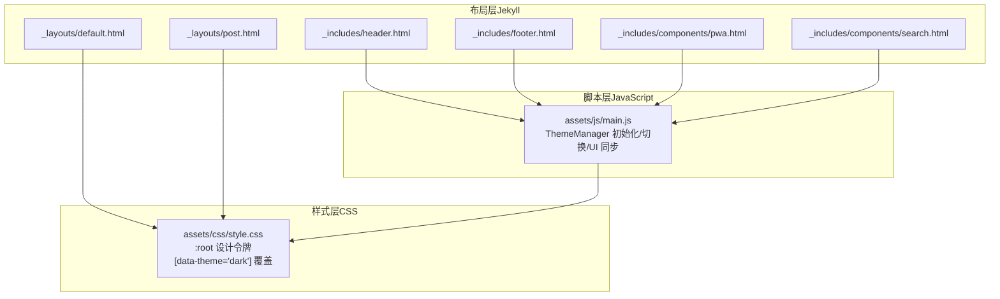
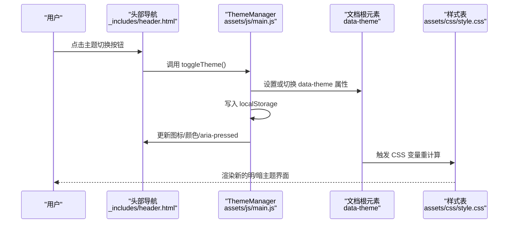
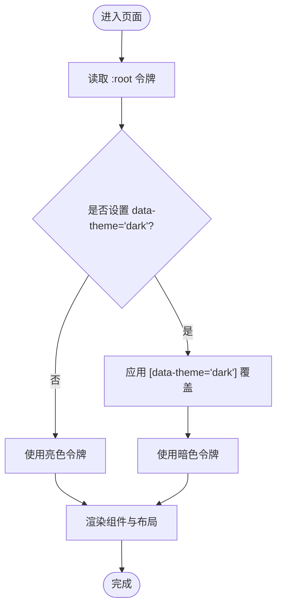
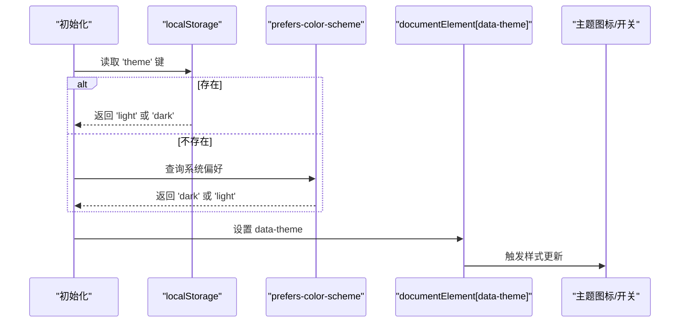
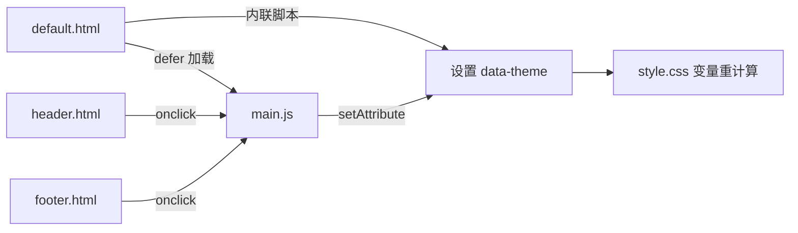
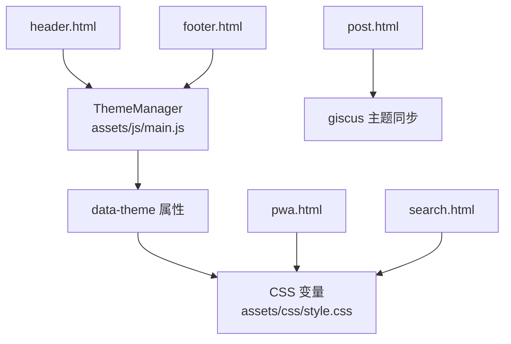

# 主题系统架构

<cite>
**本文档引用的文件**
- [assets/css/style.css](file://assets/css/style.css)
- [assets/js/main.js](file://assets/js/main.js)
- [_layouts/default.html](file://_layouts/default.html)
- [_layouts/post.html](file://_layouts/post.html)
- [_includes/header.html](file://_includes/header.html)
- [_includes/footer.html](file://_includes/footer.html)
- [_includes/components/pwa.html](file://_includes/components/pwa.html)
- [_includes/components/search.html](file://_includes/components/search.html)
- [_config.yml](file://_config.yml)
</cite>

## 目录
1. [简介](#简介)
2. [项目结构](#项目结构)
3. [核心组件](#核心组件)
4. [架构总览](#架构总览)
5. [详细组件分析](#详细组件分析)
6. [依赖关系分析](#依赖关系分析)
7. [性能考量](#性能考量)
8. [故障排查指南](#故障排查指南)
9. [结论](#结论)
10. [附录](#附录)

## 简介
本文件面向 halfism.github.io 的主题系统架构，系统性阐述基于 CSS 自定义属性的设计令牌体系（颜色、字体、间距等），明暗主题切换机制（data-theme 属性、状态管理与用户偏好持久化），以及与 Jekyll 模板的集成方式与动态主题切换的 JavaScript 实现。同时提供主题定制指南、扩展方法、无障碍支持与跨浏览器兼容性建议。

## 项目结构
主题系统由三层协同构成：
- 样式层：以 CSS 自定义属性为核心的设计令牌，覆盖颜色、字体、间距、阴影、过渡与层级。
- 脚本层：统一的主题管理器，负责初始化、切换、状态持久化与 UI 同步。
- 布局层：Jekyll 布局与组件模板，注入 data-theme 属性、无障碍元素与交互入口。

**图表来源**
- [_layouts/default.html](file://_layouts/default.html)
- [_layouts/post.html](file://_layouts/post.html)
- [_includes/header.html](file://_includes/header.html)
- [_includes/footer.html](file://_includes/footer.html)
- [_includes/components/pwa.html](file://_includes/components/pwa.html)
- [_includes/components/search.html](file://_includes/components/search.html)
- [assets/js/main.js](file://assets/js/main.js)
- [assets/css/style.css](file://assets/css/style.css)

**章节来源**
- [_layouts/default.html](file://_layouts/default.html)
- [_layouts/post.html](file://_layouts/post.html)
- [_includes/header.html](file://_includes/header.html)
- [_includes/footer.html](file://_includes/footer.html)
- [_includes/components/pwa.html](file://_includes/components/pwa.html)
- [_includes/components/search.html](file://_includes/components/search.html)
- [assets/js/main.js](file://assets/js/main.js)
- [assets/css/style.css](file://assets/css/style.css)

## 核心组件
- 设计令牌（CSS 自定义属性）
  - 颜色令牌：主色、辅色、语义色、背景、文本、边框等。
  - 字体令牌：无衬线与等宽字体族、字号与行高。
  - 间距令牌：从 0.25rem 到 5rem 的连续标度。
  - 视觉与交互令牌：圆角、阴影、过渡时长、z-index。
- 明暗主题
  - 仅使用 data-theme 属性，根元素切换 light/dark。
  - 暗色模式通过选择器覆盖关键令牌值，最小化重复。
- 主题管理器（ThemeManager）
  - 初始化：优先读取本地存储，其次匹配系统偏好，最后回退 light。
  - 切换：更新 data-theme，写入本地存储，同步 UI 图标与状态。
  - UI 同步：根据当前主题更新移动端/页脚/开关图标与可访问性属性。

**章节来源**
- [assets/css/style.css](file://assets/css/style.css)
- [assets/js/main.js](file://assets/js/main.js)

## 架构总览
主题系统采用“样式令牌 + 脚本控制 + 布局集成”的分层架构。data-theme 作为单一真相源，驱动 CSS 变量与视觉状态；ThemeManager 保证一致性与可恢复性；Jekyll 布局在页面加载前通过内联脚本避免 FOUC，并在模板中提供主题切换入口与无障碍元素。

**图表来源**
- [_includes/header.html](file://_includes/header.html)
- [assets/js/main.js](file://assets/js/main.js)
- [assets/css/style.css](file://assets/css/style.css)

## 详细组件分析

### 设计令牌系统（CSS 自定义属性）
- 组织结构
  - :root 定义亮色模式的完整令牌集。
  - [data-theme="dark"] 仅覆盖需要改变的令牌，保持简洁与可维护。
- 关键类别
  - 颜色：主色、辅色、语义色（成功/警告/错误/信息）、背景与文本、边框。
  - 字体：sans-serif 与 monospace 字体族、多级字号与行高。
  - 间距：连续标度空间，配合工具类与组件使用。
  - 视觉：圆角、阴影、过渡时长、z-index 分层。
- 使用方式
  - 组件与布局广泛使用 var(--token) 引用令牌，确保主题切换时自动生效。
  - 工具类（如 text-primary、bg-secondary、shadow-md）进一步抽象常用组合。

**图表来源**
- [assets/css/style.css](file://assets/css/style.css)

**章节来源**
- [assets/css/style.css](file://assets/css/style.css)

### 明暗主题切换机制
- data-theme 属性
  - 布局默认设置为 light，内联脚本在 DOMContentLoaded 前后根据用户偏好与本地存储决定初始值，避免 FOUC。
  - 切换时仅变更根元素的 data-theme，所有组件即时响应。
- 用户偏好与状态管理
  - 初始化顺序：localStorage -> prefers-color-scheme -> 默认 light。
  - 切换流程：读取当前值 -> 计算下一个值 -> 写入 localStorage -> 设置 data-theme -> 更新 UI。
- UI 同步策略
  - 移动端菜单、页脚与桌面导航中的太阳/月亮图标随主题切换更新。
  - 切换开关的 aria-pressed 与颜色状态同步，提升可访问性。

**图表来源**
- [_layouts/default.html](file://_layouts/default.html)
- [assets/js/main.js](file://assets/js/main.js)

**章节来源**
- [_layouts/default.html](file://_layouts/default.html)
- [assets/js/main.js](file://assets/js/main.js)

### Jekyll 模板集成与动态切换
- 布局集成
  - default.html 在 head 中内联脚本设置 data-theme，避免闪烁；在 body 注入全局脚本 main.js。
  - post.html 动态内联样式使用 var(--color-*)，并与评论区（如 giscus）联动。
- 主题切换入口
  - header.html 提供桌面与移动端主题切换按钮，绑定 toggleTheme()。
  - footer.html 提供移动端快捷切换入口。
- 无障碍与可发现性
  - skip-link 快速跳转至主内容。
  - 主题切换按钮具备 aria-label 与 aria-pressed。
  - 减少动画偏好：尊重 prefers-reduced-motion。

**图表来源**
- [_layouts/default.html](file://_layouts/default.html)
- [_includes/header.html](file://_includes/header.html)
- [_includes/footer.html](file://_includes/footer.html)
- [assets/js/main.js](file://assets/js/main.js)
- [assets/css/style.css](file://assets/css/style.css)

**章节来源**
- [_layouts/default.html](file://_layouts/default.html)
- [_layouts/post.html](file://_layouts/post.html)
- [_includes/header.html](file://_includes/header.html)
- [_includes/footer.html](file://_includes/footer.html)
- [assets/js/main.js](file://assets/js/main.js)

### 主题系统与第三方组件的协作
- PWA 组件
  - PWA Banner 与 Update 通知使用 var(--color-*) 令牌，确保在不同主题下保持一致的视觉风格。
- 搜索组件
  - 搜索模态框的输入框、滚动条、高亮与提示均使用设计令牌，保障主题一致性。
- 评论系统（示例：giscus）
  - post.html 中监听 data-theme 变化，向 iframe 发送主题配置，实现评论区与站点主题同步。

**章节来源**
- [_includes/components/pwa.html](file://_includes/components/pwa.html)
- [_includes/components/search.html](file://_includes/components/search.html)
- [_layouts/post.html](file://_layouts/post.html)

## 依赖关系分析
- 组件耦合
  - ThemeManager 与布局模板松耦合：通过 data-theme 属性与 CSS 变量解耦。
  - 样式层独立于脚本层：仅依赖 data-theme 选择器与 var()。
- 外部依赖
  - Font Awesome 图标库用于主题切换与社交链接图标。
  - giscus 评论系统通过 post.html 的 MutationObserver 与 postMessage 协同。
- 潜在风险
  - 若未正确设置 data-theme，可能造成样式不一致或 FOUC。
  - 本地存储损坏或被清空时，需确保回退逻辑有效。

**图表来源**
- [assets/js/main.js](file://assets/js/main.js)
- [assets/css/style.css](file://assets/css/style.css)
- [_includes/header.html](file://_includes/header.html)
- [_includes/footer.html](file://_includes/footer.html)
- [_layouts/post.html](file://_layouts/post.html)
- [_includes/components/pwa.html](file://_includes/components/pwa.html)
- [_includes/components/search.html](file://_includes/components/search.html)

**章节来源**
- [assets/js/main.js](file://assets/js/main.js)
- [assets/css/style.css](file://assets/css/style.css)
- [_includes/header.html](file://_includes/header.html)
- [_includes/footer.html](file://_includes/footer.html)
- [_layouts/post.html](file://_layouts/post.html)
- [_includes/components/pwa.html](file://_includes/components/pwa.html)
- [_includes/components/search.html](file://_includes/components/search.html)

## 性能考量
- 样式层
  - 使用 CSS 变量减少重复样式，降低打包体积与维护成本。
  - 选择器仅针对根元素与必要组件，避免过度重排。
- 脚本层
  - ThemeManager 初始化与切换均为 O(1) 操作，DOM 更新集中在少数节点。
  - 事件节流与防抖（如滚动、搜索）降低主线程压力。
- 首屏与可访问性
  - 布局内联脚本在 DOMContentLoaded 前设置 data-theme，避免 FOUC。
  - 尊重 prefers-reduced-motion，减少不必要的动画。

[本节为通用指导，无需列出具体文件来源]

## 故障排查指南
- 主题切换无效
  - 检查 data-theme 是否正确设置于 documentElement。
  - 确认 localStorage 中 'theme' 键值是否被意外修改。
  - 查看 ThemeManager.applyTheme 是否被调用。
- 图标/颜色未更新
  - 确认 updateUI 中对应 DOM 节点是否存在（移动端/页脚/开关图标）。
  - 检查 CSS 中是否正确使用 var(--color-*)。
- FOUC 或闪烁
  - 确保 default.html 中内联脚本在 head 中执行，早于样式加载。
- 可访问性问题
  - 检查主题切换按钮的 aria-pressed 与 aria-label 是否同步更新。
  - 确认 skip-link 正常聚焦。

**章节来源**
- [assets/js/main.js](file://assets/js/main.js)
- [_layouts/default.html](file://_layouts/default.html)
- [_includes/header.html](file://_includes/header.html)
- [_includes/footer.html](file://_includes/footer.html)

## 结论
该主题系统以 CSS 自定义属性为核心，结合 Jekyll 布局与轻量脚本，实现了简洁、可维护、可扩展的明暗主题方案。通过 data-theme 单一真相源与设计令牌体系，系统在视觉一致性、无障碍支持与性能方面均表现良好。建议在后续迭代中持续关注跨浏览器兼容性与第三方组件的主题适配。

[本节为总结性内容，无需列出具体文件来源]

## 附录

### 主题定制指南
- 修改颜色方案
  - 在 :root 中调整基础颜色令牌；若需更细粒度控制，可在 [data-theme="dark"] 中补充覆盖。
- 调整字体与间距
  - 修改字体家族、字号与行高令牌；调整间距标度以适配新布局。
- 扩展主题类型
  - 当前仅支持 light/dark。若需引入“自动”模式，可在初始化逻辑中读取配置并按系统偏好切换。
- 与 Jekyll 集成
  - 在 _config.yml 中新增主题相关设置项，供模板读取并注入到 head 或组件中。

**章节来源**
- [assets/css/style.css](file://assets/css/style.css)
- [_config.yml](file://_config.yml)

### 无障碍与跨浏览器兼容性
- 无障碍
  - 使用 aria-pressed、aria-label、skip-link 等提升可访问性。
  - 尊重 prefers-reduced-motion，提供简化动画选项。
- 跨浏览器
  - CSS 变量在主流浏览器已广泛支持；如需兼容旧版 IE，可考虑降级方案或 polyfill。
  - data-theme 属性在现代浏览器中表现稳定；注意在极端情况下回退逻辑的有效性。

**章节来源**
- [assets/css/style.css](file://assets/css/style.css)
- [_layouts/default.html](file://_layouts/default.html)