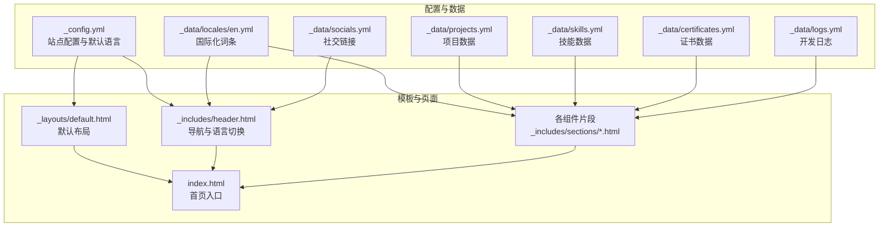
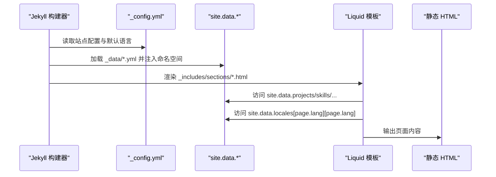
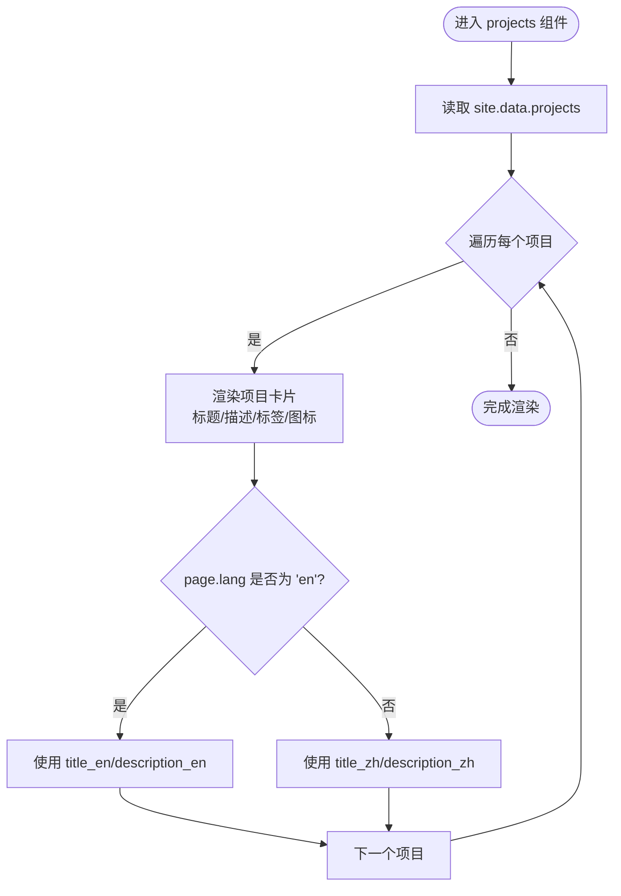
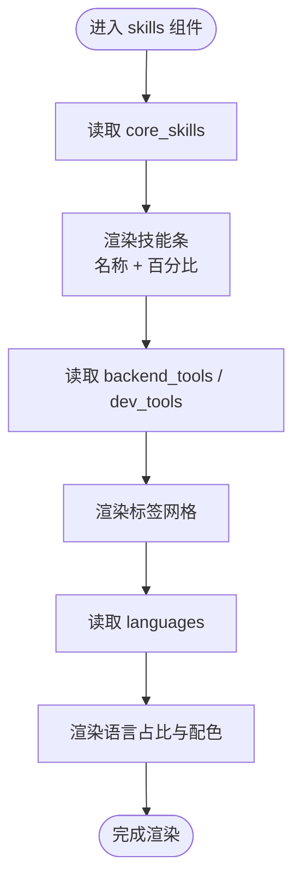
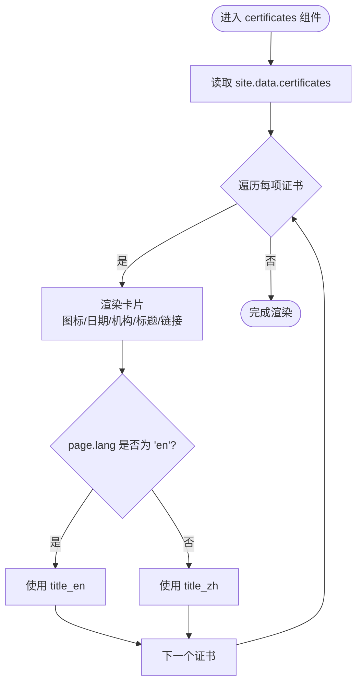
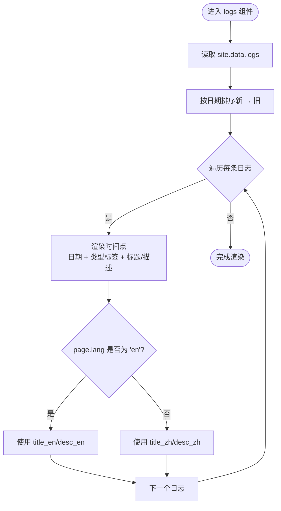
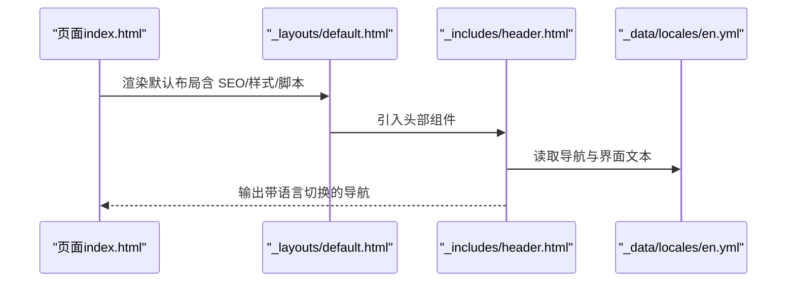
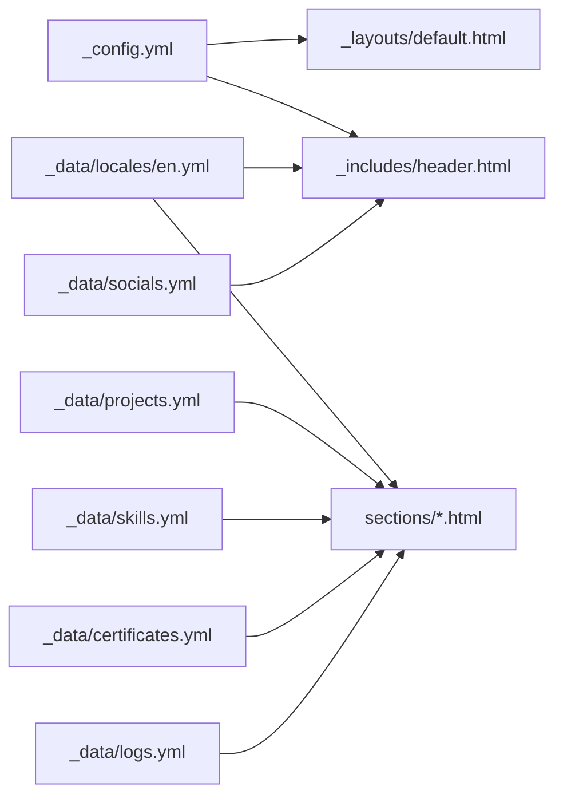

# 数据驱动内容管理

<cite>
**本文档引用的文件**
- [_config.yml](file://_config.yml)
- [README.md](file://README.md)
- [_data/projects.yml](file://_data/projects.yml)
- [_data/skills.yml](file://_data/skills.yml)
- [_data/certificates.yml](file://_data/certificates.yml)
- [_data/logs.yml](file://_data/logs.yml)
- [_data/socials.yml](file://_data/socials.yml)
- [_data/locales/en.yml](file://_data/locales/en.yml)
- [_includes/sections/projects.html](file://_includes/sections/projects.html)
- [_includes/sections/skills.html](file://_includes/sections/skills.html)
- [_includes/sections/certificates.html](file://_includes/sections/certificates.html)
- [_includes/sections/logs.html](file://_includes/sections/logs.html)
- [_includes/header.html](file://_includes/header.html)
- [_includes/sections/about.html](file://_includes/sections/about.html)
- [_includes/sections/hero.html](file://_includes/sections/hero.html)
- [_layouts/default.html](file://_layouts/default.html)
- [index.html](file://index.html)
</cite>

## 目录
1. [引言](#引言)
2. [项目结构](#项目结构)
3. [核心组件](#核心组件)
4. [架构总览](#架构总览)
5. [详细组件分析](#详细组件分析)
6. [依赖关系分析](#依赖关系分析)
7. [性能考量](#性能考量)
8. [故障排查指南](#故障排查指南)
9. [结论](#结论)
10. [附录](#附录)

## 引言
本文件面向 halfism.github.io 的数据驱动内容管理系统，系统以 Jekyll 数据文件为核心，结合模板系统实现动态内容渲染。重点覆盖以下方面：
- YAML 数据文件的组织结构与数据绑定机制
- 多语言国际化数据处理流程
- 模板与数据的绑定方式及渲染路径
- 数据文件的编辑规范、验证规则与最佳实践
- 数据迁移、备份与版本控制建议

## 项目结构
该站点采用“数据驱动 + 组件化模板”的架构。核心数据位于 _data 目录，模板组件位于 _includes 下，页面通过 front matter 指定语言与布局，最终由 Jekyll 在构建时渲染为静态 HTML。

图表来源
- [_config.yml:62-76](file://_config.yml#L62-L76)
- [_data/locales/en.yml:1-166](file://_data/locales/en.yml#L1-L166)
- [_data/projects.yml:1-45](file://_data/projects.yml#L1-L45)
- [_data/skills.yml:1-41](file://_data/skills.yml#L1-L41)
- [_data/certificates.yml:1-24](file://_data/certificates.yml#L1-L24)
- [_data/logs.yml:1-31](file://_data/logs.yml#L1-L31)
- [_data/socials.yml:1-20](file://_data/socials.yml#L1-L20)
- [_layouts/default.html:1-152](file://_layouts/default.html#L1-L152)
- [_includes/header.html:1-116](file://_includes/header.html#L1-L116)
- [_includes/sections/projects.html:1-50](file://_includes/sections/projects.html#L1-L50)
- [_includes/sections/skills.html:1-61](file://_includes/sections/skills.html#L1-L61)
- [_includes/sections/certificates.html:1-33](file://_includes/sections/certificates.html#L1-L33)
- [_includes/sections/logs.html:1-41](file://_includes/sections/logs.html#L1-L41)
- [index.html:1-17](file://index.html#L1-L17)

章节来源
- [README.md:26-63](file://README.md#L26-L63)
- [_config.yml:62-76](file://_config.yml#L62-L76)

## 核心组件
- 站点配置与默认语言
  - 通过 _config.yml 设置 languages、default_lang、defaults 等，决定页面默认语言与多语言范围。
- 国际化词条
  - _data/locales/en.yml 提供导航、段落、搜索等多类词条，模板通过 site.data.locales[page.lang][page.lang] 获取对应语言文本。
- 数据文件
  - projects.yml、skills.yml、certificates.yml、logs.yml、socials.yml 分别承载项目、技能、证书、日志与社交链接数据。
- 模板组件
  - 各 sections/*.html 通过 for 循环遍历 site.data.* 数据，实现动态渲染；header.html 负责语言切换与主题切换等交互。
- 页面入口
  - index.html 通过 include 引入各组件片段，形成完整页面。

章节来源
- [_config.yml:62-76](file://_config.yml#L62-L76)
- [_data/locales/en.yml:1-166](file://_data/locales/en.yml#L1-L166)
- [_includes/sections/projects.html:1-50](file://_includes/sections/projects.html#L1-L50)
- [_includes/sections/skills.html:1-61](file://_includes/sections/skills.html#L1-L61)
- [_includes/sections/certificates.html:1-33](file://_includes/sections/certificates.html#L1-L33)
- [_includes/sections/logs.html:1-41](file://_includes/sections/logs.html#L1-L41)
- [_includes/header.html:1-116](file://_includes/header.html#L1-L116)
- [index.html:1-17](file://index.html#L1-L17)

## 架构总览
Jekyll 在构建阶段读取 _data 下的 YAML 文件，将其注入到 site.data 命名空间；模板通过 Liquid 语法访问这些数据并进行渲染。页面通过 front matter 指定语言，模板根据 page.lang 选择对应词条与字段。

图表来源
- [_config.yml:62-76](file://_config.yml#L62-L76)
- [_data/projects.yml:1-45](file://_data/projects.yml#L1-L45)
- [_data/skills.yml:1-41](file://_data/skills.yml#L1-L41)
- [_data/certificates.yml:1-24](file://_data/certificates.yml#L1-L24)
- [_data/logs.yml:1-31](file://_data/logs.yml#L1-L31)
- [_data/socials.yml:1-20](file://_data/socials.yml#L1-L20)
- [_data/locales/en.yml:1-166](file://_data/locales/en.yml#L1-L166)
- [_includes/sections/projects.html:1-50](file://_includes/sections/projects.html#L1-L50)
- [_includes/sections/skills.html:1-61](file://_includes/sections/skills.html#L1-L61)
- [_includes/sections/certificates.html:1-33](file://_includes/sections/certificates.html#L1-L33)
- [_includes/sections/logs.html:1-41](file://_includes/sections/logs.html#L1-L41)
- [_includes/header.html:1-116](file://_includes/header.html#L1-L116)

## 详细组件分析

### 项目数据模型与渲染流程（projects.yml）
- 数据模型要点
  - 每个项目包含 id、多语言标题与描述、图片地址、技术标签、分类、仓库地址、star/fork 数等字段。
  - 支持多语言字段：title_zh/title_en、description_zh/description_en。
- 渲染绑定机制
  - 模板通过 for 遍历 site.data.projects，按 page.lang 切换显示中文或英文标题与描述。
  - 使用 site.socials.github.url 作为“查看全部”链接的目标路径。
- 性能与可用性
  - 图片懒加载与卡片式布局，标签云动态展示，stars/forks 展示项目活跃度。

图表来源
- [_includes/sections/projects.html:1-50](file://_includes/sections/projects.html#L1-L50)
- [_data/projects.yml:1-45](file://_data/projects.yml#L1-L45)
- [_config.yml:19-36](file://_config.yml#L19-L36)

章节来源
- [_includes/sections/projects.html:1-50](file://_includes/sections/projects.html#L1-L50)
- [_data/projects.yml:1-45](file://_data/projects.yml#L1-L45)
- [_config.yml:19-36](file://_config.yml#L19-L36)

### 技能数据模型与渲染流程（skills.yml）
- 数据模型要点
  - core_skills：名称与掌握程度百分比。
  - backend_tools/dev_tools：技能标签集合。
  - languages：按语言占比与配色标识。
- 渲染绑定机制
  - 模板分别遍历 core_skills、backend_tools、dev_tools 与 languages，生成技能条与标签云。
  - 百分比用于进度条宽度计算，颜色类用于视觉区分。
- 可维护性
  - 将技能分为不同维度，便于后续扩展与样式定制。

图表来源
- [_includes/sections/skills.html:1-61](file://_includes/sections/skills.html#L1-L61)
- [_data/skills.yml:1-41](file://_data/skills.yml#L1-L41)

章节来源
- [_includes/sections/skills.html:1-61](file://_includes/sections/skills.html#L1-L61)
- [_data/skills.yml:1-41](file://_data/skills.yml#L1-L41)

### 证书数据模型与渲染流程（certificates.yml）
- 数据模型要点
  - 每项包含多语言标题、颁发机构、获得日期、图标、颜色类与链接。
- 渲染绑定机制
  - 模板遍历 site.data.certificates，按 page.lang 切换标题显示，并应用颜色类与图标样式。
  - 点击卡片跳转至证书链接。

图表来源
- [_includes/sections/certificates.html:1-33](file://_includes/sections/certificates.html#L1-L33)
- [_data/certificates.yml:1-24](file://_data/certificates.yml#L1-L24)

章节来源
- [_includes/sections/certificates.html:1-33](file://_includes/sections/certificates.html#L1-L33)
- [_data/certificates.yml:1-24](file://_data/certificates.yml#L1-L24)

### 开发日志数据模型与渲染流程（logs.yml）
- 数据模型要点
  - 每条记录包含日期、类型（feat/code/api）、多语言标题与描述。
- 渲染绑定机制
  - 模板按日期倒序渲染时间轴，类型映射为不同标签样式，标题与描述按 page.lang 切换。
- 可读性
  - 时间轴样式清晰展示迭代历程，便于访客了解项目演进。

图表来源
- [_includes/sections/logs.html:1-41](file://_includes/sections/logs.html#L1-L41)
- [_data/logs.yml:1-31](file://_data/logs.yml#L1-L31)

章节来源
- [_includes/sections/logs.html:1-41](file://_includes/sections/logs.html#L1-L41)
- [_data/logs.yml:1-31](file://_data/logs.yml#L1-L31)

### 导航与国际化（header.html 与 locales/en.yml）
- 国际化词条
  - _data/locales/en.yml 提供导航、英雄区、关于我、项目、技能、日志、证书、联系、博客、画廊、搜索、PWA、页脚、文章、离线提示、通用等多类词条。
- 模板绑定
  - 模板通过 site.data.locales[page.lang][page.lang] 获取当前语言词条；导航中的“切换语言”按钮根据 page.lang 显示不同目标路径。
- 多语言切换
  - 通过页面 front matter 的 lang 字段控制渲染语言；_config.yml 的 defaults 为根路径与 en 子路径设定默认语言。

图表来源
- [_includes/header.html:1-116](file://_includes/header.html#L1-L116)
- [_data/locales/en.yml:1-166](file://_data/locales/en.yml#L1-L166)
- [_layouts/default.html:1-152](file://_layouts/default.html#L1-L152)
- [index.html:1-17](file://index.html#L1-L17)

章节来源
- [_includes/header.html:1-116](file://_includes/header.html#L1-L116)
- [_data/locales/en.yml:1-166](file://_data/locales/en.yml#L1-L166)
- [_layouts/default.html:1-152](file://_layouts/default.html#L1-L152)
- [index.html:1-17](file://index.html#L1-L17)

### 作者信息与社交链接（_config.yml 与 socials.yml）
- 作者信息
  - _config.yml 的 author 字段包含姓名、头像、多语言简介、位置、雇主与标签等，模板在 hero 与 about 组件中使用。
- 社交链接
  - _data/socials.yml 提供图标、URL 与悬停样式；_config.yml 的 socials 字段提供用户名与平台链接，模板在 header 与 hero 中使用。

章节来源
- [_config.yml:8-18](file://_config.yml#L8-L18)
- [_config.yml:19-36](file://_config.yml#L19-L36)
- [_data/socials.yml:1-20](file://_data/socials.yml#L1-L20)
- [_includes/sections/hero.html:1-56](file://_includes/sections/hero.html#L1-L56)
- [_includes/sections/about.html:1-48](file://_includes/sections/about.html#L1-L48)

## 依赖关系分析
- 数据依赖
  - 各 sections/*.html 依赖 site.data.* 对应数据文件；header.html 依赖 site.data.locales 与 site.socials。
- 配置依赖
  - _config.yml 的 languages、default_lang、defaults 控制页面语言；SEO、评论、Analytics 等插件与设置影响最终输出。
- 模板耦合
  - 组件间低耦合，通过 include 组合；数据访问集中在 Liquid 模板层，便于维护。

图表来源
- [_config.yml:62-76](file://_config.yml#L62-L76)
- [_data/locales/en.yml:1-166](file://_data/locales/en.yml#L1-L166)
- [_data/projects.yml:1-45](file://_data/projects.yml#L1-L45)
- [_data/skills.yml:1-41](file://_data/skills.yml#L1-L41)
- [_data/certificates.yml:1-24](file://_data/certificates.yml#L1-L24)
- [_data/logs.yml:1-31](file://_data/logs.yml#L1-L31)
- [_data/socials.yml:1-20](file://_data/socials.yml#L1-L20)
- [_includes/header.html:1-116](file://_includes/header.html#L1-L116)
- [_includes/sections/projects.html:1-50](file://_includes/sections/projects.html#L1-L50)
- [_includes/sections/skills.html:1-61](file://_includes/sections/skills.html#L1-L61)
- [_includes/sections/certificates.html:1-33](file://_includes/sections/certificates.html#L1-L33)
- [_includes/sections/logs.html:1-41](file://_includes/sections/logs.html#L1-L41)

章节来源
- [_config.yml:62-76](file://_config.yml#L62-L76)
- [_data/locales/en.yml:1-166](file://_data/locales/en.yml#L1-L166)
- [_data/projects.yml:1-45](file://_data/projects.yml#L1-L45)
- [_data/skills.yml:1-41](file://_data/skills.yml#L1-L41)
- [_data/certificates.yml:1-24](file://_data/certificates.yml#L1-L24)
- [_data/logs.yml:1-31](file://_data/logs.yml#L1-L31)
- [_data/socials.yml:1-20](file://_data/socials.yml#L1-L20)
- [_includes/header.html:1-116](file://_includes/header.html#L1-L116)
- [_includes/sections/projects.html:1-50](file://_includes/sections/projects.html#L1-L50)
- [_includes/sections/skills.html:1-61](file://_includes/sections/skills.html#L1-L61)
- [_includes/sections/certificates.html:1-33](file://_includes/sections/certificates.html#L1-L33)
- [_includes/sections/logs.html:1-41](file://_includes/sections/logs.html#L1-L41)

## 性能考量
- 构建期优化
  - 使用 Jekyll 插件生成 sitemap、feed 与 SEO 标签，减少运行时开销。
- 资源加载
  - 布局中预连接外部资源，避免阻塞；字体与图标通过 CDN 引入，注意缓存策略。
- 内容体积
  - 保持数据文件简洁，避免冗余字段；图片懒加载与卡片布局降低首屏压力。
- 可访问性
  - 布局包含 skip-link、阅读进度条与无障碍标签，提升用户体验。

## 故障排查指南
- 语言切换无效
  - 检查页面 front matter 的 lang 是否正确；确认 _config.yml 的 defaults 是否为根路径与 en 子路径设置了默认语言。
- 词条未显示或显示为空
  - 确认 _data/locales/en.yml 中对应键是否存在；检查模板中是否使用了正确的嵌套路径 site.data.locales[page.lang][page.lang]。
- 项目/技能/证书/日志不显示
  - 确认 _data 下对应文件存在且格式正确；检查模板中是否使用了正确的数据访问路径 site.data.<file>。
- 社交链接错误
  - 检查 _data/socials.yml 与 _config.yml 中的 socials 字段是否一致；确认模板中使用的变量名与数据结构匹配。

章节来源
- [_config.yml:62-76](file://_config.yml#L62-L76)
- [_data/locales/en.yml:1-166](file://_data/locales/en.yml#L1-L166)
- [_data/projects.yml:1-45](file://_data/projects.yml#L1-L45)
- [_data/skills.yml:1-41](file://_data/skills.yml#L1-L41)
- [_data/certificates.yml:1-24](file://_data/certificates.yml#L1-L24)
- [_data/logs.yml:1-31](file://_data/logs.yml#L1-L31)
- [_data/socials.yml:1-20](file://_data/socials.yml#L1-L20)
- [_includes/header.html:1-116](file://_includes/header.html#L1-L116)

## 结论
halfism.github.io 的数据驱动内容管理以 Jekyll 数据文件为核心，通过模板系统实现高度模块化与可维护的内容渲染。合理的数据模型设计与多语言词条管理，使得内容更新与国际化切换变得简单可靠。遵循本文档的编辑规范与最佳实践，可进一步提升系统的稳定性与可扩展性。

## 附录

### 数据文件编辑指南与验证规则
- 通用规则
  - 使用缩进与一致的键名，避免混合缩进（空格/制表符）。
  - 多语言字段成对出现（如 title_zh/title_en），确保切换正常。
  - 日期字段使用统一格式（如 YYYY-MM 或 YYYY-MM-DD），便于排序与展示。
- 项目（projects.yml）
  - 必填字段：id、title_zh/title_en、description_zh/description_en、image、tags、category、url、stars、forks。
  - 建议：tags 与 category 保持一致性，便于筛选与展示。
- 技能（skills.yml）
  - core_skills：name 与 level 成对出现，level 为合理数值范围。
  - backend_tools/dev_tools：每个工具独立列出，避免重复。
  - languages：percentage 之和建议为 100，color 为有效的样式类。
- 证书（certificates.yml）
  - 必填字段：title_zh/title_en、issuer、date、icon、color、url。
  - 建议：icon 与 color 保持风格一致，便于视觉识别。
- 日志（logs.yml）
  - 必填字段：date、type（feat/code/api）、title_zh/title_en、desc_zh/desc_en。
  - 建议：按时间倒序排列，便于展示最新进展。
- 社交（socials.yml）
  - 必填字段：name、icon、url、hover_class。
  - 建议：icon 与 hover_class 与主题样式一致。

### 数据迁移、备份与版本控制建议
- 迁移策略
  - 新增字段时，先在测试分支添加默认值，再逐步替换旧数据，确保模板兼容。
  - 对多语言字段进行批量校验，避免缺失或错位。
- 备份与回滚
  - 对重要数据文件进行版本化管理，保留历史快照；变更前在本地或测试环境验证。
- 版本控制
  - 将 _data 与 _config.yml 的变更纳入 PR 流程，增加同行评审，减少回归风险。
  - 使用分支策略：feature/data-* 用于数据特性开发，release/* 用于发布前校验。