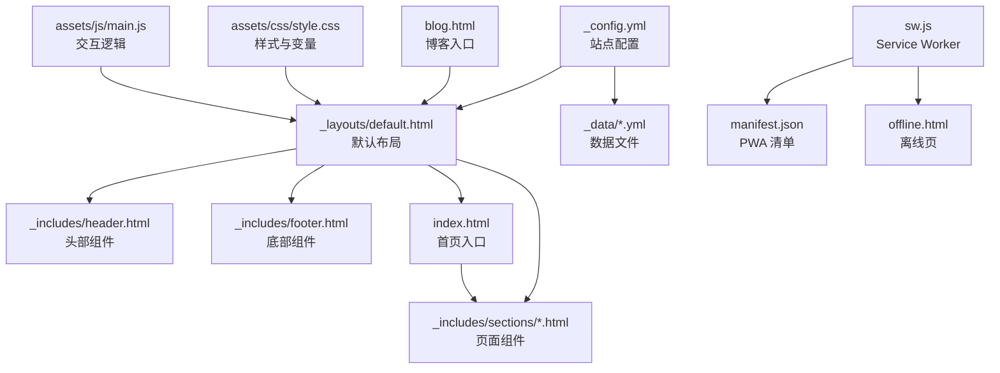
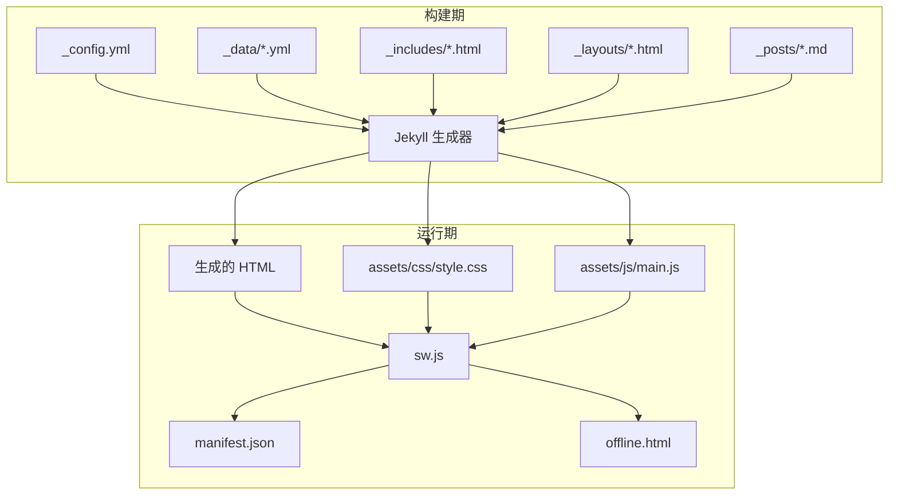
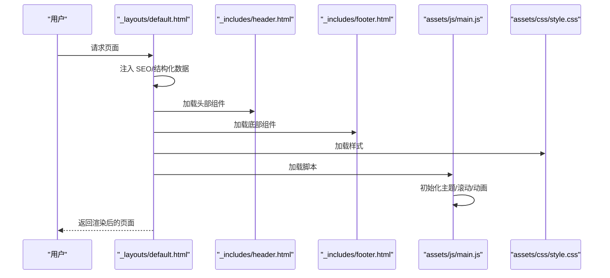
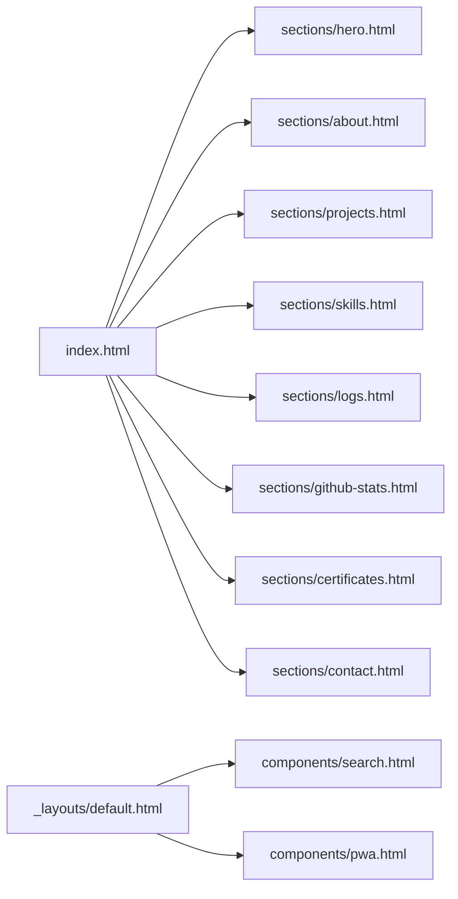
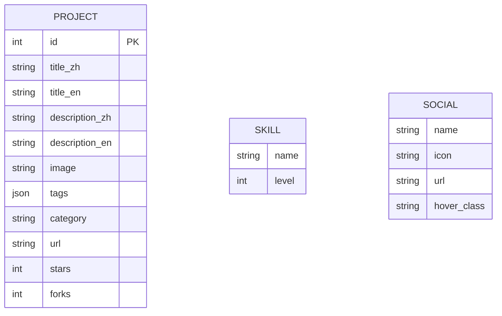
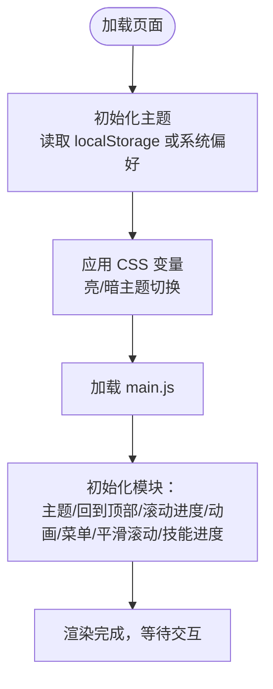
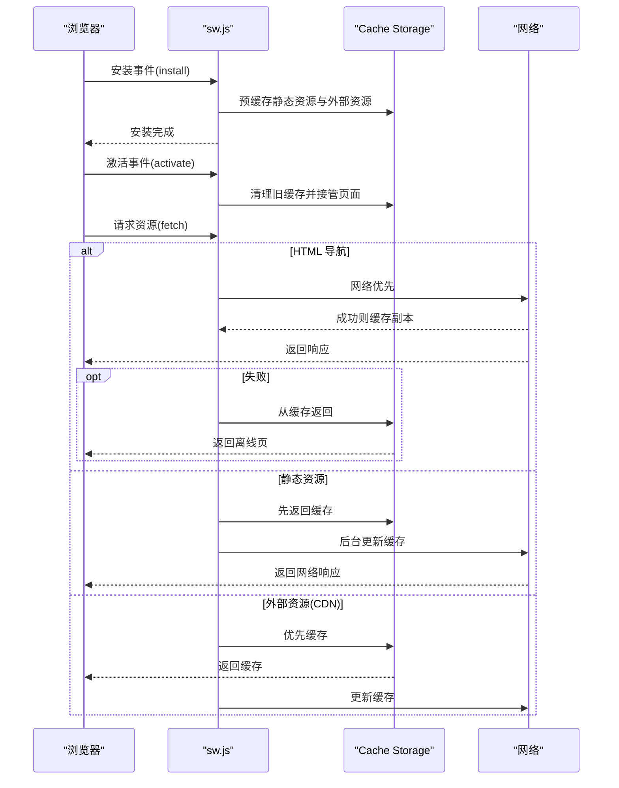
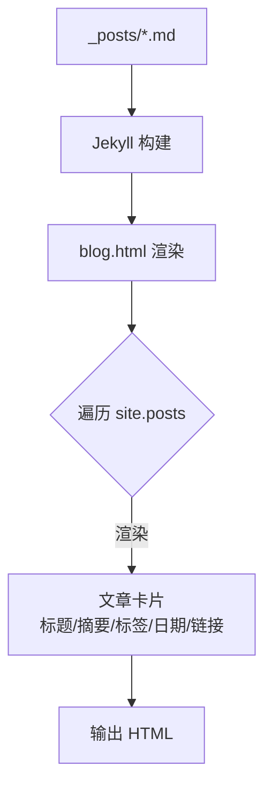
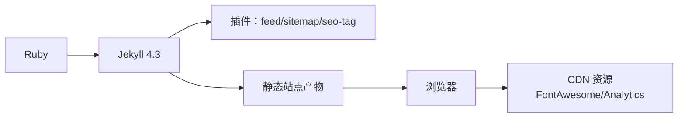

# 架构设计

<cite>
**本文引用的文件**
- [_config.yml](file://_config.yml)
- [Gemfile](file://Gemfile)
- [README.md](file://README.md)
- [index.html](file://index.html)
- [blog.html](file://blog.html)
- [sw.js](file://sw.js)
- [manifest.json](file://manifest.json)
- [offline.html](file://offline.html)
- [_layouts/default.html](file://_layouts/default.html)
- [_includes/header.html](file://_includes/header.html)
- [_includes/footer.html](file://_includes/footer.html)
- [_data/projects.yml](file://_data/projects.yml)
- [_data/skills.yml](file://_data/skills.yml)
- [_data/socials.yml](file://_data/socials.yml)
- [assets/css/style.css](file://assets/css/style.css)
- [assets/js/main.js](file://assets/js/main.js)
</cite>

## 目录
1. [引言](#引言)
2. [项目结构](#项目结构)
3. [核心组件](#核心组件)
4. [架构总览](#架构总览)
5. [详细组件分析](#详细组件分析)
6. [依赖分析](#依赖分析)
7. [性能考量](#性能考量)
8. [故障排查指南](#故障排查指南)
9. [结论](#结论)
10. [附录](#附录)

## 引言
本项目是一个基于 Jekyll 的静态网站生成器，采用数据驱动的内容管理与组件化架构，结合 PWA 能力与 CSS 变量体系，实现现代化、可维护、高性能的个人作品集站点。本文档系统阐述其架构设计、组件关系、数据流与处理逻辑，并提供可视化图表帮助开发者理解技术选型与实现思路。

## 项目结构
项目采用 Jekyll 的约定式目录组织，核心目录职责如下：
- 根目录：页面入口与全局配置
- _config.yml：站点配置（SEO、主题、评论、分析等）
- _data/：数据文件（项目、技能、证书、社交、日志、多语言）
- _includes/：可复用组件（header、footer、sections、components）
- _layouts/：布局模板（default、post、project）
- _posts/：博客文章（Kramdown + Permalink）
- assets/：资源管理（CSS 变量体系、JS 模块化）
- PWA 相关：sw.js、manifest.json、offline.html

**图表来源**
- [_config.yml:1-133](file://_config.yml#L1-L133)
- [_layouts/default.html:1-152](file://_layouts/default.html#L1-L152)
- [_includes/header.html:1-116](file://_includes/header.html#L1-L116)
- [_includes/footer.html:1-49](file://_includes/footer.html#L1-L49)
- [index.html:1-17](file://index.html#L1-L17)
- [blog.html:1-50](file://blog.html#L1-L50)
- [assets/css/style.css:1-1015](file://assets/css/style.css#L1-L1015)
- [assets/js/main.js:1-279](file://assets/js/main.js#L1-L279)
- [sw.js:1-237](file://sw.js#L1-L237)
- [manifest.json:1-79](file://manifest.json#L1-L79)
- [offline.html:1-82](file://offline.html#L1-L82)

**章节来源**
- [_config.yml:1-133](file://_config.yml#L1-L133)
- [README.md:26-63](file://README.md#L26-L63)

## 核心组件
- 数据驱动内容管理：通过 _data 下的 YAML 文件集中管理项目、技能、证书、社交、日志与多语言文案，页面通过 Liquid 语法读取并渲染。
- 组件化布局：_layouts/default.html 提供统一布局，_includes 下的 sections 与 components 实现高内聚、可复用的页面片段。
- 资源与主题：assets/css/style.css 采用 CSS 变量作为设计令牌，支持亮/暗主题；assets/js/main.js 提供主题切换、滚动进度、平滑滚动等交互。
- PWA 能力：sw.js 实现预缓存、动态缓存与离线回退；manifest.json 提供应用清单；offline.html 提供离线提示页。
- 博客系统：_posts 下的文章由 Jekyll 插件生成 RSS 与 sitemap，页面通过 Liquid 遍历渲染。

**章节来源**
- [_data/projects.yml:1-45](file://_data/projects.yml#L1-L45)
- [_data/skills.yml:1-41](file://_data/skills.yml#L1-L41)
- [_data/socials.yml:1-20](file://_data/socials.yml#L1-L20)
- [_layouts/default.html:1-152](file://_layouts/default.html#L1-L152)
- [assets/css/style.css:1-1015](file://assets/css/style.css#L1-L1015)
- [assets/js/main.js:1-279](file://assets/js/main.js#L1-L279)
- [sw.js:1-237](file://sw.js#L1-L237)
- [manifest.json:1-79](file://manifest.json#L1-L79)
- [offline.html:1-82](file://offline.html#L1-L82)
- [blog.html:1-50](file://blog.html#L1-L50)

## 架构总览
整体架构遵循“静态生成 + 运行时增强”的模式：
- 构建期：Jekyll 解析 _config.yml、_data、_includes、_layouts、_posts，生成静态 HTML/CSS/JS。
- 运行期：浏览器加载 assets 并执行 main.js，配合 sw.js 提供缓存与离线能力；PWA 清单注册应用行为。

**图表来源**
- [_config.yml:1-133](file://_config.yml#L1-L133)
- [_data/*.yml:1-45](file://_data/projects.yml#L1-L45)
- [_includes/*.html:1-116](file://_includes/header.html#L1-L116)
- [_layouts/*.html:1-152](file://_layouts/default.html#L1-L152)
- [_posts/*.md:18-45](file://blog.html#L18-L45)
- [assets/css/style.css:1-1015](file://assets/css/style.css#L1-L1015)
- [assets/js/main.js:1-279](file://assets/js/main.js#L1-L279)
- [sw.js:1-237](file://sw.js#L1-L237)
- [manifest.json:1-79](file://manifest.json#L1-L79)
- [offline.html:1-82](file://offline.html#L1-L82)

## 详细组件分析

### 布局与模板系统（_layouts/default.html）
- 多语言与 SEO：根据 page.lang 注入 <html lang>、hreflang、Open Graph、Twitter Card、JSON-LD 结构化数据。
- 资源加载：预连接外部资源、注入主题初始化脚本、加载 style.css 与 main.js。
- 可访问性：跳转到主内容锚点、阅读进度条、键盘导航支持。
- 组件挂载：包含 header、footer、搜索模态与 PWA 安装组件。

**图表来源**
- [_layouts/default.html:1-152](file://_layouts/default.html#L1-L152)
- [_includes/header.html:1-116](file://_includes/header.html#L1-L116)
- [_includes/footer.html:1-49](file://_includes/footer.html#L1-L49)
- [assets/css/style.css:1-1015](file://assets/css/style.css#L1-L1015)
- [assets/js/main.js:1-279](file://assets/js/main.js#L1-L279)

**章节来源**
- [_layouts/default.html:1-152](file://_layouts/default.html#L1-L152)

### 可复用组件系统（_includes/sections/ 与 _includes/components/）
- sections：页面级可复用片段，如 hero、about、projects、skills、logs、github-stats、certificates、contact。
- components：通用 UI 组件，如搜索模态与 PWA 安装提示。
- 数据绑定：通过 Liquid 语法访问 site.data.* 与 page.lang 实现内容与多语言渲染。

**图表来源**
- [index.html:7-16](file://index.html#L7-L16)
- [_layouts/default.html:145-149](file://_layouts/default.html#L145-L149)

**章节来源**
- [index.html:1-17](file://index.html#L1-L17)
- [_layouts/default.html:145-149](file://_layouts/default.html#L145-L149)

### 数据文件系统（_data/）
- projects.yml：项目集合，包含标题、描述、标签、分类、链接与仓库统计。
- skills.yml：核心技能、后端工具、开发工具与语言占比。
- socials.yml：社交链接与图标映射。
- 多语言：通过 _config.yml 的 languages 与 default_lang 配置，结合页面 front matter 控制渲染语言。

**图表来源**
- [_data/projects.yml:1-45](file://_data/projects.yml#L1-L45)
- [_data/skills.yml:1-41](file://_data/skills.yml#L1-L41)
- [_data/socials.yml:1-20](file://_data/socials.yml#L1-L20)

**章节来源**
- [_data/projects.yml:1-45](file://_data/projects.yml#L1-L45)
- [_data/skills.yml:1-41](file://_data/skills.yml#L1-L41)
- [_data/socials.yml:1-20](file://_data/socials.yml#L1-L20)
- [_config.yml:63-75](file://_config.yml#L63-L75)

### 资源管理与主题系统（assets/）
- CSS 变量体系：在 :root 与 [data-theme="dark"] 中定义设计令牌，实现主题切换与深色模式。
- 组件样式：卡片、按钮、标签、进度条、章节样式等，均基于变量与工具类组合。
- JavaScript 模块化：main.js 将主题、回到顶部、滚动进度、滚动动画、移动端菜单、平滑滚动、技能进度等封装为模块化对象，统一初始化。

**图表来源**
- [assets/css/style.css:10-145](file://assets/css/style.css#L10-L145)
- [assets/js/main.js:27-75](file://assets/js/main.js#L27-L75)

**章节来源**
- [assets/css/style.css:1-1015](file://assets/css/style.css#L1-L1015)
- [assets/js/main.js:1-279](file://assets/js/main.js#L1-L279)

### PWA 架构（Service Worker、缓存策略与离线）
- 预缓存：安装阶段缓存首页、博客、联系页、manifest.json、静态 CSS/JS。
- 外部资源缓存：缓存字体与分析脚本等外部资源。
- 缓存策略：
  - HTML 导航：Network First，失败回退至缓存或离线页。
  - 静态资源：Stale While Revalidate，先返回缓存再后台更新。
  - 外部资源：Cache First，优先缓存 CDN 资源。
- 离线体验：匹配 /offline.html，支持在线事件监听自动刷新。
- 清单与安装：manifest.json 提供应用元信息与图标，触发安装提示。

**图表来源**
- [sw.js:28-114](file://sw.js#L28-L114)
- [sw.js:120-194](file://sw.js#L120-L194)
- [sw.js:199-211](file://sw.js#L199-L211)
- [manifest.json:1-79](file://manifest.json#L1-L79)
- [offline.html:1-82](file://offline.html#L1-L82)

**章节来源**
- [sw.js:1-237](file://sw.js#L1-L237)
- [manifest.json:1-79](file://manifest.json#L1-L79)
- [offline.html:1-82](file://offline.html#L1-L82)

### 博客系统（_posts 与渲染）
- 文章列表：遍历 site.posts，渲染摘要、标签、日期与链接。
- 多语言：通过 site.data.locales[page.lang][page.lang] 获取文案。
- SEO：默认使用 page.excerpt 或截断 site.description。

**图表来源**
- [blog.html:18-45](file://blog.html#L18-L45)
- [_config.yml:110-113](file://_config.yml#L110-L113)

**章节来源**
- [blog.html:1-50](file://blog.html#L1-L50)

## 依赖分析
- 构建工具链：Ruby + Jekyll 4.3，插件 jekyll-feed、jekyll-sitemap、jekyll-seo-tag。
- 运行时依赖：Font Awesome 4.7（CDN）、Google Analytics（按配置启用）。
- 本地化与国际化：_config.yml 的 languages 与 default_lang，以及 _includes/header.html 中的语言切换逻辑。

**图表来源**
- [Gemfile:1-12](file://Gemfile#L1-L12)
- [_config.yml:110-113](file://_config.yml#L110-L113)

**章节来源**
- [Gemfile:1-12](file://Gemfile#L1-L12)
- [_config.yml:63-75](file://_config.yml#L63-L75)

## 性能考量
- 静态生成：Jekyll 在构建期完成模板渲染与资源打包，运行期仅传输最小化 HTML/CSS/JS。
- 资源体积：CSS 变量与工具类减少重复样式，JS 采用原生模块化避免第三方依赖。
- 缓存策略：Service Worker 分场景采用 Network First、Stale While Revalidate、Cache First，兼顾可用性与新鲜度。
- 可访问性与 SEO：结构化数据、多语言 hreflang、Open Graph/Twitter Card、canonical 链接。
- 无障碍：skip-link、键盘导航、减少动画偏好、焦点可见性。

[本节为通用指导，无需列出具体文件来源]

## 故障排查指南
- 主题不生效
  - 检查 data-theme 是否正确写入（初始化脚本会根据 localStorage 或系统偏好设置）。
  - 确认 CSS 变量在 :root 与 [data-theme="dark"] 中定义完整。
- Service Worker 未注册或缓存异常
  - 确认 sw.js 已部署且路径正确。
  - 检查浏览器控制台是否有安装/激活错误。
  - 使用消息类型 SKIP_WAITING 或 CLEAR_CACHE 触发更新或清空缓存。
- 离线页未显示
  - 确认 /offline.html 存在且未被排除。
  - 检查 fetch 事件对 HTML 导航的 Network First 策略是否命中。
- 外部资源加载失败
  - 检查 CDN 地址与跨域策略，确认缓存命中或回退逻辑正常。
- 博客列表为空
  - 确认 _posts 下存在 Markdown 文件且命名符合 Jekyll 规范。
  - 检查 _config.yml 中的 plugins 与 permalink 设置。

**章节来源**
- [assets/js/main.js:27-75](file://assets/js/main.js#L27-L75)
- [assets/css/style.css:10-145](file://assets/css/style.css#L10-L145)
- [sw.js:28-81](file://sw.js#L28-L81)
- [sw.js:84-114](file://sw.js#L84-L114)
- [sw.js:214-224](file://sw.js#L214-L224)
- [offline.html:1-82](file://offline.html#L1-L82)
- [blog.html:18-45](file://blog.html#L18-L45)
- [_config.yml:110-113](file://_config.yml#L110-L113)

## 结论
本项目通过 Jekyll 的静态生成能力与组件化架构，结合数据驱动的内容管理与 PWA 缓存策略，实现了高性能、可维护、可扩展的个人作品集站点。CSS 变量体系与原生 JavaScript 模块化保证了主题一致性与交互体验，Service Worker 为离线与弱网场景提供了稳健保障。该架构适合持续演进与二次开发。

[本节为总结性内容，无需列出具体文件来源]

## 附录
- 快速开始与本地开发流程见 README 的“本地开发”与“自定义配置”章节。
- 添加新页面与组件的方法见 README 的“添加新页面”与“创建新组件”。

**章节来源**
- [README.md:80-123](file://README.md#L80-L123)