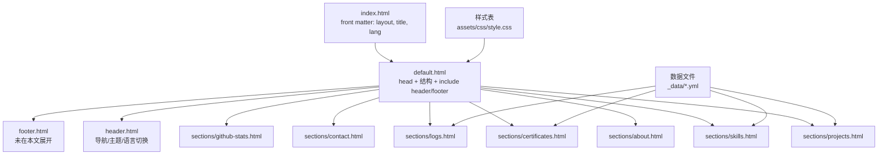
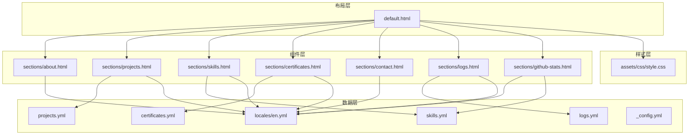
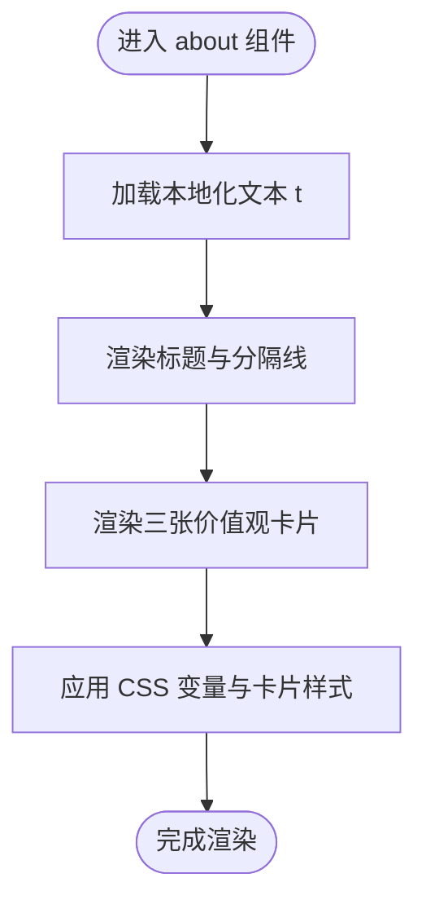
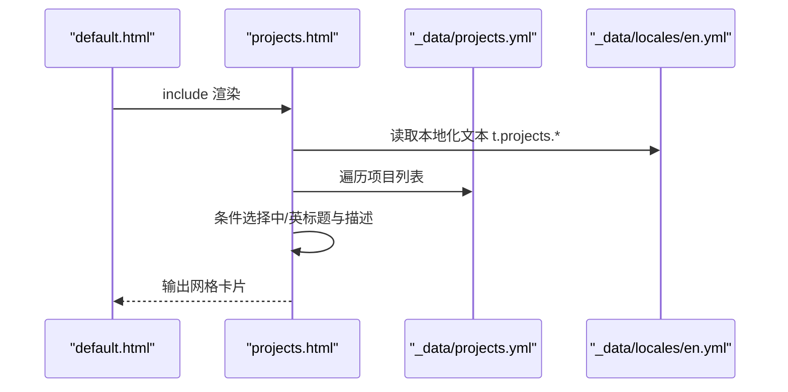
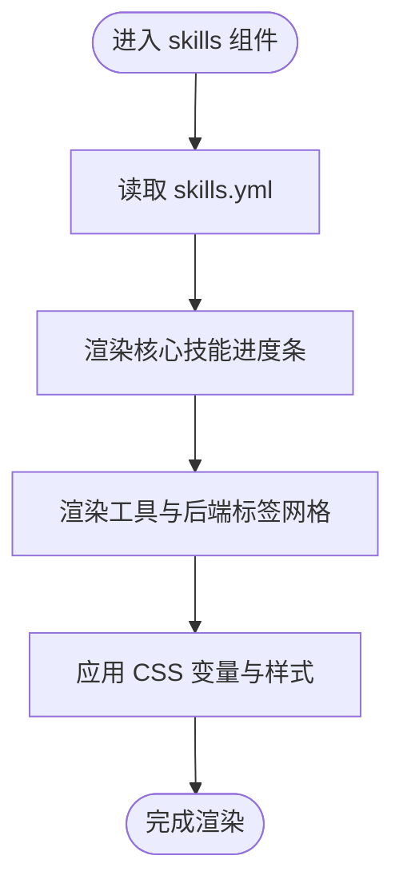
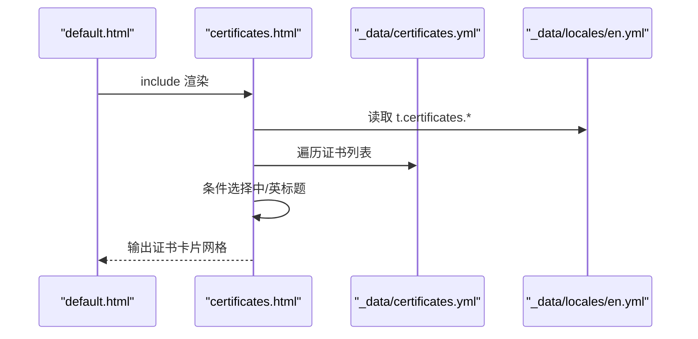
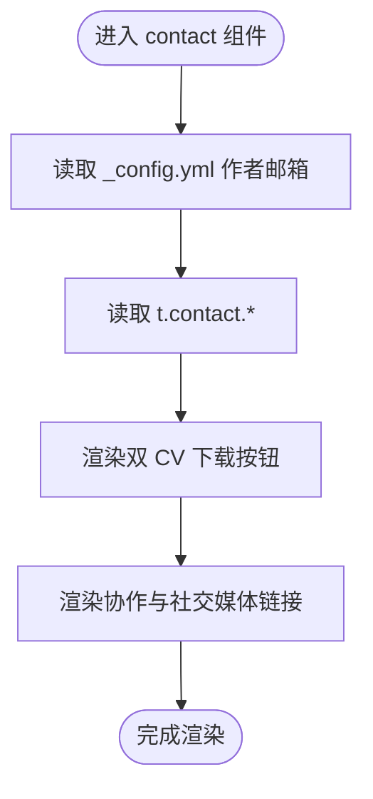
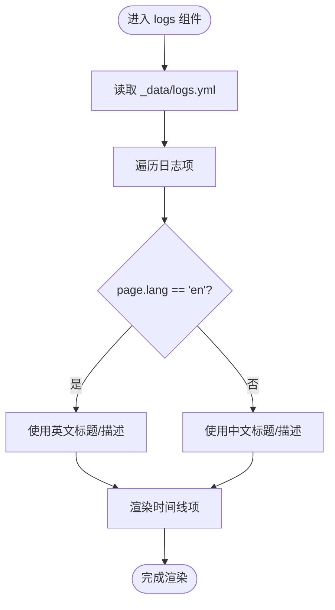
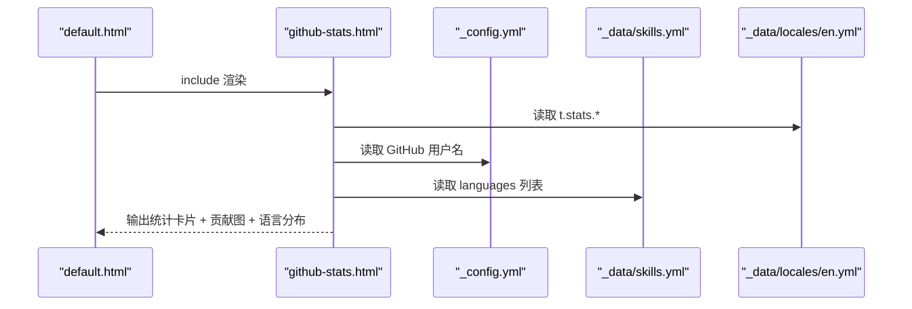
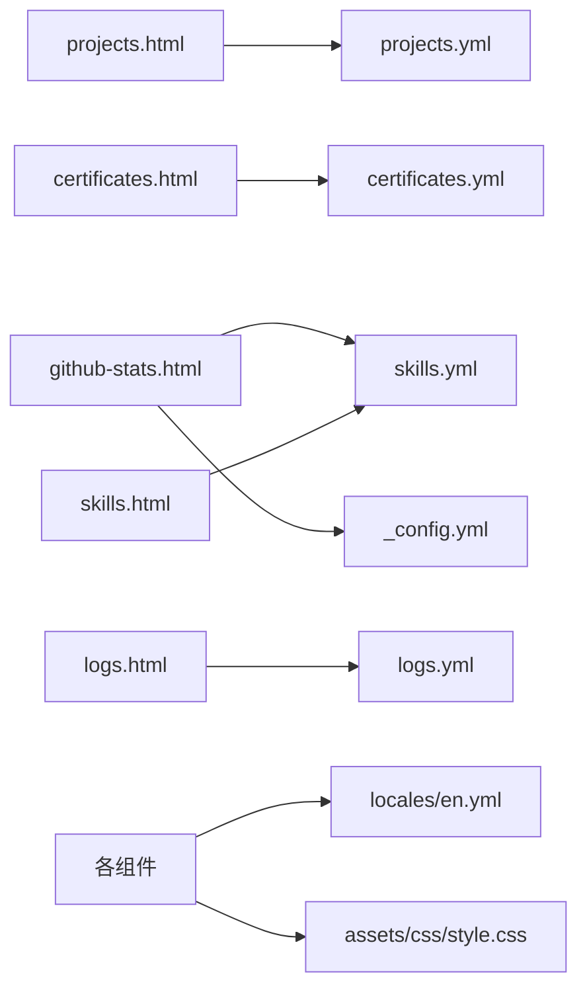

# Sections 组件系统

<cite>
**本文引用的文件**
- [about.html](file://_includes/sections/about.html)
- [projects.html](file://_includes/sections/projects.html)
- [skills.html](file://_includes/sections/skills.html)
- [certificates.html](file://_includes/sections/certificates.html)
- [contact.html](file://_includes/sections/contact.html)
- [logs.html](file://_includes/sections/logs.html)
- [github-stats.html](file://_includes/sections/github-stats.html)
- [projects.yml](file://_data/projects.yml)
- [skills.yml](file://_data/skills.yml)
- [certificates.yml](file://_data/certificates.yml)
- [logs.yml](file://_data/logs.yml)
- [en.yml](file://_data/locales/en.yml)
- [_config.yml](file://_config.yml)
- [default.html](file://_layouts/default.html)
- [style.css](file://assets/css/style.css)
- [header.html](file://_includes/header.html)
- [index.html](file://index.html)
</cite>

## 目录
1. [简介](#简介)
2. [项目结构](#项目结构)
3. [核心组件](#核心组件)
4. [架构总览](#架构总览)
5. [组件详细分析](#组件详细分析)
6. [依赖关系分析](#依赖关系分析)
7. [性能考量](#性能考量)
8. [故障排查指南](#故障排查指南)
9. [结论](#结论)
10. [附录](#附录)

## 简介
本文件系统性梳理 halfism.github.io 的 Sections 组件体系，聚焦 _includes/sections/ 目录下的组件：about、projects、skills、certificates、contact、logs、github-stats。文档从设计理念、数据绑定机制、多语言支持、样式系统与响应式设计入手，给出组件复用最佳实践、自定义开发指南与组件间数据传递模式，并提供可追溯的“章节来源”与“图表来源”，帮助开发者快速理解与扩展该组件系统。

## 项目结构
Sections 组件通过 Jekyll 布局与 include 机制组合渲染。页面在 front matter 中声明语言与布局，主页面模板按顺序 include 各个 sections 组件，形成完整的页面内容流。

图表来源
- [index.html:1-17](file://index.html#L1-L17)
- [default.html:1-152](file://_layouts/default.html#L1-L152)
- [header.html:1-116](file://_includes/header.html#L1-L116)
- [projects.html:1-50](file://_includes/sections/projects.html#L1-L50)
- [skills.html:1-61](file://_includes/sections/skills.html#L1-L61)
- [certificates.html:1-33](file://_includes/sections/certificates.html#L1-L33)
- [logs.html:1-41](file://_includes/sections/logs.html#L1-L41)
- [github-stats.html:1-75](file://_includes/sections/github-stats.html#L1-L75)
- [style.css:1-200](file://assets/css/style.css#L1-L200)

章节来源
- [index.html:1-17](file://index.html#L1-L17)
- [default.html:1-152](file://_layouts/default.html#L1-L152)

## 核心组件
本节概述各组件职责与通用特性：
- about：个人介绍与价值观卡片，强调可访问性与语义化标题。
- projects：项目网格展示，支持多语言标题/描述与标签。
- skills：技能进度条与技能标签分组，体现核心能力与工具链。
- certificates：证书卡片列表，支持图标、发证机构与日期。
- contact：联系与简历下载区域，提供中英双 CV 下载入口。
- logs：时间线展示开发历程，按类型标注标签。
- github-stats：GitHub 统计卡片、贡献图与语言分布。

章节来源
- [about.html:1-48](file://_includes/sections/about.html#L1-L48)
- [projects.html:1-50](file://_includes/sections/projects.html#L1-L50)
- [skills.html:1-61](file://_includes/sections/skills.html#L1-L61)
- [certificates.html:1-33](file://_includes/sections/certificates.html#L1-L33)
- [contact.html:1-39](file://_includes/sections/contact.html#L1-L39)
- [logs.html:1-41](file://_includes/sections/logs.html#L1-L41)
- [github-stats.html:1-75](file://_includes/sections/github-stats.html#L1-L75)

## 架构总览
Sections 组件遵循“布局-组件-数据-样式”的分层架构：
- 布局层：default.html 提供全局结构、SEO、PWA、脚本与主题初始化。
- 组件层：sections/*.html 通过 Liquid 读取数据与本地化文本，渲染结构化内容。
- 数据层：_data/*.yml 提供项目、技能、证书、日志等静态数据。
- 样式层：style.css 定义设计令牌与主题变量，组件通过 CSS 变量与原子类实现一致风格。

图表来源
- [default.html:1-152](file://_layouts/default.html#L1-L152)
- [projects.html:1-50](file://_includes/sections/projects.html#L1-L50)
- [skills.html:1-61](file://_includes/sections/skills.html#L1-L61)
- [certificates.html:1-33](file://_includes/sections/certificates.html#L1-L33)
- [logs.html:1-41](file://_includes/sections/logs.html#L1-L41)
- [github-stats.html:1-75](file://_includes/sections/github-stats.html#L1-L75)
- [projects.yml:1-45](file://_data/projects.yml#L1-L45)
- [skills.yml:1-41](file://_data/skills.yml#L1-L41)
- [certificates.yml:1-24](file://_data/certificates.yml#L1-L24)
- [logs.yml:1-31](file://_data/logs.yml#L1-L31)
- [en.yml:1-166](file://_data/locales/en.yml#L1-L166)
- [_config.yml:1-133](file://_config.yml#L1-L133)
- [style.css:1-200](file://assets/css/style.css#L1-L200)

## 组件详细分析

### 关于组件（about）
- 设计理念：强调可访问性（aria-labelledby）、居中标题与分隔线；卡片内含三块价值观卡片，使用语义化标题与图标。
- 数据绑定：通过本地化映射 t.about.* 获取文案；作者名来自站点配置。
- 多语言支持：t.about.* 由 _data/locales/en.yml 提供；组件内未直接使用 page.lang 切换，但可扩展。
- 样式系统：使用 CSS 变量与卡片容器，配合主题色实现视觉一致性。
- 响应式：卡片网格在小屏单列、中屏三列布局。

图表来源
- [about.html:1-48](file://_includes/sections/about.html#L1-L48)
- [en.yml:25-37](file://_data/locales/en.yml#L25-L37)

章节来源
- [about.html:1-48](file://_includes/sections/about.html#L1-L48)
- [en.yml:25-37](file://_data/locales/en.yml#L25-L37)

### 项目组件（projects）
- 设计理念：网格化项目卡片，包含图片、分类徽标、标题/描述、标签、星级/forks 统计与源码链接。
- 数据绑定：遍历 _data/projects.yml，按 page.lang 选择中/英标题与描述。
- 多语言支持：通过条件判断选择 title_en/title_zh 与 description_en/description_zh。
- 样式系统：使用 CSS Grid 实现响应式网格；边框颜色通过 CSS 变量控制。
- 响应式：1/2/3 列随屏幕尺寸变化。

图表来源
- [projects.html:1-50](file://_includes/sections/projects.html#L1-L50)
- [projects.yml:1-45](file://_data/projects.yml#L1-L45)
- [en.yml:39-44](file://_data/locales/en.yml#L39-L44)

章节来源
- [projects.html:1-50](file://_includes/sections/projects.html#L1-L50)
- [projects.yml:1-45](file://_data/projects.yml#L1-L45)
- [en.yml:39-44](file://_data/locales/en.yml#L39-L44)

### 技能组件（skills）
- 设计理念：左侧核心技能进度条，右侧工具与后端分组标签；使用图标与语义化标题增强可读性。
- 数据绑定：读取 _data/skills.yml 的 core_skills、backend_tools、dev_tools、languages。
- 多语言支持：本地化文本来自 t.skills.*。
- 样式系统：进度条宽度通过内联样式设置；标签使用统一的 tag 类。
- 响应式：两列布局在大屏，移动端堆叠。

图表来源
- [skills.html:1-61](file://_includes/sections/skills.html#L1-L61)
- [skills.yml:1-41](file://_data/skills.yml#L1-L41)
- [en.yml:46-51](file://_data/locales/en.yml#L46-L51)

章节来源
- [skills.html:1-61](file://_includes/sections/skills.html#L1-L61)
- [skills.yml:1-41](file://_data/skills.yml#L1-L41)
- [en.yml:46-51](file://_data/locales/en.yml#L46-L51)

### 证书组件（certificates）
- 设计理念：证书卡片列表，每张卡片包含图标、发证机构、日期与标题，点击跳转证书链接。
- 数据绑定：遍历 _data/certificates.yml，按 page.lang 选择中/英标题。
- 多语言支持：title_en/title_zh 与本地化文案 t.certificates.view_cert。
- 样式系统：卡片使用统一的装饰图标与颜色类，支持深浅主题。
- 响应式：1/2/3 列随屏幕尺寸变化。

图表来源
- [certificates.html:1-33](file://_includes/sections/certificates.html#L1-L33)
- [certificates.yml:1-24](file://_data/certificates.yml#L1-L24)
- [en.yml:69-72](file://_data/locales/en.yml#L69-L72)

章节来源
- [certificates.html:1-33](file://_includes/sections/certificates.html#L1-L33)
- [certificates.yml:1-24](file://_data/certificates.yml#L1-L24)
- [en.yml:69-72](file://_data/locales/en.yml#L69-L72)

### 联系组件（contact）
- 设计理念：强调行动号召（CTA），提供中英双 CV 下载与协作入口。
- 数据绑定：作者邮箱来自 _config.yml；按钮文案与描述来自本地化。
- 多语言支持：download_cv_zh/download_cv_en 与 t.contact.*。
- 样式系统：按钮使用主题色与对比色，强调可访问性文本颜色。
- 响应式：按钮在窄屏自动换行。

图表来源
- [contact.html:1-39](file://_includes/sections/contact.html#L1-L39)
- [_config.yml:9-17](file://_config.yml#L9-L17)
- [en.yml:74-82](file://_data/locales/en.yml#L74-L82)

章节来源
- [contact.html:1-39](file://_includes/sections/contact.html#L1-L39)
- [_config.yml:9-17](file://_config.yml#L9-L17)
- [en.yml:74-82](file://_data/locales/en.yml#L74-L82)

### 日志组件（logs）
- 设计理念：时间线展示开发历程，按类型（feat/code/api）标注不同标签。
- 数据绑定：遍历 _data/logs.yml，按 page.lang 选择中/英标题与描述。
- 多语言支持：title_en/title_zh 与 desc_en/desc_zh，以及 t.logs.feature/code/api。
- 样式系统：时间点与内容块使用 Flex 布局，标签根据类型动态生成。
- 响应式：在窄屏堆叠显示日期与内容。

图表来源
- [logs.html:1-41](file://_includes/sections/logs.html#L1-L41)
- [logs.yml:1-31](file://_data/logs.yml#L1-L31)
- [en.yml:53-58](file://_data/locales/en.yml#L53-L58)

章节来源
- [logs.html:1-41](file://_includes/sections/logs.html#L1-L41)
- [logs.yml:1-31](file://_data/logs.yml#L1-L31)
- [en.yml:53-58](file://_data/locales/en.yml#L53-L58)

### GitHub 统计组件（github-stats）
- 设计理念：展示 Stars/Forks/Commits 统计、过去一年贡献热力图与 Top 语言分布。
- 数据绑定：用户名来自 _config.yml；语言分布来自 _data/skills.yml.languages。
- 多语言支持：t.stats.* 提供标题与说明。
- 样式系统：卡片与进度条使用 CSS 变量；热力图通过循环生成不同透明度的格子。
- 响应式：统计卡片与贡献图在中屏两列，语言分布卡片单列。

图表来源
- [github-stats.html:1-75](file://_includes/sections/github-stats.html#L1-L75)
- [_config.yml:20-28](file://_config.yml#L20-L28)
- [skills.yml:28-41](file://_data/skills.yml#L28-L41)
- [en.yml:60-67](file://_data/locales/en.yml#L60-L67)

章节来源
- [github-stats.html:1-75](file://_includes/sections/github-stats.html#L1-L75)
- [_config.yml:20-28](file://_config.yml#L20-L28)
- [skills.yml:28-41](file://_data/skills.yml#L28-L41)
- [en.yml:60-67](file://_data/locales/en.yml#L60-L67)

## 依赖关系分析
- 组件对数据的依赖：projects/skills/certificates/logs 对应 _data/*.yml；github-stats 依赖 _config.yml 与 _data/skills.yml。
- 组件对本地化的依赖：所有组件通过 t.* 读取 _data/locales/en.yml。
- 样式依赖：组件广泛使用 CSS 变量与原子类，确保主题切换与一致性。
- 布局依赖：default.html 提供 head、SEO、PWA、脚本与主题初始化，是组件运行的基础环境。

图表来源
- [projects.html:1-50](file://_includes/sections/projects.html#L1-L50)
- [skills.html:1-61](file://_includes/sections/skills.html#L1-L61)
- [certificates.html:1-33](file://_includes/sections/certificates.html#L1-L33)
- [logs.html:1-41](file://_includes/sections/logs.html#L1-L41)
- [github-stats.html:1-75](file://_includes/sections/github-stats.html#L1-L75)
- [projects.yml:1-45](file://_data/projects.yml#L1-L45)
- [skills.yml:1-41](file://_data/skills.yml#L1-L41)
- [certificates.yml:1-24](file://_data/certificates.yml#L1-L24)
- [logs.yml:1-31](file://_data/logs.yml#L1-L31)
- [_config.yml:1-133](file://_config.yml#L1-L133)
- [en.yml:1-166](file://_data/locales/en.yml#L1-L166)
- [style.css:1-200](file://assets/css/style.css#L1-L200)

章节来源
- [projects.html:1-50](file://_includes/sections/projects.html#L1-L50)
- [skills.html:1-61](file://_includes/sections/skills.html#L1-L61)
- [certificates.html:1-33](file://_includes/sections/certificates.html#L1-L33)
- [logs.html:1-41](file://_includes/sections/logs.html#L1-L41)
- [github-stats.html:1-75](file://_includes/sections/github-stats.html#L1-L75)
- [projects.yml:1-45](file://_data/projects.yml#L1-L45)
- [skills.yml:1-41](file://_data/skills.yml#L1-L41)
- [certificates.yml:1-24](file://_data/certificates.yml#L1-L24)
- [logs.yml:1-31](file://_data/logs.yml#L1-L31)
- [_config.yml:1-133](file://_config.yml#L1-L133)
- [en.yml:1-166](file://_data/locales/en.yml#L1-L166)
- [style.css:1-200](file://assets/css/style.css#L1-L200)

## 性能考量
- 图片懒加载：项目卡片使用 loading="lazy"，提升首屏性能。
- 主题初始化：在 head 中通过脚本避免 FOUC，减少闪烁。
- 字体与图标：通过 CDN 引入 Font Awesome，减少本地体积。
- 响应式网格：使用原子类与 CSS Grid，避免复杂 JS 动态计算。
- 本地化与数据：静态数据在构建期注入，避免运行时网络请求。

## 故障排查指南
- 多语言显示异常
  - 现象：组件内中/英内容未正确切换。
  - 排查：确认 page.lang 是否在 front matter 设置；检查 _data/locales/en.yml 对应键是否存在。
  - 参考
    - [index.html:4](file://index.html#L4)
    - [en.yml:25-37](file://_data/locales/en.yml#L25-L37)
- 样式不生效或主题色不一致
  - 现象：组件颜色与预期不符。
  - 排查：确认 CSS 变量是否被覆盖；检查 [data-theme] 属性与主题切换逻辑。
  - 参考
    - [default.html:60-67](file://_layouts/default.html#L60-L67)
    - [style.css:10-145](file://assets/css/style.css#L10-L145)
- 项目/技能/证书/日志未显示
  - 现象：对应组件为空。
  - 排查：确认 _data/*.yml 文件格式正确、字段名称与组件读取一致。
  - 参考
    - [projects.yml:1-45](file://_data/projects.yml#L1-L45)
    - [skills.yml:1-41](file://_data/skills.yml#L1-L41)
    - [certificates.yml:1-24](file://_data/certificates.yml#L1-L24)
    - [logs.yml:1-31](file://_data/logs.yml#L1-L31)
- GitHub 统计用户名未显示
  - 现象：用户名为空。
  - 排查：确认 _config.yml 中 socials.github.username 已配置。
  - 参考
    - [_config.yml:20-28](file://_config.yml#L20-L28)

章节来源
- [index.html:4](file://index.html#L4)
- [en.yml:25-37](file://_data/locales/en.yml#L25-L37)
- [default.html:60-67](file://_layouts/default.html#L60-L67)
- [style.css:10-145](file://assets/css/style.css#L10-L145)
- [projects.yml:1-45](file://_data/projects.yml#L1-L45)
- [skills.yml:1-41](file://_data/skills.yml#L1-L41)
- [certificates.yml:1-24](file://_data/certificates.yml#L1-L24)
- [logs.yml:1-31](file://_data/logs.yml#L1-L31)
- [_config.yml:20-28](file://_config.yml#L20-L28)

## 结论
Sections 组件系统通过清晰的分层与数据驱动，实现了高复用、易扩展的内容组织方式。组件普遍采用 CSS 变量与原子类，结合 Jekyll 的本地化与数据注入机制，既保证了主题一致性，又便于国际化扩展。建议在新增组件时遵循现有命名规范、数据结构与样式约定，确保与整体系统无缝衔接。

## 附录

### 组件复用最佳实践
- 统一使用 t.* 读取本地化文本，避免硬编码。
- 使用 CSS 变量与卡片/标签等通用类，保持视觉一致性。
- 在数据层定义稳定的字段名，组件侧仅做条件渲染与展示。
- 为每个组件提供语义化标题与 aria-labelledby，提升可访问性。

### 自定义组件开发指南
- 数据准备：在 _data/ 下新增 *.yml，定义组件所需字段。
- 本地化：在 _data/locales/en.yml 中添加对应键值。
- 组件编写：参考现有组件的结构与样式，使用 include 方式接入布局。
- 响应式：优先使用原子类与 CSS Grid，必要时补充媒体查询。

### 组件间数据传递模式
- 页面级共享：通过 _config.yml 与 _data/locales/en.yml 提供跨组件共享信息（如作者邮箱、GitHub 用户名）。
- 组件内共享：同一页面内的 sections 通过默认布局与 include 顺序自然串联，无需额外参数传递。
- 扩展建议：若需跨页面共享数据，可在 _data/ 下增加共享数据文件并通过 Liquid 注入。