# 布局模板系统

<cite>
**本文引用的文件**
- [_layouts/default.html](file://_layouts/default.html)
- [_layouts/post.html](file://_layouts/post.html)
- [_layouts/project.html](file://_layouts/project.html)
- [_config.yml](file://_config.yml)
- [_includes/header.html](file://_includes/header.html)
- [_includes/footer.html](file://_includes/footer.html)
- [_includes/components/search.html](file://_includes/components/search.html)
- [_includes/components/pwa.html](file://_includes/components/pwa.html)
- [_data/locales/en.yml](file://_data/locales/en.yml)
- [_data/projects.yml](file://_data/projects.yml)
- [_data/skills.yml](file://_data/skills.yml)
- [Gemfile](file://Gemfile)
- [assets/css/style.css](file://assets/css/style.css)
- [_posts/2026-03-15-taskflow-pro.md](file://_posts/2026-03-15-taskflow-pro.md)
</cite>

## 目录
1. [简介](#简介)
2. [项目结构](#项目结构)
3. [核心组件](#核心组件)
4. [架构概览](#架构概览)
5. [详细组件分析](#详细组件分析)
6. [依赖分析](#依赖分析)
7. [性能考虑](#性能考虑)
8. [故障排除指南](#故障排除指南)
9. [结论](#结论)
10. [附录](#附录)

## 简介

halfism.github.io 项目的布局模板系统是基于 Jekyll 静态站点生成器构建的现代化前端架构。该系统采用分层布局设计模式，通过 default.html 作为基础模板，post.html 和 project.html 作为专用布局，实现了博客文章和项目展示的差异化呈现。

系统的核心设计理念包括：
- **模板继承模式**：子布局继承基础模板的通用结构和样式
- **语义化 SEO 优化**：完整的结构化数据和元数据管理
- **响应式设计**：基于 CSS 自定义属性的主题系统
- **国际化支持**：多语言内容管理和本地化资源
- **PWA 集成**：渐进式 Web 应用功能支持

## 项目结构

该项目采用标准的 Jekyll 项目目录结构，关键布局文件位于 `_layouts/` 目录下，配合 `_includes/` 中的可复用组件模块。

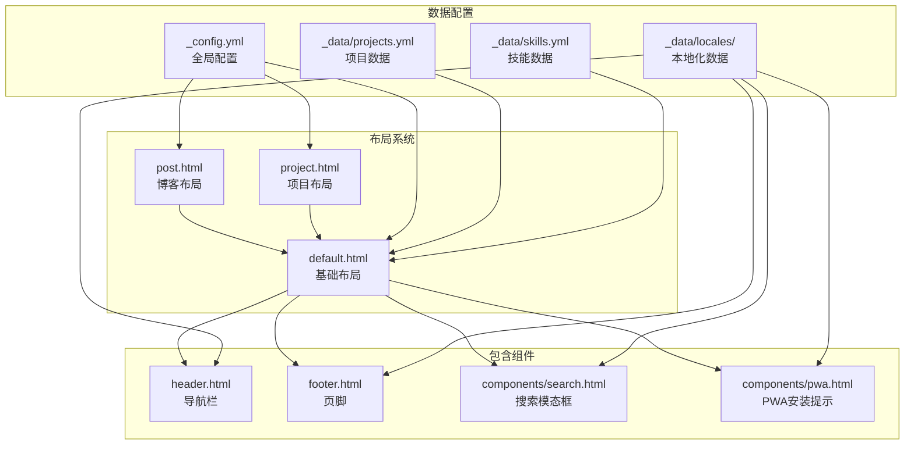

**图表来源**
- [_layouts/default.html:1-152](file://_layouts/default.html#L1-L152)
- [_layouts/post.html:1-328](file://_layouts/post.html#L1-L328)
- [_layouts/project.html:1-472](file://_layouts/project.html#L1-L472)
- [_config.yml:1-133](file://_config.yml#L1-L133)

**章节来源**
- [_layouts/default.html:1-152](file://_layouts/default.html#L1-L152)
- [_config.yml:1-133](file://_config.yml#L1-L133)

## 核心组件

### 布局继承体系

系统采用经典的模板继承模式，通过 YAML front matter 中的 `layout` 字段建立继承关系：

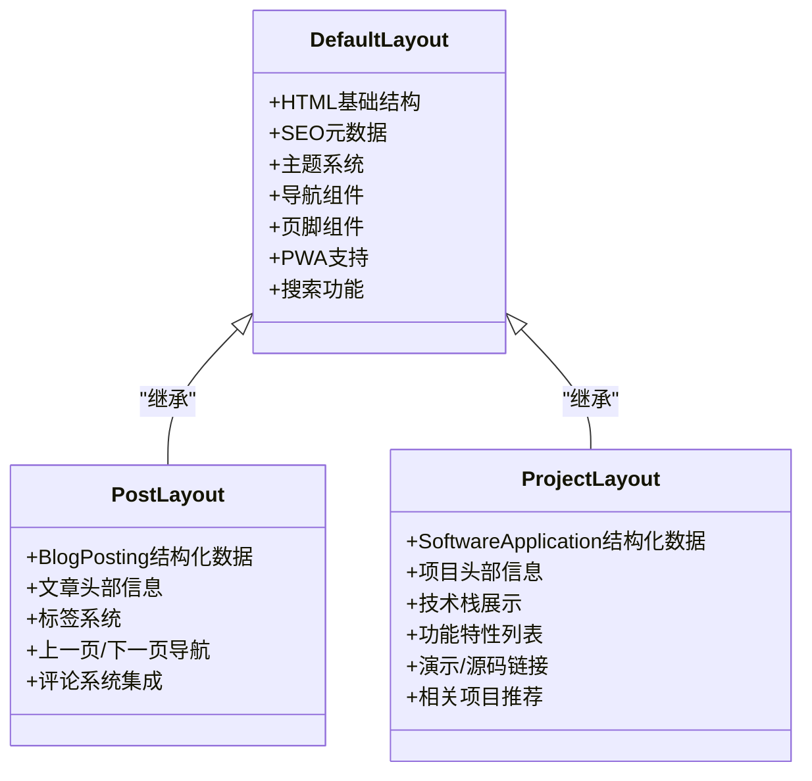

**图表来源**
- [_layouts/default.html:1-152](file://_layouts/default.html#L1-L152)
- [_layouts/post.html:1-328](file://_layouts/post.html#L1-L328)
- [_layouts/project.html:1-472](file://_layouts/project.html#L1-L472)

### 模板变量传递机制

Jekyll 通过 Liquid 模板引擎实现变量传递，主要分为三类：

1. **页面特定变量**：来自 YAML front matter 的内容变量
2. **站点全局变量**：来自 _config.yml 的配置信息
3. **数据文件变量**：来自 _data/ 目录的结构化数据

**章节来源**
- [_layouts/default.html:6-11](file://_layouts/default.html#L6-L11)
- [_config.yml:1-133](file://_config.yml#L1-L133)

## 架构概览

系统采用分层架构设计，从底层到上层依次为：数据层、配置层、布局层、组件层。

```mermaid
graph TD
subgraph "数据层"
Posts[_posts/<br/>博客文章]
DataFiles[_data/<br/>配置数据]
Assets[assets/<br/>静态资源]
end
subgraph "配置层"
Config[_config.yml<br/>全局配置]
Gemfile<br/>依赖管理
end
subgraph "布局层"
Default[default.html<br/>基础布局]
Post[post.html<br/>博客布局]
Project[project.html<br/>项目布局]
end
subgraph "组件层"
Header[header.html<br/>导航组件]
Footer[footer.html<br/>页脚组件]
Search[components/search.html<br/>搜索组件]
PWA[components/pwa.html<br/>PWA组件]
end
Posts --> Post
DataFiles --> Default
Config --> Default
Gemfile --> Config
Default --> Header
Default --> Footer
Default --> Search
Default --> PWA
Post --> Default
Project --> Default
```

**图表来源**
- [_config.yml:1-133](file://_config.yml#L1-L133)
- [_layouts/default.html:1-152](file://_layouts/default.html#L1-L152)
- [_layouts/post.html:1-328](file://_layouts/post.html#L1-L328)
- [_layouts/project.html:1-472](file://_layouts/project.html#L1-L472)

## 详细组件分析

### default.html 基础布局

default.html 作为系统的核心基础布局，承担着以下职责：

#### SEO 优化实现

系统实现了完整的 SEO 优化策略，包括结构化数据、Open Graph、Twitter Card 等：

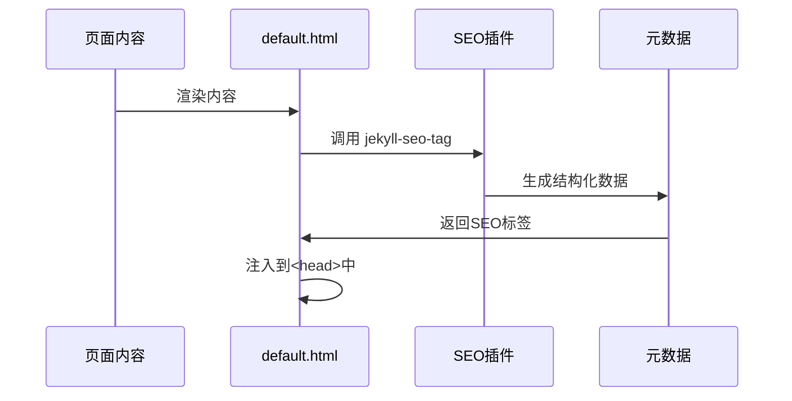

**图表来源**
- [_layouts/default.html:12-48](file://_layouts/default.html#L12-L48)

#### 主题系统架构

系统采用 CSS 自定义属性 + data-theme 属性的双层主题控制机制：

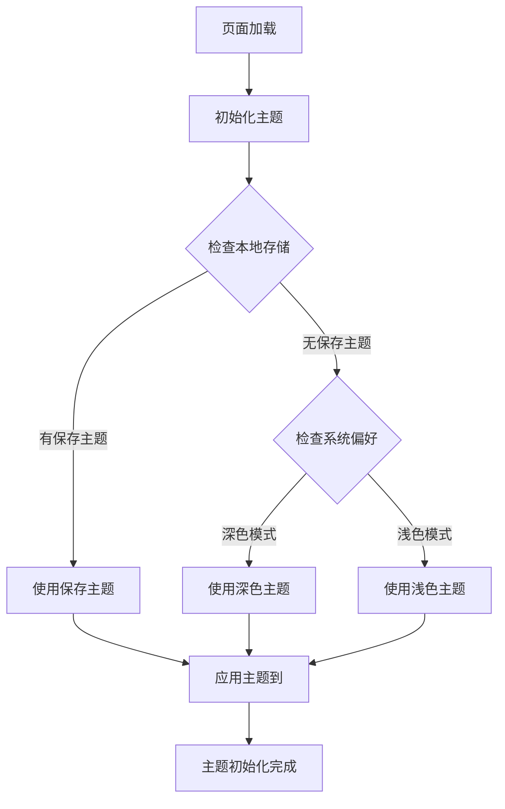

**图表来源**
- [_layouts/default.html:60-67](file://_layouts/default.html#L60-L67)

#### 国际化支持

系统通过 _data/locales 目录实现多语言支持，支持简体中文和英文两种语言环境。

**章节来源**
- [_layouts/default.html:1-152](file://_layouts/default.html#L1-L152)
- [_data/locales/en.yml:1-166](file://_data/locales/en.yml#L1-L166)

### post.html 博客布局

post.html 专门用于博客文章的展示，实现了丰富的文章阅读体验。

#### 结构化数据集成

系统为博客文章添加了完整的 Schema.org 结构化数据：

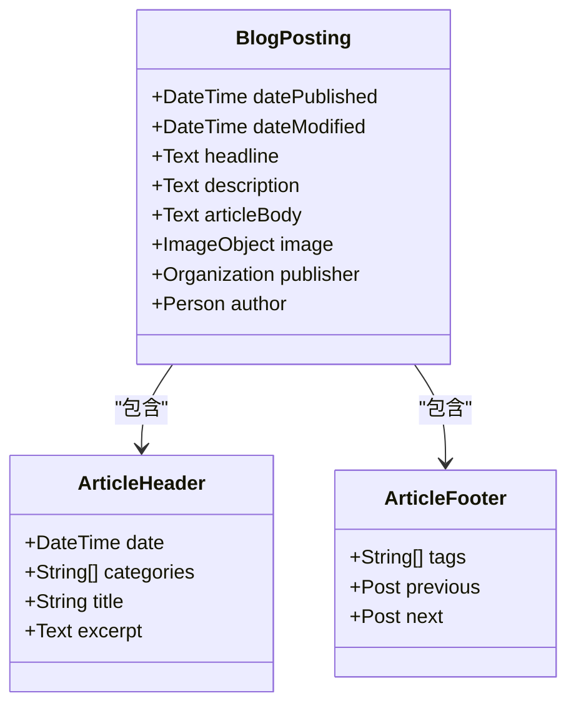

**图表来源**
- [_layouts/post.html:5-67](file://_layouts/post.html#L5-L67)

#### 评论系统集成

系统集成了 Giscus 评论系统，实现了与主题切换的同步：

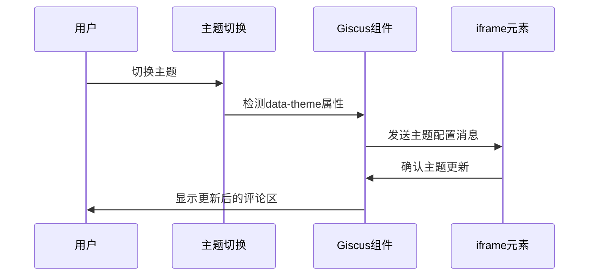

**图表来源**
- [_layouts/post.html:281-327](file://_layouts/post.html#L281-L327)

**章节来源**
- [_layouts/post.html:1-328](file://_layouts/post.html#L1-L328)

### project.html 项目布局

project.html 专为项目展示设计，提供了完整的项目信息展示框架。

#### 响应式网格系统

系统采用了基于 CSS Grid 的响应式布局设计：

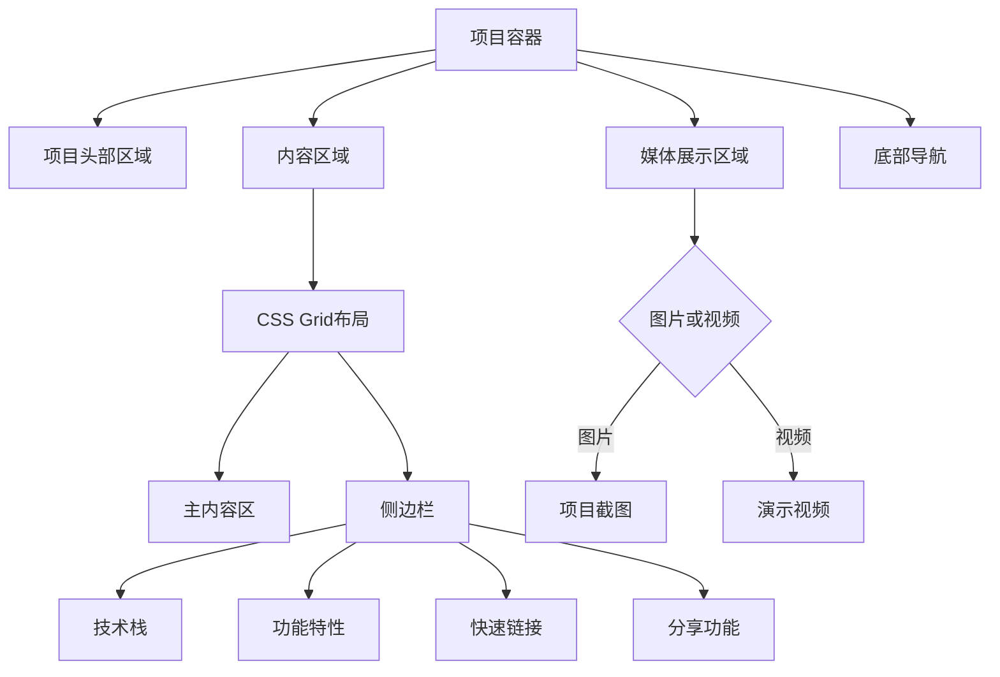

**图表来源**
- [_layouts/project.html:80-174](file://_layouts/project.html#L80-L174)

#### 相关项目推荐

系统实现了智能的相关项目推荐功能，基于 YAML front matter 中的 `related_projects` 字段：

**章节来源**
- [_layouts/project.html:1-472](file://_layouts/project.html#L1-L472)

### 组件系统分析

#### 搜索组件

搜索组件提供了全文搜索功能，支持键盘快捷键操作：

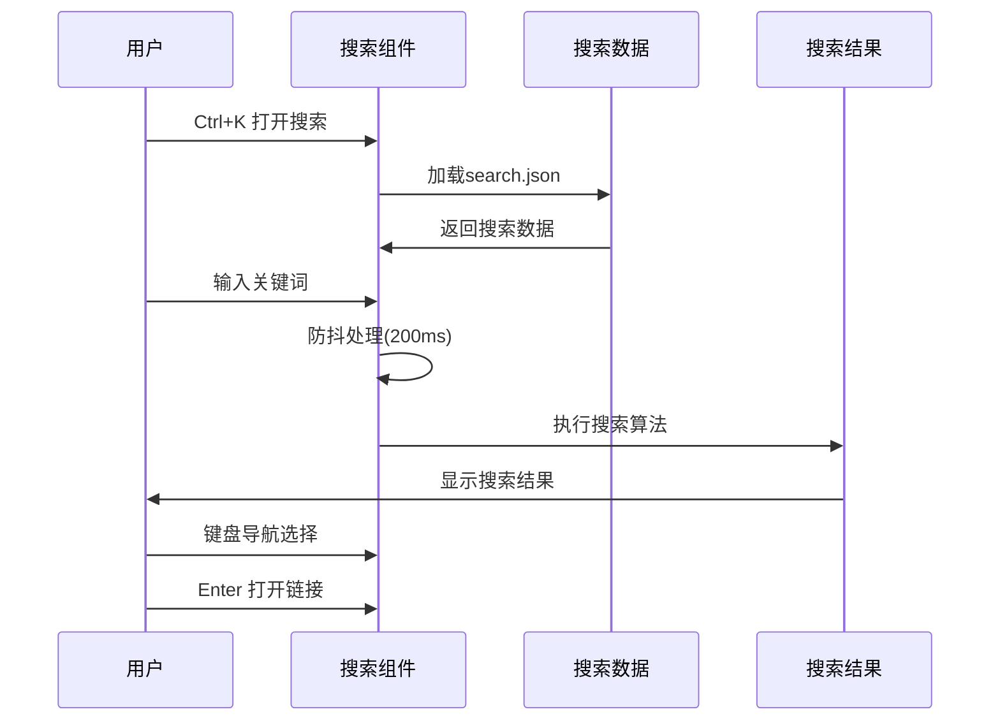

**图表来源**
- [_includes/components/search.html:253-335](file://_includes/components/search.html#L253-L335)

#### PWA 组件

PWA 组件实现了渐进式 Web 应用的核心功能：

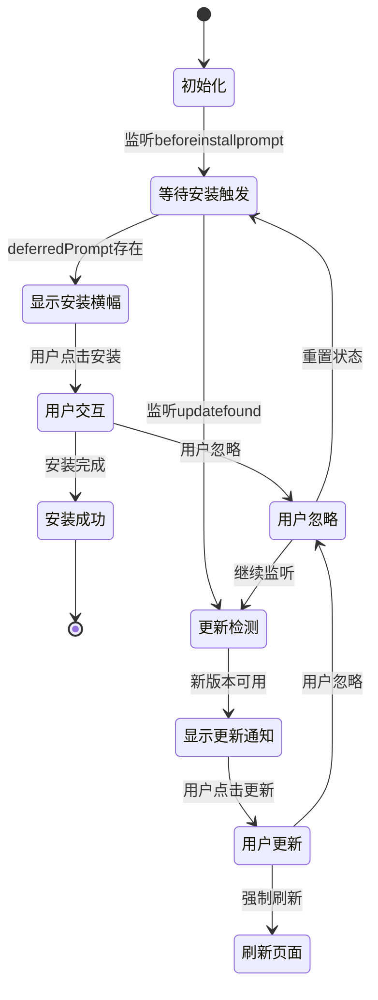

**图表来源**
- [_includes/components/pwa.html:95-184](file://_includes/components/pwa.html#L95-L184)

**章节来源**
- [_includes/components/search.html:1-336](file://_includes/components/search.html#L1-L336)
- [_includes/components/pwa.html:1-192](file://_includes/components/pwa.html#L1-L192)

## 依赖分析

### Jekyll 插件生态系统

系统使用了多个官方推荐的 Jekyll 插件来增强功能：

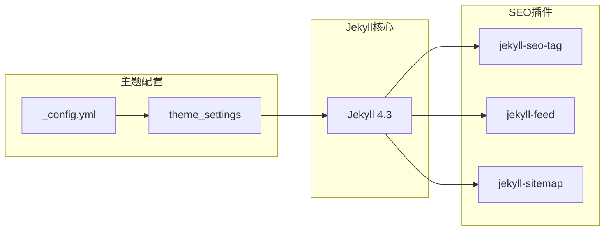

**图表来源**
- [Gemfile:1-12](file://Gemfile#L1-L12)
- [_config.yml:109-114](file://_config.yml#L109-L114)

### 数据依赖关系

系统通过 _data 目录实现松耦合的数据管理：

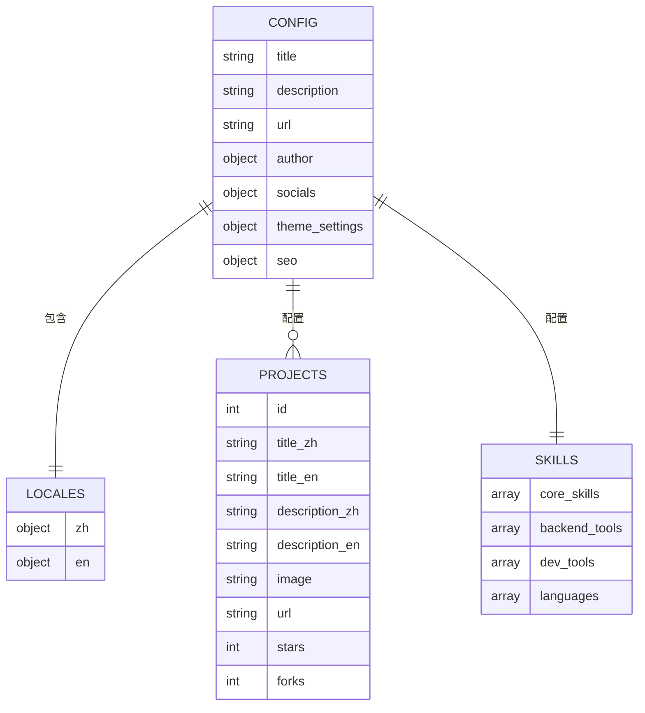

**图表来源**
- [_config.yml:1-133](file://_config.yml#L1-L133)
- [_data/projects.yml:1-45](file://_data/projects.yml#L1-L45)
- [_data/skills.yml:1-41](file://_data/skills.yml#L1-L41)

**章节来源**
- [Gemfile:1-12](file://Gemfile#L1-L12)
- [_config.yml:1-133](file://_config.yml#L1-L133)

## 性能考虑

### 主题切换优化

系统实现了无闪烁的主题切换机制，通过 JavaScript 在页面加载时检测和应用主题：

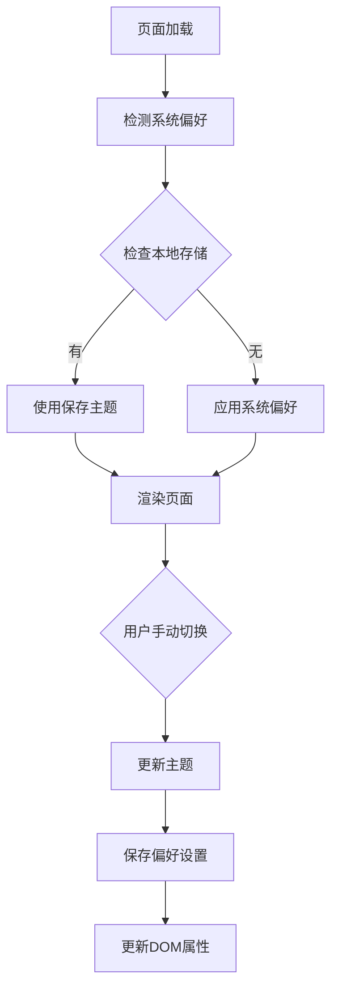

**图表来源**
- [_layouts/default.html:60-67](file://_layouts/default.html#L60-L67)

### 资源预加载策略

系统采用了多种资源优化策略：

1. **DNS 预解析**：对 CDN 服务器进行 DNS 预解析
2. **字体图标优化**：使用 CDN 托管 Font Awesome
3. **延迟加载**：JavaScript 资源使用 defer 属性
4. **PWA 缓存**：Service Worker 实现离线缓存

**章节来源**
- [_layouts/default.html:50-90](file://_layouts/default.html#L50-L90)

## 故障排除指南

### 常见问题诊断

#### SEO 标签未正确生成

**症状**：社交媒体分享时缺少预览图或描述

**排查步骤**：
1. 检查 _config.yml 中的 SEO 配置
2. 验证页面 YAML front matter 中的元数据
3. 确认 jekyll-seo-tag 插件已正确安装

#### 主题切换失效

**症状**：切换主题后页面颜色未改变

**排查步骤**：
1. 检查浏览器控制台是否有 JavaScript 错误
2. 验证 data-theme 属性是否正确设置
3. 确认 CSS 自定义属性定义完整

#### 搜索功能异常

**症状**：搜索框无法打开或搜索结果为空

**排查步骤**：
1. 检查 search.json 文件是否生成
2. 验证搜索组件的 JavaScript 代码
3. 确认键盘快捷键事件绑定正常

**章节来源**
- [_includes/components/search.html:253-335](file://_includes/components/search.html#L253-L335)
- [_includes/components/pwa.html:95-184](file://_includes/components/pwa.html#L95-L184)

## 结论

halfism.github.io 的布局模板系统展现了现代静态站点生成的最佳实践。通过精心设计的模板继承体系、完善的 SEO 优化、响应式的主题系统和丰富的组件生态，该系统为开发者提供了一个可扩展、可维护的前端架构。

系统的成功关键在于：
- **清晰的层次结构**：基础布局与专用布局的明确分工
- **数据驱动的设计**：通过配置文件和数据文件实现内容管理
- **用户体验优先**：从无障碍访问到 PWA 支持的全方位优化
- **国际化支持**：完整的多语言内容管理机制

## 附录

### 最佳实践指南

#### 自定义开发建议

1. **遵循模板继承原则**：新布局应继承 default.html，避免重复代码
2. **合理使用数据文件**：将可复用的配置信息放入 _data 目录
3. **保持 SEO 一致性**：确保每个页面都有适当的元数据
4. **测试多语言支持**：在新增功能时考虑国际化需求

#### 性能优化建议

1. **懒加载策略**：对非关键资源使用懒加载
2. **缓存策略**：合理设置 HTTP 缓存头
3. **资源压缩**：确保 CSS 和 JavaScript 经过压缩
4. **CDN 优化**：使用 CDN 托管静态资源

#### 安全考虑

1. **输入验证**：对用户输入的内容进行验证和清理
2. **XSS 防护**：确保动态内容的安全性
3. **CSP 策略**：实施内容安全策略
4. **HTTPS 强制**：确保所有资源通过 HTTPS 加载