# 组件交互模式

<cite>
**本文档引用的文件**
- [main.js](file://assets/js/main.js)
- [search.html](file://_includes/components/search.html)
- [pwa.html](file://_includes/components/pwa.html)
- [default.html](file://_layouts/default.html)
- [sw.js](file://sw.js)
- [style.css](file://assets/css/style.css)
- [header.html](file://_includes/header.html)
- [en.yml](file://_data/locales/en.yml)
- [manifest.json](file://manifest.json)
- [search.json](file://search.json)
- [offline.html](file://offline.html)
</cite>

## 目录
1. [简介](#简介)
2. [项目结构概览](#项目结构概览)
3. [核心组件架构](#核心组件架构)
4. [主题管理系统](#主题管理系统)
5. [搜索组件交互](#搜索组件交互)
6. [PWA 组件交互](#pwa-组件交互)
7. [导航组件集成](#导航组件集成)
8. [组件生命周期管理](#组件生命周期管理)
9. [JavaScript 与 Jekyll 协作机制](#javascript-与-jekyll-协作机制)
10. [性能优化策略](#性能优化策略)
11. [用户体验设计原则](#用户体验设计原则)
12. [故障排除指南](#故障排除指南)
13. [总结](#总结)

## 简介

halfism.github.io 是一个基于 Jekyll 构建的个人作品集网站，采用现代化的前端架构设计。该项目展示了静态网站中组件间交互的最佳实践，包括导航组件、搜索组件、主题切换组件和 PWA 组件的协同工作机制。

该网站采用了模块化的设计模式，通过独立的组件实现特定功能，同时保持组件间的松耦合和高内聚。项目的核心特点是：

- **响应式设计**：支持桌面端和移动端的完整体验
- **主题系统**：支持明暗主题切换，自动跟随系统偏好
- **离线支持**：完整的 PWA 功能，支持离线浏览
- **高性能**：优化的 JavaScript 和 CSS 架构
- **无障碍访问**：完整的 ARIA 支持和键盘导航

## 项目结构概览

项目采用 Jekyll 的标准目录结构，结合自定义的组件化设计：

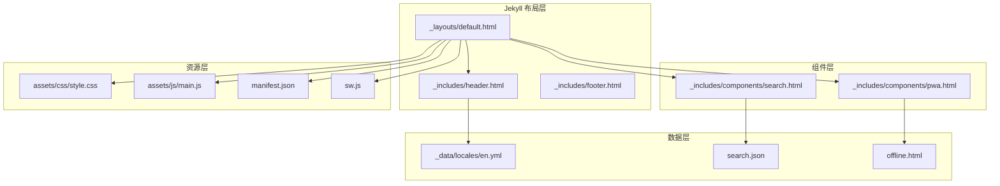

**图表来源**
- [default.html:1-152](file://_layouts/default.html#L1-L152)
- [header.html:1-116](file://_includes/header.html#L1-L116)
- [search.html:1-336](file://_includes/components/search.html#L1-L336)
- [pwa.html:1-192](file://_includes/components/pwa.html#L1-L192)

**章节来源**
- [default.html:1-152](file://_layouts/default.html#L1-L152)
- [header.html:1-116](file://_includes/header.html#L1-L116)

## 核心组件架构

项目的核心架构基于模块化设计，每个组件都有明确的职责边界和清晰的接口定义。

### 组件分类

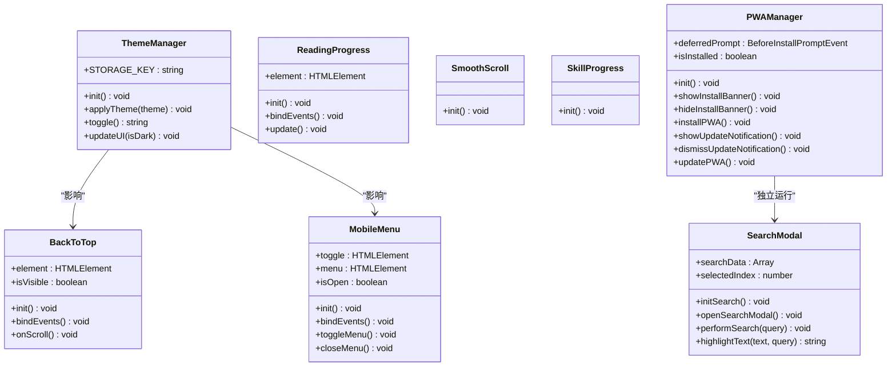

**图表来源**
- [main.js:27-75](file://assets/js/main.js#L27-L75)
- [main.js:80-116](file://assets/js/main.js#L80-L116)
- [main.js:121-142](file://assets/js/main.js#L121-L142)
- [main.js:170-207](file://assets/js/main.js#L170-L207)
- [main.js:212-230](file://assets/js/main.js#L212-L230)
- [main.js:235-253](file://assets/js/main.js#L235-L253)
- [pwa.html:95-184](file://_includes/components/pwa.html#L95-L184)
- [search.html:245-335](file://_includes/components/search.html#L245-L335)

### 初始化流程

组件按照特定的顺序进行初始化，确保依赖关系正确建立：

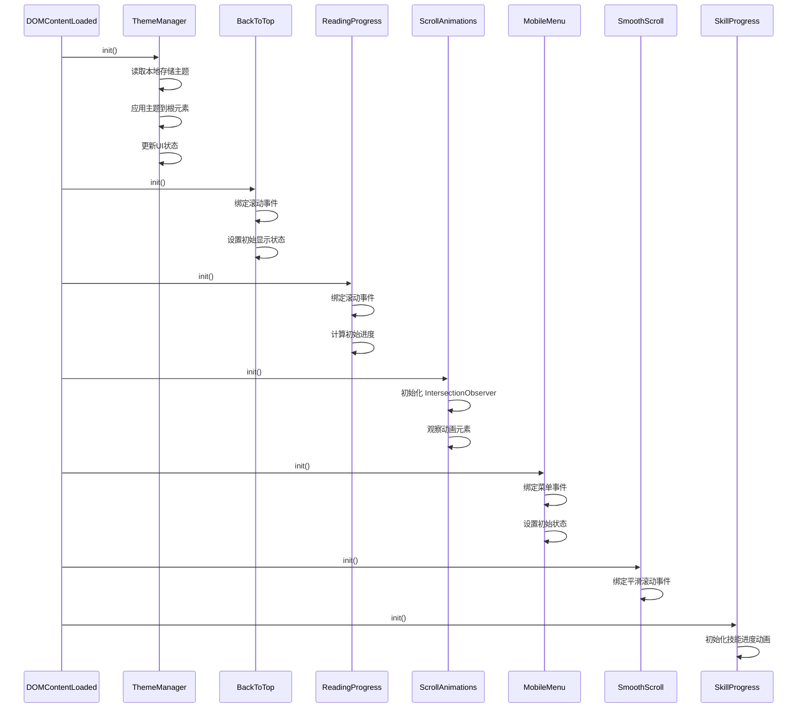

**图表来源**
- [main.js:263-277](file://assets/js/main.js#L263-L277)
- [main.js:27-75](file://assets/js/main.js#L27-L75)
- [main.js:80-116](file://assets/js/main.js#L80-L116)
- [main.js:121-142](file://assets/js/main.js#L121-L142)
- [main.js:147-165](file://assets/js/main.js#L147-L165)
- [main.js:170-207](file://assets/js/main.js#L170-L207)
- [main.js:212-230](file://assets/js/main.js#L212-L230)
- [main.js:235-253](file://assets/js/main.js#L235-L253)

**章节来源**
- [main.js:1-279](file://assets/js/main.js#L1-L279)

## 主题管理系统

主题管理系统是整个网站的核心交互组件之一，负责维护明暗主题状态并在用户界面中同步更新。

### 设计模式

主题系统采用了单例模式和观察者模式的组合：

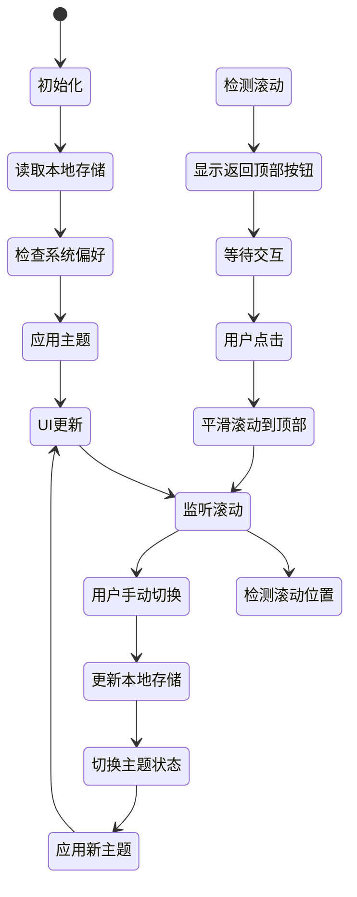

**图表来源**
- [main.js:27-75](file://assets/js/main.js#L27-L75)
- [main.js:80-116](file://assets/js/main.js#L80-L116)

### 主题切换机制

主题切换通过以下步骤实现：

1. **状态检测**：检查本地存储中的主题设置，如果不存在则使用系统偏好
2. **应用主题**：将主题值设置到 `data-theme` 属性上
3. **UI同步**：更新所有相关的 UI 元素状态
4. **持久化**：将新的主题设置保存到本地存储

### 无障碍支持

主题系统完全支持无障碍访问：

- 使用 `aria-pressed` 属性指示按钮状态
- 提供键盘导航支持
- 支持屏幕阅读器识别
- 自动跟随系统主题偏好

**章节来源**
- [main.js:27-75](file://assets/js/main.js#L27-L75)
- [style.css:107-145](file://assets/css/style.css#L107-L145)
- [header.html:58-64](file://_includes/header.html#L58-L64)

## 搜索组件交互

搜索组件提供了全文搜索功能，支持实时搜索建议和键盘导航。

### 搜索架构

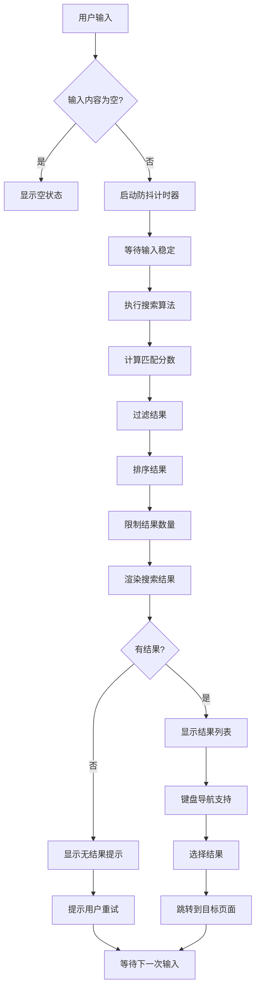

**图表来源**
- [search.html:295-314](file://_includes/components/search.html#L295-L314)
- [search.html:253-279](file://_includes/components/search.html#L253-L279)

### 搜索算法

搜索算法采用多字段匹配和加权评分机制：

1. **标题匹配**：权重 10 分
2. **标签匹配**：权重 5 分  
3. **摘要匹配**：权重 3 分
4. **内容匹配**：权重 1 分

### 实时搜索优化

- **防抖机制**：输入延迟 200ms 执行搜索
- **结果缓存**：避免重复请求相同查询
- **高亮显示**：使用标记元素突出显示匹配文本
- **键盘导航**：支持上下箭头键和回车键操作

### 国际化支持

搜索组件完全支持多语言：

- 使用 Jekyll 数据文件提供本地化文本
- 支持中英文界面切换
- 动态加载相应的搜索提示文本

**章节来源**
- [search.html:1-336](file://_includes/components/search.html#L1-L336)
- [search.json:1-19](file://search.json#L1-L19)
- [en.yml:101-109](file://_data/locales/en.yml#L101-L109)

## PWA 组件交互

PWA 组件实现了完整的渐进式 Web 应用功能，包括安装提示、更新通知和离线支持。

### PWA 生命周期

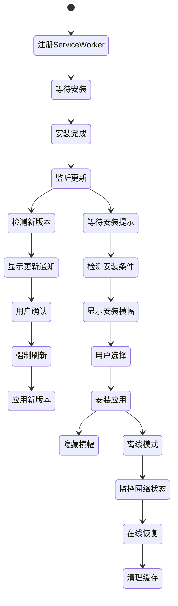

**图表来源**
- [pwa.html:95-184](file://_includes/components/pwa.html#L95-L184)
- [sw.js:28-81](file://sw.js#L28-L81)

### 缓存策略

PWA 采用了多种缓存策略以优化性能：

1. **预缓存策略**：安装时缓存关键资源
2. **网络优先策略**：HTML 页面优先从网络获取
3. **缓存优先策略**：静态资源优先从缓存获取
4. **外部资源缓存**：CDN 资源离线可用

### Service Worker 功能

Service Worker 实现了以下核心功能：

- **资源缓存**：智能缓存策略管理
- **离线页面**：提供优雅的离线体验
- **更新通知**：及时通知用户新版本
- **消息传递**：与主线程通信协调

**章节来源**
- [pwa.html:1-192](file://_includes/components/pwa.html#L1-L192)
- [sw.js:1-237](file://sw.js#L1-L237)
- [manifest.json:1-79](file://manifest.json#L1-L79)
- [offline.html:1-82](file://offline.html#L1-L82)

## 导航组件集成

导航组件作为网站的主要交互入口，集成了多个子组件并提供统一的用户体验。

### 导航架构

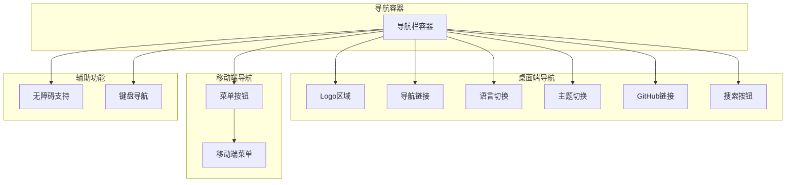

**图表来源**
- [header.html:1-116](file://_includes/header.html#L1-L116)

### 移动端适配

导航组件针对移动端进行了专门优化：

- **汉堡菜单**：在小屏幕上折叠为汉堡菜单
- **触摸友好的按钮**：确保足够的点击区域
- **滑动关闭**：支持手势操作
- **响应式布局**：根据屏幕尺寸调整布局

### 平滑滚动集成

导航组件与平滑滚动功能深度集成：

- **锚点链接**：支持页面内平滑滚动
- **偏移调整**：考虑导航栏高度的偏移
- **菜单关闭**：自动关闭移动端菜单
- **滚动监听**：实时更新活动状态

**章节来源**
- [header.html:1-116](file://_includes/header.html#L1-L116)
- [main.js:212-230](file://assets/js/main.js#L212-L230)

## 组件生命周期管理

项目中的每个组件都遵循明确的生命周期管理规范，确保资源的有效利用和内存安全。

### 组件生命周期阶段

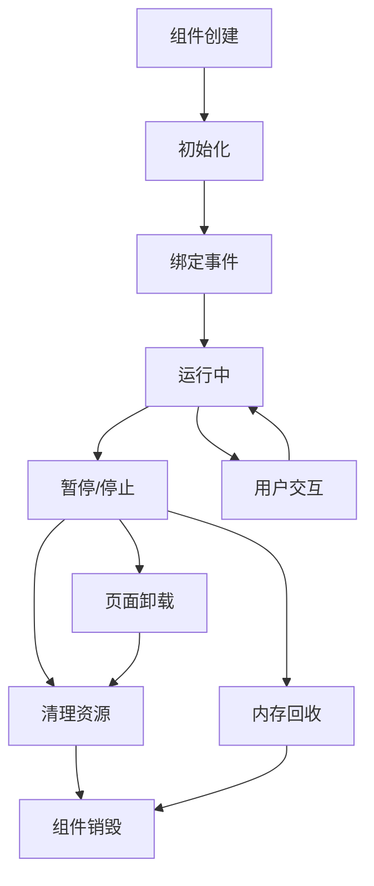

### 事件绑定与解绑

每个组件都实现了完整的事件管理：

- **事件绑定**：在初始化时绑定必要的事件监听器
- **事件解绑**：在组件销毁时移除所有事件监听器
- **内存泄漏防护**：防止循环引用导致的内存泄漏
- **性能监控**：监控事件处理的性能表现

### 资源管理

组件资源管理包括：

- **DOM 元素引用**：缓存常用的 DOM 元素引用
- **定时器管理**：正确清理定时器和动画帧
- **网络请求**：取消未完成的网络请求
- **订阅管理**：解除事件订阅和观察者

**章节来源**
- [main.js:1-279](file://assets/js/main.js#L1-L279)

## JavaScript 与 Jekyll 协作机制

JavaScript 与 Jekyll 的协作体现了现代静态站点生成器的最佳实践，实现了动态功能与静态内容的完美结合。

### 数据流架构

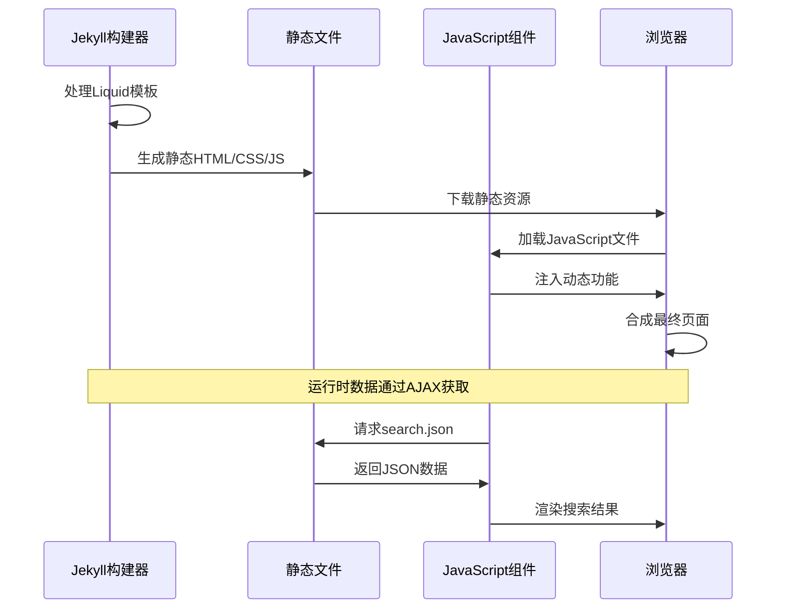

**图表来源**
- [default.html:145-149](file://_layouts/default.html#L145-L149)
- [search.html:253-258](file://_includes/components/search.html#L253-L258)
- [search.json:1-19](file://search.json#L1-L19)

### 动态内容注入

JavaScript 通过以下方式与 Jekyll 协作：

1. **模板变量**：使用 Liquid 模板变量提供静态数据
2. **API 接口**：通过 JSON 文件提供动态内容
3. **事件驱动**：通过事件系统协调组件交互
4. **状态管理**：通过本地存储维护用户偏好

### 性能优化策略

- **延迟加载**：非关键脚本延迟执行
- **按需加载**：根据需要加载特定功能
- **缓存策略**：合理利用浏览器缓存
- **压缩优化**：生产环境下的资源压缩

**章节来源**
- [default.html:1-152](file://_layouts/default.html#L1-L152)
- [search.html:245-335](file://_includes/components/search.html#L245-L335)
- [search.json:1-19](file://search.json#L1-L19)

## 性能优化策略

项目实施了多层次的性能优化策略，确保在各种设备和网络条件下都能提供优秀的用户体验。

### JavaScript 性能优化

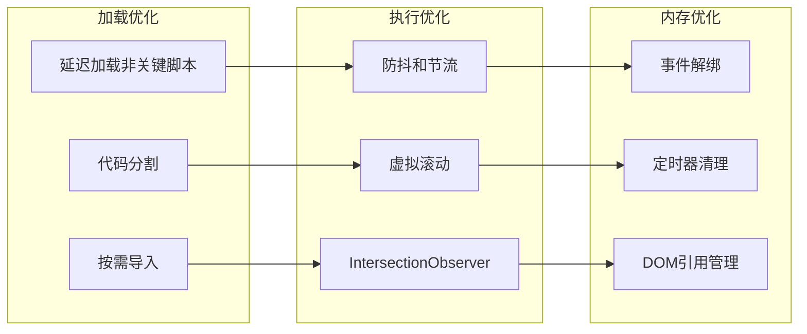

### 缓存策略

项目采用了多层次的缓存策略：

1. **浏览器缓存**：静态资源长期缓存
2. **Service Worker 缓存**：智能离线缓存
3. **内存缓存**：搜索结果和用户状态
4. **CDN 缓存**：外部资源加速

### 网络优化

- **资源预加载**：关键资源提前加载
- **连接复用**：HTTP/2 连接池
- **压缩传输**：Gzip/Brotli 压缩
- **图片优化**：响应式图片和格式转换

**章节来源**
- [sw.js:83-114](file://sw.js#L83-L114)
- [style.css:1-200](file://assets/css/style.css#L1-L200)

## 用户体验设计原则

项目严格遵循用户体验设计的最佳实践，确保在各种使用场景下都能提供优质的用户体验。

### 无障碍访问支持

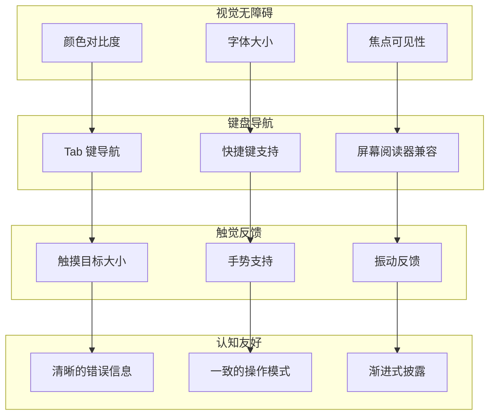

### 响应式设计

项目实现了完整的响应式设计：

- **移动优先**：从小屏幕开始设计
- **弹性布局**：使用 CSS Grid 和 Flexbox
- **媒体查询**：针对不同断点优化
- **触摸友好的交互**：适合移动设备使用

### 性能感知设计

- **即时反馈**：用户操作立即得到响应
- **进度指示**：长时间操作显示进度
- **错误恢复**：失败时提供恢复选项
- **离线支持**：网络不佳时仍可使用

**章节来源**
- [header.html:1-116](file://_includes/header.html#L1-L116)
- [style.css:177-187](file://assets/css/style.css#L177-L187)

## 故障排除指南

### 常见问题诊断

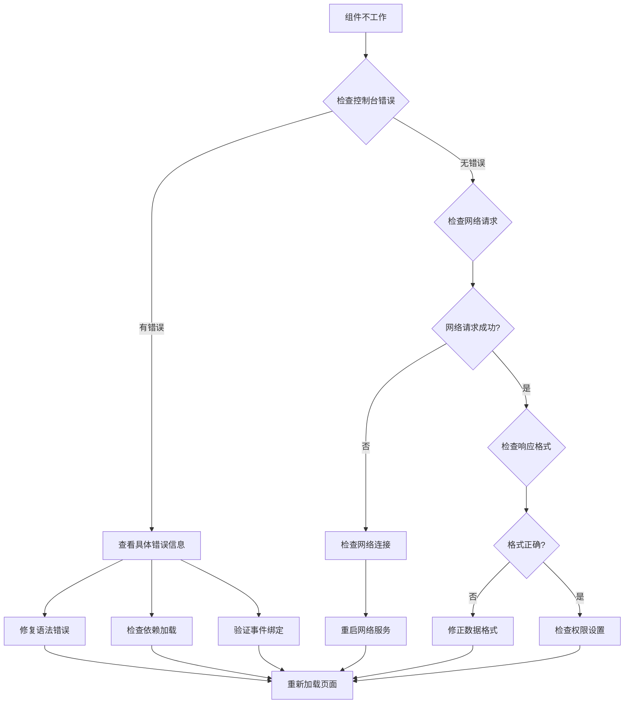

### 调试工具使用

- **浏览器开发者工具**：检查网络、控制台和性能
- **Service Worker 调试**：监控缓存和更新状态
- **性能分析**：使用 Performance 面板分析瓶颈
- **网络面板**：监控资源加载和缓存命中率

### 最佳实践建议

- **错误边界**：为关键功能添加错误处理
- **日志记录**：记录重要事件和错误信息
- **降级方案**：为不支持的功能提供替代方案
- **监控告警**：设置性能和错误监控

**章节来源**
- [main.js:1-279](file://assets/js/main.js#L1-L279)
- [sw.js:1-237](file://sw.js#L1-L237)

## 总结

halfism.github.io 项目展示了现代静态网站开发的最佳实践，通过精心设计的组件交互模式实现了优秀的用户体验和性能表现。

### 核心成就

- **模块化架构**：清晰的组件分离和职责划分
- **性能优化**：多层次的性能优化策略
- **用户体验**：完整的无障碍访问和响应式设计
- **技术整合**：JavaScript 与 Jekyll 的完美协作

### 技术亮点

- **主题系统**：智能的主题切换和持久化
- **搜索功能**：高效的全文搜索和实时建议
- **PWA 支持**：完整的离线和安装功能
- **导航优化**：流畅的平滑滚动和响应式设计

### 未来发展方向

- **性能监控**：集成更完善的性能监控系统
- **功能扩展**：添加更多交互式功能
- **测试覆盖**：增加自动化测试覆盖率
- **文档完善**：补充详细的开发文档

这个项目为静态网站开发提供了宝贵的参考案例，展示了如何在保持静态特性的同时实现丰富的交互功能。