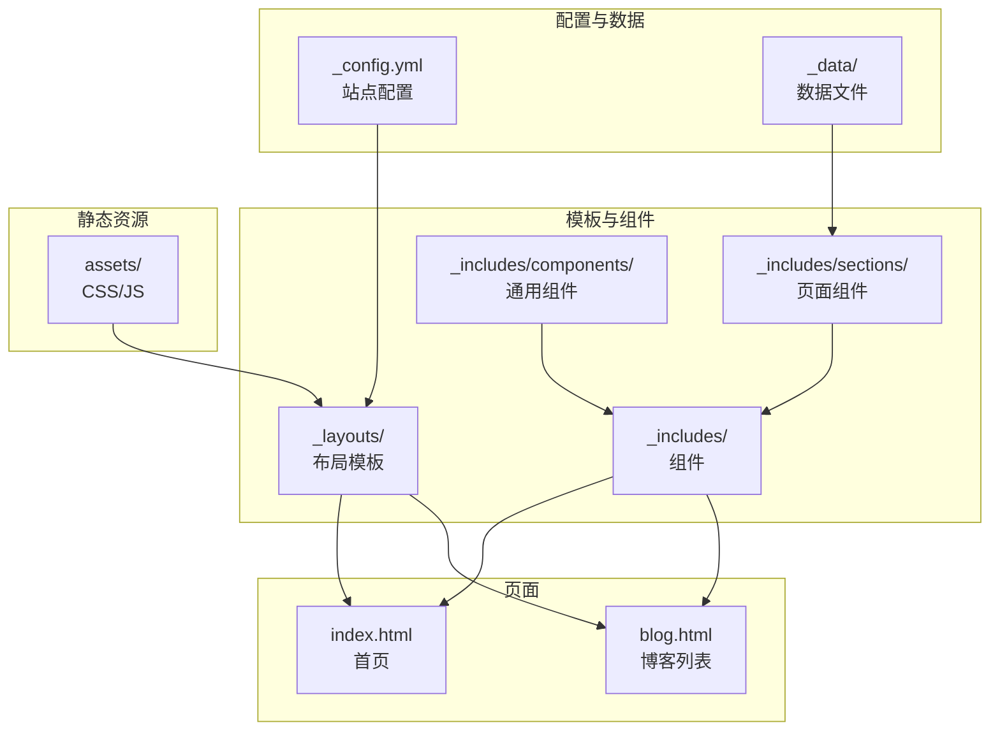
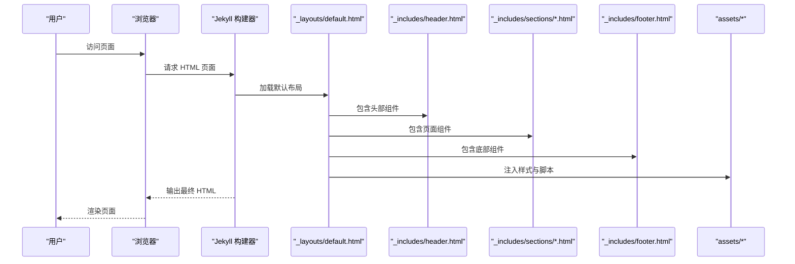
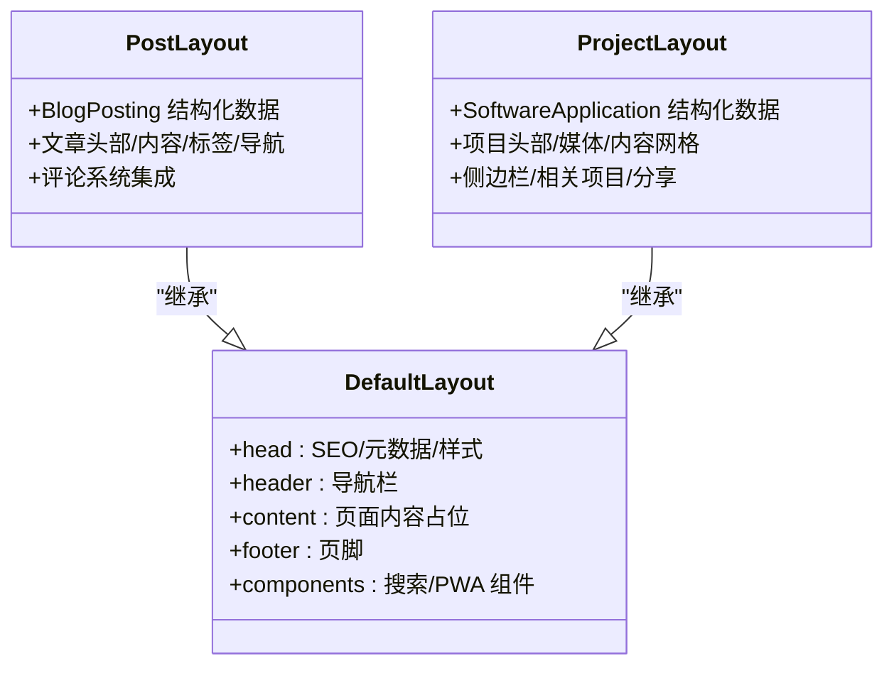
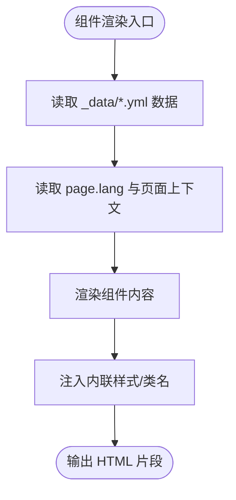
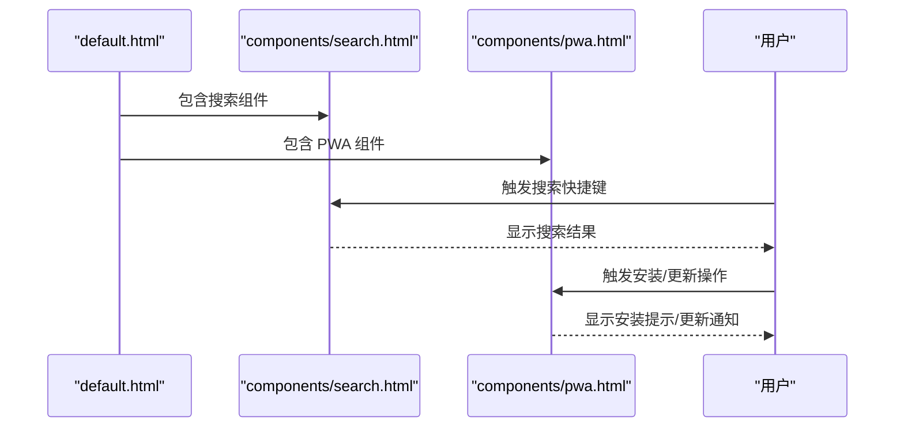
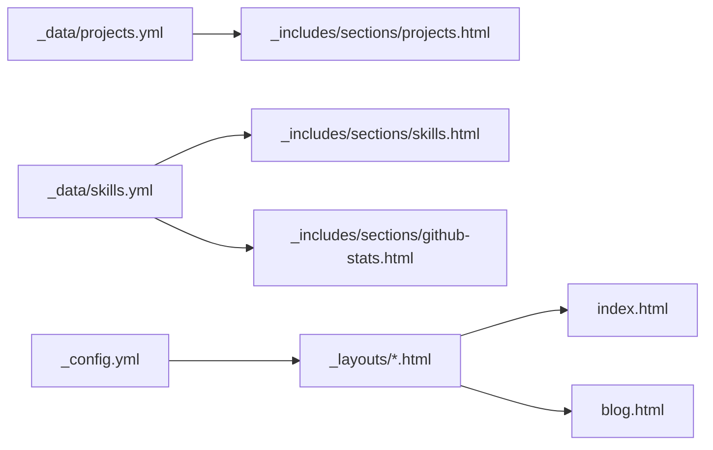
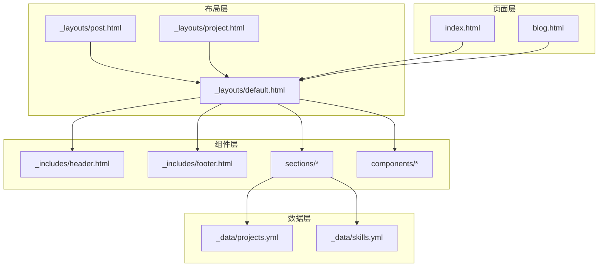

# 组件化架构设计

<cite>
**本文档引用的文件**
- [_config.yml](file://_config.yml)
- [README.md](file://README.md)
- [index.html](file://index.html)
- [blog.html](file://blog.html)
- [_layouts/default.html](file://_layouts/default.html)
- [_layouts/post.html](file://_layouts/post.html)
- [_layouts/project.html](file://_layouts/project.html)
- [_includes/header.html](file://_includes/header.html)
- [_includes/footer.html](file://_includes/footer.html)
- [_includes/sections/hero.html](file://_includes/sections/hero.html)
- [_includes/sections/about.html](file://_includes/sections/about.html)
- [_includes/sections/projects.html](file://_includes/sections/projects.html)
- [_includes/sections/skills.html](file://_includes/sections/skills.html)
- [_includes/sections/logs.html](file://_includes/sections/logs.html)
- [_includes/sections/github-stats.html](file://_includes/sections/github-stats.html)
- [_includes/sections/certificates.html](file://_includes/sections/certificates.html)
- [_includes/sections/contact.html](file://_includes/sections/contact.html)
- [_includes/components/search.html](file://_includes/components/search.html)
- [_includes/components/pwa.html](file://_includes/components/pwa.html)
- [_data/projects.yml](file://_data/projects.yml)
- [_data/skills.yml](file://_data/skills.yml)
</cite>

## 目录
1. [引言](#引言)
2. [项目结构](#项目结构)
3. [核心组件](#核心组件)
4. [架构概览](#架构概览)
5. [详细组件分析](#详细组件分析)
6. [依赖关系分析](#依赖关系分析)
7. [性能考量](#性能考量)
8. [故障排除指南](#故障排除指南)
9. [结论](#结论)
10. [附录](#附录)

## 引言
本项目基于 Jekyll 构建，采用高度模块化的组件化架构，通过 Jekyll include 系统将页面拆分为可复用的组件，结合数据驱动的 YAML 配置实现内容与展示的解耦。该架构遵循“数据驱动、组件化、渐进增强、性能优先、无障碍”的设计原则，旨在提供现代化、可维护且高性能的个人作品集网站。

## 项目结构
项目采用分层组织方式，核心目录与职责如下：
- _config.yml：站点全局配置，包含主题设置、SEO、评论系统、分析等配置项
- _data/：数据文件目录，存放项目、技能、证书、日志、社交链接等数据
- _includes/：组件目录，包含可复用的页面片段（sections 为页面组件，components 为通用组件）
- _layouts/：布局模板，定义页面骨架与通用结构
- assets/：静态资源（CSS、JS）
- 根目录页面：如 index.html、blog.html 等，通过 front matter 指定布局并组合组件

**图表来源**
- [_config.yml:1-133](file://_config.yml#L1-L133)
- [_layouts/default.html:1-152](file://_layouts/default.html#L1-L152)
- [_includes/header.html:1-116](file://_includes/header.html#L1-L116)
- [_includes/footer.html:1-49](file://_includes/footer.html#L1-L49)

**章节来源**
- [_config.yml:1-133](file://_config.yml#L1-L133)
- [README.md:26-63](file://README.md#L26-L63)

## 核心组件
本项目的核心组件围绕“页面组件”和“通用组件”两大类展开，均通过 Jekyll include 机制在页面中组合使用。页面组件负责承载具体业务内容，通用组件提供跨页面的交互能力。

- 页面组件（_includes/sections/）
  - hero：首页头部区域，包含欢迎语、个人介绍与行动按钮
  - about：关于我区域，展示个人背景与价值观
  - projects：项目展示区域，基于 _data/projects.yml 数据渲染
  - skills：技能展示区域，包含技能进度条与标签云
  - logs：开发日志时间线，记录项目迭代历程
  - github-stats：GitHub 统计卡片与贡献图
  - certificates：专业认证展示
  - contact：联系与协作区域，提供简历下载与联系方式

- 通用组件（_includes/components/）
  - search：搜索模态框，提供全文检索与快捷键支持
  - pwa：PWA 安装提示与更新通知

这些组件通过统一的布局模板进行装配，并通过 _data 目录下的数据文件实现内容驱动。

**章节来源**
- [_includes/sections/hero.html:1-56](file://_includes/sections/hero.html#L1-L56)
- [_includes/sections/about.html:1-48](file://_includes/sections/about.html#L1-L48)
- [_includes/sections/projects.html:1-50](file://_includes/sections/projects.html#L1-L50)
- [_includes/sections/skills.html:1-61](file://_includes/sections/skills.html#L1-L61)
- [_includes/sections/logs.html:1-41](file://_includes/sections/logs.html#L1-L41)
- [_includes/sections/github-stats.html:1-75](file://_includes/sections/github-stats.html#L1-L75)
- [_includes/sections/certificates.html:1-33](file://_includes/sections/certificates.html#L1-L33)
- [_includes/sections/contact.html:1-39](file://_includes/sections/contact.html#L1-L39)
- [_includes/components/search.html:1-336](file://_includes/components/search.html#L1-L336)
- [_includes/components/pwa.html:1-192](file://_includes/components/pwa.html#L1-L192)

## 架构概览
Jekyll 的 include 系统是组件化架构的核心。页面通过 front matter 指定布局，布局模板中注入通用头部、内容区与尾部，再由页面调用 include 将各组件拼装成完整页面。数据通过 _data 目录中的 YAML 文件提供，实现内容与展示的解耦。

**图表来源**
- [_layouts/default.html:127-132](file://_layouts/default.html#L127-L132)
- [_includes/header.html:1-116](file://_includes/header.html#L1-L116)
- [_includes/footer.html:1-49](file://_includes/footer.html#L1-L49)

**章节来源**
- [_layouts/default.html:1-152](file://_layouts/default.html#L1-L152)
- [index.html:7-16](file://index.html#L7-L16)

## 详细组件分析

### 布局系统（_layouts/）
布局系统采用继承模式，default.html 提供通用骨架，post.html 与 project.html 通过 front matter 指定继承 default.html 并扩展特定内容。

**图表来源**
- [_layouts/default.html:1-152](file://_layouts/default.html#L1-L152)
- [_layouts/post.html:1-328](file://_layouts/post.html#L1-L328)
- [_layouts/project.html:1-472](file://_layouts/project.html#L1-L472)

**章节来源**
- [_layouts/default.html:1-152](file://_layouts/default.html#L1-L152)
- [_layouts/post.html:1-328](file://_layouts/post.html#L1-L328)
- [_layouts/project.html:1-472](file://_layouts/project.html#L1-L472)

### 页面组件（_includes/sections/）
页面组件通过 Jekyll 模板语法访问站点数据与页面上下文，实现多语言支持与动态内容渲染。

**图表来源**
- [_includes/sections/projects.html:14-46](file://_includes/sections/projects.html#L14-L46)
- [_includes/sections/skills.html:18-29](file://_includes/sections/skills.html#L18-L29)
- [_includes/sections/logs.html:12-36](file://_includes/sections/logs.html#L12-L36)

**章节来源**
- [_includes/sections/hero.html:1-56](file://_includes/sections/hero.html#L1-L56)
- [_includes/sections/about.html:1-48](file://_includes/sections/about.html#L1-L48)
- [_includes/sections/projects.html:1-50](file://_includes/sections/projects.html#L1-L50)
- [_includes/sections/skills.html:1-61](file://_includes/sections/skills.html#L1-L61)
- [_includes/sections/logs.html:1-41](file://_includes/sections/logs.html#L1-L41)
- [_includes/sections/github-stats.html:1-75](file://_includes/sections/github-stats.html#L1-L75)
- [_includes/sections/certificates.html:1-33](file://_includes/sections/certificates.html#L1-L33)
- [_includes/sections/contact.html:1-39](file://_includes/sections/contact.html#L1-L39)

### 通用组件（_includes/components/）
通用组件提供跨页面的交互能力，通过 include 注入到默认布局中。

**图表来源**
- [_layouts/default.html:145-149](file://_layouts/default.html#L145-L149)
- [_includes/components/search.html:245-335](file://_includes/components/search.html#L245-L335)
- [_includes/components/pwa.html:94-191](file://_includes/components/pwa.html#L94-L191)

**章节来源**
- [_includes/components/search.html:1-336](file://_includes/components/search.html#L1-L336)
- [_includes/components/pwa.html:1-192](file://_includes/components/pwa.html#L1-L192)

### 数据驱动与多语言支持
项目通过 _data 目录的数据文件与页面上下文实现数据驱动与多语言支持。例如：
- _data/projects.yml 提供项目列表数据，用于 projects.html 组件渲染
- _data/skills.yml 提供技能与语言分布数据，用于 skills.html 与 github-stats.html 组件
- 页面通过 page.lang 控制显示语言，组件内部根据语言选择对应字段

**图表来源**
- [_data/projects.yml:1-45](file://_data/projects.yml#L1-L45)
- [_data/skills.yml:1-41](file://_data/skills.yml#L1-L41)
- [_includes/sections/projects.html:15-25](file://_includes/sections/projects.html#L15-L25)
- [_includes/sections/skills.html:19-43](file://_includes/sections/skills.html#L19-L43)
- [_includes/sections/github-stats.html:59-69](file://_includes/sections/github-stats.html#L59-L69)

**章节来源**
- [_data/projects.yml:1-45](file://_data/projects.yml#L1-L45)
- [_data/skills.yml:1-41](file://_data/skills.yml#L1-L41)

## 依赖关系分析
组件间依赖关系清晰，遵循“布局 -> 页面 -> 组件 -> 数据”的层次结构，避免循环依赖并保持高内聚低耦合。

**图表来源**
- [_layouts/default.html:127-132](file://_layouts/default.html#L127-L132)
- [_includes/header.html:1-116](file://_includes/header.html#L1-L116)
- [_includes/footer.html:1-49](file://_includes/footer.html#L1-L49)
- [_includes/components/search.html:1-336](file://_includes/components/search.html#L1-L336)
- [_includes/components/pwa.html:1-192](file://_includes/components/pwa.html#L1-L192)
- [_data/projects.yml:1-45](file://_data/projects.yml#L1-L45)
- [_data/skills.yml:1-41](file://_data/skills.yml#L1-L41)

**章节来源**
- [_layouts/default.html:1-152](file://_layouts/default.html#L1-L152)
- [index.html:7-16](file://index.html#L7-L16)
- [blog.html:17-45](file://blog.html#L17-L45)

## 性能考量
- 轻量级依赖：移除外部 CSS 框架，仅保留必要的 Font Awesome 与本地 CSS/JS
- 本地化资源：CSS 变量与 Utility 类减少重复样式，提升维护效率
- 渐进增强：基础功能优先，JavaScript 增强体验，保证无 JS 场景可用
- SEO 优化：内置 jekyll-seo-tag 插件，提供 Open Graph、Twitter Card、结构化数据等
- 主题系统：深色/浅色主题切换通过 CSS 变量与 data-theme 实现，避免重绘开销

[本节为通用性能指导，无需列出具体文件来源]

## 故障排除指南
- 搜索功能异常
  - 检查 search.json 是否生成（可通过构建日志确认）
  - 确认浏览器控制台无跨域错误
  - 验证搜索快捷键绑定是否生效
- PWA 安装提示不出现
  - 确认浏览器支持 Service Worker 且 HTTPS 环境
  - 检查 sw.js 是否正确部署
  - 验证 beforeinstallprompt 事件是否触发
- 多语言切换问题
  - 确认 _config.yml 中 languages 与 default_lang 配置正确
  - 检查页面 front matter 中 lang 设置
  - 验证 locales 数据是否完整

**章节来源**
- [_includes/components/search.html:245-335](file://_includes/components/search.html#L245-L335)
- [_includes/components/pwa.html:94-191](file://_includes/components/pwa.html#L94-L191)
- [_config.yml:62-76](file://_config.yml#L62-L76)

## 结论
本项目通过 Jekyll include 系统实现了高度模块化的组件化架构，配合数据驱动与多语言支持，提供了可维护、可扩展且高性能的个人作品集解决方案。布局继承模式与组件分层设计使得页面结构清晰、职责明确，便于二次开发与定制。

[本节为总结性内容，无需列出具体文件来源]

## 附录

### 组件复用最佳实践
- 将通用 UI 逻辑抽象为独立组件，避免在多个页面重复编写
- 使用 CSS 变量与 Utility 类统一风格，减少样式冲突
- 通过 _data 目录集中管理静态数据，便于维护与更新
- 为组件提供清晰的语义化标签与无障碍属性，提升可访问性

### 自定义组件开发指南
- 在 _includes/sections/ 下创建新的 .html 文件
- 使用 Jekyll 模板语法访问数据：{{ site.data.your-data }}
- 支持多语言：......
- 在页面中通过  引入组件
- 如需全局交互，可参考 components 目录的实现模式

**章节来源**
- [README.md:184-189](file://README.md#L184-L189)
- [_includes/sections/hero.html:1-56](file://_includes/sections/hero.html#L1-L56)
- [_includes/sections/projects.html:1-50](file://_includes/sections/projects.html#L1-L50)