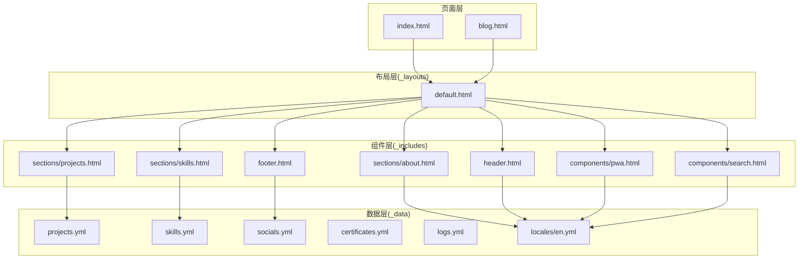
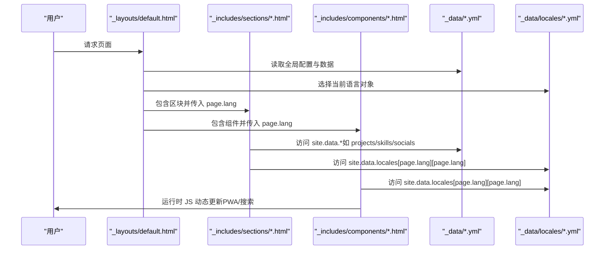
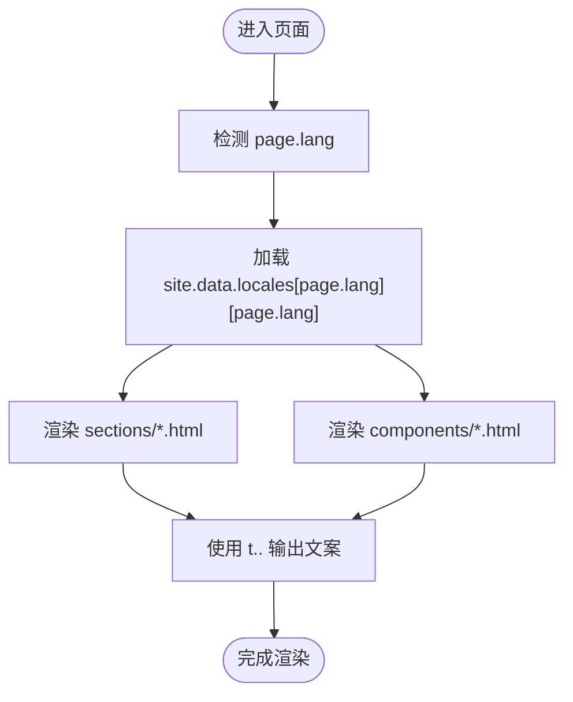
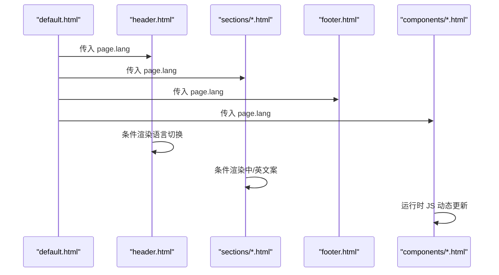
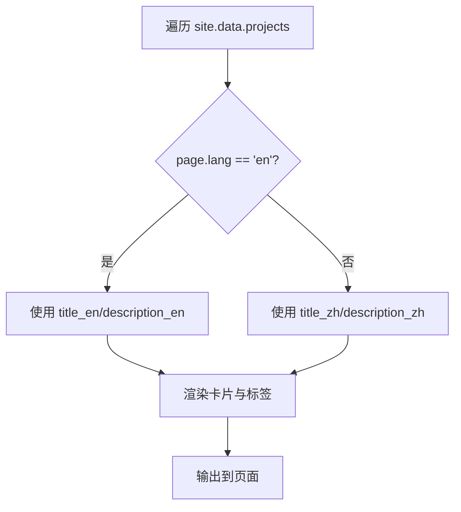
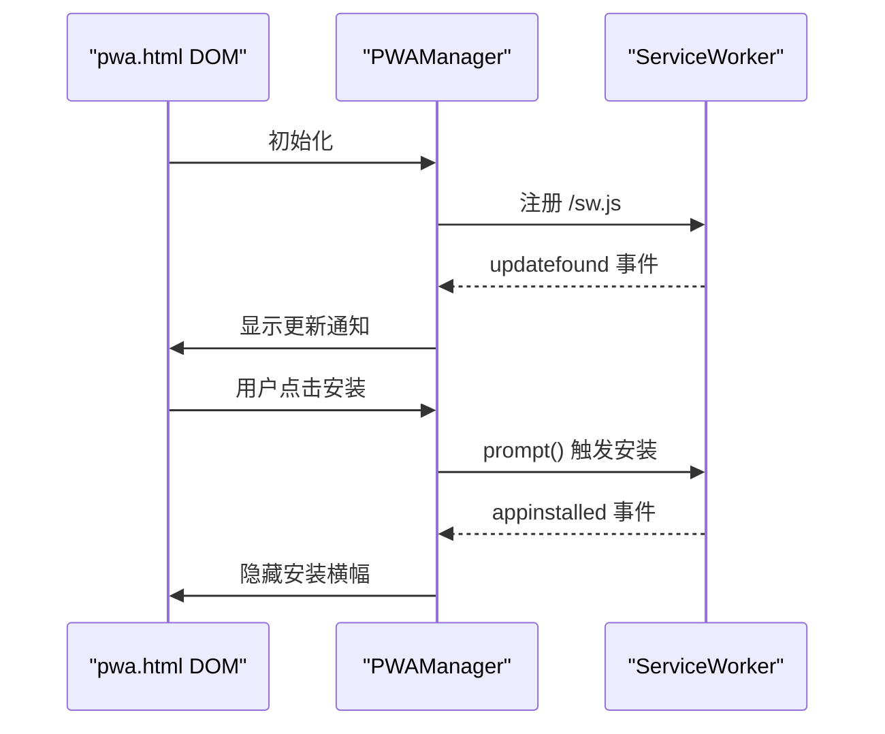
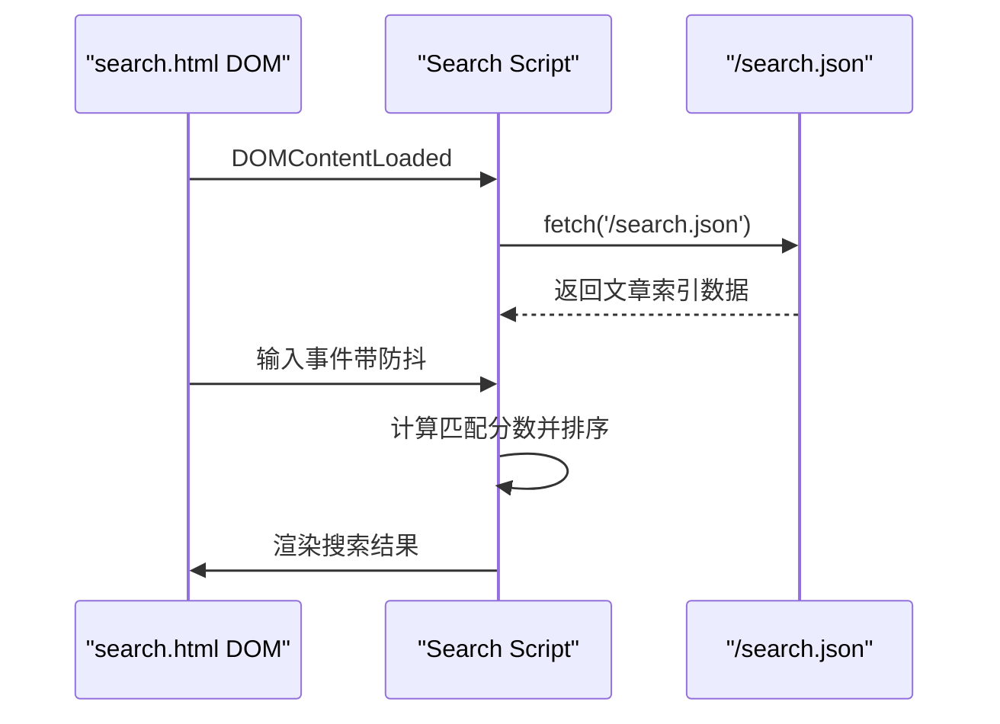
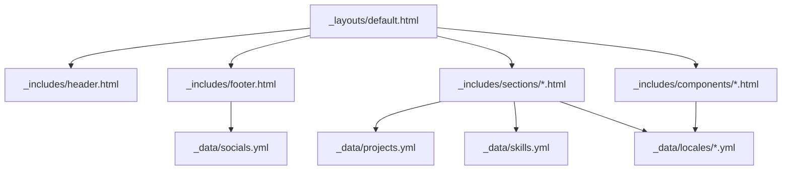

# 组件数据绑定机制

<cite>
**本文引用的文件**
- [_config.yml](file://_config.yml)
- [default.html](file://_layouts/default.html)
- [header.html](file://_includes/header.html)
- [footer.html](file://_includes/footer.html)
- [pwa.html](file://_includes/components/pwa.html)
- [search.html](file://_includes/components/search.html)
- [about.html](file://_includes/sections/about.html)
- [projects.html](file://_includes/sections/projects.html)
- [skills.html](file://_includes/sections/skills.html)
- [certificates.yml](file://_data/certificates.yml)
- [projects.yml](file://_data/projects.yml)
- [skills.yml](file://_data/skills.yml)
- [socials.yml](file://_data/socials.yml)
- [logs.yml](file://_data/logs.yml)
- [en.yml](file://_data/locales/en.yml)
</cite>

## 目录
1. [引言](#引言)
2. [项目结构](#项目结构)
3. [核心组件](#核心组件)
4. [架构总览](#架构总览)
5. [详细组件分析](#详细组件分析)
6. [依赖关系分析](#依赖关系分析)
7. [性能考量](#性能考量)
8. [故障排查指南](#故障排查指南)
9. [结论](#结论)
10. [附录](#附录)

## 引言
本文件系统性阐述 halfism.github.io 的组件数据绑定机制，重点覆盖以下方面：
- Jekyll 数据文件系统（_data/）的设计与使用：YAML 文件如何与模板进行数据绑定
- _config.yml 中的全局配置如何影响组件渲染（主题、SEO、国际化等）
- 多语言数据（site.data.locales）的动态加载与切换机制
- 组件间的数据传递模式、条件渲染逻辑与动态内容更新
- 数据绑定最佳实践、性能优化技巧与调试方法
- 提供具体代码示例路径与实际应用场景

## 项目结构
该项目采用 Jekyll 静态站点生成器，遵循“数据（_data）—模板（_includes/_layouts）—页面（.html/.md）”的清晰分层：
- 数据层：_data 下的 YAML 文件（如 projects.yml、skills.yml、socials.yml、locales/en.yml 等），用于集中管理可复用内容与多语言文案
- 布局层：_layouts/default.html 定义全局结构、SEO、主题初始化与脚本注入
- 组件层：_includes/components 与 _includes/sections 提供可复用的 UI 组件与页面区块
- 页面层：index.html、blog.html 等页面通过 include 引入组件与区块

图表来源
- [default.html:1-152](file://_layouts/default.html#L1-L152)
- [header.html:1-116](file://_includes/header.html#L1-L116)
- [footer.html:1-49](file://_includes/footer.html#L1-L49)
- [pwa.html:1-192](file://_includes/components/pwa.html#L1-L192)
- [search.html:1-336](file://_includes/components/search.html#L1-L336)
- [about.html:1-48](file://_includes/sections/about.html#L1-L48)
- [projects.html:1-50](file://_includes/sections/projects.html#L1-L50)
- [skills.html:1-61](file://_includes/sections/skills.html#L1-L61)
- [projects.yml:1-45](file://_data/projects.yml#L1-L45)
- [skills.yml:1-41](file://_data/skills.yml#L1-L41)
- [socials.yml:1-20](file://_data/socials.yml#L1-L20)
- [certificates.yml:1-24](file://_data/certificates.yml#L1-L24)
- [logs.yml:1-31](file://_data/logs.yml#L1-L31)
- [en.yml:1-166](file://_data/locales/en.yml#L1-L166)

章节来源
- [default.html:1-152](file://_layouts/default.html#L1-L152)
- [_config.yml:1-133](file://_config.yml#L1-L133)

## 核心组件
本节聚焦数据绑定的关键实现点与最佳实践。

- 数据文件系统（_data/）
  - YAML 文件直接映射为 Liquid 变量：例如 site.data.projects、site.data.skills、site.data.socials、site.data.locales
  - 多语言文案通过 site.data.locales[page.lang][page.lang] 动态选择当前语言对象
  - 示例路径：[projects.yml:1-45](file://_data/projects.yml#L1-L45)、[skills.yml:1-41](file://_data/skills.yml#L1-L41)、[socials.yml:1-20](file://_data/socials.yml#L1-L20)、[en.yml:1-166](file://_data/locales/en.yml#L1-L166)

- 布局与全局配置
  - _config.yml 提供主题颜色、SEO、默认语言、analytics、评论系统等全局设置，被 default.html 读取用于 SEO、OG、Twitter 卡片、Analytics 注入与主题初始化
  - 示例路径：[_config.yml:1-133](file://_config.yml#L1-L133)、[default.html:1-152](file://_layouts/default.html#L1-L152)

- 组件与区块的数据绑定
  - header.html、footer.html、sections/*.html 使用 site.data.locales 与 site.data.* 进行文案与内容绑定
  - components/*.html（如 pwa.html、search.html）在构建时通过 Liquid 渲染静态文本，同时在运行时通过 JS 动态更新状态
  - 示例路径：[header.html:1-116](file://_includes/header.html#L1-L116)、[footer.html:1-49](file://_includes/footer.html#L1-L49)、[about.html:1-48](file://_includes/sections/about.html#L1-L48)、[projects.html:1-50](file://_includes/sections/projects.html#L1-L50)、[skills.html:1-61](file://_includes/sections/skills.html#L1-L61)、[pwa.html:1-192](file://_includes/components/pwa.html#L1-L192)、[search.html:1-336](file://_includes/components/search.html#L1-L336)

- 条件渲染与动态内容
  - 多语言切换：根据 page.lang 决定显示中文或英文文案；导航中的语言切换按钮在不同语言页面呈现不同选中态
  - 主题切换：default.html 初始化 data-theme 并通过 JS 切换；组件通过 CSS 变量响应主题变化
  - PWA 与搜索：组件在运行时监听事件并更新 DOM，实现安装提示与更新通知的动态展示

章节来源
- [_config.yml:62-76](file://_config.yml#L62-L76)
- [default.html:1-152](file://_layouts/default.html#L1-L152)
- [header.html:1-116](file://_includes/header.html#L1-L116)
- [footer.html:1-49](file://_includes/footer.html#L1-L49)
- [pwa.html:1-192](file://_includes/components/pwa.html#L1-L192)
- [search.html:1-336](file://_includes/components/search.html#L1-L336)
- [about.html:1-48](file://_includes/sections/about.html#L1-L48)
- [projects.html:1-50](file://_includes/sections/projects.html#L1-L50)
- [skills.html:1-61](file://_includes/sections/skills.html#L1-L61)

## 架构总览
下图展示了从数据到模板再到运行时交互的整体流程。

图表来源
- [default.html:1-152](file://_layouts/default.html#L1-L152)
- [header.html:1-116](file://_includes/header.html#L1-L116)
- [footer.html:1-49](file://_includes/footer.html#L1-L49)
- [pwa.html:1-192](file://_includes/components/pwa.html#L1-L192)
- [search.html:1-336](file://_includes/components/search.html#L1-L336)
- [about.html:1-48](file://_includes/sections/about.html#L1-L48)
- [projects.html:1-50](file://_includes/sections/projects.html#L1-L50)
- [skills.html:1-61](file://_includes/sections/skills.html#L1-L61)
- [projects.yml:1-45](file://_data/projects.yml#L1-L45)
- [skills.yml:1-41](file://_data/skills.yml#L1-L41)
- [socials.yml:1-20](file://_data/socials.yml#L1-L20)
- [en.yml:1-166](file://_data/locales/en.yml#L1-L166)

## 详细组件分析

### 数据绑定与多语言机制
- 多语言数据结构
  - _data/locales/en.yml 提供英文键值对，键名按功能域划分（如 nav、hero、about、projects 等）
  - 在模板中通过 site.data.locales[page.lang][page.lang] 获取当前语言对象，再按需访问子键（如 t.nav.home）
- 语言切换逻辑
  - header.html 根据 page.lang 决定语言切换按钮的显示与选中态
  - _config.yml 的 languages 与 default_lang 控制默认语言与可用语言列表
- 国际化文案在各组件中的应用
  - sections/*.html 与 components/*.html 通过 t.<domain>.<key> 输出本地化文案
  - 示例路径：[en.yml:1-166](file://_data/locales/en.yml#L1-L166)、[header.html:1-116](file://_includes/header.html#L1-L116)、[about.html:1-48](file://_includes/sections/about.html#L1-L48)、[pwa.html:1-192](file://_includes/components/pwa.html#L1-L192)、[search.html:1-336](file://_includes/components/search.html#L1-L336)

图表来源
- [header.html:1-116](file://_includes/header.html#L1-L116)
- [about.html:1-48](file://_includes/sections/about.html#L1-L48)
- [pwa.html:1-192](file://_includes/components/pwa.html#L1-L192)
- [search.html:1-336](file://_includes/components/search.html#L1-L336)
- [en.yml:1-166](file://_data/locales/en.yml#L1-L166)

章节来源
- [_config.yml:62-76](file://_config.yml#L62-L76)
- [header.html:1-116](file://_includes/header.html#L1-L116)
- [en.yml:1-166](file://_data/locales/en.yml#L1-L166)

### 布局与全局配置的影响
- 主题与 SEO
  - default.html 读取 _config.yml 的 theme_settings、seo、socials 等字段，注入主题色、OG 图片、Twitter 卡片、JSON-LD 结构化数据等
- 分析与评论
  - google_analytics.enabled 与 tracking_id 控制 GA4 注入；comments.giscus.* 控制评论系统参数
- 默认语言与 hreflang
  - _config.yml 的 defaults 与 languages/default_lang 影响页面默认语言与 hreflang 标签生成

章节来源
- [_config.yml:37-99](file://_config.yml#L37-L99)
- [default.html:1-152](file://_layouts/default.html#L1-L152)

### 组件间的数据传递与条件渲染
- 组件包含关系
  - default.html 通过  引入 header、sections、footer、components，形成“布局—区块—组件”的层级
- 条件渲染
  - header.html 根据 page.lang 显示不同语言的导航与切换按钮
  - sections/*.html 根据 page.lang 选择中文或英文标题与描述
- 动态内容更新
  - components/*.html 在构建期输出静态文本，在运行期通过 JS 更新状态（如 PWA 安装提示、搜索结果）

图表来源
- [default.html:1-152](file://_layouts/default.html#L1-L152)
- [header.html:1-116](file://_includes/header.html#L1-L116)
- [footer.html:1-49](file://_includes/footer.html#L1-L49)
- [pwa.html:1-192](file://_includes/components/pwa.html#L1-L192)
- [search.html:1-336](file://_includes/components/search.html#L1-L336)

章节来源
- [default.html:1-152](file://_layouts/default.html#L1-L152)
- [header.html:1-116](file://_includes/header.html#L1-L116)
- [footer.html:1-49](file://_includes/footer.html#L1-L49)
- [pwa.html:1-192](file://_includes/components/pwa.html#L1-L192)
- [search.html:1-336](file://_includes/components/search.html#L1-L336)

### 数据驱动的区块渲染
- 项目区块（projects.html）
  - 遍历 site.data.projects，按 page.lang 选择标题与描述，渲染标签、星级与链接
- 技能区块（skills.html）
  - 使用 site.data.skills.core_skills、backend_tools、dev_tools 等分组渲染技能条与标签
- 关于区块（about.html）
  - 使用 site.data.locales 输出本地化段落与特性卡片文案

图表来源
- [projects.html:1-50](file://_includes/sections/projects.html#L1-L50)
- [projects.yml:1-45](file://_data/projects.yml#L1-L45)

章节来源
- [projects.html:1-50](file://_includes/sections/projects.html#L1-L50)
- [skills.html:1-61](file://_includes/sections/skills.html#L1-L61)
- [about.html:1-48](file://_includes/sections/about.html#L1-L48)
- [projects.yml:1-45](file://_data/projects.yml#L1-L45)
- [skills.yml:1-41](file://_data/skills.yml#L1-L41)

### PWA 组件的数据绑定与运行时行为
- 构建期绑定
  - 通过 site.data.locales[page.lang][page.lang] 获取本地化文案并注入到组件 HTML
- 运行时行为
  - 注册 Service Worker、监听 beforeinstallprompt 与 appinstalled 事件，控制安装横幅与更新通知的显示与隐藏
  - 通过 localStorage 记录用户对安装提示的忽略状态

图表来源
- [pwa.html:1-192](file://_includes/components/pwa.html#L1-L192)

章节来源
- [pwa.html:1-192](file://_includes/components/pwa.html#L1-L192)

### 搜索组件的数据绑定与动态搜索
- 构建期绑定
  - 通过 site.data.locales[page.lang][page.lang] 注入搜索框占位符、空结果提示等文案
- 运行时行为
  - 加载 /search.json，监听键盘快捷键（Ctrl/Cmd+K 打开、ESC 关闭、上下键导航、回车打开）
  - 对标题、标签、摘要与正文进行评分与排序，高亮匹配关键词

图表来源
- [search.html:1-336](file://_includes/components/search.html#L1-L336)

章节来源
- [search.html:1-336](file://_includes/components/search.html#L1-L336)

## 依赖关系分析
- 组件耦合与内聚
  - sections/*.html 依赖 site.data.* 与 site.data.locales，内聚度高但耦合于数据结构
  - components/*.html 在构建期依赖多语言数据，运行期依赖浏览器环境与 JS
- 直接与间接依赖
  - default.html 作为根布局，间接依赖所有 include 的组件与区块
  - header/footer 依赖多语言数据与社交链接数据
- 外部依赖与集成点
  - default.html 集成 GA4、Open Graph、Twitter Card、JSON-LD 等外部资源
  - PWA 组件依赖 Service Worker 与浏览器 PWA API

图表来源
- [default.html:1-152](file://_layouts/default.html#L1-L152)
- [header.html:1-116](file://_includes/header.html#L1-L116)
- [footer.html:1-49](file://_includes/footer.html#L1-L49)
- [pwa.html:1-192](file://_includes/components/pwa.html#L1-L192)
- [search.html:1-336](file://_includes/components/search.html#L1-L336)
- [about.html:1-48](file://_includes/sections/about.html#L1-L48)
- [projects.html:1-50](file://_includes/sections/projects.html#L1-L50)
- [skills.html:1-61](file://_includes/sections/skills.html#L1-L61)
- [projects.yml:1-45](file://_data/projects.yml#L1-L45)
- [skills.yml:1-41](file://_data/skills.yml#L1-L41)
- [socials.yml:1-20](file://_data/socials.yml#L1-L20)
- [en.yml:1-166](file://_data/locales/en.yml#L1-L166)

章节来源
- [default.html:1-152](file://_layouts/default.html#L1-L152)
- [header.html:1-116](file://_includes/header.html#L1-L116)
- [footer.html:1-49](file://_includes/footer.html#L1-L49)
- [pwa.html:1-192](file://_includes/components/pwa.html#L1-L192)
- [search.html:1-336](file://_includes/components/search.html#L1-L336)
- [about.html:1-48](file://_includes/sections/about.html#L1-L48)
- [projects.html:1-50](file://_includes/sections/projects.html#L1-L50)
- [skills.html:1-61](file://_includes/sections/skills.html#L1-L61)
- [projects.yml:1-45](file://_data/projects.yml#L1-L45)
- [skills.yml:1-41](file://_data/skills.yml#L1-L41)
- [socials.yml:1-20](file://_data/socials.yml#L1-L20)
- [en.yml:1-166](file://_data/locales/en.yml#L1-L166)

## 性能考量
- 数据访问与渲染
  - 将大型数据拆分为多个 YAML 文件，避免单文件过大导致 Liquid 渲染压力
  - 在模板中尽量减少嵌套循环与重复访问同一数据集合
- 多语言文案
  - 将常用文案集中到 locales，避免在多个组件重复硬编码
  - 使用局部变量缓存 t.<domain>，减少重复访问
- 运行时性能
  - 搜索组件使用防抖（约 200ms）降低输入事件处理频率
  - 使用 CSS 变量与原生 JS 控制主题切换，避免重排与重绘
- 资源加载
  - default.html 中对 CDN 资源使用 preconnect 与 dns-prefetch，缩短关键资源加载延迟

## 故障排查指南
- 多语言文案未生效
  - 检查 page.lang 是否正确传递至组件（default.html 的 lang 属性）
  - 确认 _data/locales/<lang>.yml 键名与调用处一致
  - 参考路径：[default.html:1-152](file://_layouts/default.html#L1-L152)、[en.yml:1-166](file://_data/locales/en.yml#L1-L166)
- 语言切换按钮不显示或状态错误
  - 检查 header.html 中的语言切换逻辑与 page.lang 的判断
  - 参考路径：[header.html:1-116](file://_includes/header.html#L1-L116)
- PWA 安装提示不出现
  - 确认浏览器支持 Service Worker 且 /sw.js 存在
  - 检查 beforeinstallprompt 事件是否触发与 deferredPrompt 是否存在
  - 参考路径：[pwa.html:1-192](file://_includes/components/pwa.html#L1-L192)
- 搜索无结果或报错
  - 确认 /search.json 是否生成并可访问
  - 检查搜索脚本的 fetch 错误处理与防抖逻辑
  - 参考路径：[search.html:1-336](file://_includes/components/search.html#L1-L336)
- 主题切换无效
  - 检查 data-theme 属性与 CSS 变量是否正确更新
  - 参考路径：[default.html:1-152](file://_layouts/default.html#L1-L152)

章节来源
- [default.html:1-152](file://_layouts/default.html#L1-L152)
- [header.html:1-116](file://_includes/header.html#L1-L116)
- [pwa.html:1-192](file://_includes/components/pwa.html#L1-L192)
- [search.html:1-336](file://_includes/components/search.html#L1-L336)
- [en.yml:1-166](file://_data/locales/en.yml#L1-L166)

## 结论
halfism.github.io 的数据绑定机制以 Jekyll 的 _data 与 Liquid 为核心，结合 _config.yml 的全局配置与多语言数据，实现了“数据—模板—运行时”的三层绑定：
- 数据层：集中管理内容与多语言文案
- 模板层：通过 Liquid 实现静态绑定与条件渲染
- 运行时层：通过 JS 实现动态交互与状态更新

该机制具备良好的可维护性与扩展性，适合在个人作品集、技术博客等场景中复用。

## 附录
- 最佳实践清单
  - 将文案与内容分离到 _data 与 locales，避免硬编码
  - 使用局部变量缓存多语言对象，减少重复访问
  - 对运行时交互使用防抖与懒加载策略
  - 保持数据结构稳定，避免频繁变更键名
- 常见问题速查
  - 多语言键名不一致导致文案缺失
  - page.lang 未正确传递导致语言切换失效
  - /search.json 未生成导致搜索功能异常
  - Service Worker 注册失败导致 PWA 功能不可用