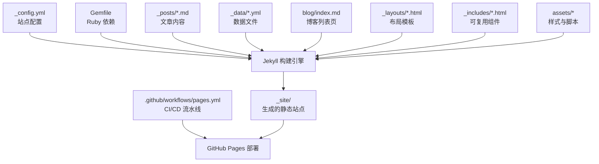
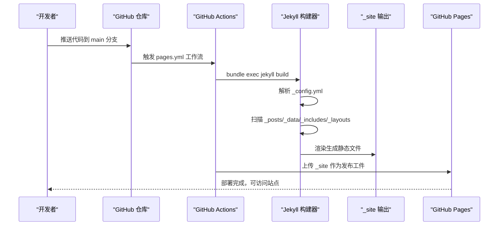
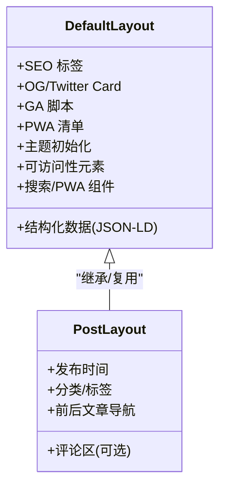
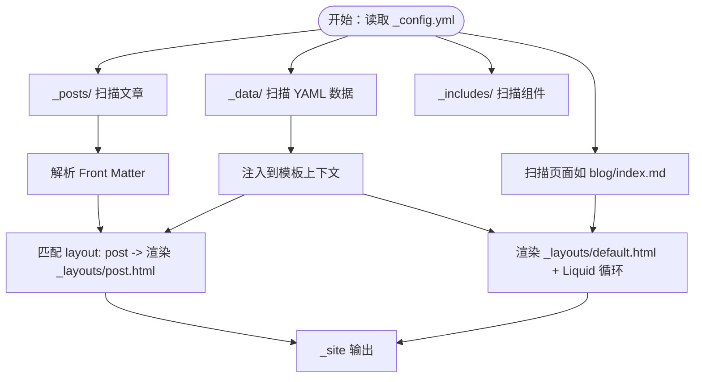
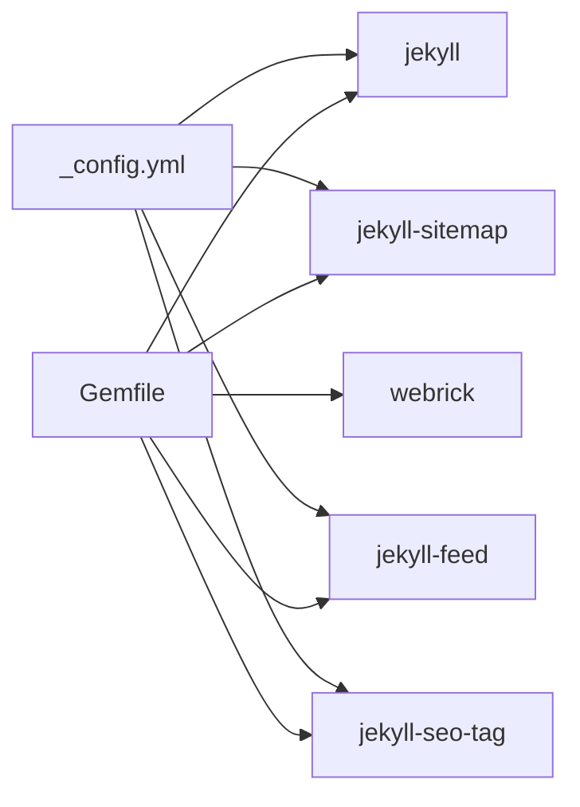

# 静态站点生成架构

<cite>
**本文档引用的文件**
- [_config.yml](file://_config.yml)
- [Gemfile](file://Gemfile)
- [README.md](file://README.md)
- [.github/workflows/pages.yml](file://.github/workflows/pages.yml)
- [_layouts/default.html](file://_layouts/default.html)
- [_layouts/post.html](file://_layouts/post.html)
- [index.html](file://index.html)
- [blog/index.md](file://blog/index.md)
- [_posts/2026-04-06-jekyll-blog-tutorial.md](file://_posts/2026-04-06-jekyll-blog-tutorial.md)
- [_includes/header.html](file://_includes/header.html)
- [_includes/footer.html](file://_includes/footer.html)
- [_includes/sections/about.html](file://_includes/sections/about.html)
- [_data/projects.yml](file://_data/projects.yml)
- [_data/skills.yml](file://_data/skills.yml)
- [_data/locales/en.yml](file://_data/locales/en.yml)
- [assets/css/style.css](file://assets/css/style.css)
</cite>

## 目录
1. [引言](#引言)
2. [项目结构](#项目结构)
3. [核心组件](#核心组件)
4. [架构概览](#架构概览)
5. [详细组件分析](#详细组件分析)
6. [依赖关系分析](#依赖关系分析)
7. [性能考量](#性能考量)
8. [故障排除指南](#故障排除指南)
9. [结论](#结论)
10. [附录](#附录)

## 引言
本文件面向 halfism.github.io 项目的静态站点生成架构，系统阐述 Jekyll 静态网站生成器的工作原理，覆盖构建流程、数据处理与模板渲染机制；详解 _config.yml 配置项，包括站点元数据、SEO 设置、分析配置与插件管理；解析 Markdown 内容从 _posts/ 文章到最终 HTML 页面的生成过程；分析 jekyll-feed、jekyll-sitemap、jekyll-seo-tag 等插件的作用与配置方法；并提供构建优化建议与性能考虑。

## 项目结构
halfism.github.io 采用 Jekyll 原生项目结构，结合数据驱动与组件化布局，形成清晰的分层组织：
- 配置与依赖：_config.yml、Gemfile、README.md
- 内容与数据：_posts/（文章）、_data/（YAML 数据）、blog/index.md（博客列表）
- 布局与组件：_layouts/（default.html、post.html）、_includes/（header.html、footer.html、sections/*）
- 资源与前端：assets/css/style.css、assets/js/main.js、manifest.json、sw.js 等
- 自动化：.github/workflows/pages.yml（GitHub Actions）

图表来源
- [_config.yml:1-133](file://_config.yml#L1-L133)
- [Gemfile:1-12](file://Gemfile#L1-L12)
- [blog/index.md:1-253](file://blog/index.md#L1-L253)
- [_layouts/default.html:1-152](file://_layouts/default.html#L1-L152)
- [_layouts/post.html:1-328](file://_layouts/post.html#L1-L328)
- [_includes/header.html:1-116](file://_includes/header.html#L1-L116)
- [_includes/footer.html:1-49](file://_includes/footer.html#L1-L49)
- [_posts/2026-04-06-jekyll-blog-tutorial.md:1-164](file://_posts/2026-04-06-jekyll-blog-tutorial.md#L1-L164)

章节来源
- [_config.yml:1-133](file://_config.yml#L1-L133)
- [Gemfile:1-12](file://Gemfile#L1-L12)
- [README.md:26-63](file://README.md#L26-L63)

## 核心组件
- 站点配置与元数据：title、email、description、url、baseurl、author、socials、theme_settings、seo、languages、defaults、analytics、comments、contact、build settings、plugins、exclude
- 布局系统：default.html（通用布局，含 SEO、结构化数据、GA、PWA、主题初始化等），post.html（文章详情页布局）
- 内容与数据：_posts/ 下的 Markdown 文章（带 Front Matter），_data/ 下的 YAML 数据（projects.yml、skills.yml、locales/en.yml 等）
- 组件化页面：index.html 通过 include 引入 sections/* 组件；blog/index.md 列表页动态渲染文章集合
- 自动化部署：GitHub Actions 在推送到 main 分支时构建并部署至 GitHub Pages

章节来源
- [_config.yml:1-133](file://_config.yml#L1-L133)
- [_layouts/default.html:1-152](file://_layouts/default.html#L1-L152)
- [_layouts/post.html:1-328](file://_layouts/post.html#L1-L328)
- [index.html:1-17](file://index.html#L1-L17)
- [blog/index.md:1-253](file://blog/index.md#L1-L253)
- [_posts/2026-04-06-jekyll-blog-tutorial.md:1-164](file://_posts/2026-04-06-jekyll-blog-tutorial.md#L1-L164)
- [_data/projects.yml:1-45](file://_data/projects.yml#L1-L45)
- [_data/skills.yml:1-41](file://_data/skills.yml#L1-L41)
- [_data/locales/en.yml:1-166](file://_data/locales/en.yml#L1-L166)
- [.github/workflows/pages.yml:1-50](file://.github/workflows/pages.yml#L1-L50)

## 架构概览
Jekyll 构建流程从读取 _config.yml 开始，扫描 _posts、_data、_includes、_layouts 等目录，依据 Front Matter 与数据文件渲染模板，最终输出到 _site 目录。GitHub Actions 在 CI 中执行相同流程并上传产物以供 GitHub Pages 发布。

图表来源
- [.github/workflows/pages.yml:1-50](file://.github/workflows/pages.yml#L1-L50)
- [_config.yml:104-133](file://_config.yml#L104-L133)

## 详细组件分析

### 配置系统与 _config.yml
_config.yml 是整个站点的“事实来源”，涵盖站点元数据、SEO、分析、评论、主题、多语言、构建选项与插件管理。关键要点：
- 站点元数据：title、email、description、url、baseurl、author、socials
- 主题与外观：theme_settings（颜色、字体、主题模式）
- SEO：og_image、twitter_card、keywords、social links
- 多语言：languages、default_lang、defaults（按路径设置 lang）
- 分析：google_analytics（启用与跟踪 ID）
- 评论：comments（provider、giscus 配置）
- 联系表单：contact.form_id
- 构建：markdown、highlighter、permalink
- 插件：jekyll-sitemap、jekyll-feed、jekyll-seo-tag
- 排除：README.md、Gemfile、vendor/*、node_modules 等

章节来源
- [_config.yml:1-133](file://_config.yml#L1-L133)

### 布局系统：default.html 与 post.html
- default.html：提供全局 HTML 结构、SEO 标签（）、Open Graph/Twitter Card、结构化数据（JSON-LD）、Google Analytics、PWA 清单、主题初始化脚本、可访问性元素（跳转链接、进度条、回到顶部按钮）、搜索与 PWA 组件注入。
- post.html：文章详情页布局，包含发布时间、分类、标签、前后文章导航、评论区（根据配置启用）。

图表来源
- [_layouts/default.html:1-152](file://_layouts/default.html#L1-L152)
- [_layouts/post.html:1-328](file://_layouts/post.html#L1-L328)

章节来源
- [_layouts/default.html:1-152](file://_layouts/default.html#L1-L152)
- [_layouts/post.html:1-328](file://_layouts/post.html#L1-L328)

### 内容与数据：Markdown 与 YAML
- 文章：_posts/ 下的 Markdown 文件（如 2026-04-06-jekyll-blog-tutorial.md），包含 Front Matter（layout、title、date、category、tags、image、excerpt）与正文内容。Jekyll 依据 layout: post 渲染到 post.html。
- 博客列表：blog/index.md（layout: default，permalink: /blog/），通过 Liquid 遍历 site.posts 渲染文章卡片、筛选器与分页/分组。
- 数据：_data/projects.yml、_data/skills.yml、_data/locales/en.yml 提供项目、技能、多语言文案等，被布局与组件通过 site.data.* 访问。

图表来源
- [_posts/2026-04-06-jekyll-blog-tutorial.md:1-164](file://_posts/2026-04-06-jekyll-blog-tutorial.md#L1-L164)
- [blog/index.md:1-253](file://blog/index.md#L1-L253)
- [_data/projects.yml:1-45](file://_data/projects.yml#L1-L45)
- [_data/skills.yml:1-41](file://_data/skills.yml#L1-L41)
- [_layouts/post.html:1-328](file://_layouts/post.html#L1-L328)
- [_layouts/default.html:1-152](file://_layouts/default.html#L1-L152)

章节来源
- [_posts/2026-04-06-jekyll-blog-tutorial.md:1-164](file://_posts/2026-04-06-jekyll-blog-tutorial.md#L1-L164)
- [blog/index.md:1-253](file://blog/index.md#L1-L253)
- [_data/projects.yml:1-45](file://_data/projects.yml#L1-L45)
- [_data/skills.yml:1-41](file://_data/skills.yml#L1-L41)
- [_data/locales/en.yml:1-166](file://_data/locales/en.yml#L1-L166)

### 组件化页面：index.html 与 sections/*
index.html 通过 include 将多个 sections/* 组件拼装成首页，体现“数据驱动、组件化”的设计思想。例如 about.html、projects.html、skills.html、logs.html、github-stats.html、certificates.html、contact.html 等，均通过 site.data.* 与多语言 locales 获取数据。

章节来源
- [index.html:1-17](file://index.html#L1-L17)
- [_includes/sections/about.html:1-48](file://_includes/sections/about.html#L1-L48)
- [_data/locales/en.yml:1-166](file://_data/locales/en.yml#L1-L166)

### 主题与样式：CSS 变量与深色模式
assets/css/style.css 定义了完整的 CSS 自定义属性体系（设计令牌），并在 [data-theme="dark"] 中覆盖关键变量，实现浅色/深色主题切换。default.html 初始化主题（localStorage 或系统偏好），避免 FOUC（Flash of Unstyled Content）。

章节来源
- [assets/css/style.css:1-200](file://assets/css/style.css#L1-L200)
- [_layouts/default.html:59-67](file://_layouts/default.html#L59-L67)

### 插件生态：jekyll-seo-tag、jekyll-sitemap、jekyll-feed
- jekyll-seo-tag：在 default.html 中通过  自动注入 SEO 元信息（title/description、OG、Twitter Card、结构化数据等），并与 _config.yml 的 seo 字段联动。
- jekyll-sitemap：自动生成 sitemap.xml，便于搜索引擎抓取。
- jekyll-feed：为 RSS/Atom 订阅生成 feed.xml，供读者订阅文章更新。

章节来源
- [_config.yml:109-114](file://_config.yml#L109-L114)
- [_layouts/default.html:12-12](file://_layouts/default.html#L12-L12)

### 自动化部署：GitHub Actions
pages.yml 在推送到 main 分支时：
- 检出代码
- 设置 Ruby 环境并缓存 Bundler
- 执行 bundle exec jekyll build
- 上传 _site 为页面工件
- 部署到 GitHub Pages

章节来源
- [.github/workflows/pages.yml:1-50](file://.github/workflows/pages.yml#L1-L50)

## 依赖关系分析
Jekyll 依赖由 Gemfile 管理，核心依赖包括 jekyll、jekyll-sitemap、jekyll-feed、jekyll-seo-tag 以及本地调试用 webrick。_config.yml 的 plugins 字段声明启用的插件，Jekyll 在构建时自动加载。

图表来源
- [Gemfile:1-12](file://Gemfile#L1-L12)
- [_config.yml:109-114](file://_config.yml#L109-L114)

章节来源
- [Gemfile:1-12](file://Gemfile#L1-L12)
- [_config.yml:109-114](file://_config.yml#L109-L114)

## 性能考量
- 构建层面
  - 使用 kramdown 与 Rouge 提升 Markdown 渲染与高亮效率
  - 启用 pretty permalinks，利于 SEO 与可读性
  - 排除不必要的文件（vendor、node_modules、IDE 目录）以缩短构建时间
- 运行层面
  - default.html 中对外部资源进行 preconnect/dns-prefetch，降低第三方资源加载延迟
  - 使用 CSS 变量与原子化样式，减少重复规则与体积
  - 图片懒加载与结构化数据有助于 Core Web Vitals
- 部署层面
  - GitHub Pages 本身具备全球加速与静态资源优化能力
  - 通过 GitHub Actions 缓存 Bundler，缩短 CI 时间

章节来源
- [_config.yml:105-107](file://_config.yml#L105-L107)
- [_layouts/default.html:50-57](file://_layouts/default.html#L50-L57)

## 故障排除指南
- 构建失败（依赖问题）
  - 确认 Ruby 版本与 Bundler 缓存设置一致（参考 pages.yml 中 ruby/setup-ruby 的版本）
  - 在本地执行 bundle install 并使用 bundle exec jekyll build
- SEO 标签缺失
  - 检查 _config.yml 中 seo 字段是否正确配置（og_image、twitter_card、keywords、social.links）
  - 确认 default.html 中  是否存在
- 评论系统不显示
  - 检查 comments.enabled 与 provider（giscus）配置
  - 确认 giscus 的 repo、repo_id、category、category_id 等字段是否填写
- 多语言与 hreflang
  - 检查 languages、default_lang、defaults 中的 lang 设置
  - 确认 default.html 中的 hreflang 标签生成逻辑
- GA 不生效
  - 检查 google_analytics.enabled 与 tracking_id 是否正确
  - 确认 default.html 中 GA 脚本注入条件

章节来源
- [_config.yml:45-100](file://_config.yml#L45-L100)
- [_layouts/default.html:12-12](file://_layouts/default.html#L12-L12)
- [_layouts/post.html:281-327](file://_layouts/post.html#L281-L327)
- [.github/workflows/pages.yml:26-33](file://.github/workflows/pages.yml#L26-L33)

## 结论
halfism.github.io 通过 Jekyll 的数据驱动与组件化架构，实现了高性能、可维护、可扩展的个人作品集与博客站点。配合 jekyll-seo-tag、jekyll-sitemap、jekyll-feed 等插件，以及 GitHub Actions 的自动化部署，形成了从内容创作到上线发布的完整闭环。建议在后续迭代中持续关注构建缓存、资源优化与可访问性指标，以进一步提升用户体验与 SEO 表现。

## 附录
- 本地开发命令参考：bundle install、bundle exec jekyll serve
- 快速开始与自定义配置参考：README.md 中的本地开发与自定义配置章节

章节来源
- [README.md:80-123](file://README.md#L80-L123)