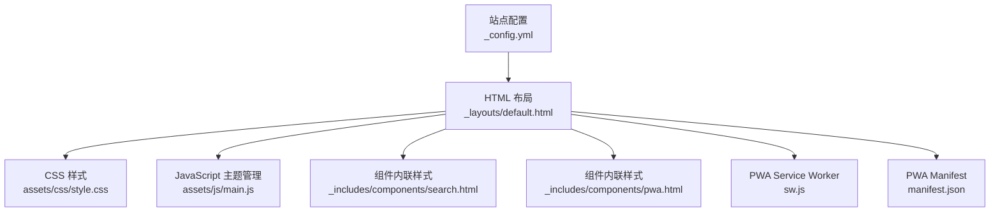
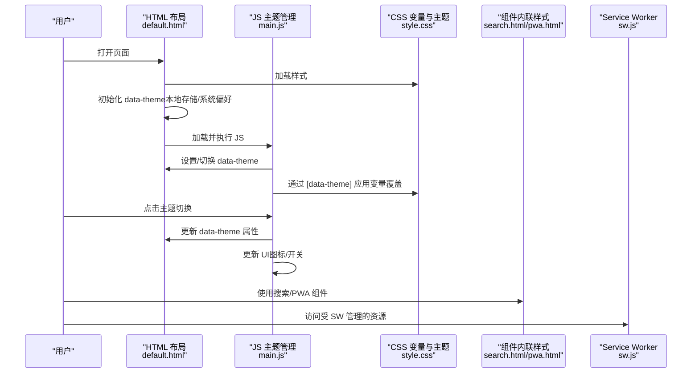
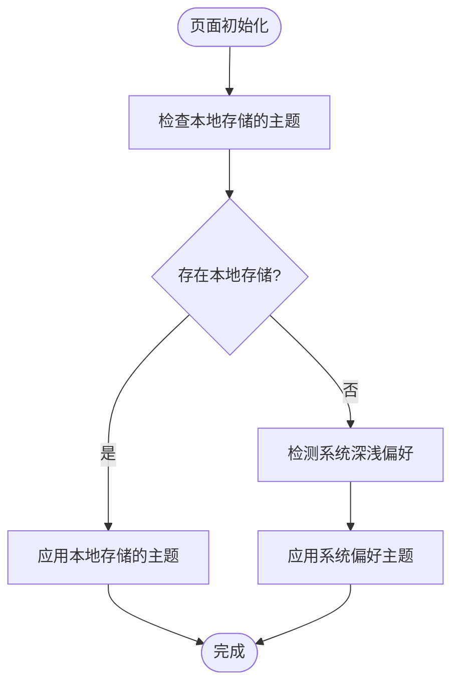
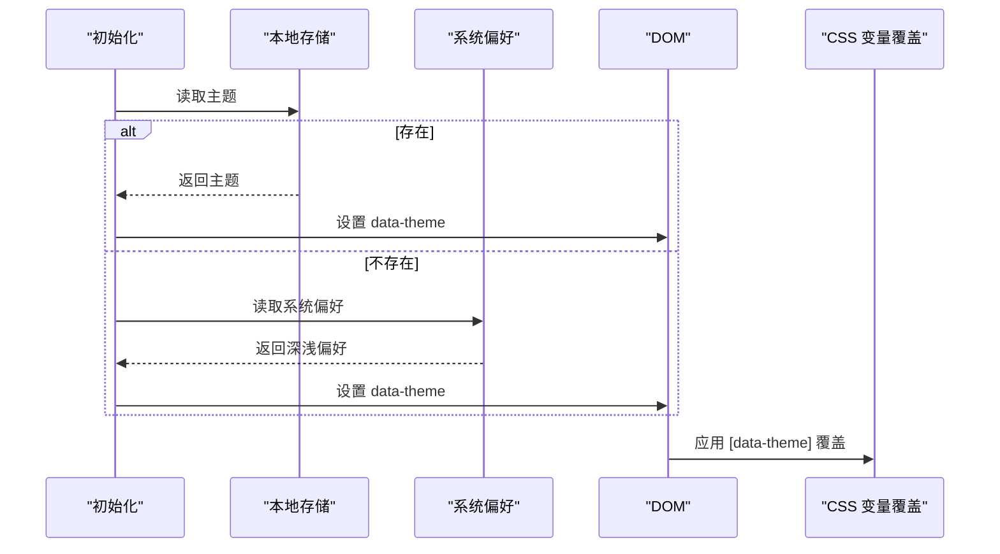
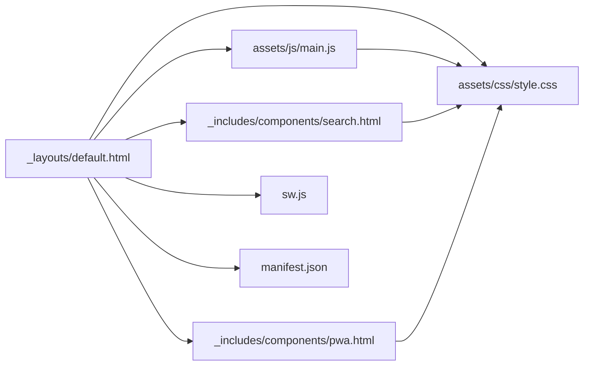

# 样式系统

<cite>
**本文引用的文件**
- [style.css](file://assets/css/style.css)
- [_config.yml](file://_config.yml)
- [default.html](file://_layouts/default.html)
- [main.js](file://assets/js/main.js)
- [search.html](file://_includes/components/search.html)
- [pwa.html](file://_includes/components/pwa.html)
- [manifest.json](file://manifest.json)
- [sw.js](file://sw.js)
- [2026-04-04-modern-css-guide.md](file://_posts/2026-04-04-modern-css-guide.md)
- [2026-04-05-performance-optimization-guide.md](file://_posts/2026-04-05-performance-optimization-guide.md)
</cite>

## 目录
1. [简介](#简介)
2. [项目结构](#项目结构)
3. [核心组件](#核心组件)
4. [架构总览](#架构总览)
5. [详细组件分析](#详细组件分析)
6. [依赖关系分析](#依赖关系分析)
7. [性能考量](#性能考量)
8. [故障排查指南](#故障排查指南)
9. [结论](#结论)
10. [附录](#附录)

## 简介
本文件面向 halfism.github.io 的样式系统，系统性阐述其基于 CSS 变量的设计令牌体系、明暗主题切换机制、响应式与移动端适配策略、BEM 风格的类命名与组件化组织方式，并提供主题定制、性能优化与最佳实践建议。文档以仓库现有实现为依据，避免臆测，所有分析均附带具体文件与行号来源。

**更新** 本版本重点反映了CSS工具类的重大扩展，包括50多个新增工具类，涵盖响应式显示控制（md:前缀）、间距调整、边框控制、转换工具类等，支持现代响应式设计模式。

## 项目结构
样式系统主要由以下部分构成：
- 核心样式：统一的 CSS 变量、重置与基础样式、组件样式、布局工具类、响应式规则、打印样式与玻璃效果等
- 主题初始化与切换：HTML 中的 data-theme 初始化脚本与 JS 主题管理器
- 组件内联样式：搜索模态与 PWA 安装提示等组件的局部样式
- PWA 支持：Service Worker 缓存策略与 manifest 配置
- 主题配置：站点配置中的主题设置项

**图表来源**
- [default.html:1-152](file://_layouts/default.html#L1-L152)
- [style.css:1-1064](file://assets/css/style.css#L1-L1064)
- [main.js:1-279](file://assets/js/main.js#L1-L279)
- [search.html:1-336](file://_includes/components/search.html#L1-L336)
- [pwa.html:1-192](file://_includes/components/pwa.html#L1-L192)
- [sw.js:1-237](file://sw.js#L1-L237)
- [_config.yml:1-133](file://_config.yml#L1-L133)

**章节来源**
- [default.html:1-152](file://_layouts/default.html#L1-L152)
- [style.css:1-1064](file://assets/css/style.css#L1-L1064)
- [main.js:1-279](file://assets/js/main.js#L1-L279)
- [search.html:1-336](file://_includes/components/search.html#L1-L336)
- [pwa.html:1-192](file://_includes/components/pwa.html#L1-L192)
- [sw.js:1-237](file://sw.js#L1-L237)
- [_config.yml:1-133](file://_config.yml#L1-L133)

## 核心组件
- 设计令牌（CSS 变量）：颜色、字体、间距、圆角、阴影、过渡、层级等
- 明暗主题：data-theme 属性驱动的主题切换，暗色主题覆盖关键变量
- 基础与排版：重置、基础排版、可访问性（尊重减少动效）、跳转到主内容
- 布局与工具类：容器、网格、弹性布局、间距、尺寸、可见性、动画类
- **新增** 响应式工具类：md:、lg:、xl: 前缀的断点控制，支持现代响应式设计
- **新增** 交互工具类：hover:、focus:、group:、peer: 状态前缀
- **新增** 转换工具类：transform、translate、rotate、scale 等变换类
- **新增** 过渡工具类：transition-all、transition-colors、duration-* 等
- 组件样式：卡片、按钮、标签/徽章、进度条、章节装饰、阅读进度条等
- 响应式与移动端：移动端优先的断点与隐藏类、打印样式、玻璃效果
- 主题初始化与切换：HTML 初始化脚本 + JS 主题管理器
- 组件内联样式：搜索模态与 PWA 安装提示的局部样式
- PWA 支持：Service Worker 缓存策略与 manifest

**章节来源**
- [style.css:10-145](file://assets/css/style.css#L10-L145)
- [style.css:147-187](file://assets/css/style.css#L147-L187)
- [style.css:294-354](file://assets/css/style.css#L294-L354)
- [style.css:359-520](file://assets/css/style.css#L359-L520)
- [style.css:815-859](file://assets/css/style.css#L815-L859)
- [style.css:918-1064](file://assets/css/style.css#L918-L1064)
- [default.html:59-67](file://_layouts/default.html#L59-L67)
- [main.js:27-75](file://assets/js/main.js#L27-L75)
- [search.html:47-243](file://_includes/components/search.html#L47-L243)
- [pwa.html:31-92](file://_includes/components/pwa.html#L31-L92)
- [sw.js:11-26](file://sw.js#L11-L26)

## 架构总览
样式系统的运行链路如下：
- 页面加载时，HTML 通过脚本在 DOM 上设置 data-theme（优先本地存储，其次系统偏好），随后 CSS 通过 [data-theme="..."] 选择器应用对应变量覆盖
- JS 主题管理器负责切换主题、更新 UI（图标、开关位置、颜色）以及持久化状态
- 组件内联样式与 PWA Service Worker 作为补充，分别提供交互体验与离线能力

**图表来源**
- [default.html:59-67](file://_layouts/default.html#L59-L67)
- [main.js:27-75](file://assets/js/main.js#L27-L75)
- [style.css:110-145](file://assets/css/style.css#L110-L145)
- [search.html:245-335](file://_includes/components/search.html#L245-L335)
- [pwa.html:94-191](file://_includes/components/pwa.html#L94-L191)
- [sw.js:84-114](file://sw.js#L84-L114)

## 详细组件分析

### 设计令牌系统（CSS 变量）
- 颜色变量：主色、次色、强调色、背景、文本、边框、语义色（成功/警告/错误/信息）
- 字体变量：无衬线字体族、等宽字体族、字号与行高
- 间距变量：从 1/4 rem 到 5 rem 的连续刻度
- 圆角、阴影、过渡、层级等辅助变量
- 作用：全局统一视觉语言，便于主题切换与定制

**章节来源**
- [style.css:10-105](file://assets/css/style.css#L10-L105)

### 明暗主题切换机制
- data-theme 属性：页面初始化脚本与 JS 主题管理器共同维护该属性
- 暗色覆盖：仅覆盖关键变量，保证最小覆盖原则
- UI 同步：JS 更新图标、开关位置与颜色，保持一致性
- 系统偏好：若未手动选择，跟随系统深浅模式

**图表来源**
- [default.html:60-66](file://_layouts/default.html#L60-L66)
- [main.js:30-34](file://assets/js/main.js#L30-L34)

**章节来源**
- [default.html:59-67](file://_layouts/default.html#L59-L67)
- [main.js:27-75](file://assets/js/main.js#L27-L75)
- [style.css:110-145](file://assets/css/style.css#L110-L145)

### 响应式设计与移动端适配
- 断点策略：移动端优先，针对小屏进行基础排版优化；在中屏及以上逐步增强
- 隐藏类：.hide-mobile/.hide-desktop 控制特定设备上的显示
- **新增** 响应式显示控制：.md:flex、.md:hidden、.md:px-6 等 md: 前缀工具类
- **新增** 网格系统响应式：.md:grid-cols-2、.lg:grid-cols-3 等断点控制
- 打印样式：打印时强制白底黑字、隐藏非打印元素、链接输出 URL
- 玻璃效果：半透明背景与模糊滤镜，适用于导航等场景
- 媒体查询：在关键组件处使用 min-width/max-width 限制范围

**章节来源**
- [style.css:815-859](file://assets/css/style.css#L815-L859)
- [style.css:864-869](file://assets/css/style.css#L864-L869)
- [style.css:325-338](file://assets/css/style.css#L325-L338)
- [style.css:364-375](file://assets/css/style.css#L364-L375)

### BEM 风格与组件化组织
- 命名规范：块（Block）、元素（Element）、修饰符（Modifier）清晰分离
- 示例：.card、.card__image、.card--interactive；.btn、.btn--secondary、.btn--sm；.tag、.tag--accent、.tag--small
- 组件边界：每个组件拥有独立的变量依赖与交互行为，降低耦合
- 与工具类结合：通过语义化工具类（文本、背景、边框、阴影、布局、间距）快速组合

**章节来源**
- [style.css:360-520](file://assets/css/style.css#L360-L520)
- [style.css:897-1015](file://assets/css/style.css#L897-L1015)

### 工具类系统重大扩展
**新增** 50多个实用工具类，涵盖以下类别：

#### 响应式工具类
- **断点前缀**：md:、lg:、xl: 前缀用于控制不同屏幕尺寸下的显示
- **示例**：.md:flex、.md:hidden、.md:px-6、.md:gap-6、.lg:grid-cols-3
- **用途**：实现移动端优先的响应式设计，支持从移动到桌面的渐进增强

#### 交互状态工具类
- **hover:** 前缀：.hover:bg-tertiary、.hover:text-primary、.hover:scale-[1.01]
- **focus:** 前缀：.focus:outline-none、.focus:ring-2
- **group:** 前缀：用于组内元素的状态控制
- **peer:** 前缀：用于相邻元素的状态控制

#### 转换与动画工具类
- **transform**：.translate-x-1、.translate-x-6
- **scale**：.hover:scale-[1.01]
- **transition**：.transition-all、.transition-colors
- **duration**：.duration-300、.duration-500

#### 布局与间距工具类
- **尺寸**：.w-full、.w-8、.w-12、.h-1、.h-2
- **间距**：.p-3、.p-4、.px-6、.py-24、.mt-6、.mb-12
- **空间**：.space-y-1、.space-y-4、.space-y-6
- **最大宽度**：.max-w-xs、.max-w-2xl、.max-w-4xl

#### 文本与视觉工具类
- **文本**：.text-primary、.text-secondary、.text-sm、.text-lg
- **背景**：.bg-primary、.bg-secondary、.bg-success
- **边框**：.border、.border-t、.border-b、.border-none
- **阴影**：.shadow-sm、.shadow-md、.shadow-lg、.shadow-none

**章节来源**
- [style.css:918-1064](file://assets/css/style.css#L918-L1064)
- [style.css:325-338](file://assets/css/style.css#L325-L338)
- [style.css:364-375](file://assets/css/style.css#L364-L375)
- [style.css:1012-1051](file://assets/css/style.css#L1012-L1051)

### 组件样式与交互
- 卡片：悬停提升、阴影与边框过渡；交互式卡片额外提升与更大阴影
- 按钮：多变体（主色、次级、幽灵、尺寸）、焦点可见性、悬停变换
- 标签/徽章：语义化背景与文本色、尺寸与圆角
- 进度条：填充动画与宽度过渡
- 阅读进度条：固定定位、渐变色、随滚动更新
- 时间线/日志：左侧引导线、时间点与内容卡片

**章节来源**
- [style.css:360-520](file://assets/css/style.css#L360-L520)

### 主题初始化与切换流程（JS）
- 初始化：读取本地存储或系统偏好，设置 data-theme
- 切换：读取当前主题，切换为另一主题，写入本地存储，更新 UI
- 可访问性：更新切换按钮的 aria-pressed 状态
- 与 CSS 协作：JS 仅负责属性变更，CSS 通过 [data-theme] 覆盖变量

**图表来源**
- [default.html:60-66](file://_layouts/default.html#L60-L66)
- [main.js:30-74](file://assets/js/main.js#L30-L74)
- [style.css:110-145](file://assets/css/style.css#L110-L145)

**章节来源**
- [main.js:27-75](file://assets/js/main.js#L27-L75)

### 组件内联样式（搜索与 PWA）
- 搜索模态：输入框、结果列表、快捷键提示、动画与滚动条样式，全部使用 CSS 变量
- PWA 安装横幅与更新通知：固定定位、动画入场、按钮样式复用组件类

**章节来源**
- [search.html:47-243](file://_includes/components/search.html#L47-L243)
- [pwa.html:31-92](file://_includes/components/pwa.html#L31-L92)

### PWA 支持与缓存策略
- 预缓存：首页与关键静态资源
- 外部资源缓存：CDN 资源（图标库、统计脚本）
- 缓存策略：
  - 导航请求：网络优先，失败回退缓存，必要时返回离线页
  - 静态资源：先缓存后网络更新（stale-while-revalidate）
  - 外部资源：缓存优先
- manifest：主题色与图标配置

**章节来源**
- [sw.js:11-26](file://sw.js#L11-L26)
- [sw.js:84-114](file://sw.js#L84-L114)
- [sw.js:120-168](file://sw.js#L120-L168)
- [sw.js:174-194](file://sw.js#L174-L194)
- [manifest.json:1-79](file://manifest.json#L1-L79)

## 依赖关系分析
- HTML 布局依赖 CSS 样式与 JS 主题管理
- JS 主题管理依赖 data-theme 属性与本地存储
- CSS 主题覆盖依赖 data-theme 属性
- 组件内联样式依赖 CSS 变量
- PWA 依赖 Service Worker 与 manifest

**图表来源**
- [default.html:1-152](file://_layouts/default.html#L1-L152)
- [style.css:1-1064](file://assets/css/style.css#L1-L1064)
- [main.js:1-279](file://assets/js/main.js#L1-L279)
- [search.html:1-336](file://_includes/components/search.html#L1-L336)
- [pwa.html:1-192](file://_includes/components/pwa.html#L1-L192)
- [sw.js:1-237](file://sw.js#L1-L237)
- [manifest.json:1-79](file://manifest.json#L1-L79)

**章节来源**
- [default.html:1-152](file://_layouts/default.html#L1-L152)
- [style.css:1-1064](file://assets/css/style.css#L1-L1064)
- [main.js:1-279](file://assets/js/main.js#L1-L279)
- [search.html:1-336](file://_includes/components/search.html#L1-L336)
- [pwa.html:1-192](file://_includes/components/pwa.html#L1-L192)
- [sw.js:1-237](file://sw.js#L1-L237)
- [manifest.json:1-79](file://manifest.json#L1-L79)

## 性能考量
- 关键 CSS 内联：参考现代 CSS 指南中的关键路径内联策略，减少阻塞渲染的 CSS 体积
- will-change 与 GPU 加速：对频繁动画元素使用 will-change 与 transform: translateZ(0) 提升合成层
- 缓存策略：Service Worker 采用网络优先（导航）、先缓存后更新（静态资源）、缓存优先（外部资源）
- 字体优化：使用 font-display: swap 避免 FOIT，优先加载等宽字体用于代码块
- 减少动效：尊重用户减少动效偏好，降低动画与过渡时长
- 代码分割与懒加载：按需加载组件与资源，降低首屏负担

**章节来源**
- [2026-04-05-performance-optimization-guide.md:660-693](file://_posts/2026-04-05-performance-optimization-guide.md#L660-L693)
- [2026-04-04-modern-css-guide.md:660-732](file://_posts/2026-04-04-modern-css-guide.md#L660-L732)
- [sw.js:84-114](file://sw.js#L84-L114)

## 故障排查指南
- 主题切换无效
  - 检查 data-theme 是否被正确设置与持久化
  - 确认 [data-theme="..."] 选择器是否生效
  - 查看 JS 主题管理器是否抛错
- 暗色主题颜色异常
  - 确认暗色覆盖变量是否完整
  - 检查是否存在更高优先级的选择器覆盖
- 响应式失效
  - 检查媒体查询断点与类名拼写
  - 确认移动端隐藏类是否被意外覆盖
- **新增** 工具类冲突
  - 检查响应式前缀类的拼写（md:、lg:、xl:）
  - 确认交互状态前缀（hover:、focus:）的正确使用
  - 验证转换工具类的语法格式
- 组件样式冲突
  - 检查 BEM 命名是否规范
  - 确认工具类与组件样式的优先级顺序
- PWA 缓存问题
  - 检查 Service Worker 注册与激活日志
  - 清理旧缓存或触发 skipWaiting

**章节来源**
- [main.js:27-75](file://assets/js/main.js#L27-L75)
- [style.css:110-145](file://assets/css/style.css#L110-L145)
- [sw.js:29-81](file://sw.js#L29-L81)

## 结论
halfism.github.io 的样式系统以 CSS 变量为核心，结合 data-theme 主题切换与组件化 BEM 命名，实现了高可维护性与强扩展性的设计系统。配合响应式与移动端适配、PWA 缓存策略及性能优化实践，整体具备良好的可用性与可演进性。

**更新** 本次重大更新显著增强了工具类系统，新增50多个实用工具类，包括响应式显示控制、交互状态管理、转换动画等功能，为现代响应式设计提供了强大的基础设施。后续可在容器查询、关键 CSS 内联与字体优化方面进一步深化。

## 附录

### 主题定制指南
- 修改主色调与强调色
  - 在站点配置中设置 primary_color 与 accent_color
  - 在 CSS 变量中调整 --color-primary、--color-secondary 等
- 自定义字体
  - 在站点配置中设置 font_family 与 code_font_family
  - 在 CSS 变量中调整 --font-sans 与 --font-mono
- 调整布局与间距
  - 修改 --space-* 与 --radius-* 变量
  - 调整网格与弹性布局工具类的断点
- 添加新主题模式
  - 新增 data-theme 值并在 CSS 中添加覆盖规则
  - 在 JS 中扩展主题切换逻辑

### 工具类使用最佳实践
**响应式设计**
- 使用 md:、lg:、xl: 前缀实现断点控制
- 遵循移动端优先原则，从小屏幕开始设计
- 合理使用 .md:hidden、.md:flex 等类控制显示

**交互状态管理**
- 使用 hover:、focus: 前缀处理用户交互状态
- 避免过度使用复杂的选择器组合
- 确保可访问性，提供键盘导航支持

**转换与动画**
- 使用 transform 类实现高性能动画
- 合理设置 transition 和 duration 类
- 避免在动画期间改变布局属性

**章节来源**
- [_config.yml:37-43](file://_config.yml#L37-L43)
- [style.css:10-105](file://assets/css/style.css#L10-L105)
- [default.html:59-67](file://_layouts/default.html#L59-L67)
- [main.js:27-75](file://assets/js/main.js#L27-L75)