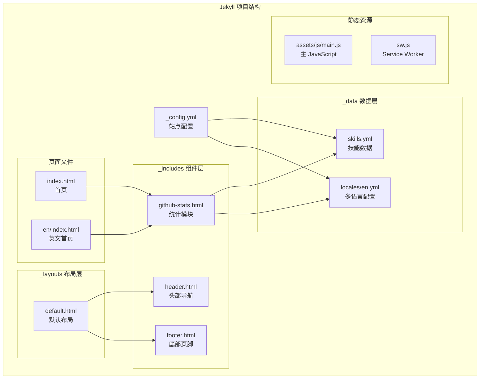
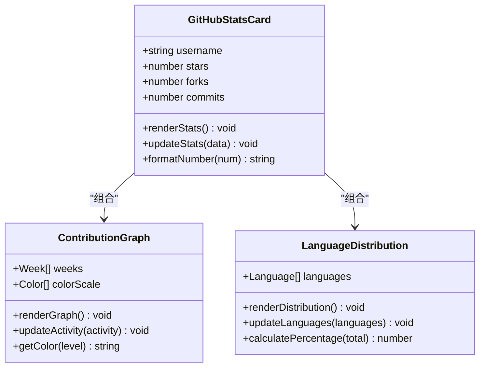
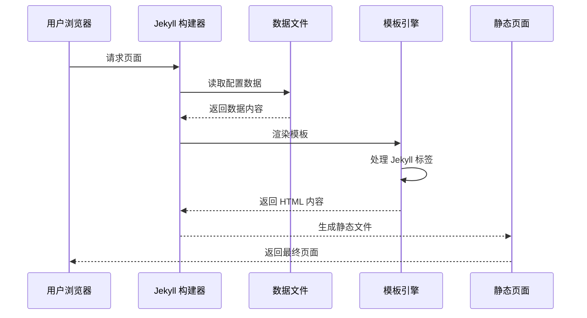
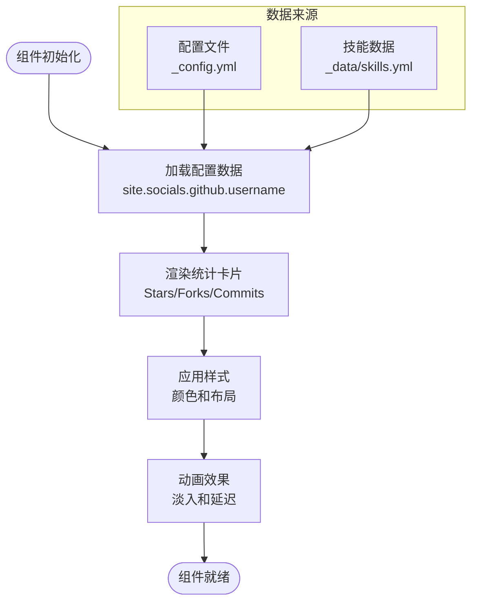
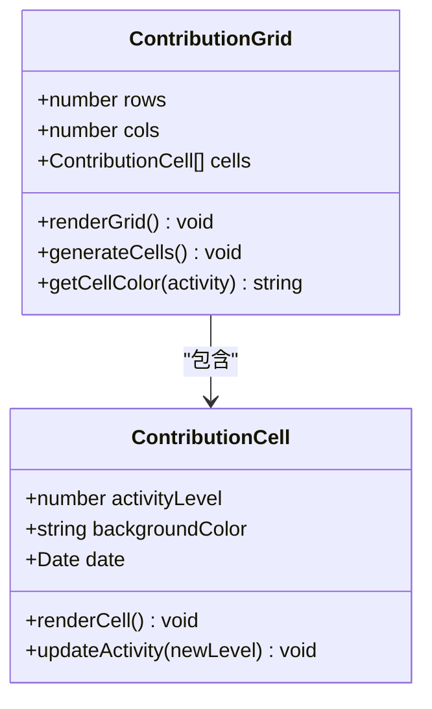
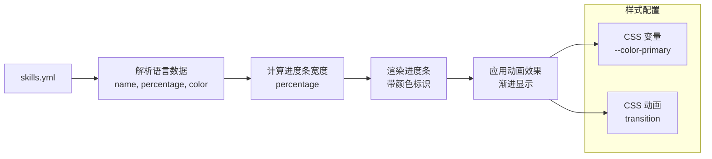
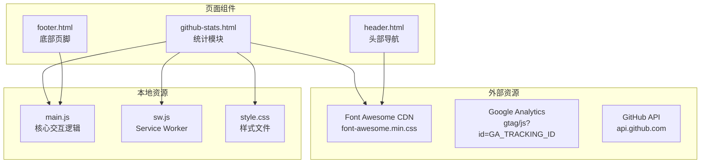
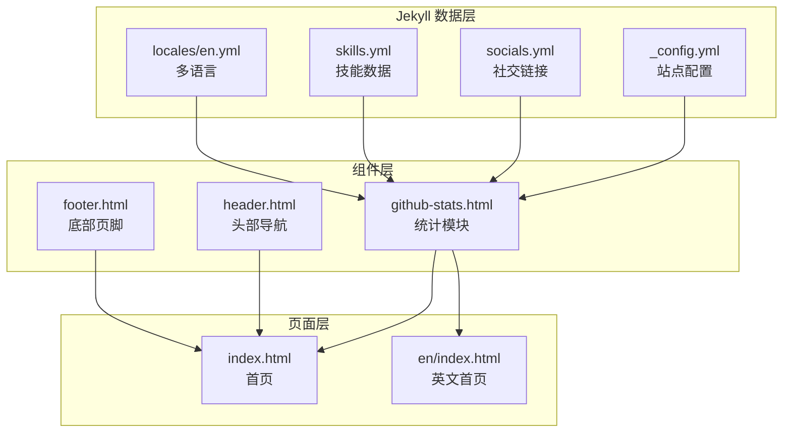
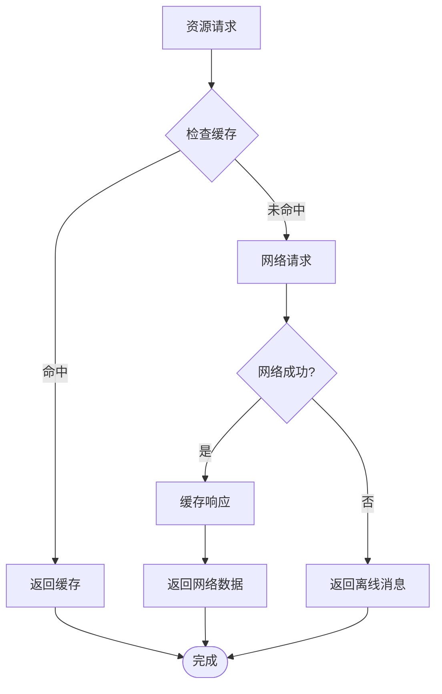

# GitHub 统计模块

<cite>
**本文档引用的文件**
- [github-stats.html](file://_includes/sections/github-stats.html)
- [_config.yml](file://_config.yml)
- [skills.yml](file://_data/skills.yml)
- [en.yml](file://_data/locales/en.yml)
- [main.js](file://assets/js/main.js)
- [sw.js](file://sw.js)
- [index.html](file://index.html)
- [README.md](file://README.md)
</cite>

## 目录
1. [简介](#简介)
2. [项目结构](#项目结构)
3. [核心组件](#核心组件)
4. [架构概览](#架构概览)
5. [详细组件分析](#详细组件分析)
6. [依赖关系分析](#依赖关系分析)
7. [性能考虑](#性能考虑)
8. [故障排除指南](#故障排除指南)
9. [结论](#结论)

## 简介

GitHub 统计模块是一个用于展示开发者 GitHub 账户统计信息的功能模块。该模块目前在项目中以静态形式存在，展示了基本的统计卡片、贡献图和语言分布，但尚未集成实际的 GitHub API 数据获取功能。

该模块的主要功能包括：
- 显示 GitHub 用户基本信息和统计数据
- 展示代码贡献活动图表
- 显示编程语言使用分布
- 提供响应式设计和主题支持

## 项目结构

该项目采用 Jekyll 静态站点生成器，GitHub 统计模块作为可复用组件集成在项目中：

**图表来源**
- [github-stats.html:1-75](file://_includes/sections/github-stats.html#L1-L75)
- [_config.yml:1-133](file://_config.yml#L1-L133)
- [skills.yml:1-41](file://_data/skills.yml#L1-L41)

**章节来源**
- [github-stats.html:1-75](file://_includes/sections/github-stats.html#L1-L75)
- [_config.yml:1-133](file://_config.yml#L1-L133)
- [README.md:26-63](file://README.md#L26-L63)

## 核心组件

### 统计卡片组件

统计卡片组件负责显示 GitHub 用户的基本统计信息，包括星标数、分支数和提交数等关键指标。

**图表来源**
- [github-stats.html:13-35](file://_includes/sections/github-stats.html#L13-L35)
- [github-stats.html:55-71](file://_includes/sections/github-stats.html#L55-L71)

### 多语言支持系统

项目内置了完整的多语言支持系统，支持中文和英文两种语言环境。

**章节来源**
- [github-stats.html:1-8](file://_includes/sections/github-stats.html#L1-L8)
- [en.yml:60-67](file://_data/locales/en.yml#L60-L67)

## 架构概览

当前的 GitHub 统计模块采用静态渲染架构，所有数据都来自 Jekyll 的数据文件系统：

**图表来源**
- [github-stats.html:1-75](file://_includes/sections/github-stats.html#L1-L75)
- [index.html:1-17](file://index.html#L1-L17)

## 详细组件分析

### 统计卡片组件实现

统计卡片组件目前使用硬编码的数据进行展示，实际部署时需要替换为动态数据：

**图表来源**
- [github-stats.html:13-35](file://_includes/sections/github-stats.html#L13-L35)
- [_config.yml:20-24](file://_config.yml#L20-L24)

### 贡献图组件分析

贡献图组件使用网格布局展示一年的代码贡献活动，采用渐变色表示活跃程度：

**图表来源**
- [github-stats.html:37-52](file://_includes/sections/github-stats.html#L37-L52)

### 语言分布组件实现

语言分布组件基于技能数据文件展示编程语言使用情况：

**图表来源**
- [github-stats.html:55-71](file://_includes/sections/github-stats.html#L55-L71)
- [skills.yml:28-41](file://_data/skills.yml#L28-L41)

**章节来源**
- [github-stats.html:1-75](file://_includes/sections/github-stats.html#L1-L75)
- [skills.yml:28-41](file://_data/skills.yml#L28-L41)

## 依赖关系分析

### 外部依赖

项目对外部资源的依赖主要通过 CDN 和 GitHub Pages 实现：

**图表来源**
- [sw.js:23-26](file://sw.js#L23-L26)
- [sw.js:207-211](file://sw.js#L207-L211)

### 内部依赖关系

**图表来源**
- [github-stats.html:1-75](file://_includes/sections/github-stats.html#L1-L75)
- [index.html:1-17](file://index.html#L1-L17)

**章节来源**
- [sw.js:1-38](file://sw.js#L1-L38)
- [sw.js:178-236](file://sw.js#L178-L236)

## 性能考虑

### 缓存策略

项目实现了完整的 Service Worker 缓存策略，支持离线访问和资源预缓存：

**图表来源**
- [sw.js:178-194](file://sw.js#L178-L194)

### 加载优化

项目采用了多种性能优化技术：

1. **资源预缓存**: 在 Service Worker 安装阶段预缓存关键资源
2. **外部资源缓存**: 缓存 Font Awesome 和 Google Analytics 等外部资源
3. **按需加载**: 使用 Intersection Observer 实现滚动动画的懒加载
4. **CSS 变量**: 使用 CSS 变量实现主题切换的高性能渲染

**章节来源**
- [sw.js:1-38](file://sw.js#L1-L38)
- [main.js:147-165](file://assets/js/main.js#L147-L165)

## 故障排除指南

### 常见问题及解决方案

#### GitHub 统计数据不显示

**问题描述**: GitHub 统计模块显示为空白或只显示占位符

**可能原因**:
1. Jekyll 数据文件配置错误
2. GitHub API 限流导致数据获取失败
3. 网络连接问题

**解决方案**:
1. 检查 `_config.yml` 中的 GitHub 用户名配置
2. 验证数据文件格式是否正确
3. 检查网络连接和防火墙设置

#### 主题切换失效

**问题描述**: 深色/浅色主题切换按钮无法正常工作

**可能原因**:
1. localStorage 权限被阻止
2. CSS 变量未正确应用
3. JavaScript 错误

**解决方案**:
1. 检查浏览器控制台是否有 JavaScript 错误
2. 验证 CSS 变量定义是否正确
3. 确认主题切换逻辑的执行

#### 响应式布局问题

**问题描述**: 在移动设备上布局错乱

**可能原因**:
1. CSS 媒体查询配置错误
2. viewport 设置问题
3. 字体大小适配不当

**解决方案**:
1. 检查 CSS 媒体查询断点设置
2. 验证 viewport meta 标签配置
3. 测试不同屏幕尺寸下的显示效果

**章节来源**
- [main.js:27-75](file://assets/js/main.js#L27-L75)
- [sw.js:1-38](file://sw.js#L1-L38)

## 结论

当前的 GitHub 统计模块为一个功能完整的静态展示组件，提供了良好的用户体验和性能表现。虽然目前没有集成实际的 GitHub API 数据获取功能，但其模块化的设计使得后续集成 API 功能变得相对简单。

### 当前优势

1. **性能优异**: 静态渲染，加载速度快
2. **离线支持**: 完整的 Service Worker 缓存策略
3. **响应式设计**: 适配各种设备屏幕
4. **主题支持**: 深色/浅色主题自动切换
5. **多语言支持**: 内置中英双语支持

### 改进建议

1. **集成 GitHub API**: 实现真实的统计数据获取
2. **添加缓存机制**: 减少 API 调用频率
3. **增强错误处理**: 提供更好的用户体验
4. **优化加载性能**: 实现数据懒加载
5. **扩展统计维度**: 添加更多有用的统计指标

该模块为开发者提供了一个良好的起点，可以在此基础上进一步扩展和完善，实现一个功能丰富、性能优异的 GitHub 统计系统。