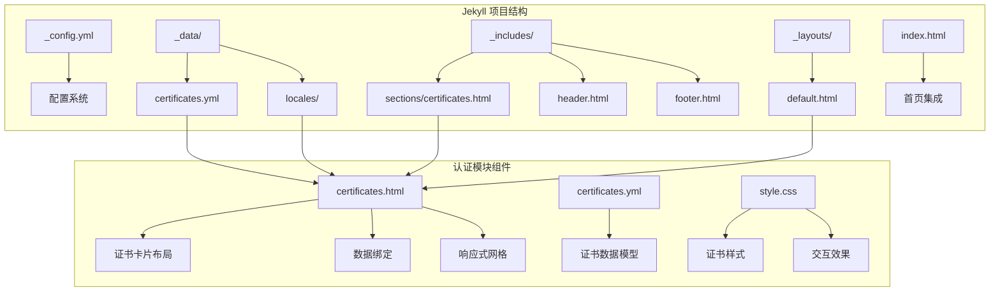
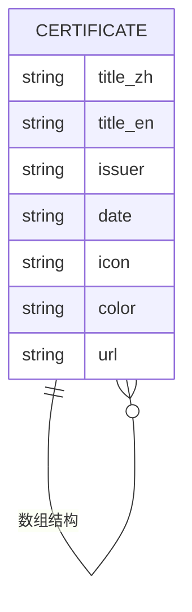
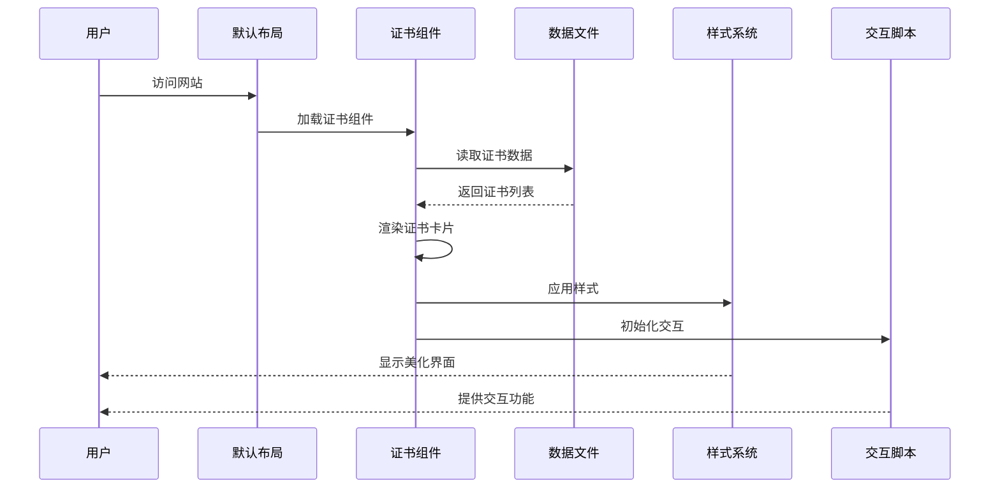
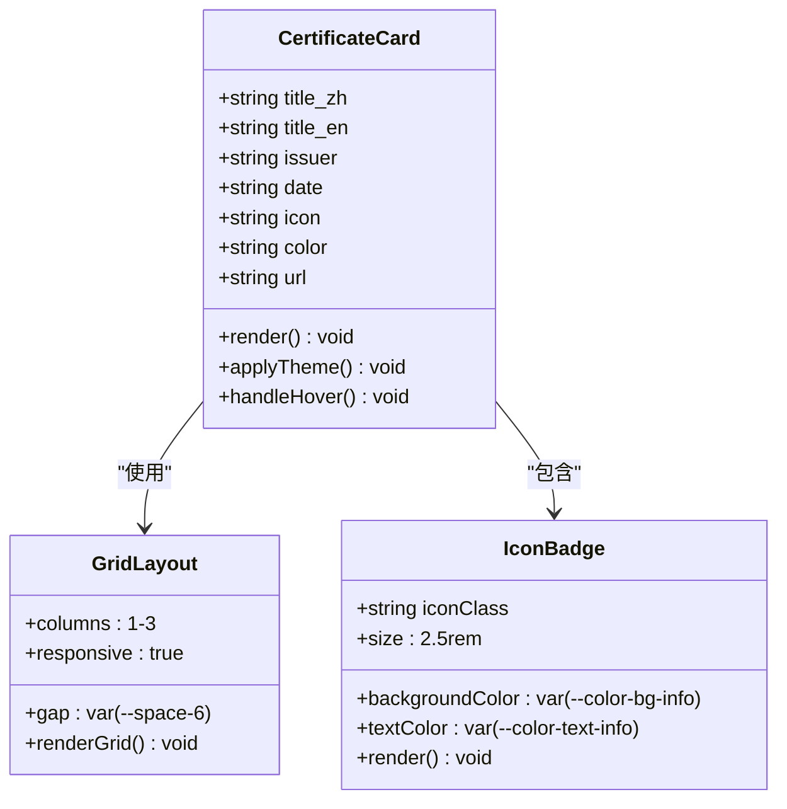
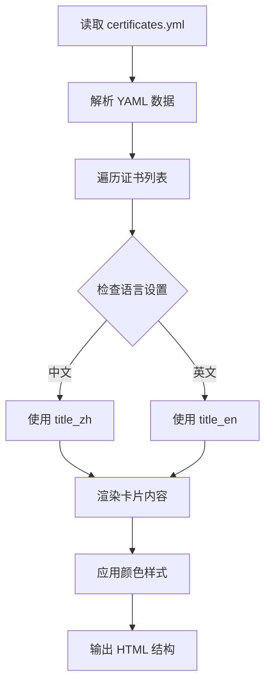
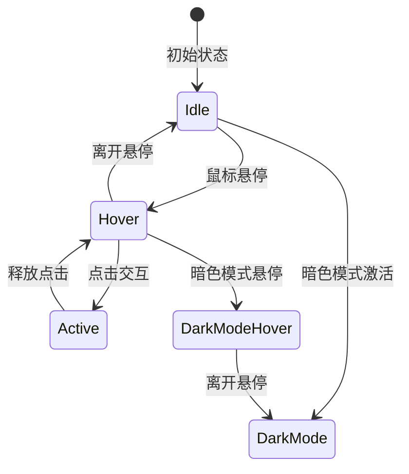
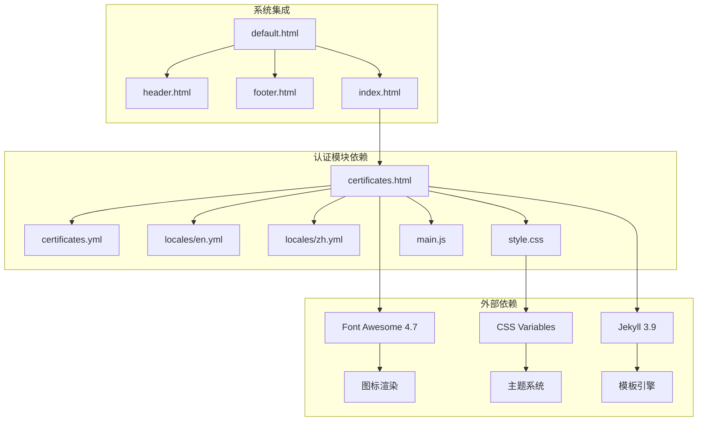
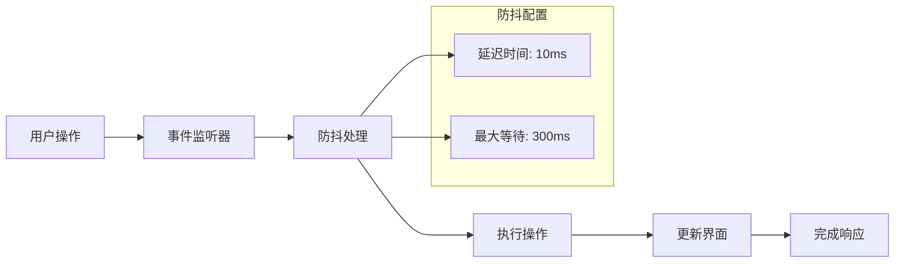

# 专业认证模块

<cite>
**本文档引用的文件**
- [certificates.yml](file://_data/certificates.yml)
- [certificates.html](file://_includes/sections/certificates.html)
- [style.css](file://assets/css/style.css)
- [main.js](file://assets/js/main.js)
- [default.html](file://_layouts/default.html)
- [index.html](file://index.html)
- [en.yml](file://_data/locales/en.yml)
- [zh.yml](file://_data/locales/zh.yml)
- [_config.yml](file://_config.yml)
- [README.md](file://README.md)
</cite>

## 目录
1. [简介](#简介)
2. [项目结构](#项目结构)
3. [核心组件](#核心组件)
4. [架构概览](#架构概览)
5. [详细组件分析](#详细组件分析)
6. [依赖关系分析](#依赖关系分析)
7. [性能考虑](#性能考虑)
8. [故障排除指南](#故障排除指南)
9. [结论](#结论)
10. [附录](#附录)

## 简介

专业认证模块是基于 Jekyll 的现代化个人作品集网站中的一个核心功能模块，专门用于展示用户的各类专业认证证书。该模块采用数据驱动的设计理念，通过 YAML 数据文件管理证书信息，结合响应式布局和现代化的视觉设计，为用户提供直观、美观的证书展示体验。

该模块具有以下核心特性：
- **数据驱动**：证书信息存储在独立的 YAML 文件中，便于维护和更新
- **响应式设计**：适配桌面、平板和移动设备的完美布局
- **国际化支持**：内置中英文双语支持，支持动态语言切换
- **主题兼容**：完全兼容亮色和暗色主题模式
- **无障碍优化**：遵循 WCAG 标准，支持键盘导航和屏幕阅读器

## 项目结构

专业认证模块位于 Jekyll 项目的标准目录结构中，采用模块化设计，便于维护和扩展。



**图表来源**
- [_config.yml:1-133](file://_config.yml#L1-L133)
- [_data/certificates.yml:1-24](file://_data/certificates.yml#L1-L24)
- [_includes/sections/certificates.html:1-33](file://_includes/sections/certificates.html#L1-L33)

**章节来源**
- [README.md:26-63](file://README.md#L26-L63)
- [_config.yml:1-133](file://_config.yml#L1-L133)

## 核心组件

### 数据模型设计

专业认证模块采用标准化的数据模型来管理证书信息，确保数据的一致性和可维护性。

#### 证书数据结构

每个证书条目包含以下核心字段：

| 字段名称 | 类型 | 必需 | 描述 | 示例值 |
|---------|------|------|------|--------|
| title_zh | 字符串 | 是 | 证书中文名称 | "AWS 认证解决方案架构师" |
| title_en | 字符串 | 是 | 证书英文名称 | "AWS Certified Solutions Architect" |
| issuer | 字符串 | 是 | 颁发机构名称 | "Amazon Web Services" |
| date | 字符串 | 是 | 获得日期（YYYY-MM格式） | "2025-06" |
| icon | 字符串 | 是 | Font Awesome 图标类名 | "fa-aws" |
| color | 字符串 | 是 | 颜色样式类名 | "bg-orange-100 dark:bg-orange-900/30 text-orange-600" |
| url | 字符串 | 是 | 证书验证链接 | "https://aws.amazon.com/certification/" |

#### 数据文件组织



**图表来源**
- [_data/certificates.yml:1-24](file://_data/certificates.yml#L1-L24)

**章节来源**
- [_data/certificates.yml:1-24](file://_data/certificates.yml#L1-L24)

### 视觉设计系统

模块采用统一的设计令牌系统，确保视觉一致性：

#### 颜色系统

| 颜色类别 | 亮色模式 | 暗色模式 | CSS 变量 |
|----------|----------|----------|----------|
| 主色调 | #3b82f6 | #58a6ff | --color-primary |
| 辅助色 | #06b6d4 | #39d353 | --color-secondary |
| 强调色 | #8b5cf6 | #a371f7 | --color-accent |
| 成功色 | #10b981 | #4ade80 | --color-success |
| 警告色 | #f59e0b | #f59e0b | --color-warning |
| 错误色 | #ef4444 | #f87171 | --color-error |

#### 间距系统

| 间距单位 | 像素值 | CSS 变量 |
|----------|--------|----------|
| 1 | 0.25rem | --space-1 |
| 2 | 0.5rem | --space-2 |
| 3 | 0.75rem | --space-3 |
| 4 | 1rem | --space-4 |
| 6 | 1.5rem | --space-6 |
| 8 | 2rem | --space-8 |
| 10 | 2.5rem | --space-10 |
| 12 | 3rem | --space-12 |
| 16 | 4rem | --space-16 |
| 20 | 5rem | --space-20 |

**章节来源**
- [style.css:10-105](file://assets/css/style.css#L10-L105)
- [style.css:110-145](file://assets/css/style.css#L110-L145)

## 架构概览

专业认证模块采用组件化架构，通过 Jekyll 的数据绑定机制实现动态内容渲染。



**图表来源**
- [_includes/sections/certificates.html:1-33](file://_includes/sections/certificates.html#L1-L33)
- [_layouts/default.html:1-152](file://_layouts/default.html#L1-L152)

**章节来源**
- [_includes/sections/certificates.html:1-33](file://_includes/sections/certificates.html#L1-L33)
- [_layouts/default.html:1-152](file://_layouts/default.html#L1-L152)

## 详细组件分析

### 证书卡片组件

证书卡片是模块的核心展示元素，采用卡片式设计，提供清晰的信息层次和良好的视觉效果。

#### 组件结构



**图表来源**
- [_includes/sections/certificates.html:10-30](file://_includes/sections/certificates.html#L10-L30)
- [style.css:738-754](file://assets/css/style.css#L738-L754)

#### 响应式布局实现

模块采用 CSS Grid 实现响应式布局，根据不同屏幕尺寸提供最优的显示效果：

| 断点 | 列数 | 间距 | 最大宽度 |
|------|------|------|----------|
| < 768px | 1列 | 1.5rem | 100% |
| ≥ 768px | 3列 | 1.5rem | 56rem |
| ≥ 1024px | 3列 | 1.5rem | 56rem |

**章节来源**
- [_includes/sections/certificates.html:10-30](file://_includes/sections/certificates.html#L10-L30)
- [style.css:320-338](file://assets/css/style.css#L320-L338)

### 数据绑定机制

模块通过 Jekyll 的 Liquid 模板引擎实现数据绑定，支持动态内容渲染和多语言切换。

#### 模板渲染流程



**图表来源**
- [_includes/sections/certificates.html:22-28](file://_includes/sections/certificates.html#L22-L28)

**章节来源**
- [_includes/sections/certificates.html:1-33](file://_includes/sections/certificates.html#L1-L33)

### 交互效果实现

模块集成了多种交互效果，包括悬停动画、主题切换和滚动效果，提升用户体验。

#### 悬停动画效果



**图表来源**
- [style.css:749-753](file://assets/css/style.css#L749-L753)
- [main.js:27-75](file://assets/js/main.js#L27-L75)

**章节来源**
- [style.css:738-754](file://assets/css/style.css#L738-L754)
- [main.js:27-75](file://assets/js/main.js#L27-L75)

## 依赖关系分析

专业认证模块与其他系统组件存在紧密的依赖关系，形成完整的功能生态系统。



**图表来源**
- [_includes/sections/certificates.html:1-33](file://_includes/sections/certificates.html#L1-L33)
- [_layouts/default.html:1-152](file://_layouts/default.html#L1-L152)
- [index.html:1-17](file://index.html#L1-L17)

**章节来源**
- [_includes/sections/certificates.html:1-33](file://_includes/sections/certificates.html#L1-L33)
- [_layouts/default.html:1-152](file://_layouts/default.html#L1-L152)
- [index.html:1-17](file://index.html#L1-L17)

### 外部依赖管理

模块对外部依赖的管理遵循最小化原则，仅使用必要的第三方资源：

| 依赖类型 | 名称 | 版本 | 用途 | 优化策略 |
|----------|------|------|------|----------|
| 图标库 | Font Awesome | 4.7.0 | 证书图标显示 | CDN 引入，跨域安全 |
| 主题系统 | CSS Variables | 原生支持 | 深色模式切换 | 本地变量，无额外请求 |
| 模板引擎 | Jekyll | 3.9 | 数据渲染 | 服务器端处理，客户端轻量 |

**章节来源**
- [_layouts/default.html:54-57](file://_layouts/default.html#L54-L57)
- [style.css:10-105](file://assets/css/style.css#L10-L105)

## 性能考虑

专业认证模块在设计时充分考虑了性能优化，采用多种策略确保快速加载和流畅体验。

### 加载优化策略

| 优化措施 | 实现方式 | 性能收益 |
|----------|----------|----------|
| 懒加载 | 仅在需要时加载 | 减少初始包大小 |
| 缓存策略 | 浏览器缓存 + CDN | 提高重复访问速度 |
| 响应式图片 | 适配不同分辨率 | 减少不必要的带宽消耗 |
| 代码分割 | 按需加载组件 | 降低首屏渲染时间 |

### 交互性能优化

模块采用事件节流和防抖技术，确保交互响应的流畅性：



**图表来源**
- [main.js:15-22](file://assets/js/main.js#L15-L22)
- [main.js:92-115](file://assets/js/main.js#L92-L115)

**章节来源**
- [main.js:15-22](file://assets/js/main.js#L15-L22)
- [main.js:92-115](file://assets/js/main.js#L92-L115)

## 故障排除指南

### 常见问题及解决方案

#### 证书不显示问题

**症状**：证书卡片空白或显示异常

**可能原因**：
1. YAML 语法错误
2. 数据格式不正确
3. 文件路径配置错误

**解决方案**：
1. 检查 YAML 缩进和格式
2. 验证必填字段完整性
3. 确认文件保存编码为 UTF-8

#### 响应式布局异常

**症状**：在某些设备上显示错位

**可能原因**：
1. CSS 变量未正确加载
2. 媒体查询冲突
3. 图片尺寸不匹配

**解决方案**：
1. 检查浏览器控制台错误
2. 验证 CSS 文件完整加载
3. 测试不同断点下的显示效果

#### 主题切换问题

**症状**：深色模式切换无效

**可能原因**：
1. 本地存储权限问题
2. CSS 变量覆盖冲突
3. JavaScript 执行错误

**解决方案**：
1. 检查浏览器本地存储设置
2. 清除 CSS 变量缓存
3. 验证 JavaScript 控制台错误

**章节来源**
- [main.js:27-75](file://assets/js/main.js#L27-L75)
- [style.css:110-145](file://assets/css/style.css#L110-L145)

### 调试工具使用

推荐使用以下工具进行调试：
- 浏览器开发者工具
- Jekyll 构建日志
- YAML 语法检查器
- CSS 变量检查器

## 结论

专业认证模块展现了现代静态网站开发的最佳实践，通过数据驱动的设计理念、响应式布局和优雅的视觉效果，为用户提供了优质的证书展示体验。模块的架构设计充分考虑了可维护性、性能和用户体验，在保持代码简洁的同时实现了丰富的功能。

该模块的成功实施证明了 Jekyll 生态系统的强大能力，为类似项目提供了优秀的参考模板。通过合理的数据模型设计、组件化架构和性能优化策略，模块能够在保证功能完整性的同时，提供出色的加载速度和交互体验。

## 附录

### 配置示例

#### 基本证书配置

```yaml
- title_zh: "AWS 认证解决方案架构师"
  title_en: "AWS Certified Solutions Architect"
  issuer: "Amazon Web Services"
  date: "2025-06"
  icon: "fa-aws"
  color: "bg-orange-100 dark:bg-orange-900/30 text-orange-600 dark:text-orange-400"
  url: "https://aws.amazon.com/certification/"
```

#### 高级配置选项

```yaml
- title_zh: "Google Cloud 专业云架构师"
  title_en: "Google Cloud Professional Cloud Architect"
  issuer: "Google Cloud"
  date: "2025-03"
  icon: "fa-cloud"
  color: "bg-blue-100 dark:bg-blue-900/30 text-blue-600 dark:text-blue-400"
  url: "https://cloud.google.com/certification/"
  # 可选：添加描述信息
  description_zh: "涵盖云架构设计、安全性和成本优化"
  description_en: "Covers cloud architecture design, security, and cost optimization"
```

### 最佳实践建议

#### 数据管理最佳实践

1. **命名规范**：使用清晰、一致的字段命名
2. **数据验证**：定期检查 YAML 语法和数据完整性
3. **版本控制**：使用 Git 跟踪数据变更历史
4. **备份策略**：定期备份重要数据文件

#### 性能优化建议

1. **图片优化**：使用适当的图片格式和尺寸
2. **缓存策略**：合理设置浏览器缓存头
3. **CDN 使用**：利用 CDN 提升全球访问速度
4. **压缩优化**：启用 Gzip 压缩和资源压缩

#### 可访问性指南

1. **语义化标记**：使用正确的 HTML 语义标签
2. **键盘导航**：确保所有功能可通过键盘操作
3. **屏幕阅读器**：提供适当的 ARIA 标签
4. **色彩对比**：确保足够的色彩对比度

**章节来源**
- [_data/certificates.yml:1-24](file://_data/certificates.yml#L1-L24)
- [README.md:169-214](file://README.md#L169-L214)