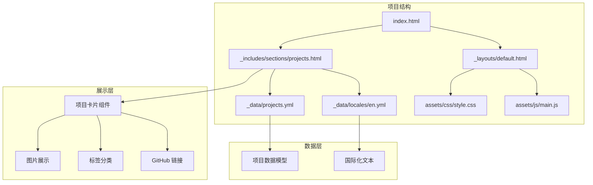
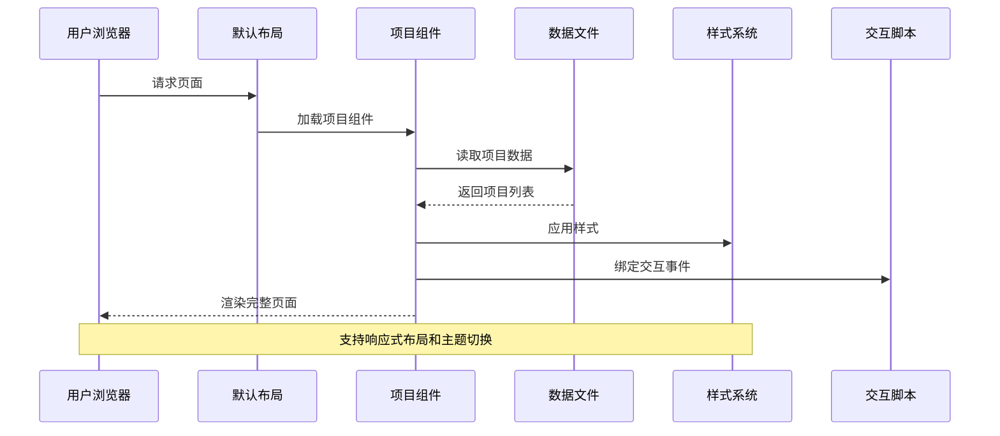
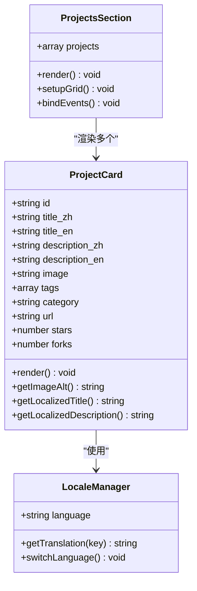
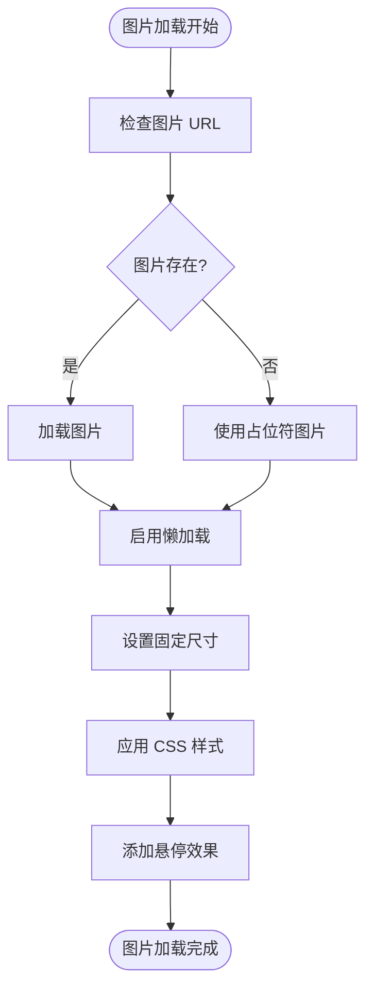
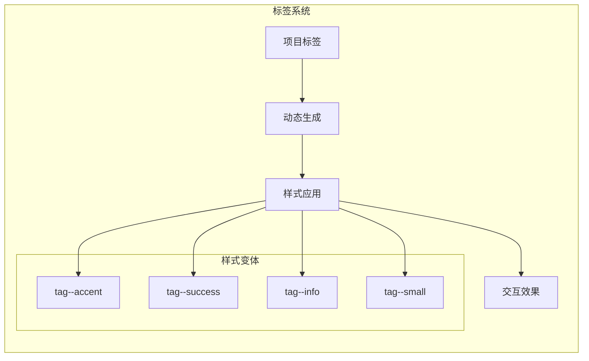
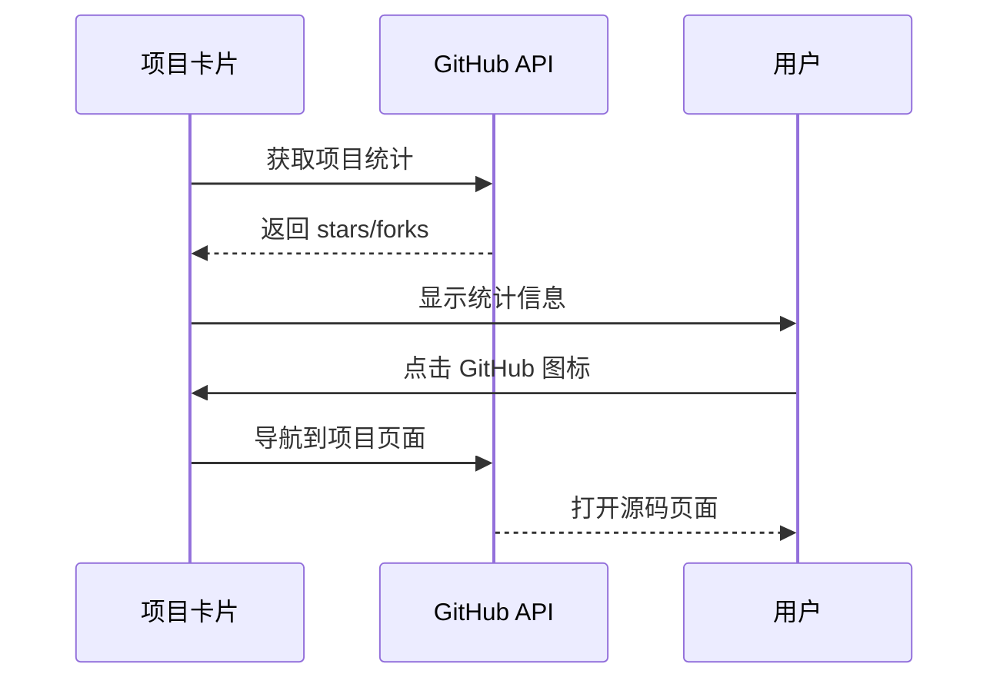
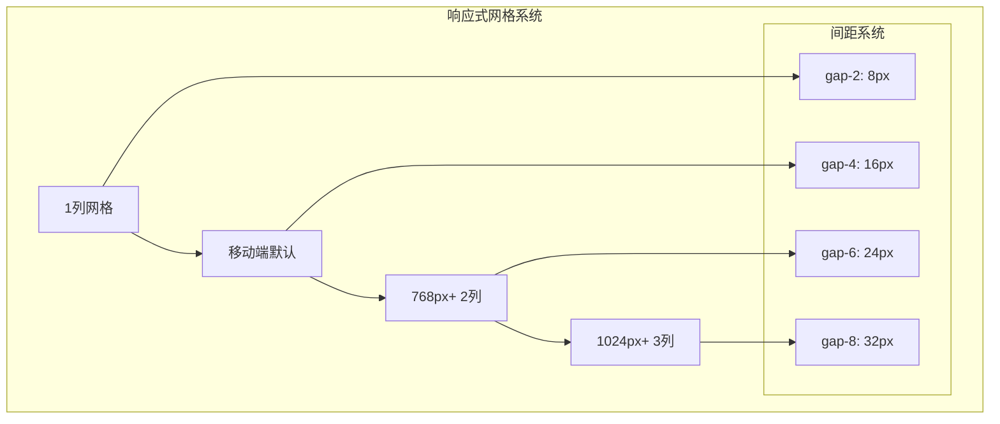
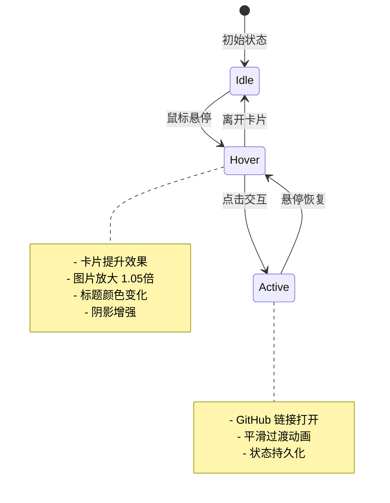
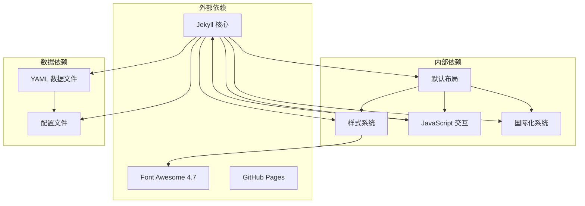

# 作品集展示模块

<cite>
**本文档引用的文件**
- [_data/projects.yml](file://_data/projects.yml)
- [_includes/sections/projects.html](file://_includes/sections/projects.html)
- [_config.yml](file://_config.yml)
- [assets/css/style.css](file://assets/css/style.css)
- [assets/js/main.js](file://assets/js/main.js)
- [_data/locales/en.yml](file://_data/locales/en.yml)
- [_layouts/default.html](file://_layouts/default.html)
- [index.html](file://index.html)
- [_posts/2026-03-15-taskflow-pro.md](file://_posts/2026-03-15-taskflow-pro.md)
- [_posts/2026-04-02-typescript-advanced-guide.md](file://_posts/2026-04-02-typescript-advanced-guide.md)
- [README.md](file://README.md)
</cite>

## 目录
1. [简介](#简介)
2. [项目结构](#项目结构)
3. [核心组件](#核心组件)
4. [架构概览](#架构概览)
5. [详细组件分析](#详细组件分析)
6. [依赖关系分析](#依赖关系分析)
7. [性能考虑](#性能考虑)
8. [故障排除指南](#故障排除指南)
9. [结论](#结论)
10. [附录](#附录)

## 简介

作品集展示模块是基于 Jekyll 构建的现代化个人作品集网站的核心功能模块。该模块通过数据驱动的方式展示开发者的作品集，采用卡片式布局设计，支持响应式显示和深色模式切换。模块实现了完整的项目展示功能，包括图片展示、标签分类系统和 GitHub 链接集成机制。

该模块的设计理念遵循现代化 Web 开发最佳实践，注重性能优化、无障碍访问和用户体验。通过纯静态生成的方式，确保网站具有出色的加载性能和 SEO 友好性。

## 项目结构

作品集展示模块位于项目的 `_includes/sections/projects.html` 文件中，配合 `_data/projects.yml` 数据文件实现动态内容展示。整个模块采用组件化架构，与其他页面组件高度解耦。

**图表来源**
- [index.html:1-17](file://index.html#L1-L17)
- [_includes/sections/projects.html:1-50](file://_includes/sections/projects.html#L1-L50)
- [_data/projects.yml:1-45](file://_data/projects.yml#L1-L45)

**章节来源**
- [index.html:1-17](file://index.html#L1-L17)
- [_includes/sections/projects.html:1-50](file://_includes/sections/projects.html#L1-L50)
- [README.md:26-63](file://README.md#L26-L63)

## 核心组件

作品集展示模块由三个主要组件构成：

### 1. 项目卡片组件 (Project Card Component)
这是模块的核心展示单元，负责渲染单个项目的信息。每个项目卡片包含：
- **图片展示区域**：显示项目缩略图，支持懒加载和响应式适配
- **标题和描述**：支持中英文双语显示
- **技术标签系统**：动态显示项目使用的技术栈
- **GitHub 集成**：显示项目星级和 Fork 数，提供源码链接

### 2. 数据驱动系统
模块通过 `_data/projects.yml` 文件实现数据驱动的内容管理：
- **结构化数据存储**：使用 YAML 格式存储项目元数据
- **国际化支持**：分别存储中英文标题和描述
- **分类系统**：支持项目分类和标签管理
- **社交集成**：集成 GitHub 仓库信息

### 3. 响应式布局系统
采用现代化的 CSS Grid 和 Flexbox 技术：
- **移动端优先**：从移动设备开始设计，逐步增强到桌面端
- **弹性网格**：支持 1-3 列的自适应网格布局
- **主题适配**：完美支持亮色和深色模式切换

**章节来源**
- [_includes/sections/projects.html:14-47](file://_includes/sections/projects.html#L14-L47)
- [_data/projects.yml:1-45](file://_data/projects.yml#L1-L45)
- [assets/css/style.css:319-338](file://assets/css/style.css#L319-L338)

## 架构概览

作品集展示模块采用分层架构设计，实现了清晰的关注点分离：

**图表来源**
- [_layouts/default.html:117-151](file://_layouts/default.html#L117-L151)
- [_includes/sections/projects.html:1-50](file://_includes/sections/projects.html#L1-L50)
- [_data/projects.yml:1-45](file://_data/projects.yml#L1-L45)

模块的架构特点：
- **数据驱动**：内容完全由 YAML 数据文件驱动
- **组件化**：采用可复用的 HTML 组件
- **响应式**：基于 CSS Grid 和媒体查询的自适应设计
- **可访问性**：遵循 WCAG 标准，支持键盘导航

## 详细组件分析

### 项目卡片组件实现

项目卡片组件是整个模块的核心，采用了精心设计的 HTML 结构和 CSS 样式：

**图表来源**
- [_includes/sections/projects.html:16-46](file://_includes/sections/projects.html#L16-L46)
- [_data/projects.yml:1-45](file://_data/projects.yml#L1-L45)

#### 图片展示机制

项目卡片的图片展示采用了现代的响应式图片技术：

**图表来源**
- [_includes/sections/projects.html:18](file://_includes/sections/projects.html#L18)
- [assets/css/style.css:609-624](file://assets/css/style.css#L609-L624)

#### 标签分类系统

标签系统实现了灵活的技术栈展示功能：

**图表来源**
- [_includes/sections/projects.html:30-34](file://_includes/sections/projects.html#L30-L34)
- [assets/css/style.css:449-488](file://assets/css/style.css#L449-L488)

#### GitHub 链接集成机制

GitHub 链接集成了项目统计信息和外部链接：

**图表来源**
- [_includes/sections/projects.html:36-42](file://_includes/sections/projects.html#L36-L42)
- [_data/projects.yml:11-13](file://_data/projects.yml#L11-L13)

### 数据模型定义

项目数据采用结构化的 YAML 格式存储，每个项目包含以下字段：

| 字段名 | 类型 | 必需 | 描述 | 示例 |
|--------|------|------|------|------|
| id | number | 是 | 项目唯一标识符 | 1 |
| title_zh | string | 是 | 中文项目标题 | Web 应用程序 |
| title_en | string | 是 | 英文项目标题 | Web Application |
| description_zh | string | 是 | 中文项目描述 | 具有响应式设计... |
| description_en | string | 是 | 英文项目描述 | Full-featured web application... |
| image | string | 是 | 项目图片 URL | https://picsum.photos/... |
| tags | array | 是 | 技术栈标签列表 | ["React", "Node.js"] |
| category | string | 是 | 项目分类 | JavaScript |
| url | string | 是 | GitHub 仓库链接 | https://github.com/... |
| stars | number | 是 | GitHub 星标数量 | 120 |
| forks | number | 是 | GitHub Fork 数量 | 35 |

**章节来源**
- [_data/projects.yml:1-45](file://_data/projects.yml#L1-L45)

### 响应式布局设计

模块实现了完整的响应式设计，支持从移动设备到桌面端的完美适配：

**图表来源**
- [assets/css/style.css:319-338](file://assets/css/style.css#L319-L338)
- [assets/css/style.css:325-338](file://assets/css/style.css#L325-L338)

### 交互效果实现

项目卡片实现了丰富的交互效果，提升了用户体验：

**图表来源**
- [assets/css/style.css:596-640](file://assets/css/style.css#L596-L640)

**章节来源**
- [assets/css/style.css:596-640](file://assets/css/style.css#L596-L640)
- [assets/js/main.js:258-278](file://assets/js/main.js#L258-L278)

## 依赖关系分析

作品集展示模块的依赖关系相对简单，主要依赖于 Jekyll 的数据系统和静态资源：

**图表来源**
- [_layouts/default.html:55-57](file://_layouts/default.html#L55-L57)
- [_config.yml:109-113](file://_config.yml#L109-L113)

模块的依赖特点：
- **低耦合**：各组件之间依赖关系清晰
- **可替换性**：样式和脚本可以独立替换
- **扩展性**：易于添加新的项目字段和功能

**章节来源**
- [_config.yml:109-113](file://_config.yml#L109-L113)
- [_layouts/default.html:55-57](file://_layouts/default.html#L55-L57)

## 性能考虑

作品集展示模块在设计时充分考虑了性能优化：

### 加载性能
- **静态生成**：使用 Jekyll 预生成静态 HTML，避免运行时渲染
- **图片优化**：采用懒加载和固定尺寸，减少首次渲染时间
- **CSS 优化**：使用 CSS 变量和内联关键样式

### 交互性能
- **事件节流**：JavaScript 事件使用防抖技术
- **硬件加速**：CSS3 变换使用 GPU 加速
- **内存管理**：及时清理事件监听器

### SEO 优化
- **结构化数据**：提供完整的 SEO 元数据
- **语义化标记**：使用正确的 HTML 语义标签
- **可访问性**：支持屏幕阅读器和键盘导航

**章节来源**
- [assets/js/main.js:15-22](file://assets/js/main.js#L15-L22)
- [_layouts/default.html:12-48](file://_layouts/default.html#L12-L48)

## 故障排除指南

### 常见问题及解决方案

#### 1. 项目图片不显示
**症状**：项目卡片中的图片显示为占位符
**原因**：图片 URL 无效或网络问题
**解决方案**：
- 检查 `_data/projects.yml` 中的图片 URL
- 确保图片 URL 可访问
- 使用可靠的图片托管服务

#### 2. 标签样式异常
**症状**：技术标签显示样式不正确
**原因**：CSS 类名冲突或样式覆盖
**解决方案**：
- 检查自定义 CSS 是否覆盖了标签样式
- 确保使用正确的标签类名
- 清除浏览器缓存重新加载

#### 3. 响应式布局错乱
**症状**：在某些屏幕尺寸下布局异常
**原因**：媒体查询或网格系统配置错误
**解决方案**：
- 检查 CSS 媒体查询断点
- 验证网格系统的响应式类名
- 测试不同设备的显示效果

#### 4. GitHub 链接失效
**症状**：点击 GitHub 图标无法打开项目页面
**原因**：项目 URL 配置错误
**解决方案**：
- 检查 `_data/projects.yml` 中的 URL 字段
- 确保 GitHub 仓库链接有效
- 验证项目是否公开可访问

**章节来源**
- [_data/projects.yml:6, 21, 36:6-6](file://_data/projects.yml#L6-L6)
- [_includes/sections/projects.html:18, 40:18-40](file://_includes/sections/projects.html#L18-L40)

## 结论

作品集展示模块是一个设计精良、实现优雅的现代化作品集展示系统。它成功地将数据驱动、组件化和响应式设计相结合，为开发者提供了一个功能完整、性能优异的作品集展示解决方案。

模块的主要优势包括：
- **数据驱动**：通过 YAML 文件轻松管理内容
- **响应式设计**：完美适配各种设备和屏幕尺寸
- **性能优化**：静态生成和优化的资源加载
- **可访问性**：遵循 Web 标准，支持辅助技术
- **可扩展性**：模块化设计便于功能扩展

该模块不仅满足了当前的需求，还为未来的功能扩展奠定了良好的基础。通过合理的架构设计和代码组织，使得维护和定制变得简单直接。

## 附录

### 数据添加和修改步骤

#### 添加新项目
1. 打开 `_data/projects.yml` 文件
2. 复制现有项目的结构
3. 填写新的项目信息
4. 保存文件并预览效果

#### 修改项目信息
1. 在 `_data/projects.yml` 中找到对应项目
2. 修改所需的字段值
3. 保存并检查显示效果

#### 图片上传规范
- **格式**：推荐使用 JPG 或 PNG 格式
- **尺寸**：建议使用 600x400 像素的图片
- **大小**：控制在 200KB 以内
- **URL**：使用稳定的图片托管服务

#### 标签命名约定
- **技术栈**：使用标准的技术名称
- **分类**：使用简洁的分类标签
- **长度**：建议不超过 15 个字符
- **格式**：使用驼峰命名或短横线分隔

#### 链接格式要求
- **GitHub URL**：必须是有效的 GitHub 仓库链接
- **演示链接**：使用 HTTPS 协议
- **源码链接**：指向具体的代码仓库
- **协议**：推荐使用 HTTPS

### 自定义选项

#### 主题定制
- **主色调**：修改 `theme_settings.primary_color`
- **辅色调**：修改 `theme_settings.accent_color`
- **字体**：修改 `theme_settings.font_family`

#### 布局调整
- **网格列数**：修改 CSS Grid 类名
- **间距系统**：调整 CSS 变量值
- **响应式断点**：修改媒体查询条件

#### 功能扩展
- **新字段**：在 YAML 数据中添加新字段
- **新样式**：在 CSS 文件中添加新样式
- **新交互**：在 JavaScript 中添加新功能

**章节来源**
- [_config.yml:38-43](file://_config.yml#L38-L43)
- [assets/css/style.css:10-105](file://assets/css/style.css#L10-L105)
- [README.md:169-214](file://README.md#L169-L214)