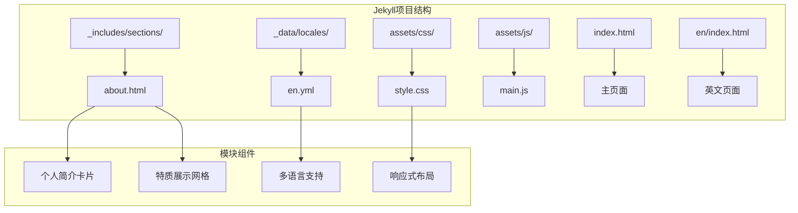
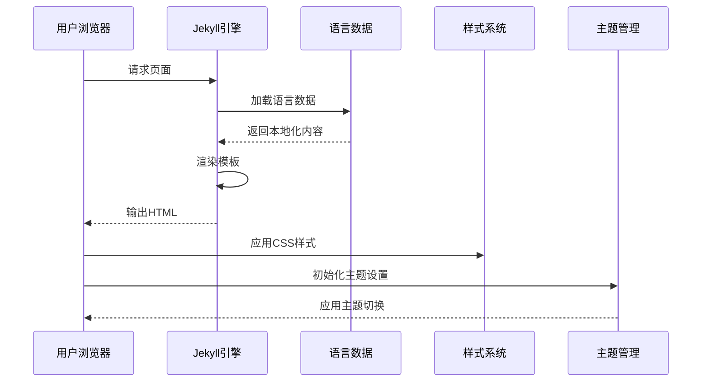
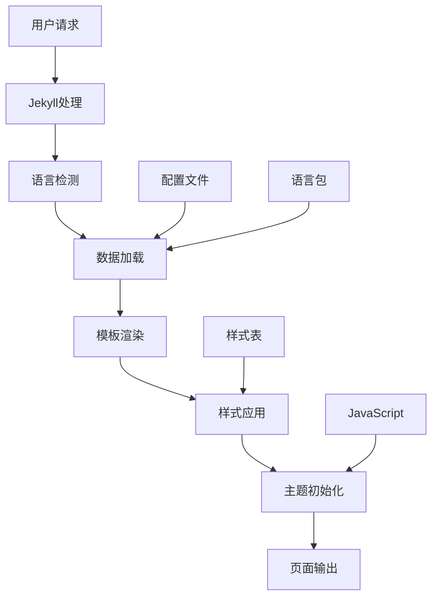
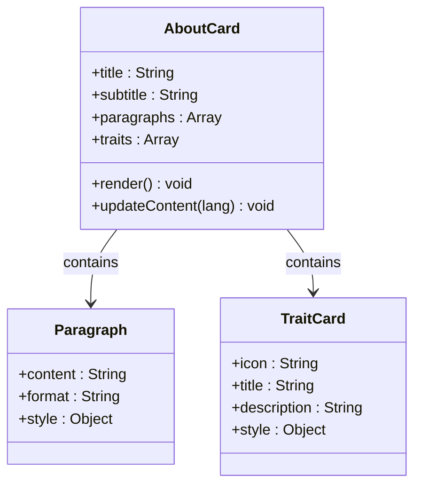
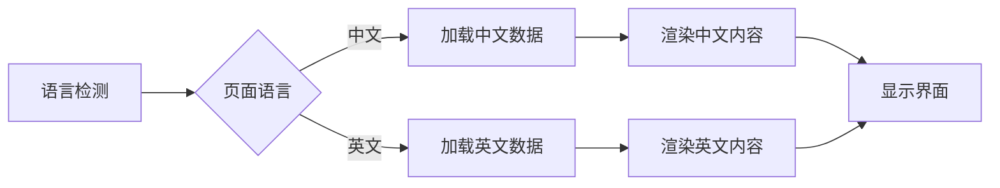
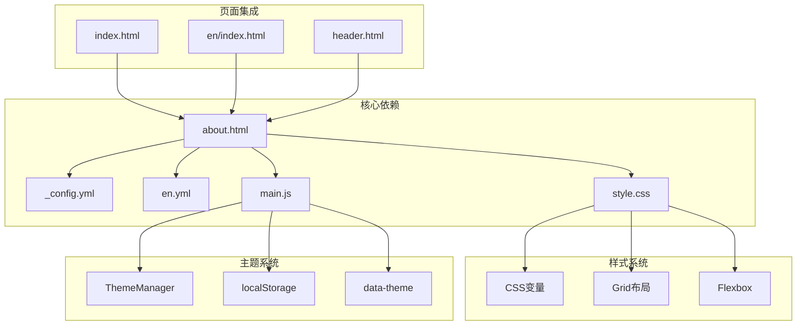

# 关于我模块

<cite>
**本文档引用的文件**
- [about.html](file://_includes/sections/about.html)
- [en.yml](file://_data/locales/en.yml)
- [_config.yml](file://_config.yml)
- [main.js](file://assets/js/main.js)
- [style.css](file://assets/css/style.css)
- [index.html](file://index.html)
- [index.html](file://en/index.html)
- [header.html](file://_includes/header.html)
- [footer.html](file://_includes/footer.html)
- [hero.html](file://_includes/sections/hero.html)
</cite>

## 目录
1. [简介](#简介)
2. [项目结构](#项目结构)
3. [核心组件](#核心组件)
4. [架构概览](#架构概览)
5. [详细组件分析](#详细组件分析)
6. [依赖关系分析](#依赖关系分析)
7. [性能考虑](#性能考虑)
8. [故障排除指南](#故障排除指南)
9. [结论](#结论)

## 简介

"关于我"模块是个人网站的核心展示区域，负责向访问者传达个人品牌信息、专业背景和价值主张。该模块采用Jekyll静态站点生成器构建，结合多语言支持系统，为用户提供个性化的浏览体验。

本模块的主要功能包括：
- 个人简介展示（姓名、头衔、简短介绍）
- 职业背景描述（编程经历、技能发展）
- 个人特质展示（开源贡献、终身学习、团队协作）
- 多语言内容切换
- 响应式设计适配

## 项目结构

基于Jekyll框架的模块化组织结构，"关于我"模块位于以下目录结构中：



**图表来源**
- [about.html:1-48](file://_includes/sections/about.html#L1-L48)
- [en.yml:25-37](file://_data/locales/en.yml#L25-L37)
- [style.css:359-400](file://assets/css/style.css#L359-L400)

**章节来源**
- [about.html:1-48](file://_includes/sections/about.html#L1-L48)
- [index.html:1-17](file://index.html#L1-L17)
- [index.html:1-22](file://en/index.html#L1-L22)

## 核心组件

"关于我"模块由多个精心设计的组件构成，每个组件都有特定的功能和职责：

### 主要内容结构

模块采用三段式内容布局：
1. **个人介绍段落** - 欢迎语和基本介绍
2. **详细背景描述** - 编程经历和技能发展
3. **个人特质展示** - 三个核心价值主张的卡片布局

### 多语言支持系统

通过Jekyll的数据文件系统实现完整的国际化支持：
- 中文默认语言配置
- 英文语言包定义
- 动态语言切换机制
- 自适应界面布局

### 响应式设计架构

采用CSS Grid和Flexbox技术实现：
- 移动端单列布局
- 平板端双列布局  
- 桌面端三列布局
- 流畅的断点过渡

**章节来源**
- [about.html:9-47](file://_includes/sections/about.html#L9-L47)
- [en.yml:25-37](file://_data/locales/en.yml#L25-L37)
- [style.css:320-338](file://assets/css/style.css#L320-L338)

## 架构概览

"关于我"模块的整体架构体现了现代前端开发的最佳实践：



**图表来源**
- [about.html:1](file://_includes/sections/about.html#L1)
- [en.yml:1](file://_data/locales/en.yml#L1)
- [main.js:263-278](file://assets/js/main.js#L263-L278)

### 数据流架构



**图表来源**
- [_config.yml:62-75](file://_config.yml#L62-L75)
- [style.css:10-105](file://assets/css/style.css#L10-L105)
- [main.js:263-278](file://assets/js/main.js#L263-L278)

## 详细组件分析

### 个人简介卡片组件

个人简介卡片是模块的核心视觉元素，采用现代化的设计理念：



**图表来源**
- [about.html:10-44](file://_includes/sections/about.html#L10-L44)

#### 内容结构分析

个人简介卡片包含三个主要部分：

1. **欢迎段落** - 动态插入用户姓名的个性化问候
2. **背景描述** - 详细的编程经历和技术理念阐述
3. **特质展示** - 三个核心价值主张的可视化呈现

每个特质卡片都包含：
- 专用图标装饰
- 简洁的标题说明
- 详细的描述文本
- 交互式悬停效果

**章节来源**
- [about.html:11-19](file://_includes/sections/about.html#L11-L19)
- [about.html:21-43](file://_includes/sections/about.html#L21-L43)

### 多语言支持系统

模块实现了完整的国际化解决方案：



**图表来源**
- [about.html:1](file://_includes/sections/about.html#L1)
- [en.yml:25-31](file://_data/locales/en.yml#L25-L31)

#### 语言切换机制

语言切换通过以下步骤实现：

1. **URL路由识别** - 根据URL路径确定目标语言
2. **数据文件加载** - 加载对应语言的数据文件
3. **动态内容替换** - 更新页面中的所有文本内容
4. **界面状态同步** - 更新导航和界面元素的语言状态

**章节来源**
- [header.html:37-56](file://_includes/header.html#L37-L56)
- [index.html:4](file://index.html#L4)
- [index.html:4](file://en/index.html#L4)

### 响应式布局系统

采用CSS Grid实现灵活的响应式布局：

```mermaid
flowchart TD
A[基础布局] --> B[移动端: 1列]
B --> C[平板端: 2列]
C --> D[桌面端: 3列]
E[断点设置] --> F[@media (max-width: 767px)]
E --> G[@media (min-width: 768px)]
E --> H[@media (min-width: 1024px)]
F --> I[1列布局]
G --> J[2列布局]
H --> K[3列布局]
```

**图表来源**
- [style.css:320-338](file://assets/css/style.css#L320-L338)

#### 设计令牌系统

模块使用CSS自定义属性实现统一的设计系统：

| 属性类别 | 变量名称 | 默认值 | 用途 |
|---------|----------|--------|------|
| 颜色 | `--color-primary` | `#3b82f6` | 主色调 |
| 字体 | `--font-sans` | `-apple-system` | 无衬线字体 |
| 间距 | `--space-6` | `1.5rem` | 标准间距 |
| 圆角 | `--radius-xl` | `0.75rem` | 卡片圆角 |

**章节来源**
- [style.css:10-105](file://assets/css/style.css#L10-L105)
- [style.css:359-400](file://assets/css/style.css#L359-L400)

## 依赖关系分析

"关于我"模块与其他系统组件的依赖关系：



**图表来源**
- [about.html:1](file://_includes/sections/about.html#L1)
- [_config.yml:62-75](file://_config.yml#L62-L75)
- [style.css:10-105](file://assets/css/style.css#L10-L105)
- [main.js:27-75](file://assets/js/main.js#L27-L75)

### 组件耦合度分析

模块采用松耦合设计原则：
- **低耦合**：各组件独立性强，便于维护和扩展
- **高内聚**：相关内容集中在一个组件中
- **可复用性**：组件设计考虑了跨页面使用
- **可测试性**：清晰的接口定义便于单元测试

**章节来源**
- [about.html:1-48](file://_includes/sections/about.html#L1-L48)
- [header.html:1-116](file://_includes/header.html#L1-L116)

## 性能考虑

### 加载优化策略

1. **延迟加载** - 非关键资源按需加载
2. **缓存策略** - 合理的HTTP缓存头设置
3. **资源压缩** - CSS和JavaScript文件压缩
4. **图片优化** - 自适应图片尺寸和格式

### 交互性能

- **防抖处理** - 滚动事件使用防抖优化
- **IntersectionObserver** - 使用现代API替代轮询
- **CSS动画** - 优先使用transform和opacity属性
- **内存管理** - 及时清理事件监听器

## 故障排除指南

### 常见问题及解决方案

#### 语言切换失效
**症状**：点击语言切换按钮无反应
**原因**：JavaScript文件未正确加载
**解决方法**：检查main.js文件路径和浏览器控制台错误

#### 样式显示异常
**症状**：页面布局错乱或颜色不正确
**原因**：CSS文件加载失败或变量未定义
**解决方法**：验证style.css文件完整性和CSS变量定义

#### 内容不更新
**症状**：修改配置后页面内容未变化
**原因**：Jekyll缓存或浏览器缓存
**解决方法**：清除浏览器缓存或强制刷新页面

**章节来源**
- [main.js:15-22](file://assets/js/main.js#L15-L22)
- [style.css:177-187](file://assets/css/style.css#L177-L187)

## 结论

"关于我"模块展现了现代静态站点生成器的最佳实践，通过合理的架构设计和丰富的功能特性，为用户提供了优秀的个人展示体验。模块的主要优势包括：

1. **模块化设计** - 清晰的组件分离和职责划分
2. **国际化支持** - 完整的多语言解决方案
3. **响应式布局** - 适配各种设备和屏幕尺寸
4. **性能优化** - 采用现代Web技术提升用户体验
5. **可维护性** - 良好的代码结构便于长期维护

该模块为个人开发者提供了一个可扩展的基础框架，可以根据具体需求进行定制和增强。