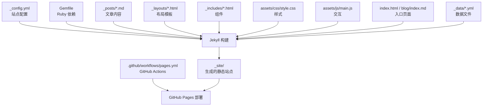
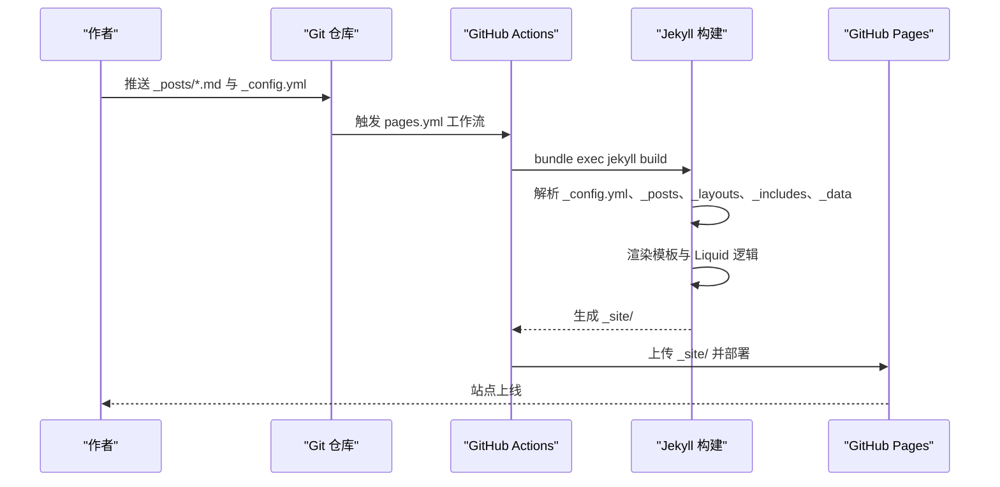
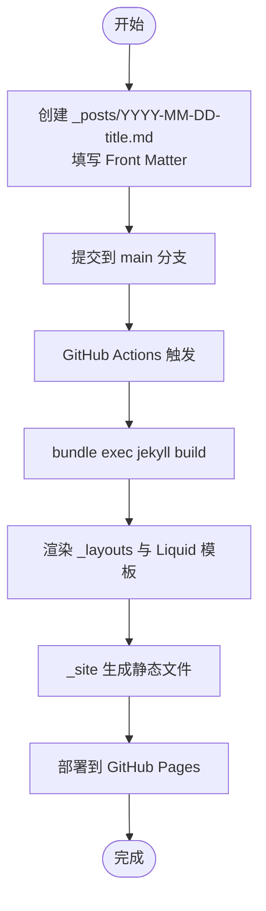
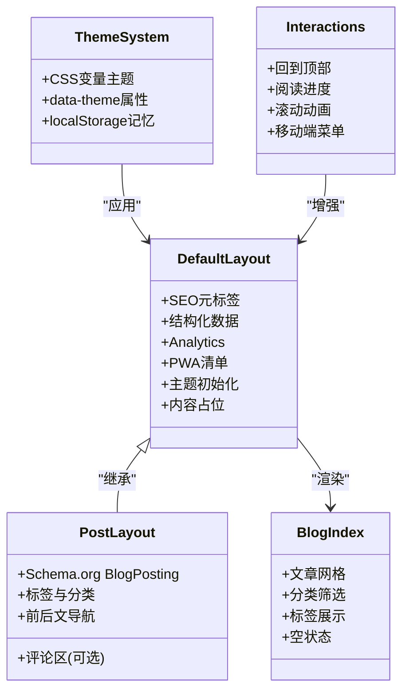
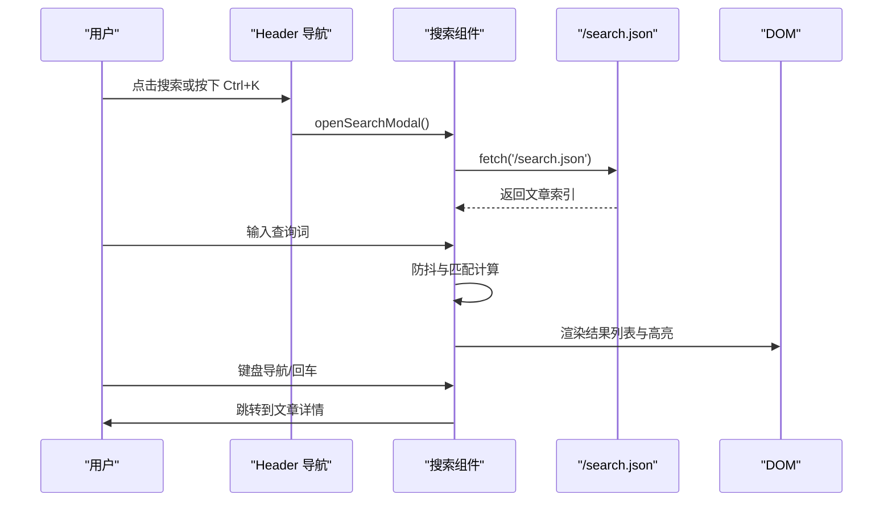
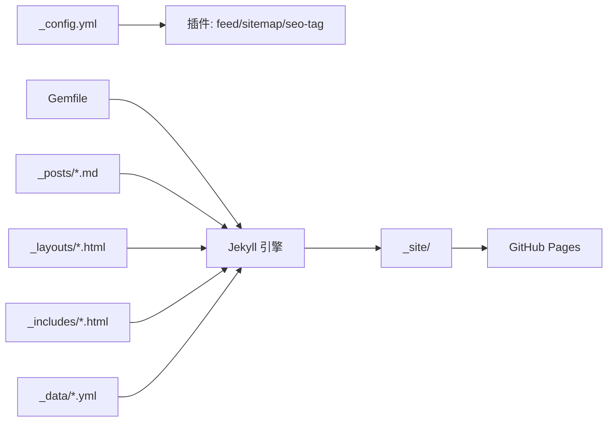

# 博客系统模块

<cite>
**本文档引用的文件**
- [_config.yml](file://_config.yml)
- [Gemfile](file://Gemfile)
- [README.md](file://README.md)
- [blog/index.md](file://blog/index.md)
- [index.html](file://index.html)
- [_layouts/default.html](file://_layouts/default.html)
- [_layouts/post.html](file://_layouts/post.html)
- [_includes/header.html](file://_includes/header.html)
- [_includes/footer.html](file://_includes/footer.html)
- [_includes/components/search.html](file://_includes/components/search.html)
- [_posts/2026-04-06-jekyll-blog-tutorial.md](file://_posts/2026-04-06-jekyll-blog-tutorial.md)
- [.github/workflows/pages.yml](file://.github/workflows/pages.yml)
- [assets/css/style.css](file://assets/css/style.css)
- [assets/js/main.js](file://assets/js/main.js)
- [_data/locales/en.yml](file://_data/locales/en.yml)
</cite>

## 目录
1. [引言](#引言)
2. [项目结构](#项目结构)
3. [核心组件](#核心组件)
4. [架构总览](#架构总览)
5. [详细组件分析](#详细组件分析)
6. [依赖关系分析](#依赖关系分析)
7. [性能考量](#性能考量)
8. [故障排查指南](#故障排查指南)
9. [结论](#结论)
10. [附录](#附录)

## 引言
本文件面向希望理解并使用该 Jekyll 博客系统的读者，系统性梳理其工作原理、文章发布流程、命名规范、前置参数、内容格式、页面布局与交互、SEO 优化、主题定制、内容创作最佳实践以及部署与维护指南。文档以仓库现有实现为依据，避免臆测，帮助技术与非技术背景的读者都能顺畅上手。

## 项目结构
该博客系统采用 Jekyll 静态站点生成器，结合 GitHub Pages 进行托管与自动化部署。整体结构遵循 Jekyll 的约定式目录组织，关键目录与文件职责如下：
- 配置与依赖
  - _config.yml：站点配置（SEO、主题、评论、Analytics、插件等）
  - Gemfile：Ruby 依赖与插件声明
  - .github/workflows/pages.yml：GitHub Actions 自动化构建与部署
- 内容与布局
  - _posts：博客文章（按 Jekyll 规范命名）
  - _layouts：页面布局模板（default、post）
  - _includes：可复用组件（header、footer、components）
  - _data：数据文件（多语言、社交、证书、技能、日志等）
- 资源与入口
  - assets/css/style.css：样式与主题变量
  - assets/js/main.js：交互逻辑（主题、回到顶部、滚动进度、滚动动画、移动端菜单等）
  - index.html、blog/index.md：首页与博客列表页入口
  - README.md：项目说明与开发指南

图表来源
- [_config.yml:1-133](file://_config.yml#L1-L133)
- [Gemfile:1-12](file://Gemfile#L1-L12)
- [.github/workflows/pages.yml:1-50](file://.github/workflows/pages.yml#L1-L50)

章节来源
- [_config.yml:1-133](file://_config.yml#L1-L133)
- [Gemfile:1-12](file://Gemfile#L1-L12)
- [README.md:26-63](file://README.md#L26-L63)
- [.github/workflows/pages.yml:1-50](file://.github/workflows/pages.yml#L1-L50)

## 核心组件
- 站点配置与 SEO
  - 通过 _config.yml 配置站点标题、描述、作者信息、主题颜色、SEO 关键词、Open Graph 图片、Twitter Card、hreflang 多语言链接、Google Analytics、评论系统（giscus）、sitemap/feed 插件等。
- 布局与模板
  - default.html 提供通用头部（SEO、结构化数据、Analytics、PWA、主题初始化）、主体与页脚占位；post.html 专用于文章详情页，包含结构化数据、标签与前后文导航。
- 内容与数据
  - _posts 下文章采用 Jekyll 命名规范（YYYY-MM-DD-title.md），使用 YAML Front Matter 定义 layout、title、date、category、tags、image、excerpt 等。
  - _data/locales/en.yml 提供多语言文案，配合 default.html 的 hreflang 与 canonical 实现国际化 SEO。
- 前端交互与主题
  - assets/css/style.css 通过 CSS 变量实现主题系统（浅色/深色），支持 data-theme 属性与 localStorage 记忆。
  - assets/js/main.js 实现主题切换、回到顶部、阅读进度条、滚动动画、移动端菜单等交互。
- 搜索与组件
  - _includes/components/search.html 提供 Ctrl+K 打开的搜索模态，依赖 /search.json 数据源进行全文检索与高亮。
- 自动化部署
  - .github/workflows/pages.yml 在推送到 main 分支时自动构建并部署至 GitHub Pages。

章节来源
- [_config.yml:45-114](file://_config.yml#L45-L114)
- [_layouts/default.html:1-152](file://_layouts/default.html#L1-L152)
- [_layouts/post.html:1-328](file://_layouts/post.html#L1-L328)
- [_posts/2026-04-06-jekyll-blog-tutorial.md:1-164](file://_posts/2026-04-06-jekyll-blog-tutorial.md#L1-L164)
- [_data/locales/en.yml:1-166](file://_data/locales/en.yml#L1-L166)
- [assets/css/style.css:1-200](file://assets/css/style.css#L1-L200)
- [assets/js/main.js:1-200](file://assets/js/main.js#L1-L200)
- [_includes/components/search.html:1-336](file://_includes/components/search.html#L1-L336)
- [.github/workflows/pages.yml:1-50](file://.github/workflows/pages.yml#L1-L50)

## 架构总览
下图展示了从内容到页面渲染再到部署的关键路径，体现 Jekyll 的数据驱动与模板渲染特性。

图表来源
- [_config.yml:104-114](file://_config.yml#L104-L114)
- [.github/workflows/pages.yml:1-50](file://.github/workflows/pages.yml#L1-L50)

## 详细组件分析

### 文章发布与渲染流程
- 发布流程
  - 在 _posts 目录创建符合 YYYY-MM-DD-title.md 的文件，添加 YAML Front Matter（至少包含 layout、title、date）。
  - 提交后，GitHub Actions 自动触发构建，Jekyll 读取 _config.yml 与插件，渲染文章到 /blog/ 路径下的页面。
- 渲染细节
  - 文章列表页（blog/index.md）通过 Liquid 遍历 site.posts，渲染文章卡片、分类与标签过滤。
  - 文章详情页（_layouts/post.html）使用结构化数据（schema.org BlogPosting）增强 SEO，并提供标签与上下篇导航。

图表来源
- [_posts/2026-04-06-jekyll-blog-tutorial.md:1-164](file://_posts/2026-04-06-jekyll-blog-tutorial.md#L1-L164)
- [blog/index.md:1-253](file://blog/index.md#L1-L253)
- [_layouts/post.html:1-328](file://_layouts/post.html#L1-L328)
- [.github/workflows/pages.yml:1-50](file://.github/workflows/pages.yml#L1-L50)

章节来源
- [_posts/2026-04-06-jekyll-blog-tutorial.md:1-164](file://_posts/2026-04-06-jekyll-blog-tutorial.md#L1-L164)
- [blog/index.md:1-253](file://blog/index.md#L1-L253)
- [_layouts/post.html:1-328](file://_layouts/post.html#L1-L328)
- [.github/workflows/pages.yml:1-50](file://.github/workflows/pages.yml#L1-L50)

### 博客文章命名规范与前置参数
- 命名规范
  - 采用 YYYY-MM-DD-title.md，确保 Jekyll 正确识别日期与排序。
- 常用 Front Matter 参数
  - layout：post（详情页）、default（列表页）
  - title：文章标题
  - date：发布时间（含时区偏移）
  - category：分类（用于列表页筛选）
  - tags：标签数组（用于标签云与筛选）
  - image：封面图 URL
  - excerpt：摘要（用于列表页预览与 SEO）

章节来源
- [_posts/2026-04-06-jekyll-blog-tutorial.md:1-164](file://_posts/2026-04-06-jekyll-blog-tutorial.md#L1-L164)
- [blog/index.md:28-70](file://blog/index.md#L28-L70)

### 博客页面布局与交互
- 布局模板
  - default.html：统一头部（SEO、结构化数据、Analytics、PWA、主题初始化）、主体占位与页脚占位。
  - post.html：文章详情页专用布局，包含结构化数据、标签、前后文导航与评论区（可选）。
- 列表页与筛选
  - blog/index.md：渲染文章网格、分类按钮、标签展示与“无文章”提示。
- 交互与主题
  - assets/js/main.js：主题切换（localStorage + data-theme）、回到顶部、阅读进度条、滚动动画、移动端菜单。
  - assets/css/style.css：CSS 变量主题系统，深色/浅色模式切换，响应式与无障碍优化。

图表来源
- [_layouts/default.html:1-152](file://_layouts/default.html#L1-L152)
- [_layouts/post.html:1-328](file://_layouts/post.html#L1-L328)
- [blog/index.md:1-253](file://blog/index.md#L1-L253)
- [assets/css/style.css:1-200](file://assets/css/style.css#L1-L200)
- [assets/js/main.js:1-200](file://assets/js/main.js#L1-L200)

章节来源
- [_layouts/default.html:1-152](file://_layouts/default.html#L1-L152)
- [_layouts/post.html:1-328](file://_layouts/post.html#L1-L328)
- [blog/index.md:1-253](file://blog/index.md#L1-L253)
- [assets/css/style.css:1-200](file://assets/css/style.css#L1-L200)
- [assets/js/main.js:1-200](file://assets/js/main.js#L1-L200)

### 搜索功能实现
- 数据来源
  - /search.json：由 Jekyll 或构建脚本生成，包含文章标题、摘要、正文、标签、分类、日期与 URL。
- 搜索逻辑
  - _includes/components/search.html：监听输入、防抖、计算匹配分数、高亮关键词、键盘导航（上下、回车打开）。
- 用户体验
  - 支持多语言文案、空结果提示、快捷键提示与滚动聚焦。

图表来源
- [_includes/header.html:71-75](file://_includes/header.html#L71-L75)
- [_includes/components/search.html:245-336](file://_includes/components/search.html#L245-L336)

章节来源
- [_includes/components/search.html:1-336](file://_includes/components/search.html#L1-L336)

### SEO 优化配置
- 元标签与结构化数据
  - default.html 使用 jekyll-seo-tag 输出 SEO 元标签；内置 JSON-LD Person 与 WebSite 结构化数据。
- Open Graph 与 Twitter Card
  - _config.yml 中配置 og_image、twitter_card、social.links；default.html 注入 og:title/description/image 与 twitter:* 元标签。
- 多语言与国际化
  - _config.yml languages/default_lang 与 hreflang alternate 链接；_data/locales/en.yml 提供多语言文案。
- 站点地图与订阅
  - jekyll-sitemap、jekyll-feed 插件自动生成 sitemap.xml 与 feed。

章节来源
- [_config.yml:45-114](file://_config.yml#L45-L114)
- [_layouts/default.html:12-116](file://_layouts/default.html#L12-L116)
- [_data/locales/en.yml:1-166](file://_data/locales/en.yml#L1-L166)

### 主题定制方法
- 样式修改
  - 通过 assets/css/style.css 的 CSS 变量（如 --color-primary、--font-size-base、--radius-*）统一调整主色、字号、圆角、阴影与间距。
- 布局调整
  - 修改 _layouts/default.html 与 _layouts/post.html 的结构与样式块，或在页面内追加内联样式。
- 功能扩展
  - 在 assets/js/main.js 中扩展交互逻辑（如新增动画、工具提示），或在 _includes/components/ 下新增组件并在页面中引入。

章节来源
- [assets/css/style.css:1-200](file://assets/css/style.css#L1-L200)
- [_layouts/default.html:69-150](file://_layouts/default.html#L69-L150)
- [_layouts/post.html:69-279](file://_layouts/post.html#L69-L279)
- [_includes/components/search.html:47-243](file://_includes/components/search.html#L47-L243)

### 内容创作最佳实践
- 写作规范
  - 使用 Markdown 语法，保持标题层级清晰，段落与列表结构合理。
- 标签与分类
  - 合理使用 tags 与 category，便于列表页筛选与 SEO。
- 前置参数
  - 至少包含 layout、title、date；建议补充 image 与 excerpt 提升列表页吸引力。
- 多语言
  - 在 _data/locales/en.yml 中维护英文文案，确保导航与界面元素一致。

章节来源
- [_posts/2026-04-06-jekyll-blog-tutorial.md:1-164](file://_posts/2026-04-06-jekyll-blog-tutorial.md#L1-L164)
- [_data/locales/en.yml:1-166](file://_data/locales/en.yml#L1-L166)

### 部署与维护指南
- 本地开发
  - 安装 Ruby 与 Bundler，执行 bundle install，再 bundle exec jekyll serve 预览。
- 自动化部署
  - 推送 main 分支触发 .github/workflows/pages.yml，自动构建并部署至 GitHub Pages。
- 维护要点
  - 更新 _config.yml 时注意插件与 SEO 设置；修改样式与交互时关注跨浏览器与无障碍兼容性。
  - 定期检查 /search.json 是否随文章更新同步（如需构建脚本生成）。

章节来源
- [README.md:80-94](file://README.md#L80-L94)
- [.github/workflows/pages.yml:1-50](file://.github/workflows/pages.yml#L1-L50)
- [_config.yml:109-133](file://_config.yml#L109-L133)

## 依赖关系分析
- 配置与插件
  - _config.yml 声明 jekyll-feed、jekyll-sitemap、jekyll-seo-tag 等插件，影响站点功能（RSS、Sitemap、SEO）。
- Ruby 环境
  - Gemfile 指定 jekyll 版本与插件组，确保 CI 与本地环境一致。
- 构建产物
  - Jekyll 将内容与模板渲染为 _site，GitHub Actions 上传该目录至 Pages。

图表来源
- [_config.yml:109-114](file://_config.yml#L109-L114)
- [Gemfile:1-12](file://Gemfile#L1-L12)
- [.github/workflows/pages.yml:32-38](file://.github/workflows/pages.yml#L32-L38)

章节来源
- [_config.yml:109-114](file://_config.yml#L109-L114)
- [Gemfile:1-12](file://Gemfile#L1-L12)
- [.github/workflows/pages.yml:32-38](file://.github/workflows/pages.yml#L32-L38)

## 性能考量
- 静态化与缓存
  - Jekyll 生成静态页面，结合浏览器缓存与 GitHub Pages CDN 提升加载速度。
- 资源优化
  - 使用 CSS 变量与基础样式，避免复杂框架；图片懒加载与合适的尺寸有助于性能。
- 无障碍与可访问性
  - 提供 skip link、键盘导航、减少动画偏好设置，提升可访问性评分。

## 故障排查指南
- 本地无法启动
  - 确认 Ruby 与 Bundler 版本，执行 bundle install 后再运行 jekyll serve。
- 部署失败
  - 查看 GitHub Actions 日志，确认 Ruby 版本、Bundler 缓存与构建命令是否正确。
- SEO 标签缺失
  - 检查 _config.yml 的 seo 字段与 jekyll-seo-tag 插件是否启用；确认 default.html 中是否包含 。
- 深色模式不生效
  - 检查 data-theme 初始化脚本与 localStorage 存储；确认 CSS 变量覆盖顺序。
- 搜索无结果
  - 确认 /search.json 是否存在且包含最新文章；检查搜索组件的 fetch 与防抖逻辑。

章节来源
- [README.md:80-94](file://README.md#L80-L94)
- [.github/workflows/pages.yml:1-50](file://.github/workflows/pages.yml#L1-L50)
- [_layouts/default.html:59-67](file://_layouts/default.html#L59-L67)
- [_includes/components/search.html:253-258](file://_includes/components/search.html#L253-L258)

## 结论
该博客系统以 Jekyll 为核心，结合 GitHub Pages 实现低成本、高性能、可定制的个人博客方案。通过合理的配置、模板与组件化设计，既满足内容创作需求，又兼顾 SEO、多语言与无障碍等现代网站标准。建议在实际使用中持续关注插件与主题更新，保持依赖版本一致，并根据业务需要扩展搜索与评论等能力。

## 附录
- 快速开始
  - 安装依赖：bundle install
  - 本地预览：bundle exec jekyll serve
  - 访问 http://localhost:4000
- 常用路径
  - 配置：_config.yml
  - 文章：_posts/YYYY-MM-DD-title.md
  - 列表页：blog/index.md
  - 布局：_layouts/default.html、_layouts/post.html
  - 样式：assets/css/style.css
  - 交互：assets/js/main.js
  - 搜索：_includes/components/search.html
  - 部署：.github/workflows/pages.yml

章节来源
- [README.md:80-94](file://README.md#L80-L94)
- [_config.yml:109-114](file://_config.yml#L109-L114)
- [Gemfile:1-12](file://Gemfile#L1-L12)
- [blog/index.md:1-253](file://blog/index.md#L1-L253)
- [_layouts/default.html:1-152](file://_layouts/default.html#L1-L152)
- [_layouts/post.html:1-328](file://_layouts/post.html#L1-L328)
- [assets/css/style.css:1-200](file://assets/css/style.css#L1-L200)
- [assets/js/main.js:1-200](file://assets/js/main.js#L1-L200)
- [_includes/components/search.html:1-336](file://_includes/components/search.html#L1-L336)
- [.github/workflows/pages.yml:1-50](file://.github/workflows/pages.yml#L1-L50)