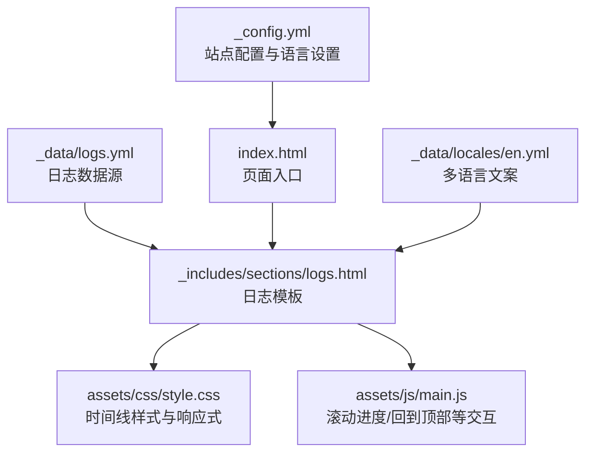
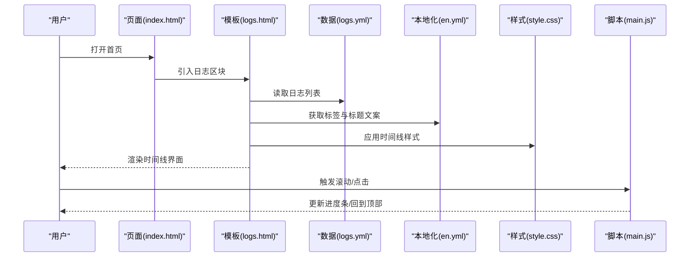
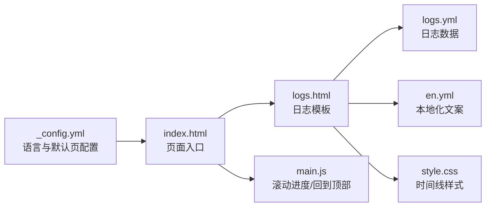

# 开发日志模块

<cite>
**本文引用的文件**
- [logs.yml](file://_data/logs.yml)
- [logs.html](file://_includes/sections/logs.html)
- [style.css](file://assets/css/style.css)
- [main.js](file://assets/js/main.js)
- [index.html](file://index.html)
- [en.yml](file://_data/locales/en.yml)
- [_config.yml](file://_config.yml)
</cite>

## 目录
1. [简介](#简介)
2. [项目结构](#项目结构)
3. [核心组件](#核心组件)
4. [架构总览](#架构总览)
5. [详细组件分析](#详细组件分析)
6. [依赖关系分析](#依赖关系分析)
7. [性能考量](#性能考量)
8. [故障排查指南](#故障排查指南)
9. [结论](#结论)
10. [附录](#附录)

## 简介
本文件系统性梳理“开发日志模块”的设计理念、数据结构、前端渲染与交互实现，以及可扩展的定制方案。重点覆盖以下方面：
- 时间线布局与事件标记的视觉设计
- logs.yml 数据文件的字段规范与国际化映射
- 日志展示的交互行为（滚动进度、回到顶部等）与响应式适配
- 新增/编辑日志内容的操作指南与格式约束
- 可视化流程图与类图，帮助开发者快速定位实现位置与优化点

## 项目结构
日志模块由三部分组成：数据层（YAML）、模板层（Liquid）与样式层（CSS），并辅以少量 JavaScript 交互能力。

图表来源
- [logs.yml:1-31](file://_data/logs.yml#L1-L31)
- [logs.html:1-41](file://_includes/sections/logs.html#L1-L41)
- [style.css:673-712](file://assets/css/style.css#L673-L712)
- [main.js:80-142](file://assets/js/main.js#L80-L142)
- [index.html:1-17](file://index.html#L1-L17)
- [en.yml:53-58](file://_data/locales/en.yml#L53-L58)
- [_config.yml:62-76](file://_config.yml#L62-L76)

章节来源
- [index.html:1-17](file://index.html#L1-L17)
- [_config.yml:62-76](file://_config.yml#L62-L76)

## 核心组件
- 数据文件：logs.yml 定义每条日志的日期、类型、中英文标题与描述
- 模板组件：logs.html 使用 Liquid 遍历数据，渲染时间线与标签
- 样式系统：style.css 提供时间线边框、圆点、内容块、标签颜色与响应式断点
- 交互脚本：main.js 提供滚动进度条与回到顶部等通用交互（日志区域可复用）
- 国际化：en.yml 提供日志区域标题与标签文案；页面通过 page.lang 控制显示语言

章节来源
- [logs.yml:1-31](file://_data/logs.yml#L1-L31)
- [logs.html:1-41](file://_includes/sections/logs.html#L1-L41)
- [style.css:673-712](file://assets/css/style.css#L673-L712)
- [main.js:80-142](file://assets/js/main.js#L80-L142)
- [en.yml:53-58](file://_data/locales/en.yml#L53-L58)

## 架构总览
日志模块遵循“数据驱动 + 模板渲染 + 样式隔离 + 轻量交互”的分层设计。数据从 YAML 注入到 Liquid 模板，再由 CSS 渲染为时间线界面；JavaScript 在页面层面提供滚动相关的用户体验增强。

图表来源
- [index.html:1-17](file://index.html#L1-L17)
- [logs.html:1-41](file://_includes/sections/logs.html#L1-L41)
- [logs.yml:1-31](file://_data/logs.yml#L1-L31)
- [en.yml:53-58](file://_data/locales/en.yml#L53-L58)
- [style.css:673-712](file://assets/css/style.css#L673-L712)
- [main.js:80-142](file://assets/js/main.js#L80-L142)

## 详细组件分析

### 数据模型：logs.yml 字段规范
- 字段说明
  - date：字符串，YYYY-MM-DD 格式，用于排序与展示
  - type：字符串，枚举值，决定标签颜色与语义
    - feat：功能更新（蓝色系标签）
    - code：代码改动（绿色系标签）
    - api：接口或集成（紫色系标签）
  - title_zh/title_en：中文/英文标题
  - desc_zh/desc_en：中文/英文描述内容
- 排序规则：按 date 降序排列（最新在前）

章节来源
- [logs.yml:1-31](file://_data/logs.yml#L1-L31)

### 模板渲染：时间线布局与事件标记
- 布局结构
  - 外层容器 timeline：左侧竖线作为时间轴
  - 每个日志项 timeline__item：包含时间戳、事件圆点、内容区
  - 圆点 timeline__dot：突出当前事件节点
  - 内容区 timeline__content：包含标签、标题与描述
- 标签与颜色
  - feat → info 标签（蓝色系）
  - code → success 标签（绿色系）
  - api → accent-purple 标签（紫色系）
- 国际化选择
  - 根据 page.lang 选择 title_en/title_zh 与 desc_en/desc_zh

章节来源
- [logs.html:1-41](file://_includes/sections/logs.html#L1-L41)
- [style.css:449-488](file://assets/css/style.css#L449-L488)

### 视觉样式：时间线与响应式
- 时间轴样式
  - 左侧竖线：border-left 实现
  - 圆点：绝对定位 + 边框形成“环形”效果
  - 内容块：背景色与圆角，提供信息密度与可读性
- 标签颜色体系
  - info：蓝色系背景与文字
  - success：绿色系背景与文字
  - accent-purple：紫色系背景与文字
- 响应式适配
  - 移动端：标题与正文字号、间距调整
  - 桌面端：保持大屏可读性与信息密度

章节来源
- [style.css:673-712](file://assets/css/style.css#L673-L712)
- [style.css:449-488](file://assets/css/style.css#L449-L488)
- [style.css:814-841](file://assets/css/style.css#L814-L841)

### 交互设计：滚动进度与回到顶部
- 滚动进度条（ReadingProgress）
  - 计算滚动百分比并更新宽度
  - 使用 IntersectionObserver 优化性能
- 回到顶部（BackToTop）
  - 超过阈值显示，点击平滑滚动至顶部
  - 使用防抖处理滚动事件
- 可复用性
  - 日志区域可直接复用上述交互，无需额外绑定

章节来源
- [main.js:80-142](file://assets/js/main.js#L80-L142)
- [main.js:147-165](file://assets/js/main.js#L147-L165)

### 国际化与页面集成
- 页面语言控制
  - 通过 _config.yml 设置默认语言与多语言支持
  - 页面通过 page.lang 切换中英文内容
- 文案来源
  - 日志标题与标签文案来自 _data/locales/en.yml
- 页面挂载
  - index.html 中引入 logs.html，确保日志区域出现在首页

章节来源
- [_config.yml:62-76](file://_config.yml#L62-L76)
- [en.yml:53-58](file://_data/locales/en.yml#L53-L58)
- [index.html:1-17](file://index.html#L1-L17)

## 依赖关系分析

图表来源
- [_config.yml:62-76](file://_config.yml#L62-L76)
- [index.html:1-17](file://index.html#L1-L17)
- [logs.html:1-41](file://_includes/sections/logs.html#L1-L41)
- [logs.yml:1-31](file://_data/logs.yml#L1-L31)
- [en.yml:53-58](file://_data/locales/en.yml#L53-L58)
- [style.css:673-712](file://assets/css/style.css#L673-L712)
- [main.js:80-142](file://assets/js/main.js#L80-L142)

章节来源
- [_config.yml:62-76](file://_config.yml#L62-L76)
- [index.html:1-17](file://index.html#L1-L17)

## 性能考量
- 滚动事件防抖：降低滚动回调频率，避免频繁重排
- IntersectionObserver：懒执行与节流，减少主线程压力
- CSS 自定义属性：主题切换与颜色一致性，避免重复计算
- 响应式断点：移动端优先，减少不必要的复杂布局

章节来源
- [main.js:15-22](file://assets/js/main.js#L15-L22)
- [main.js:147-165](file://assets/js/main.js#L147-L165)
- [style.css:10-105](file://assets/css/style.css#L10-L105)

## 故障排查指南
- 日志未显示
  - 检查 logs.yml 是否存在且字段完整
  - 确认 logs.html 已被 index.html 引入
- 标签颜色异常
  - 确认 type 值为 feat/code/api 之一
  - 检查对应标签类名是否正确应用
- 国际化不生效
  - 确认 page.lang 与 _config.yml 默认语言一致
  - 检查 en.yml 对应键是否存在
- 滚动进度条不更新
  - 确认 DOM 中存在 #reading-progress 元素
  - 检查 main.js 初始化是否执行

章节来源
- [logs.yml:1-31](file://_data/logs.yml#L1-L31)
- [logs.html:1-41](file://_includes/sections/logs.html#L1-L41)
- [en.yml:53-58](file://_data/locales/en.yml#L53-L58)
- [main.js:121-142](file://assets/js/main.js#L121-L142)

## 结论
开发日志模块以简洁的数据结构与模板渲染为核心，结合统一的样式系统与轻量交互，实现了清晰的时间线展示与良好的跨设备体验。通过标准化字段与标签体系，开发者可以快速扩展日志内容；通过响应式与无障碍优化，提升了长期可维护性与可用性。

## 附录

### 日志内容添加与编辑指南
- 时间格式规范
  - 使用 YYYY-MM-DD 字符串，如 2026-03-29
- 重要性级别
  - feat：功能更新
  - code：代码改动
  - api：接口或集成
- 标题与描述
  - 同时提供中英文版本，确保国际化正常显示
- 内容长度建议
  - 标题建议不超过 30 字
  - 描述建议控制在 200 字以内，保证移动端可读性
- 排版与格式
  - 使用纯文本，避免 HTML 标签
  - 如需强调，使用 Markdown 语法（若模板层未做特殊处理）

章节来源
- [logs.yml:1-31](file://_data/logs.yml#L1-L31)

### 个性化定制方案
- 自定义标签颜色
  - 在 style.css 中新增标签类，如 .tag--custom，并在 logs.html 中根据 type 映射
- 调整时间轴样式
  - 修改 timeline、timeline__dot、timeline__content 的边框与间距
- 增加展开/收起效果
  - 为 timeline__content 添加折叠状态，结合 JS 控制高度与过渡动画
- 响应式优化
  - 在小屏设备上调整字体大小、内边距与标签尺寸，提升可读性

章节来源
- [style.css:673-712](file://assets/css/style.css#L673-L712)
- [style.css:449-488](file://assets/css/style.css#L449-L488)