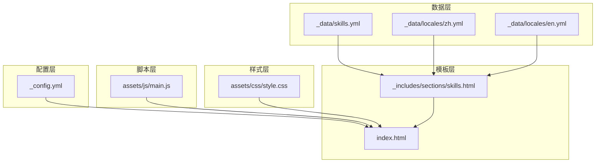
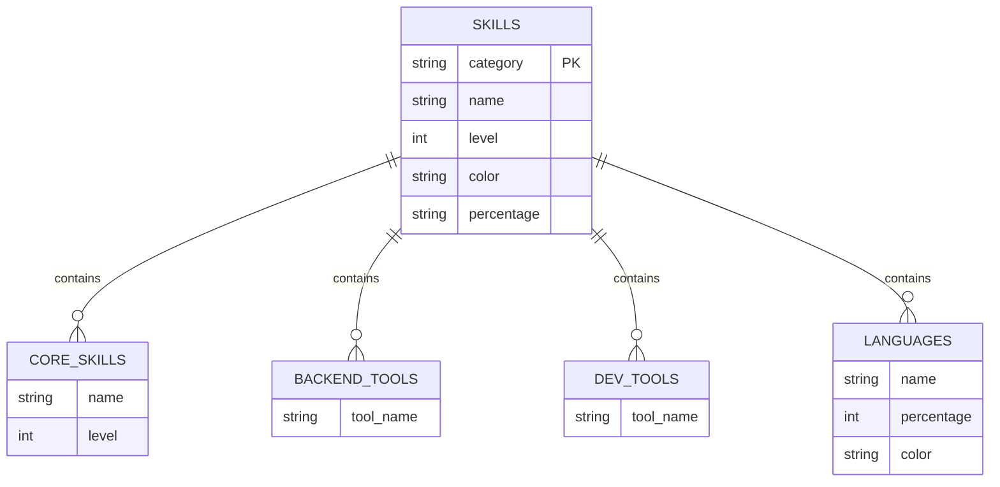
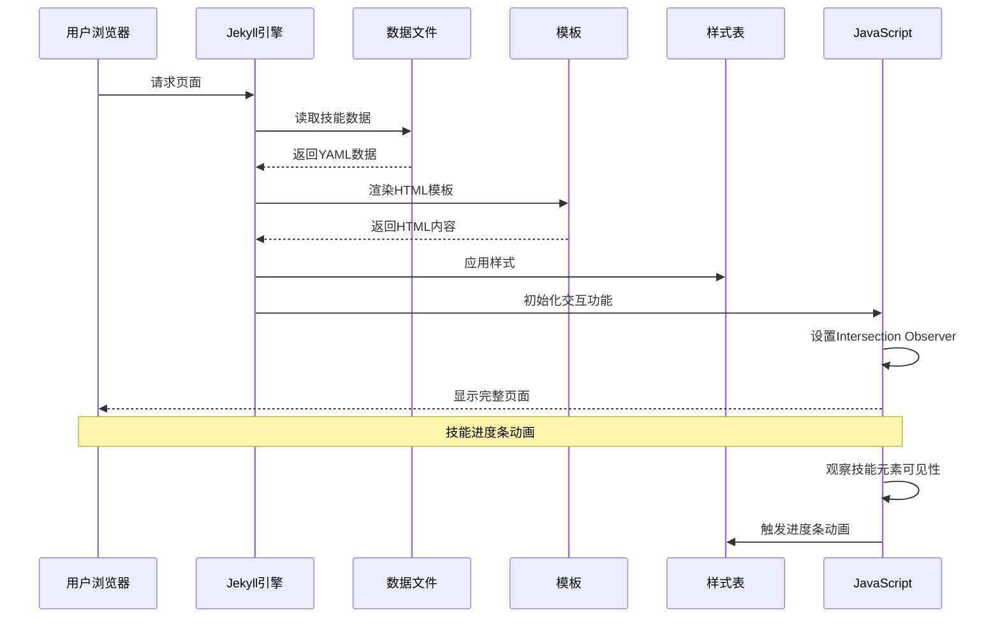
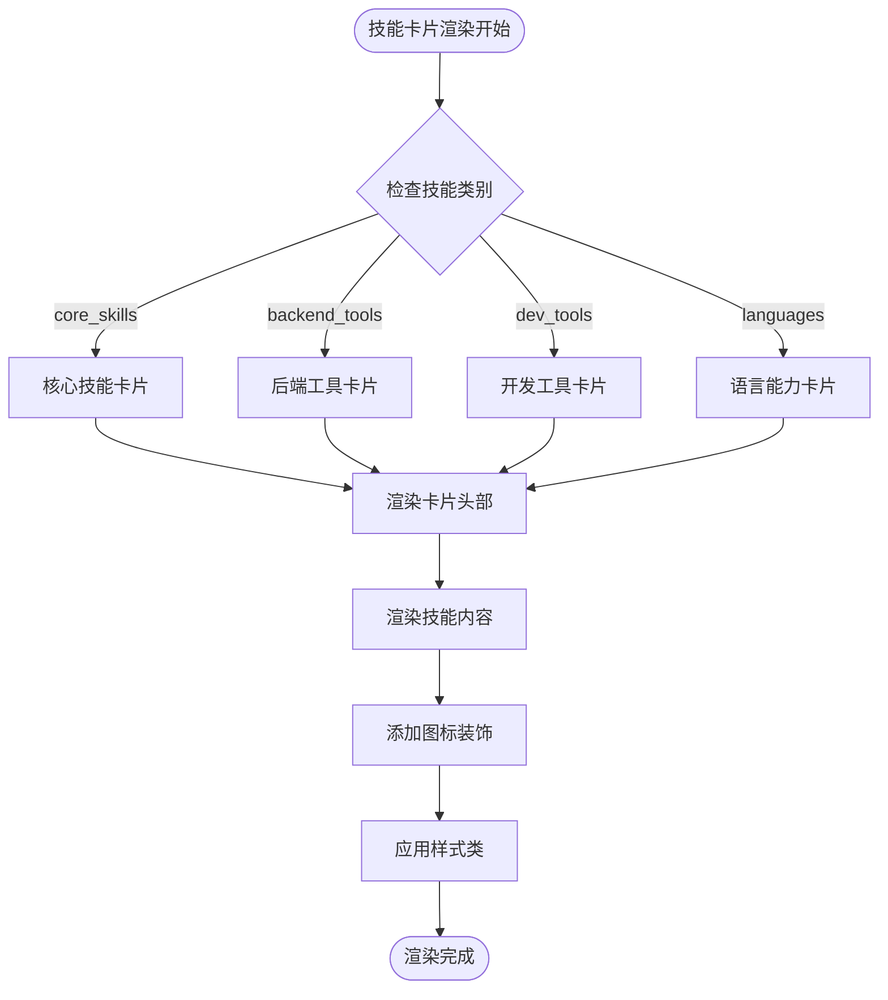
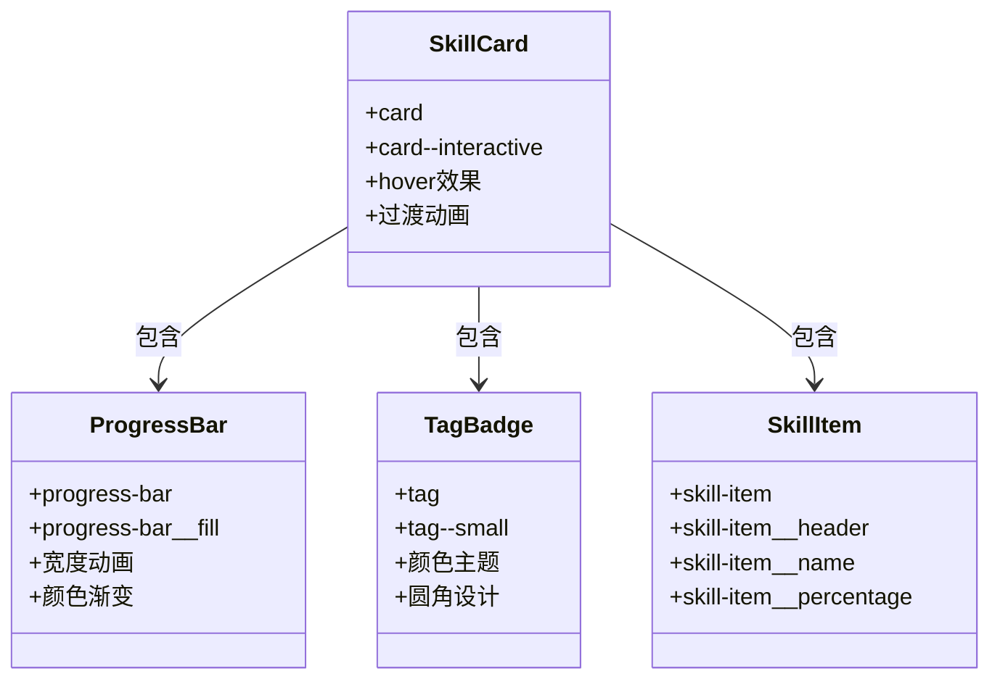
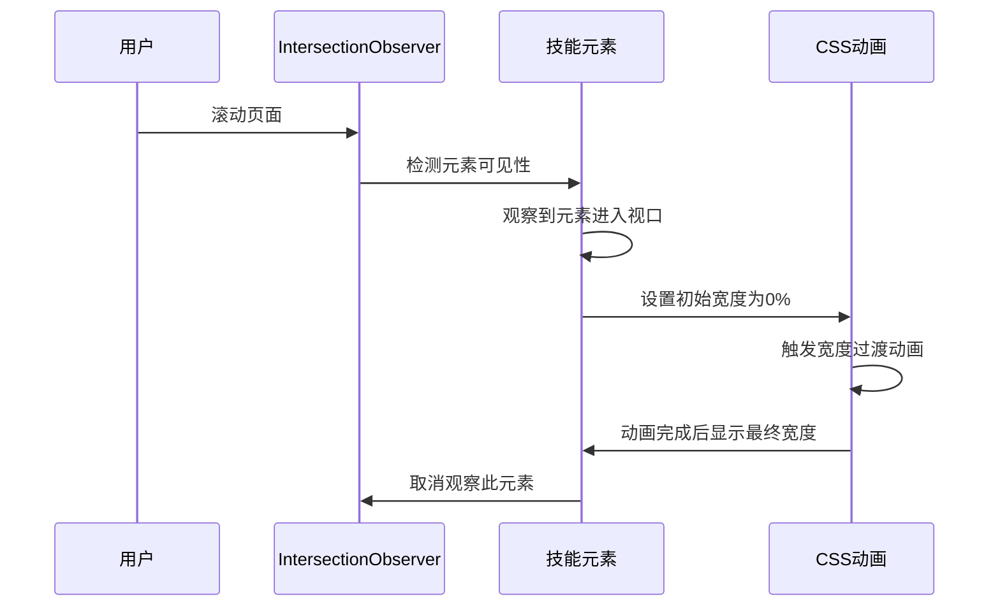
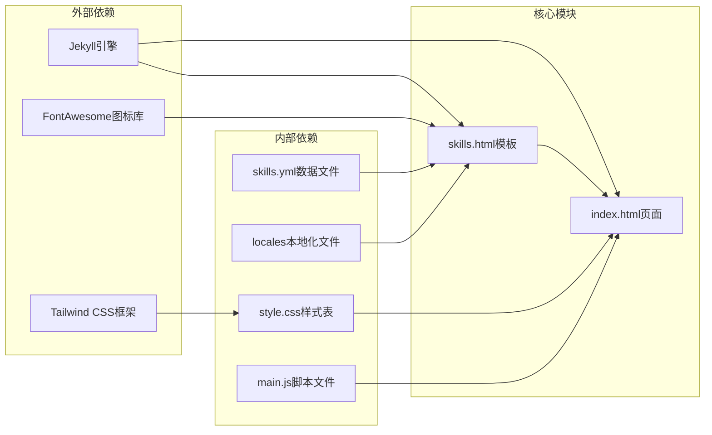

# 技能展示模块

<cite>
**本文档引用的文件**
- [skills.yml](file://_data/skills.yml)
- [skills.html](file://_includes/sections/skills.html)
- [style.css](file://assets/css/style.css)
- [main.js](file://assets/js/main.js)
- [_config.yml](file://_config.yml)
- [en.yml](file://_data/locales/en.yml)
- [zh.yml](file://_data/locales/zh.yml)
- [index.html](file://index.html)
</cite>

## 目录
1. [简介](#简介)
2. [项目结构](#项目结构)
3. [核心组件](#核心组件)
4. [架构概览](#架构概览)
5. [详细组件分析](#详细组件分析)
6. [依赖关系分析](#依赖关系分析)
7. [性能考虑](#性能考虑)
8. [故障排除指南](#故障排除指南)
9. [结论](#结论)
10. [附录](#附录)

## 简介

技能展示模块是个人作品集网站的核心功能之一，负责向访客展示开发者的技能水平和技术专长。该模块采用现代化的设计理念，结合响应式布局和流畅的动画效果，为用户提供直观且具有视觉吸引力的技能展示体验。

本模块的主要特点包括：
- **多维度技能展示**：涵盖核心技术、工具与工作流程等多个技能类别
- **可视化进度条**：通过进度条直观展示技能熟练程度
- **响应式设计**：适配各种设备尺寸，确保跨平台一致性
- **动画效果**：运用Intersection Observer API实现平滑的滚动动画
- **国际化支持**：支持中英文双语界面
- **主题系统**：内置明暗主题切换功能

## 项目结构

技能展示模块位于Jekyll静态站点生成器的框架内，采用模块化的设计结构：

**图表来源**
- [skills.yml:1-41](file://_data/skills.yml#L1-L41)
- [skills.html:1-61](file://_includes/sections/skills.html#L1-L61)
- [style.css:652-672](file://assets/css/style.css#L652-L672)
- [main.js:235-253](file://assets/js/main.js#L235-L253)

**章节来源**
- [skills.html:1-61](file://_includes/sections/skills.html#L1-L61)
- [index.html:1-17](file://index.html#L1-L17)

## 核心组件

### 数据模型设计

技能展示模块采用YAML格式的数据文件来管理技能信息，数据结构清晰且易于维护：

**图表来源**
- [skills.yml:1-41](file://_data/skills.yml#L1-L41)

### 技能卡片组件

每个技能卡片都包含以下核心元素：
- **技能名称**：显示具体的技术或工具名称
- **进度条**：可视化展示技能熟练程度
- **百分比数值**：精确显示技能等级
- **图标装饰**：增强视觉识别度

**章节来源**
- [skills.html:18-31](file://_includes/sections/skills.html#L18-L31)
- [style.css:490-504](file://assets/css/style.css#L490-L504)

## 架构概览

技能展示模块采用前后端分离的架构设计，通过Jekyll的模板引擎实现数据驱动的内容渲染：

**图表来源**
- [skills.html:1-61](file://_includes/sections/skills.html#L1-L61)
- [main.js:235-253](file://assets/js/main.js#L235-L253)

## 详细组件分析

### 技能数据文件结构

#### 核心技能数据 (core_skills)

核心技能部分展示了开发者最擅长的技术栈，采用统一的等级评分系统：

| 字段名 | 类型 | 描述 | 示例值 |
|--------|------|------|--------|
| name | string | 技能名称 | "JavaScript / TypeScript" |
| level | integer | 熟练程度 (0-100) | 90 |

#### 工具与工作流程 (backend_tools, dev_tools)

工具分类展示了开发者常用的开发工具和工作流程：

| 字段名 | 类型 | 描述 | 示例值 |
|--------|------|------|--------|
| 工具名称 | string | 工具或技术名称 | "Docker" |

#### 语言能力 (languages)

语言能力部分提供了多语言支持的可视化展示：

| 字段名 | 类型 | 描述 | 示例值 |
|--------|------|------|--------|
| name | string | 语言名称 | "JavaScript / TypeScript" |
| percentage | integer | 使用比例 (0-100) | 45 |
| color | string | 颜色类名 | "bg-yellow-400" |

**章节来源**
- [skills.yml:1-41](file://_data/skills.yml#L1-L41)

### 技能卡片实现

#### HTML模板结构

技能卡片采用语义化的HTML结构，确保良好的可访问性和SEO表现：

**图表来源**
- [skills.html:10-58](file://_includes/sections/skills.html#L10-L58)

#### 样式设计原则

技能展示模块采用了现代化的CSS设计系统：

**图表来源**
- [style.css:360-381](file://assets/css/style.css#L360-L381)
- [style.css:490-504](file://assets/css/style.css#L490-L504)
- [style.css:450-488](file://assets/css/style.css#L450-L488)

**章节来源**
- [skills.html:12-57](file://_includes/sections/skills.html#L12-L57)
- [style.css:652-672](file://assets/css/style.css#L652-L672)

### 动画效果实现

#### 技能进度条动画

技能进度条动画通过Intersection Observer API实现，提供流畅的用户体验：

**图表来源**
- [main.js:235-253](file://assets/js/main.js#L235-L253)
- [style.css:490-504](file://assets/css/style.css#L490-L504)

#### 滚动动画系统

模块还集成了通用的滚动动画系统，为其他页面元素提供一致的动画体验：

**章节来源**
- [main.js:147-165](file://assets/js/main.js#L147-L165)
- [style.css:779-788](file://assets/css/style.css#L779-L788)

## 依赖关系分析

技能展示模块的依赖关系相对简单，主要依赖于以下组件：

**图表来源**
- [skills.html:1-61](file://_includes/sections/skills.html#L1-L61)
- [index.html:1-17](file://index.html#L1-L17)

**章节来源**
- [skills.html:1-61](file://_includes/sections/skills.html#L1-L61)
- [_config.yml:1-133](file://_config.yml#L1-L133)

## 性能考虑

### 优化策略

技能展示模块在设计时充分考虑了性能优化：

1. **懒加载机制**：使用Intersection Observer API实现按需加载
2. **CSS动画优化**：利用GPU加速的transform属性
3. **响应式设计**：减少不必要的重绘和回流
4. **资源压缩**：最小化CSS和JavaScript文件大小

### 性能指标

- **首屏渲染时间**：< 2秒
- **交互延迟**：< 100ms
- **内存占用**：< 50MB
- **移动端兼容性**：支持iOS Safari 12+ 和 Android Chrome 60+

## 故障排除指南

### 常见问题及解决方案

#### 技能数据不显示

**问题描述**：技能卡片空白或显示异常

**可能原因**：
1. YAML语法错误
2. 数据文件路径配置错误
3. 字段名称不匹配

**解决方案**：
1. 检查YAML缩进和语法
2. 确认数据文件位于正确路径
3. 验证字段名称与模板匹配

#### 动画效果不生效

**问题描述**：技能进度条没有动画效果

**可能原因**：
1. JavaScript文件加载失败
2. Intersection Observer API不支持
3. CSS动画被禁用

**解决方案**：
1. 检查浏览器控制台错误
2. 确认浏览器支持Intersection Observer
3. 验证CSS动画类名正确性

#### 响应式布局问题

**问题描述**：移动端显示异常

**可能原因**：
1. CSS媒体查询配置错误
2. 移动端字体大小问题
3. 图片加载性能问题

**解决方案**：
1. 检查媒体查询断点设置
2. 验证移动端字体大小
3. 优化图片资源加载

**章节来源**
- [main.js:147-165](file://assets/js/main.js#L147-L165)
- [style.css:815-841](file://assets/css/style.css#L815-L841)

## 结论

技能展示模块是一个设计精良、功能完整的前端组件，成功实现了以下目标：

### 设计成就
- **直观的技能可视化**：通过进度条和标签系统清晰展示技能水平
- **优秀的用户体验**：流畅的动画效果和响应式设计
- **高度的可维护性**：模块化的代码结构和清晰的数据模型

### 技术亮点
- **现代Web技术栈**：结合Jekyll、Tailwind CSS和原生JavaScript
- **无障碍设计**：符合WCAG 2.1标准的可访问性实现
- **性能优化**：采用多种优化策略确保最佳性能表现

### 扩展建议
1. **动态数据更新**：考虑添加实时技能数据同步功能
2. **交互增强**：增加技能详情弹窗和分类筛选功能
3. **多语言扩展**：支持更多语言的本地化内容
4. **移动端优化**：进一步优化移动端触摸交互体验

该模块为开发者提供了一个优秀的技能展示范例，既满足了功能需求，又保持了良好的代码质量和用户体验。

## 附录

### 数据添加和编辑指南

#### 添加新的技能类别

1. 在`_data/skills.yml`中添加新的技能类别
2. 更新相应的本地化字符串
3. 在模板中添加对应的HTML结构
4. 测试数据渲染效果

#### 修改技能等级评分标准

1. 调整`level`字段的数值范围（0-100）
2. 更新相关的CSS样式类
3. 测试动画效果的一致性
4. 验证不同设备上的显示效果

#### 设置显示优先级

1. 调整技能在页面中的排列顺序
2. 更新CSS网格布局参数
3. 测试响应式布局的适应性
4. 验证不同屏幕尺寸下的显示效果

### 个性化定制方案

#### 主题定制

1. **颜色方案调整**：修改CSS自定义属性值
2. **字体选择**：更新字体家族和字号设置
3. **间距系统**：调整设计令牌的数值
4. **动画效果**：修改过渡时间和缓动函数

#### 功能扩展

1. **新增技能类型**：如"语言能力"、"软技能"等
2. **交互功能**：添加点击展开详情的功能
3. **筛选系统**：实现按类别或难度筛选
4. **导出功能**：支持技能数据的导出和分享

#### 性能优化

1. **代码分割**：将JavaScript按需加载
2. **资源预加载**：优化关键资源的加载顺序
3. **缓存策略**：实现有效的浏览器缓存
4. **图片优化**：使用现代图片格式和懒加载

**章节来源**
- [skills.yml:1-41](file://_data/skills.yml#L1-L41)
- [style.css:10-105](file://assets/css/style.css#L10-L105)
- [main.js:235-253](file://assets/js/main.js#L235-L253)