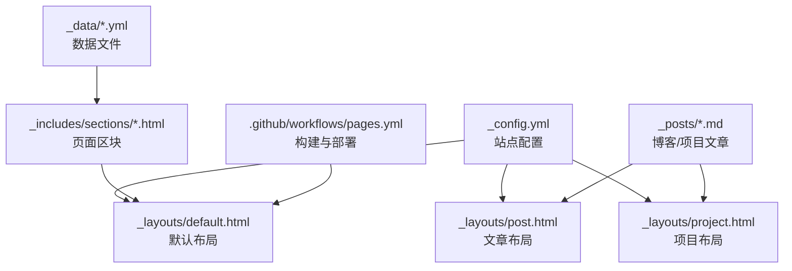
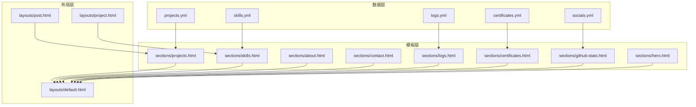
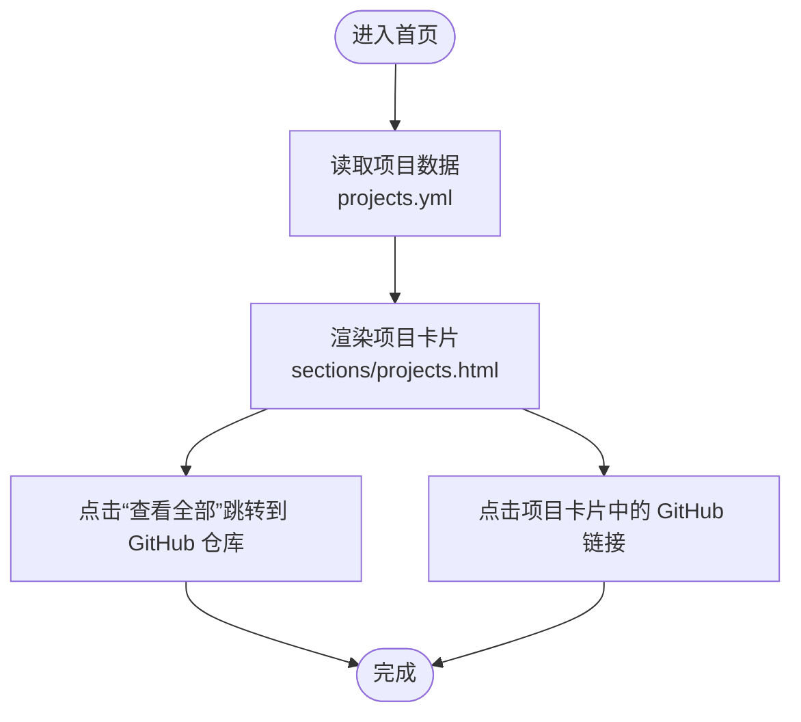
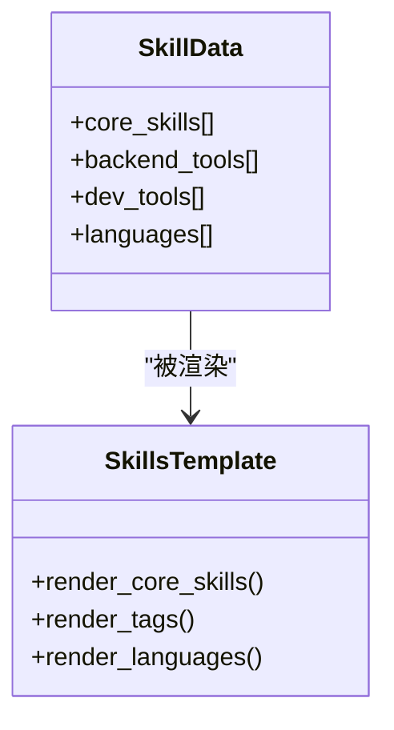
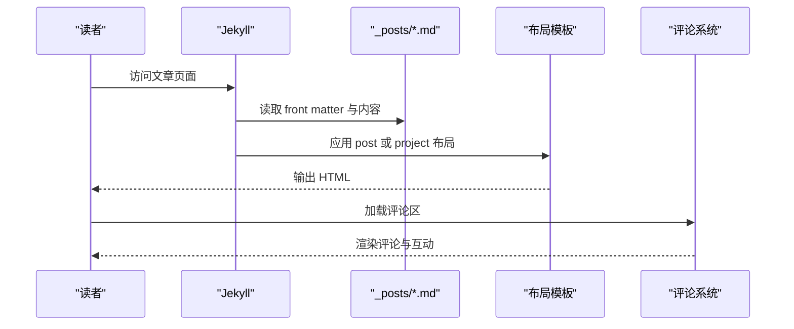
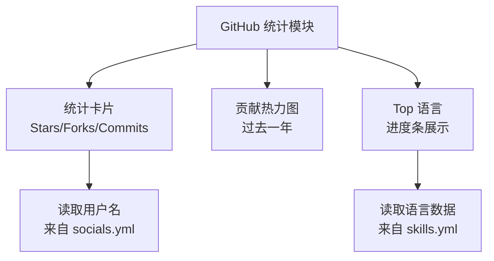
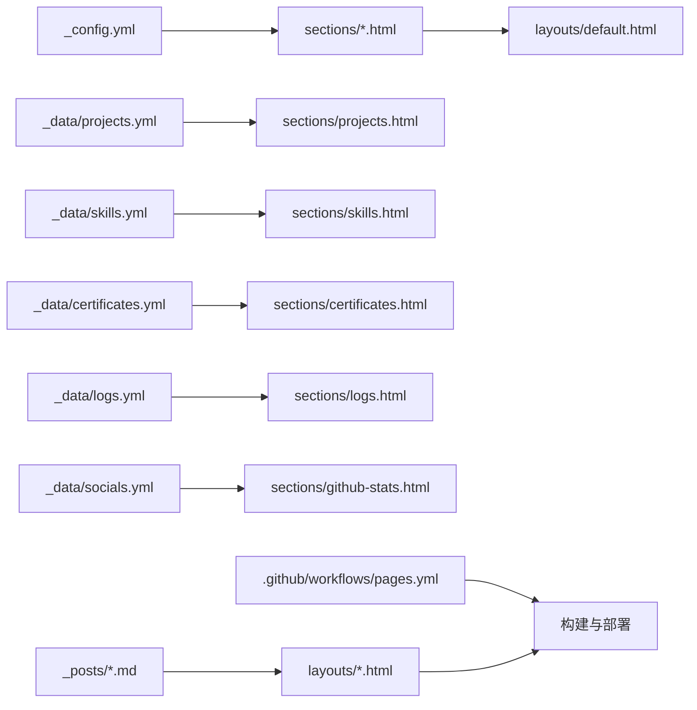

# 核心功能模块

<cite>
**本文引用的文件**
- [_config.yml](file://_config.yml)
- [_data/projects.yml](file://_data/projects.yml)
- [_data/skills.yml](file://_data/skills.yml)
- [_data/certificates.yml](file://_data/certificates.yml)
- [_data/logs.yml](file://_data/logs.yml)
- [_data/socials.yml](file://_data/socials.yml)
- [_includes/sections/projects.html](file://_includes/sections/projects.html)
- [_includes/sections/skills.html](file://_includes/sections/skills.html)
- [_includes/sections/about.html](file://_includes/sections/about.html)
- [_includes/sections/contact.html](file://_includes/sections/contact.html)
- [_includes/sections/certificates.html](file://_includes/sections/certificates.html)
- [_includes/sections/logs.html](file://_includes/sections/logs.html)
- [_includes/sections/github-stats.html](file://_includes/sections/github-stats.html)
- [_includes/sections/hero.html](file://_includes/sections/hero.html)
- [_posts/2026-03-15-taskflow-pro.md](file://_posts/2026-03-15-taskflow-pro.md)
- [_posts/2026-04-06-jekyll-blog-tutorial.md](file://_posts/2026-04-06-jekyll-blog-tutorial.md)
- [_layouts/default.html](file://_layouts/default.html)
- [_layouts/post.html](file://_layouts/post.html)
- [_layouts/project.html](file://_layouts/project.html)
- [.github/workflows/pages.yml](file://.github/workflows/pages.yml)
</cite>

## 目录
1. [简介](#简介)
2. [项目结构](#项目结构)
3. [核心组件](#核心组件)
4. [架构总览](#架构总览)
5. [详细组件分析](#详细组件分析)
6. [依赖关系分析](#依赖关系分析)
7. [性能考虑](#性能考虑)
8. [故障排查指南](#故障排查指南)
9. [结论](#结论)
10. [附录](#附录)

## 简介
本文件系统性梳理 halfism.github.io 的核心功能模块，覆盖作品集展示、技能展示、博客系统、关于我、联系方式、开发日志、专业认证以及 GitHub 统计等模块。文档从数据结构、模板实现、配置方法、数据格式要求、自定义选项到实际使用场景进行说明，帮助开发者快速理解与扩展。

## 项目结构
该站点基于 Jekyll，采用数据驱动与组件化模板的组织方式：
- 配置层：通过站点配置文件集中管理主题、SEO、评论、联系表单、分析等全局设置。
- 数据层：以 YAML 文件存放项目、技能、证书、日志、社交链接等静态数据。
- 模板层：通过 includes 中的 sections 组合页面区块；通过 layouts 定义默认布局与文章/项目布局。
- 内容层：博客文章采用 front matter 驱动，支持分类与标签；项目文章采用独立布局。
- 工作流：通过 GitHub Actions 实现自动构建与部署至 GitHub Pages。

图表来源
- [_config.yml:1-133](file://_config.yml#L1-L133)
- [_layouts/default.html](file://_layouts/default.html)
- [_layouts/post.html](file://_layouts/post.html)
- [_layouts/project.html](file://_layouts/project.html)
- [_data/projects.yml:1-45](file://_data/projects.yml#L1-L45)
- [_data/skills.yml:1-41](file://_data/skills.yml#L1-L41)
- [_data/certificates.yml:1-24](file://_data/certificates.yml#L1-L24)
- [_data/logs.yml:1-31](file://_data/logs.yml#L1-L31)
- [_data/socials.yml:1-20](file://_data/socials.yml#L1-L20)
- [_includes/sections/projects.html:1-50](file://_includes/sections/projects.html#L1-L50)
- [_includes/sections/skills.html:1-61](file://_includes/sections/skills.html#L1-L61)
- [_includes/sections/about.html:1-48](file://_includes/sections/about.html#L1-L48)
- [_includes/sections/contact.html:1-39](file://_includes/sections/contact.html#L1-L39)
- [_includes/sections/certificates.html:1-33](file://_includes/sections/certificates.html#L1-L33)
- [_includes/sections/logs.html:1-41](file://_includes/sections/logs.html#L1-L41)
- [_includes/sections/github-stats.html:1-75](file://_includes/sections/github-stats.html#L1-L75)
- [_includes/sections/hero.html:1-56](file://_includes/sections/hero.html#L1-L56)
- [_posts/2026-03-15-taskflow-pro.md:1-292](file://_posts/2026-03-15-taskflow-pro.md#L1-L292)
- [_posts/2026-04-06-jekyll-blog-tutorial.md:1-164](file://_posts/2026-04-06-jekyll-blog-tutorial.md#L1-L164)
- [.github/workflows/pages.yml](file://.github/workflows/pages.yml)

章节来源
- [_config.yml:1-133](file://_config.yml#L1-L133)

## 核心组件
- 作品集展示模块：通过项目数据渲染项目卡片，支持分类、标签、星级与 Fork 数、GitHub 链接。
- 技能展示模块：核心技能（百分比进度）、技能标签（后端/开发工具），并复用语言掌握度可视化。
- 博客系统：文章发布流程、分类与标签管理、布局模板与评论集成。
- 关于我模块：个人介绍与三个能力卡片。
- 联系方式模块：简历下载与协作入口、邮件与社交链接。
- 开发日志模块：按时间线展示功能迭代、代码重构与 API 集成记录。
- 专业认证模块：展示认证信息与链接。
- GitHub 统计模块：展示 Stars/Forks/Commit 概览、贡献热力图与 Top 语言。

章节来源
- [_includes/sections/projects.html:1-50](file://_includes/sections/projects.html#L1-L50)
- [_data/projects.yml:1-45](file://_data/projects.yml#L1-L45)
- [_includes/sections/skills.html:1-61](file://_includes/sections/skills.html#L1-L61)
- [_data/skills.yml:1-41](file://_data/skills.yml#L1-L41)
- [_posts/2026-03-15-taskflow-pro.md:1-292](file://_posts/2026-03-15-taskflow-pro.md#L1-L292)
- [_posts/2026-04-06-jekyll-blog-tutorial.md:1-164](file://_posts/2026-04-06-jekyll-blog-tutorial.md#L1-L164)
- [_includes/sections/about.html:1-48](file://_includes/sections/about.html#L1-L48)
- [_includes/sections/contact.html:1-39](file://_includes/sections/contact.html#L1-L39)
- [_includes/sections/logs.html:1-41](file://_includes/sections/logs.html#L1-L41)
- [_data/logs.yml:1-31](file://_data/logs.yml#L1-L31)
- [_includes/sections/certificates.html:1-33](file://_includes/sections/certificates.html#L1-L33)
- [_data/certificates.yml:1-24](file://_data/certificates.yml#L1-L24)
- [_includes/sections/github-stats.html:1-75](file://_includes/sections/github-stats.html#L1-L75)
- [_data/socials.yml:1-20](file://_data/socials.yml#L1-L20)

## 架构总览
整体采用“数据驱动 + Liquid 模板”的静态站点架构。数据通过 YAML 注入到 includes 的区块模板中，再组合到布局中输出最终页面。博客与项目采用不同的布局，支持 front matter 驱动的元数据与分类标签。

图表来源
- [_data/projects.yml:1-45](file://_data/projects.yml#L1-L45)
- [_data/skills.yml:1-41](file://_data/skills.yml#L1-L41)
- [_data/certificates.yml:1-24](file://_data/certificates.yml#L1-L24)
- [_data/logs.yml:1-31](file://_data/logs.yml#L1-L31)
- [_data/socials.yml:1-20](file://_data/socials.yml#L1-L20)
- [_includes/sections/projects.html:1-50](file://_includes/sections/projects.html#L1-L50)
- [_includes/sections/skills.html:1-61](file://_includes/sections/skills.html#L1-L61)
- [_includes/sections/about.html:1-48](file://_includes/sections/about.html#L1-L48)
- [_includes/sections/contact.html:1-39](file://_includes/sections/contact.html#L1-L39)
- [_includes/sections/logs.html:1-41](file://_includes/sections/logs.html#L1-L41)
- [_includes/sections/certificates.html:1-33](file://_includes/sections/certificates.html#L1-L33)
- [_includes/sections/github-stats.html:1-75](file://_includes/sections/github-stats.html#L1-L75)
- [_includes/sections/hero.html:1-56](file://_includes/sections/hero.html#L1-L56)
- [_layouts/default.html](file://_layouts/default.html)
- [_layouts/post.html](file://_layouts/post.html)
- [_layouts/project.html](file://_layouts/project.html)

## 详细组件分析

### 作品集展示模块
- 数据结构
  - 字段：id、多语言标题与描述、图片、标签数组、分类、GitHub 地址、stars、forks。
  - 示例路径：[_data/projects.yml:1-45](file://_data/projects.yml#L1-L45)
- 模板实现
  - 渲染网格布局的项目卡片，包含封面图、分类徽标、标签集合、Star/Fork 数与 GitHub 链接。
  - 示例路径：[_includes/sections/projects.html:1-50](file://_includes/sections/projects.html#L1-L50)
- GitHub 链接集成
  - 顶部“查看全部”按钮跳转至用户仓库列表；项目卡片内提供 GitHub 图标直达链接。
  - 示例路径：[_includes/sections/projects.html:9-11](file://_includes/sections/projects.html#L9-L11)，[_data/socials.yml:1-20](file://_data/socials.yml#L1-L20)
- 标签分类系统
  - 通过 tags 与 category 字段实现分类与标签展示，便于筛选与归档。
  - 示例路径：[_includes/sections/projects.html:30-34](file://_includes/sections/projects.html#L30-L34)，[_data/projects.yml:7-11](file://_data/projects.yml#L7-L11)

图表来源
- [_data/projects.yml:1-45](file://_data/projects.yml#L1-L45)
- [_includes/sections/projects.html:1-50](file://_includes/sections/projects.html#L1-L50)
- [_data/socials.yml:1-20](file://_data/socials.yml#L1-L20)

章节来源
- [_data/projects.yml:1-45](file://_data/projects.yml#L1-L45)
- [_includes/sections/projects.html:1-50](file://_includes/sections/projects.html#L1-L50)
- [_data/socials.yml:1-20](file://_data/socials.yml#L1-L20)

### 技能展示模块
- 数据结构
  - 核心技能：名称与等级百分比。
  - 技能标签：后端/DevOps 工具、开发工具集合。
  - 语言掌握度：名称、百分比、颜色类名。
  - 示例路径：[_data/skills.yml:1-41](file://_data/skills.yml#L1-L41)
- 模板实现
  - 核心技能以进度条形式展示；技能标签以可点击标签形式分组显示。
  - 示例路径：[_includes/sections/skills.html:1-61](file://_includes/sections/skills.html#L1-L61)
- 可视化呈现
  - 百分比进度条与标签云，配合图标与卡片容器增强可读性。
  - 示例路径：[_includes/sections/skills.html:18-30](file://_includes/sections/skills.html#L18-L30)，[_includes/sections/skills.html:40-56](file://_includes/sections/skills.html#L40-L56)

图表来源
- [_data/skills.yml:1-41](file://_data/skills.yml#L1-L41)
- [_includes/sections/skills.html:1-61](file://_includes/sections/skills.html#L1-L61)

章节来源
- [_data/skills.yml:1-41](file://_data/skills.yml#L1-L41)
- [_includes/sections/skills.html:1-61](file://_includes/sections/skills.html#L1-L61)

### 博客系统
- 发布流程
  - 在 _posts 下创建带 front matter 的 Markdown 文件，指定 layout、标题、日期、分类与标签。
  - 示例路径：[_posts/2026-04-06-jekyll-blog-tutorial.md:1-164](file://_posts/2026-04-06-jekyll-blog-tutorial.md#L1-L164)
- 分类与标签管理
  - front matter 中的 category 与 tags 字段用于分类与标签；可通过布局与 includes 进行展示或过滤。
  - 示例路径：[_posts/2026-04-06-jekyll-blog-tutorial.md:5-11](file://_posts/2026-04-06-jekyll-blog-tutorial.md#L5-L11)
- 布局模板
  - 默认布局与文章布局分别用于首页与文章详情页；项目文章采用独立布局。
  - 示例路径：[_layouts/default.html](file://_layouts/default.html)，[_layouts/post.html](file://_layouts/post.html)，[_layouts/project.html](file://_layouts/project.html)
- 评论系统
  - 通过 Giscus 集成评论，需在配置中填写仓库、分类等参数。
  - 示例路径：[_config.yml:82-98](file://_config.yml#L82-L98)

图表来源
- [_posts/2026-04-06-jekyll-blog-tutorial.md:1-164](file://_posts/2026-04-06-jekyll-blog-tutorial.md#L1-L164)
- [_layouts/post.html](file://_layouts/post.html)
- [_layouts/project.html](file://_layouts/project.html)
- [_config.yml:82-98](file://_config.yml#L82-L98)

章节来源
- [_posts/2026-04-06-jekyll-blog-tutorial.md:1-164](file://_posts/2026-04-06-jekyll-blog-tutorial.md#L1-L164)
- [_layouts/post.html](file://_layouts/post.html)
- [_layouts/project.html](file://_layouts/project.html)
- [_config.yml:82-98](file://_config.yml#L82-L98)

### 关于我模块
- 内容构成：标题、三张能力卡片（开源、终身学习、团队协作）与多语言文案。
- 数据与文案：通过本地化数据与作者信息驱动。
- 示例路径：[_includes/sections/about.html:1-48](file://_includes/sections/about.html#L1-L48)，[_config.yml:8-17](file://_config.yml#L8-L17)

章节来源
- [_includes/sections/about.html:1-48](file://_includes/sections/about.html#L1-L48)
- [_config.yml:8-17](file://_config.yml#L8-L17)

### 联系方式模块
- 功能：简历下载按钮、协作入口、邮件与社交链接。
- 配置：邮箱、社交链接来自配置文件。
- 示例路径：[_includes/sections/contact.html:1-39](file://_includes/sections/contact.html#L1-L39)，[_config.yml:2-35](file://_config.yml#L2-L35)

章节来源
- [_includes/sections/contact.html:1-39](file://_includes/sections/contact.html#L1-L39)
- [_config.yml:2-35](file://_config.yml#L2-L35)

### 开发日志模块
- 数据结构：日期、类型（feat/code/api）、中英文标题与描述。
- 模板实现：时间线样式展示，按类型标注标签。
- 示例路径：[_includes/sections/logs.html:1-41](file://_includes/sections/logs.html#L1-L41)，[_data/logs.yml:1-31](file://_data/logs.yml#L1-L31)

章节来源
- [_includes/sections/logs.html:1-41](file://_includes/sections/logs.html#L1-L41)
- [_data/logs.yml:1-31](file://_data/logs.yml#L1-L31)

### 专业认证模块
- 数据结构：认证名称（中英）、颁发机构、日期、图标、颜色类、链接。
- 模板实现：卡片式展示，包含图标、日期、颁发机构与链接。
- 示例路径：[_includes/sections/certificates.html:1-33](file://_includes/sections/certificates.html#L1-L33)，[_data/certificates.yml:1-24](file://_data/certificates.yml#L1-L24)

章节来源
- [_includes/sections/certificates.html:1-33](file://_includes/sections/certificates.html#L1-L33)
- [_data/certificates.yml:1-24](file://_data/certificates.yml#L1-L24)

### GitHub 统计模块
- 数据来源：用户名来自社交配置；统计数值与贡献图、Top 语言来自模板占位与技能数据。
- 模块组成：统计卡片（Stars/Forks/Commits）、贡献热力图、Top 语言进度条。
- 示例路径：[_includes/sections/github-stats.html:1-75](file://_includes/sections/github-stats.html#L1-L75)，[_data/socials.yml:1-20](file://_data/socials.yml#L1-L20)，[_data/skills.yml:28-40](file://_data/skills.yml#L28-L40)

图表来源
- [_includes/sections/github-stats.html:1-75](file://_includes/sections/github-stats.html#L1-L75)
- [_data/socials.yml:1-20](file://_data/socials.yml#L1-L20)
- [_data/skills.yml:28-40](file://_data/skills.yml#L28-L40)

章节来源
- [_includes/sections/github-stats.html:1-75](file://_includes/sections/github-stats.html#L1-L75)
- [_data/socials.yml:1-20](file://_data/socials.yml#L1-L20)
- [_data/skills.yml:28-40](file://_data/skills.yml#L28-L40)

### 首页英雄模块
- 内容构成：欢迎语、个人头衔、简述、按钮与装饰卡片。
- 示例路径：[_includes/sections/hero.html:1-56](file://_includes/sections/hero.html#L1-L56)

章节来源
- [_includes/sections/hero.html:1-56](file://_includes/sections/hero.html#L1-L56)

## 依赖关系分析
- 配置依赖：站点配置集中管理主题、SEO、评论、联系表单、分析与默认语言。
- 数据依赖：各模块通过对应 YAML 数据文件注入内容；部分模板共享技能数据（如 GitHub 统计中的语言占比）。
- 模板依赖：sections 依赖 _data 与 _config；布局依赖 sections；文章与项目依赖各自布局。
- 部署依赖：GitHub Actions 自动构建与部署。

图表来源
- [_config.yml:1-133](file://_config.yml#L1-L133)
- [_data/projects.yml:1-45](file://_data/projects.yml#L1-L45)
- [_data/skills.yml:1-41](file://_data/skills.yml#L1-L41)
- [_data/certificates.yml:1-24](file://_data/certificates.yml#L1-L24)
- [_data/logs.yml:1-31](file://_data/logs.yml#L1-L31)
- [_data/socials.yml:1-20](file://_data/socials.yml#L1-L20)
- [_posts/2026-03-15-taskflow-pro.md:1-292](file://_posts/2026-03-15-taskflow-pro.md#L1-L292)
- [_posts/2026-04-06-jekyll-blog-tutorial.md:1-164](file://_posts/2026-04-06-jekyll-blog-tutorial.md#L1-L164)
- [_layouts/default.html](file://_layouts/default.html)
- [_layouts/post.html](file://_layouts/post.html)
- [_layouts/project.html](file://_layouts/project.html)
- [.github/workflows/pages.yml](file://.github/workflows/pages.yml)

章节来源
- [_config.yml:1-133](file://_config.yml#L1-L133)
- [_data/projects.yml:1-45](file://_data/projects.yml#L1-L45)
- [_data/skills.yml:1-41](file://_data/skills.yml#L1-L41)
- [_data/certificates.yml:1-24](file://_data/certificates.yml#L1-L24)
- [_data/logs.yml:1-31](file://_data/logs.yml#L1-L31)
- [_data/socials.yml:1-20](file://_data/socials.yml#L1-L20)
- [_posts/2026-03-15-taskflow-pro.md:1-292](file://_posts/2026-03-15-taskflow-pro.md#L1-L292)
- [_posts/2026-04-06-jekyll-blog-tutorial.md:1-164](file://_posts/2026-04-06-jekyll-blog-tutorial.md#L1-L164)
- [_layouts/default.html](file://_layouts/default.html)
- [_layouts/post.html](file://_layouts/post.html)
- [_layouts/project.html](file://_layouts/project.html)
- [.github/workflows/pages.yml](file://.github/workflows/pages.yml)

## 性能考虑
- 静态生成：Jekyll 生成静态页面，避免服务器端渲染开销。
- 图片懒加载与格式：模板中提供懒加载与现代格式（如 WebP）建议，有助于降低首屏加载时间。
- CSS 变量与主题：通过 CSS 变量实现主题切换，减少重复样式与重绘。
- JavaScript 延迟加载与代码分割：建议对非关键脚本使用 defer 或动态导入，减少主线程阻塞。
- CDN 与缓存：结合 GitHub Pages 的全球分发与浏览器缓存策略，进一步提升访问速度。

## 故障排查指南
- 评论系统未显示
  - 检查评论配置是否正确，确认仓库、分类、映射等参数已填写。
  - 参考路径：[_config.yml:82-98](file://_config.yml#L82-L98)
- GitHub 统计数值为空
  - 模板当前为占位展示，若需真实数据，需在前端集成 GitHub API 并在构建阶段注入。
  - 参考路径：[_includes/sections/github-stats.html:18-34](file://_includes/sections/github-stats.html#L18-L34)
- 语言切换不生效
  - 确认默认语言与页面语言设置，检查本地化键值是否存在。
  - 参考路径：[_config.yml:62-75](file://_config.yml#L62-L75)
- 部署失败
  - 查看 GitHub Actions 工作流日志，确保 Ruby、Bundler、Jekyll 版本与 Gemfile 一致。
  - 参考路径：[pages.yml](file://.github/workflows/pages.yml)

章节来源
- [_config.yml:82-98](file://_config.yml#L82-L98)
- [_includes/sections/github-stats.html:18-34](file://_includes/sections/github-stats.html#L18-L34)
- [_config.yml:62-75](file://_config.yml#L62-L75)
- [.github/workflows/pages.yml](file://.github/workflows/pages.yml)

## 结论
本项目通过清晰的数据层与组件化模板，实现了作品集、技能、博客、关于我、联系方式、开发日志、专业认证与 GitHub 统计等模块的模块化与可扩展性。结合 Jekyll 的静态生成能力与 GitHub Pages 的免费托管，能够稳定、快速地对外发布内容。后续可在 GitHub 统计模块中接入真实 API 数据，并完善评论与多语言的边界处理，以进一步提升用户体验。

## 附录
- 配置方法与关键项
  - 主题与颜色：[_config.yml:37-43](file://_config.yml#L37-L43)
  - 社交链接：[_config.yml:19-35](file://_config.yml#L19-L35)，[_data/socials.yml:1-20](file://_data/socials.yml#L1-L20)
  - 评论系统：[_config.yml:82-98](file://_config.yml#L82-L98)
  - 联系表单：[_config.yml:100-102](file://_config.yml#L100-L102)
  - 分析与 SEO：[_config.yml:77-80](file://_config.yml#L77-L80)，[_config.yml:45-60](file://_config.yml#L45-L60)
- 数据格式要求
  - 项目：id、多语言标题与描述、image、tags、category、url、stars、forks
    - 示例路径：[_data/projects.yml:1-45](file://_data/projects.yml#L1-L45)
  - 技能：core_skills、backend_tools、dev_tools、languages
    - 示例路径：[_data/skills.yml:1-41](file://_data/skills.yml#L1-L41)
  - 认证：title、issuer、date、icon、color、url
    - 示例路径：[_data/certificates.yml:1-24](file://_data/certificates.yml#L1-L24)
  - 日志：date、type、title/desc（中英）
    - 示例路径：[_data/logs.yml:1-31](file://_data/logs.yml#L1-L31)
- 自定义选项
  - 添加新项目：在 [_data/projects.yml:1-45](file://_data/projects.yml#L1-L45) 新增条目
  - 新增技能标签：在 [_data/skills.yml:11-27](file://_data/skills.yml#L11-L27) 对应分组追加
  - 新增认证：在 [_data/certificates.yml:1-24](file://_data/certificates.yml#L1-L24) 新增条目
  - 新增日志：在 [_data/logs.yml:1-31](file://_data/logs.yml#L1-L31) 新增条目
  - 新增文章：在 [_posts](file://_posts) 下新增带 front matter 的 Markdown 文件
  - 修改布局：在 [_layouts](file://_layouts) 下调整 default/post/project
  - 部署：提交到 main 分支，等待 GitHub Actions 自动构建与部署
    - 示例路径：[pages.yml](file://.github/workflows/pages.yml)