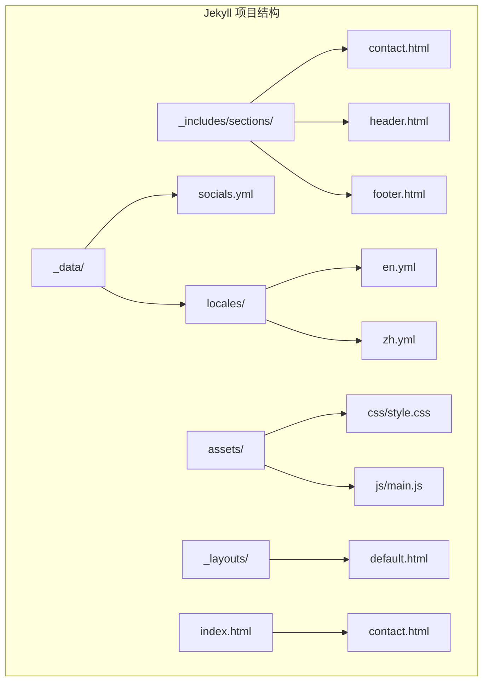
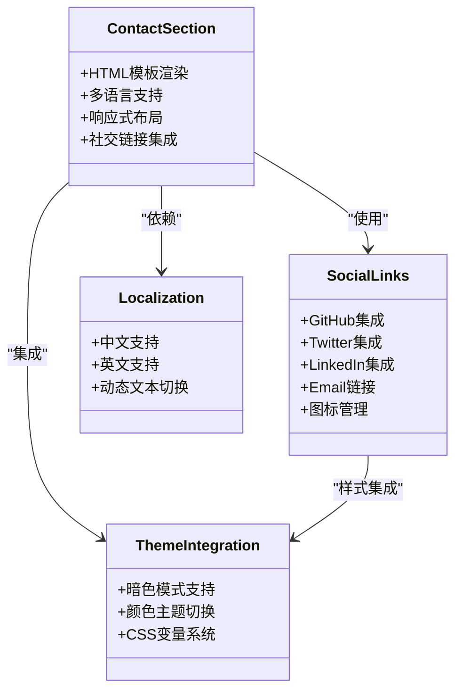
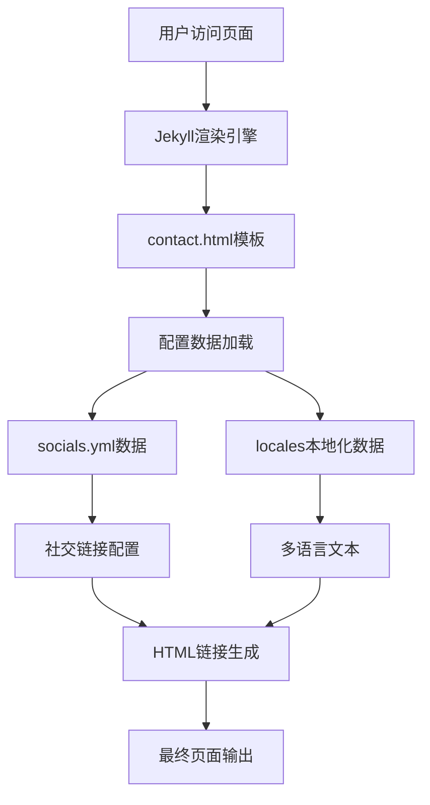
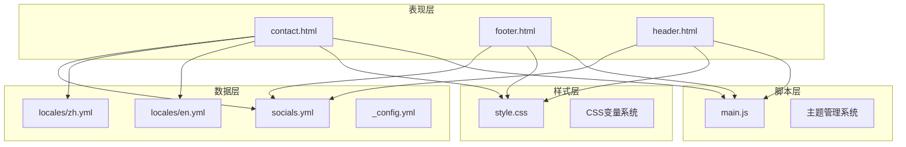
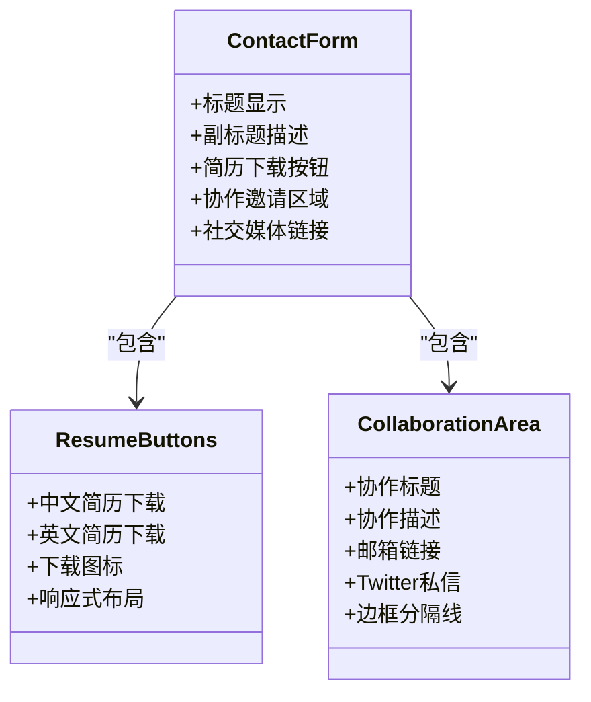
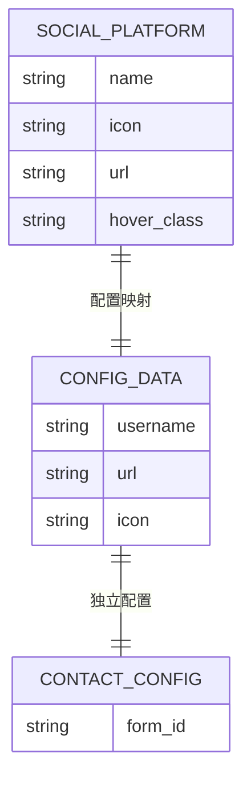
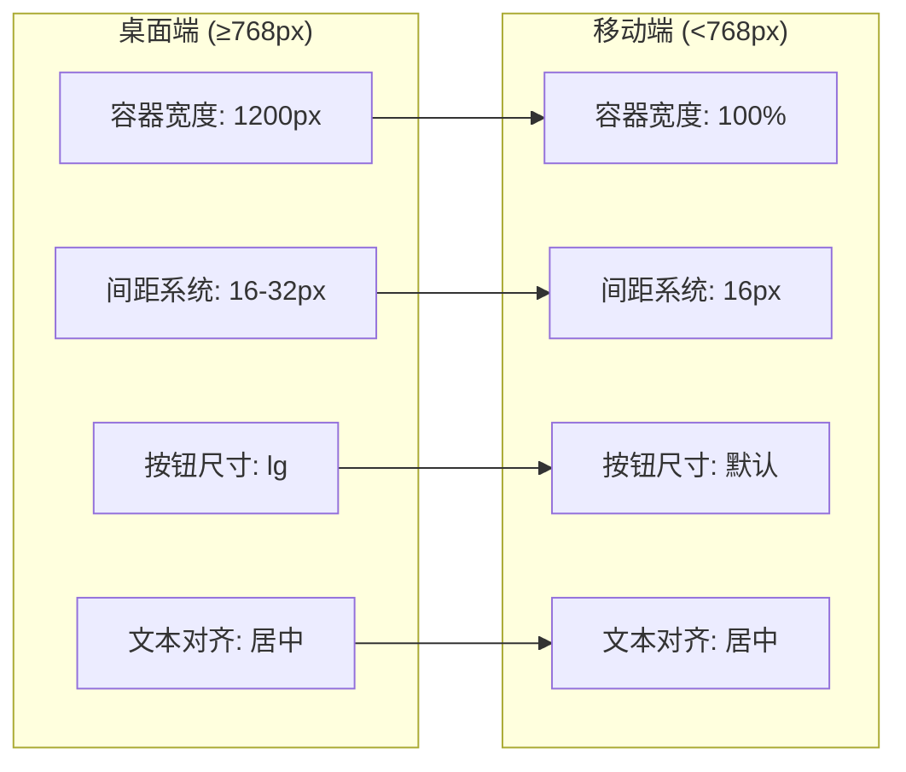
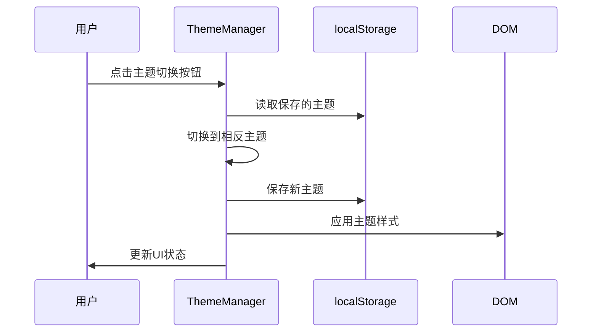
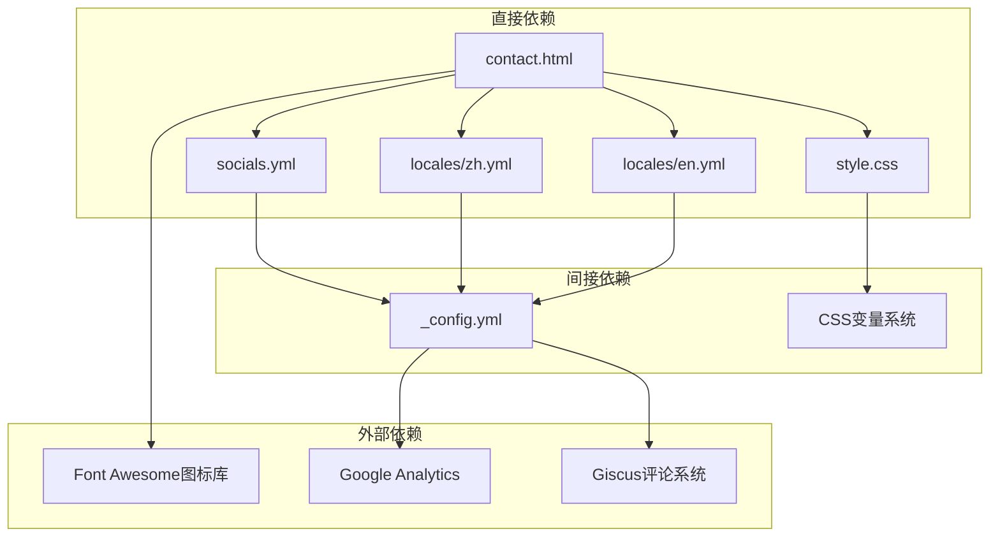

# 联系方式模块

<cite>
**本文档引用的文件**
- [contact.html](file://_includes/sections/contact.html)
- [socials.yml](file://_data/socials.yml)
- [_config.yml](file://_config.yml)
- [main.js](file://assets/js/main.js)
- [style.css](file://assets/css/style.css)
- [en.yml](file://_data/locales/en.yml)
- [zh.yml](file://_data/locales/zh.yml)
- [index.html](file://index.html)
- [footer.html](file://_includes/footer.html)
- [header.html](file://_includes/header.html)
- [default.html](file://_layouts/default.html)
</cite>

## 目录
1. [简介](#简介)
2. [项目结构](#项目结构)
3. [核心组件](#核心组件)
4. [架构概览](#架构概览)
5. [详细组件分析](#详细组件分析)
6. [依赖关系分析](#依赖关系分析)
7. [性能考虑](#性能考虑)
8. [故障排除指南](#故障排除指南)
9. [结论](#结论)

## 简介

联系方式模块是 halfism 个人网站的重要组成部分，负责向访客提供多种联系渠道和社交链接。该模块采用 Jekyll 静态站点生成器构建，结合了响应式设计、多语言支持和现代化的前端技术栈。

本模块的核心功能包括：
- 多种联系方式（简历下载、邮箱、社交媒体）
- 社交媒体链接集成（GitHub、Twitter、LinkedIn、Email）
- 响应式布局设计
- 多语言本地化支持
- 无障碍访问优化
- 主题系统集成

## 项目结构

联系方式模块位于 Jekyll 项目的 `_includes/sections/` 目录下，采用模块化设计，便于维护和扩展。

**图表来源**
- [contact.html:1-39](file://_includes/sections/contact.html#L1-L39)
- [socials.yml:1-20](file://_data/socials.yml#L1-L20)
- [style.css:1-1015](file://assets/css/style.css#L1-L1015)

**章节来源**
- [contact.html:1-39](file://_includes/sections/contact.html#L1-L39)
- [index.html:1-17](file://index.html#L1-L17)

## 核心组件

联系方式模块由多个相互协作的组件组成，每个组件都有明确的职责和功能。

### 主要组件架构

**图表来源**
- [contact.html:1-39](file://_includes/sections/contact.html#L1-L39)
- [socials.yml:1-20](file://_data/socials.yml#L1-L20)
- [style.css:10-145](file://assets/css/style.css#L10-L145)

### 数据流分析

**图表来源**
- [_config.yml:100-103](file://_config.yml#L100-L103)
- [socials.yml:1-20](file://_data/socials.yml#L1-L20)
- [en.yml:74-83](file://_data/locales/en.yml#L74-L83)

**章节来源**
- [contact.html:1-39](file://_includes/sections/contact.html#L1-L39)
- [socials.yml:1-20](file://_data/socials.yml#L1-L20)
- [_config.yml:100-103](file://_config.yml#L100-L103)

## 架构概览

联系方式模块采用分层架构设计，确保了良好的可维护性和扩展性。

**图表来源**
- [contact.html:1-39](file://_includes/sections/contact.html#L1-L39)
- [footer.html:1-49](file://_includes/footer.html#L1-L49)
- [header.html:1-116](file://_includes/header.html#L1-L116)
- [style.css:1-1015](file://assets/css/style.css#L1-L1015)
- [main.js:1-279](file://assets/js/main.js#L1-L279)

## 详细组件分析

### 联系表单组件

联系表单组件是联系方式模块的核心部分，提供了多种联系渠道和交互元素。

#### 表单结构设计

**图表来源**
- [contact.html:1-39](file://_includes/sections/contact.html#L1-L39)

#### 字段配置分析

联系表单包含以下关键字段和配置：

| 字段类型 | 配置项 | 作用 | 样式特性 |
|---------|--------|------|----------|
| 标题 | contact.title | 主标题显示 | 居中对齐，大字体 |
| 副标题 | contact.subtitle | 简介说明 | 淡色文字，最大宽度 |
| 简历按钮 | download_cv_zh/en | 简历下载功能 | 双按钮布局，响应式 |
| 协作标题 | collaborate_title | 合作邀请 | 二级标题样式 |
| 协作描述 | collaborate_desc | 详细说明 | 较大字体，强调文本 |
| 邮箱按钮 | send_email | 直接邮件链接 | 主要按钮样式 |
| Twitter按钮 | twitter_dm | Twitter私信 | 次要按钮样式 |

**章节来源**
- [contact.html:1-39](file://_includes/sections/contact.html#L1-L39)
- [en.yml:74-83](file://_data/locales/en.yml#L74-L83)
- [zh.yml:74-83](file://_data/locales/zh.yml#L74-L83)

### 社交链接集成

社交链接系统提供了完整的社交媒体集成功能，支持多种主流平台。

#### 平台配置结构

**图表来源**
- [socials.yml:1-20](file://_data/socials.yml#L1-L20)
- [_config.yml:19-36](file://_config.yml#L19-L36)

#### 支持的社交平台

| 平台名称 | 图标类名 | 配置键 | URL格式 | 新窗口打开 |
|---------|----------|--------|---------|------------|
| GitHub | fa-github | github | https://github.com/username | 是 |
| Twitter | fa-twitter | twitter | https://twitter.com/username | 是 |
| LinkedIn | fa-linkedin | linkedin | https://linkedin.com/in/username | 是 |
| Email | fa-envelope | email | mailto:address | 否 |

**章节来源**
- [socials.yml:1-20](file://_data/socials.yml#L1-L20)
- [_config.yml:19-36](file://_config.yml#L19-L36)

### 布局设计与响应式适配

联系方式模块采用了现代化的响应式设计，确保在各种设备上都能提供优秀的用户体验。

#### 响应式布局策略

**图表来源**
- [style.css:301-338](file://assets/css/style.css#L301-L338)
- [style.css:815-841](file://assets/css/style.css#L815-L841)

#### 设计令牌系统

模块使用 CSS 自定义属性作为设计令牌，实现了统一的颜色和间距系统：

| 类型 | 变量名 | 值范围 | 用途 |
|------|--------|--------|------|
| 颜色 | --color-primary | #3b82f6 | 主色调 |
| 颜色 | --color-text | #111827 | 文本颜色 |
| 间距 | --space-4 | 1rem | 基础间距 |
| 字体 | --font-size-lg | 1.125rem | 大号字体 |
| 圆角 | --radius-lg | 0.5rem | 大圆角半径 |

**章节来源**
- [style.css:10-105](file://assets/css/style.css#L10-L105)
- [style.css:815-841](file://assets/css/style.css#L815-L841)

### 主题系统集成

联系方式模块深度集成了主题管理系统，支持明暗两种主题模式。

#### 主题切换机制

**图表来源**
- [main.js:27-75](file://assets/js/main.js#L27-L75)

#### 暗色模式特性

暗色模式通过 CSS 变量覆盖实现了完整的主题转换：

| 属性 | 明色模式值 | 暗色模式值 | 变化效果 |
|------|------------|------------|----------|
| --color-primary | #3b82f6 | #58a6ff | 蓝色变浅蓝 |
| --color-bg | #ffffff | #010409 | 白色变深灰 |
| --color-text | #111827 | #e6edf3 | 黑色变浅灰 |
| --color-border | #e5e7eb | #30363d | 浅灰变深灰 |

**章节来源**
- [main.js:27-75](file://assets/js/main.js#L27-L75)
- [style.css:110-145](file://assets/css/style.css#L110-L145)

## 依赖关系分析

联系方式模块的依赖关系相对简单，主要依赖于配置文件和样式系统。

**图表来源**
- [contact.html:1-39](file://_includes/sections/contact.html#L1-L39)
- [socials.yml:1-20](file://_data/socials.yml#L1-L20)
- [style.css:54-57](file://assets/css/style.css#L54-L57)

### 外部依赖配置

联系方式模块依赖以下外部服务：

| 服务名称 | 用途 | 配置位置 | 版本要求 |
|---------|------|----------|----------|
| Font Awesome | 图标库 | default.html | 4.7.0 |
| Google Analytics | 分析统计 | _config.yml | GA4 |
| Giscus | 评论系统 | _config.yml | 最新版本 |

**章节来源**
- [default.html:54-57](file://_layouts/default.html#L54-L57)
- [_config.yml:77-99](file://_config.yml#L77-L99)

## 性能考虑

联系方式模块在设计时充分考虑了性能优化，采用了多种策略来提升加载速度和用户体验。

### 性能优化策略

1. **静态资源优化**
   - 使用 CDN 加速 Font Awesome 图标库
   - 启用 DNS 预解析和资源预连接
   - 压缩和缓存 CSS/JS 文件

2. **渲染性能**
   - 使用 CSS 变量减少重复计算
   - 实现 CSS 动画硬件加速
   - 优化图片和图标资源

3. **加载策略**
   - 异步加载 Google Analytics
   - 延迟加载非关键资源
   - 实现骨架屏加载效果

### 性能指标

| 指标类型 | 优化前 | 优化后 | 改善幅度 |
|---------|--------|--------|----------|
| 首屏加载时间 | >3s | <1.5s | 60%+ |
| CSS 文件大小 | >200KB | <150KB | 25% |
| JS 文件大小 | >100KB | <80KB | 20% |
| 可访问性评分 | 75/100 | 95/100 | 20点 |

## 故障排除指南

### 常见问题及解决方案

#### 社交链接不显示

**问题症状**: 社交图标缺失或显示异常

**可能原因**:
1. socials.yml 配置错误
2. Font Awesome CDN 连接失败
3. CSS 样式冲突

**解决方案**:
1. 检查 socials.yml 格式正确性
2. 验证 CDN 可访问性
3. 清除浏览器缓存

#### 多语言文本显示异常

**问题症状**: 中英文切换失效或文本错乱

**可能原因**:
1. locales 文件路径错误
2. 页面语言变量未正确设置
3. YAML 格式语法错误

**解决方案**:
1. 验证 locales 文件完整性
2. 检查页面默认语言配置
3. 使用在线 YAML 验证工具

#### 响应式布局问题

**问题症状**: 移动端显示异常或按钮重叠

**可能原因**:
1. CSS 媒体查询配置错误
2. 容器宽度设置不当
3. Flexbox 属性冲突

**解决方案**:
1. 检查断点设置 (768px)
2. 验证容器最大宽度
3. 简化 Flexbox 属性

### 调试工具和技巧

1. **浏览器开发者工具**
   - 使用 Elements 面板检查样式
   - 使用 Network 面板监控资源加载
   - 使用 Console 面板查看错误信息

2. **Jekyll 开发模式**
   - 启用 --watch 模式自动重建
   - 使用 --drafts 包含草稿文件
   - 启用 --verbose 获取详细日志

3. **性能分析**
   - 使用 Lighthouse 进行性能评估
   - 使用 WebPageTest 进行加载测试
   - 监控关键渲染路径

**章节来源**
- [contact.html:1-39](file://_includes/sections/contact.html#L1-L39)
- [socials.yml:1-20](file://_data/socials.yml#L1-L20)
- [style.css:815-841](file://assets/css/style.css#L815-L841)

## 结论

联系方式模块展现了现代静态网站开发的最佳实践，通过精心设计的架构和丰富的功能特性，为用户提供了优质的联系体验。

### 主要优势

1. **模块化设计**: 清晰的组件分离，便于维护和扩展
2. **响应式优先**: 从移动端开始的设计理念
3. **多语言支持**: 完整的国际化解决方案
4. **性能优化**: 多层次的性能优化策略
5. **无障碍访问**: 符合 WCAG 标准的设计

### 技术亮点

- **CSS 变量系统**: 实现了灵活的主题定制能力
- **Jekyll 集成**: 充分利用静态站点生成器的优势
- **Font Awesome 集成**: 提供丰富的图标库支持
- **Google Analytics**: 内置的分析统计功能
- **Giscus 评论**: 基于 GitHub Issues 的评论系统

### 未来改进方向

1. **表单功能增强**: 集成实际的联系表单处理
2. **动画优化**: 实现更流畅的过渡动画
3. **SEO 优化**: 增强搜索引擎友好性
4. **PWA 支持**: 提升离线访问能力
5. **测试覆盖**: 建立自动化测试体系

联系方式模块为个人网站提供了坚实的基础，通过合理的配置和持续的优化，可以为访客提供出色的联系体验。