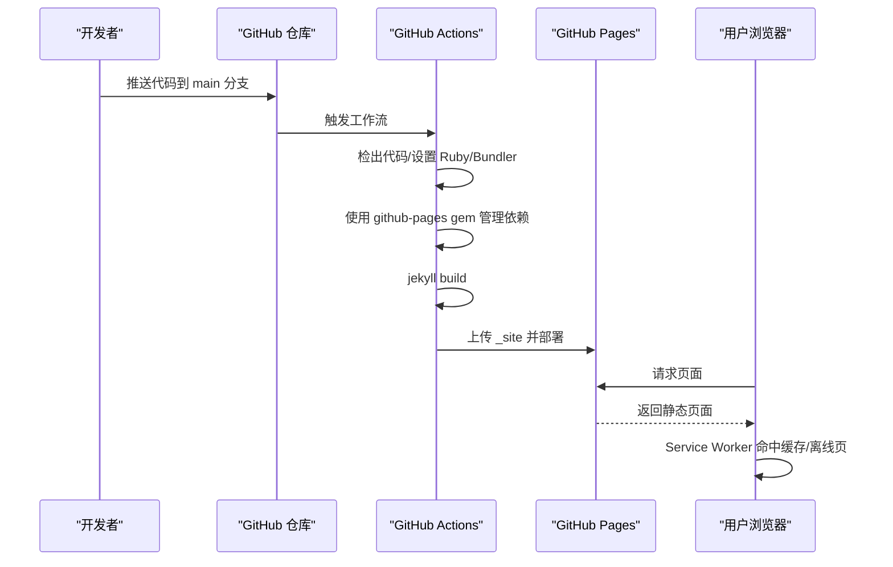
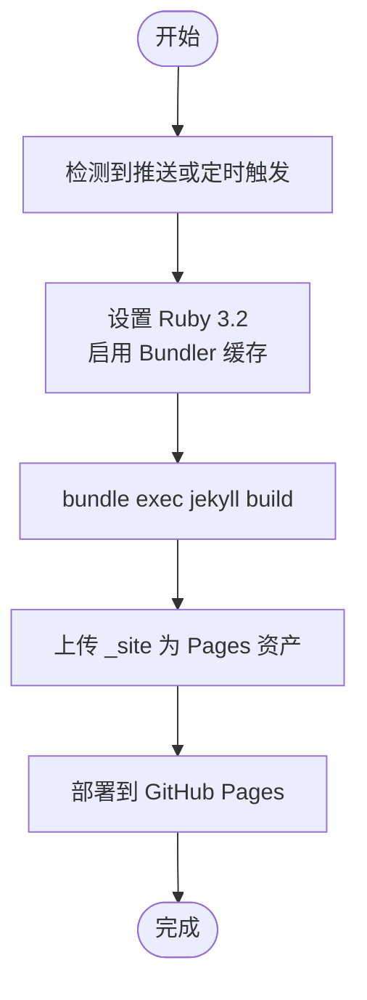
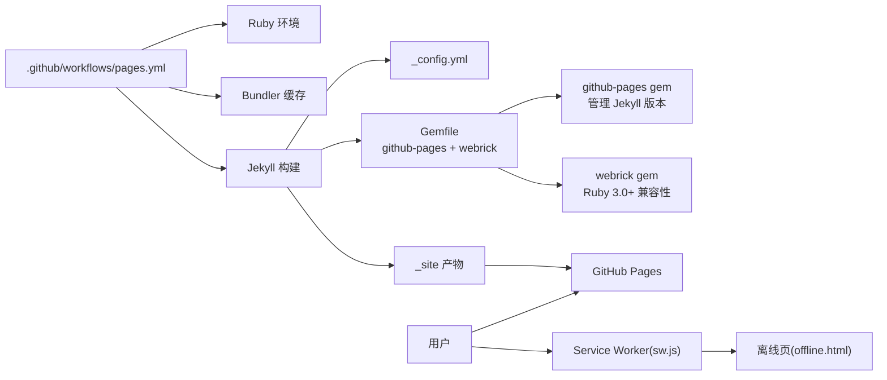

# 部署与维护

<cite>
**本文引用的文件**
- [pages.yml](file://.github/workflows/pages.yml)
- [_config.yml](file://_config.yml)
- [Gemfile](file://Gemfile)
- [README.md](file://README.md)
- [CNAME](file://CNAME)
- [robots.txt](file://robots.txt)
- [manifest.json](file://manifest.json)
- [sw.js](file://sw.js)
- [offline.html](file://offline.html)
- [projects.yml](file://_data/projects.yml)
- [index.html](file://index.html)
</cite>

## 更新摘要
**变更内容**
- 更新了 Gemfile 依赖管理策略，采用 github-pages gem 替代直接 jekyll 依赖
- 添加 webrick gem 以支持 Ruby 3.0+ 兼容性
- 优化了依赖管理的兼容性配置，确保与 GitHub Actions 工作流的无缝集成
- 更新了 PWA 缓存策略和离线体验配置

## 目录
1. [引言](#引言)
2. [项目结构](#项目结构)
3. [核心组件](#核心组件)
4. [架构总览](#架构总览)
5. [详细组件分析](#详细组件分析)
6. [依赖关系分析](#依赖关系分析)
7. [性能考虑](#性能考虑)
8. [故障排查指南](#故障排查指南)
9. [结论](#结论)
10. [附录](#附录)

## 引言
本指南面向 halfism.github.io 项目的维护者与贡献者，覆盖 GitHub Pages 自动部署流程、本地开发环境搭建、生产环境配置优化、自定义域名配置、版本与分支管理策略、监控与排障、备份与恢复，以及常见问题诊断与维护最佳实践。文档中的技术细节均来自仓库现有配置与实现文件。

**更新** 本版本反映了最新的依赖管理重构，采用更稳定的 github-pages gem 方案，并解决了 Ruby 3.0+ 兼容性问题，同时优化了 PWA 缓存策略以提升用户体验。

## 项目结构
该站点采用 Jekyll 静态站点生成器，结合 GitHub Actions 实现自动化构建与部署；前端通过 PWA 与 Service Worker 提升离线可用性与加载性能；配置集中在 _config.yml 与 Gemfile，数据通过 _data 下的 YAML 文件驱动页面渲染。

```mermaid
graph TB
A[".github/workflows/pages.yml<br/>工作流配置"] --> B["GitHub Actions 运行环境"]
B --> C["Ruby 环境<br/>ruby/setup-ruby@v1"]
C --> D["Bundler 缓存<br/>bundler-cache: true"]
D --> E["Jekyll 构建<br/>bundle exec jekyll build"]
E --> F["上传产物<br/>actions/upload-pages-artifact@v3"]
F --> G["GitHub Pages 部署<br/>actions/deploy-pages@v4"]
H["_config.yml<br/>站点配置"] --> E
I[Gemfile<br/>依赖声明<br/>github-pages + webrick"] --> C
J["CNAME<br/>自定义域名"] --> K["DNS 解析至 GitHub Pages"]
L["PWA 配置<br/>Service Worker + Manifest"] --> M["离线体验优化"]
```

**图表来源**
- [.github/workflows/pages.yml:1-50](file://.github/workflows/pages.yml#L1-L50)
- [_config.yml:1-133](file://_config.yml#L1-L133)
- [Gemfile:1-8](file://Gemfile#L1-L8)
- [CNAME:1-1](file://CNAME#L1-L1)
- [sw.js:1-237](file://sw.js#L1-L237)
- [manifest.json:1-79](file://manifest.json#L1-L79)

**章节来源**
- [README.md:26-63](file://README.md#L26-L63)
- [.github/workflows/pages.yml:1-50](file://.github/workflows/pages.yml#L1-L50)
- [_config.yml:1-133](file://_config.yml#L1-L133)
- [Gemfile:1-8](file://Gemfile#L1-L8)
- [CNAME:1-1](file://CNAME#L1-L1)
- [sw.js:1-237](file://sw.js#L1-L237)
- [manifest.json:1-79](file://manifest.json#L1-L79)

## 核心组件
- **GitHub Actions 工作流**：在推送到 main 分支或每日 UTC 午夜定时触发，执行 Ruby 环境准备、Bundler 缓存、Jekyll 构建、产物上传与 GitHub Pages 部署。
- **Jekyll 配置**：站点元信息、SEO、评论系统、Analytics、多语言、插件与排除项等。
- **依赖管理**：Gemfile 采用 github-pages gem 管理 Jekyll 版本与插件组合，webrick 作为本地开发服务器兼容 Ruby 3.0+。
- **PWA 与 Service Worker**：预缓存关键资源、离线页、多策略缓存与后台同步占位。
- **自定义域名**：CNAME 文件声明域名，配合 DNS 解析指向 GitHub Pages。

**更新** 依赖管理采用 github-pages gem 方案，提供更稳定的版本兼容性和插件组合管理，同时优化了 PWA 缓存策略以提升离线体验。

**章节来源**
- [.github/workflows/pages.yml:1-50](file://.github/workflows/pages.yml#L1-L50)
- [_config.yml:1-133](file://_config.yml#L1-L133)
- [Gemfile:1-8](file://Gemfile#L1-L8)
- [sw.js:1-237](file://sw.js#L1-L237)
- [offline.html:1-82](file://offline.html#L1-L82)
- [CNAME:1-1](file://CNAME#L1-L1)
- [manifest.json:1-79](file://manifest.json#L1-L79)

## 架构总览
下图展示了从代码提交到用户访问的完整链路，包括自动部署、构建产物与运行时缓存策略。



**图表来源**
- [.github/workflows/pages.yml:19-50](file://.github/workflows/pages.yml#L19-L50)
- [sw.js:84-114](file://sw.js#L84-L114)

## 详细组件分析

### GitHub Actions 自动部署工作流
- **触发条件**：推送至 main 分支；每日 UTC 午夜定时任务。
- **权限**：读取内容、写入 Pages、令牌签发。
- **并发控制**：同组"pages"互斥，允许队列等待。
- **步骤**：
  - 检出代码
  - 设置 Ruby 3.2 并启用 Bundler 缓存
  - 构建 Jekyll 站点
  - 上传 _site 为 Pages 资产
  - 部署到 GitHub Pages 环境并输出页面 URL



**图表来源**
- [.github/workflows/pages.yml:3-50](file://.github/workflows/pages.yml#L3-L50)

**章节来源**
- [.github/workflows/pages.yml:1-50](file://.github/workflows/pages.yml#L1-L50)

### 本地开发环境与依赖管理
- **Ruby 版本**：3.2（由工作流指定）
- **Jekyll 版本**：通过 github-pages gem 管理，无需直接声明 jekyll 版本
- **插件组**：jekyll-feed、jekyll-sitemap、jekyll-seo-tag（由 github-pages gem 提供）
- **本地启动**：bundle install 后使用 bundle exec jekyll serve
- **Ruby 3.0+ 兼容性**：webrick gem 确保本地开发服务器正常运行
- **本地调试建议**：确认 Bundler 缓存命中与端口占用情况

**更新** 采用 github-pages gem 管理 Jekyll 版本，简化了依赖声明并确保与 GitHub Pages 环境的一致性。webrick gem 提供了 Ruby 3.0+ 的兼容性支持。

**章节来源**
- [.github/workflows/pages.yml:26-33](file://.github/workflows/pages.yml#L26-L33)
- [Gemfile:1-8](file://Gemfile#L1-L8)
- [README.md:80-94](file://README.md#L80-L94)

### 生产环境配置优化
- **缓存策略（PWA 与 Service Worker）**：
  - 预缓存：首页与关键路径、样式、脚本、manifest
  - 外部资源：CDN 资源缓存（如字体、Analytics 脚本）
  - 策略选择：HTML 导航走网络优先，静态资源走"先缓存后后台更新"，外部资源走缓存优先
  - 离线页：/offline.html 提供用户引导与重试
- **SEO 与元数据**：_config.yml 中配置 SEO、OG、Twitter Card、Sitemap 与 Analytics
- **插件与排除**：sitemap、feed、seo-tag；排除 node_modules、vendor/*、.gitignore 等

**更新** PWA 缓存策略经过优化，提供了更好的离线体验和资源管理。

**章节来源**
- [sw.js:11-26](file://sw.js#L11-L26)
- [sw.js:84-114](file://sw.js#L84-L114)
- [sw.js:120-143](file://sw.js#L120-L143)
- [sw.js:149-168](file://sw.js#L149-L168)
- [sw.js:174-194](file://sw.js#L174-L194)
- [sw.js:207-211](file://sw.js#L207-L211)
- [offline.html:1-82](file://offline.html#L1-L82)
- [_config.yml:45-133](file://_config.yml#L45-L133)

### 自定义域名配置
- **CNAME 文件**：声明目标域名（例如 halfism.com）
- **DNS 配置**：将域名解析指向 GitHub Pages（具体记录类型与值请参考 GitHub Pages 官方说明）
- **注意**：仓库根目录存在 CNAME 文件即启用自定义域名；若需回退，请删除该文件并同步 DNS 记录

**章节来源**
- [CNAME:1-1](file://CNAME#L1-L1)

### 版本控制与分支管理策略
- **主分支保护**：建议对 main 分支启用保护规则（禁止直接推送、强制 PR 合并、要求审查与状态检查通过）
- **发布流程**：通过 Pull Request 合并变更，触发工作流自动构建与部署；如需灰度或预览，可利用 GitHub Pages 的环境与预览能力
- **日志与追踪**：_data/logs.yml 记录迭代历史，便于审计与回溯

**章节来源**
- [projects.yml:1-45](file://_data/projects.yml#L1-L45)

### 监控与错误排查
- **日志分析**：关注 GitHub Actions 工作流日志中的 Ruby、Bundler、Jekyll 构建阶段输出；定位失败步骤
- **性能监控**：利用 Lighthouse、WebPageTest 等工具评估 Core Web Vitals；结合 Service Worker 缓存命中率与离线页可用性
- **常见问题**：
  - Ruby/Jekyll 版本不匹配：确保本地与工作流一致（Ruby 3.2、通过 github-pages gem 管理）
  - Bundler 缓存未命中：清理 vendor/bundle 或 Gemfile.lock 后重新安装
  - PWA 缓存陈旧：通过 Service Worker 消息或更新策略主动刷新缓存
  - 自定义域名未生效：核对 CNAME 内容与 DNS 解析状态
  - Ruby 3.0+ 兼容性问题：确保 webrick gem 已正确安装

**更新** 新增 Ruby 3.0+ 兼容性问题排查指导，以及 PWA 缓存策略优化后的故障排查方法。

**章节来源**
- [.github/workflows/pages.yml:26-33](file://.github/workflows/pages.yml#L26-L33)
- [Gemfile:1-8](file://Gemfile#L1-L8)
- [sw.js:214-224](file://sw.js#L214-L224)

### 备份与恢复策略
- **代码备份**：保持 main 分支为唯一可信源；定期导出 _data 下的内容数据用于归档
- **配置备份**：_config.yml、Gemfile、CNAME 等关键配置文件纳入版本控制
- **恢复流程**：在新环境按 README 的本地开发步骤还原依赖并验证构建；如遇 PWA 缓存问题，可通过 Service Worker 消息清理缓存

**章节来源**
- [README.md:80-94](file://README.md#L80-L94)
- [sw.js:214-224](file://sw.js#L214-L224)

## 依赖关系分析
- **工作流依赖**：Actions 步骤依赖 Ruby 环境与 Bundler；Jekyll 构建依赖 _config.yml 与 github-pages gem 声明的插件组合
- **运行时依赖**：PWA 通过 Service Worker 管理缓存；离线页提供兜底体验
- **数据依赖**：页面内容由 _data 下的 YAML 文件驱动，确保数据结构与键名与模板一致



**图表来源**
- [.github/workflows/pages.yml:19-50](file://.github/workflows/pages.yml#L19-L50)
- [_config.yml:1-133](file://_config.yml#L1-L133)
- [Gemfile:1-8](file://Gemfile#L1-L8)
- [sw.js:1-237](file://sw.js#L1-L237)
- [offline.html:1-82](file://offline.html#L1-L82)

**更新** 依赖关系图反映了新的 github-pages gem 和 webrick 依赖管理方案，以及优化后的 PWA 缓存策略。

**章节来源**
- [.github/workflows/pages.yml:19-50](file://.github/workflows/pages.yml#L19-L50)
- [_config.yml:1-133](file://_config.yml#L1-L133)
- [Gemfile:1-8](file://Gemfile#L1-L8)
- [sw.js:1-237](file://sw.js#L1-L237)
- [offline.html:1-82](file://offline.html#L1-L82)

## 性能考虑
- **构建性能**：启用 Bundler 缓存，避免重复安装依赖；在本地使用 bundle exec jekyll serve 加速迭代
- **运行性能**：Service Worker 多策略缓存降低带宽与延迟；离线页提升弱网体验
- **SEO 与可达性**：_config.yml 中的 SEO、Sitemap、Analytics 与无障碍标签有助于搜索引擎收录与可访问性评分

**更新** 优化后的 PWA 缓存策略进一步提升了运行时性能和用户体验。

**章节来源**
- [.github/workflows/pages.yml:26-33](file://.github/workflows/pages.yml#L26-L33)
- [_config.yml:45-133](file://_config.yml#L45-L133)
- [sw.js:84-114](file://sw.js#L84-L114)

## 故障排查指南
- **构建失败**
  - 检查 Ruby 版本与 Jekyll 版本是否与 Gemfile/_config.yml 一致
  - 查看 Bundler 缓存是否异常，必要时清理 vendor/bundle
  - 确认 github-pages gem 是否正确安装并管理依赖
- **Ruby 3.0+ 兼容性问题**
  - 确认 webrick gem 已正确安装
  - 检查 Ruby 版本与 webrick 兼容性
- **自定义域名无效**
  - 确认 CNAME 内容正确，DNS 已解析至 GitHub Pages
- **PWA 不生效**
  - 检查 Service Worker 注册与缓存策略；必要时通过消息清理缓存
- **离线页未显示**
  - 确认 /offline.html 存在且可访问；检查 Service Worker 的离线回退逻辑
- **缓存策略问题**
  - 检查 Service Worker 的缓存策略配置
  - 确认预缓存资源列表与实际资源匹配

**更新** 新增 Ruby 3.0+ 兼容性问题排查指导，以及 PWA 缓存策略相关的故障排查方法。

**章节来源**
- [.github/workflows/pages.yml:26-33](file://.github/workflows/pages.yml#L26-L33)
- [CNAME:1-1](file://CNAME#L1-L1)
- [sw.js:214-224](file://sw.js#L214-L224)
- [offline.html:1-82](file://offline.html#L1-L82)

## 结论
halfism.github.io 采用轻量、可维护的 Jekyll + GitHub Pages + PWA 架构，结合自动化工作流实现稳定高效的发布与运行。通过采用 github-pages gem 的依赖管理方案和 webrick 兼容性支持，进一步提升了构建稳定性与环境一致性。优化后的 PWA 缓存策略显著改善了离线体验和运行性能。遵循本文的部署与维护指南，可确保构建一致性、运行稳定性与用户体验。

## 附录
- **快速检查清单**
  - Ruby/Jekyll 版本与 Gemfile/_config.yml 一致
  - 工作流权限与触发条件符合预期
  - CNAME 与 DNS 配置正确
  - Service Worker 缓存策略与离线页可用
  - 数据文件结构与键名与模板一致
  - github-pages gem 正确管理 Jekyll 依赖
  - webrick gem 支持 Ruby 3.0+ 兼容性
  - PWA 缓存策略配置正确
  - 离线页功能正常