# 项目概述

<cite>
**本文档引用的文件**
- [README.md](file://README.md)
- [_config.yml](file://_config.yml)
- [Gemfile](file://Gemfile)
- [index.html](file://index.html)
- [assets/js/main.js](file://assets/js/main.js)
- [assets/css/style.css](file://assets/css/style.css)
- [_data/projects.yml](file://_data/projects.yml)
- [_data/skills.yml](file://_data/skills.yml)
- [_data/socials.yml](file://_data/socials.yml)
- [_includes/header.html](file://_includes/header.html)
- [_includes/footer.html](file://_includes/footer.html)
- [_layouts/default.html](file://_layouts/default.html)
- [_includes/sections/hero.html](file://_includes/sections/hero.html)
- [_includes/sections/projects.html](file://_includes/sections/projects.html)
- [_includes/sections/skills.html](file://_includes/sections/skills.html)
- [.github/workflows/pages.yml](file://.github/workflows/pages.yml)
- [manifest.json](file://manifest.json)
</cite>

## 目录
1. [引言](#引言)
2. [项目结构](#项目结构)
3. [核心组件](#核心组件)
4. [架构总览](#架构总览)
5. [详细组件分析](#详细组件分析)
6. [依赖关系分析](#依赖关系分析)
7. [性能考量](#性能考量)
8. [故障排除指南](#故障排除指南)
9. [结论](#结论)
10. [附录](#附录)

## 引言
halfism.github.io 是一个现代化的个人作品集网站，基于 Jekyll 静态网站生成器构建，并托管于 GitHub Pages。该项目以“数据驱动、组件化、渐进增强、性能优先、无障碍”为核心设计原则，提供简洁的卡片式布局、深色模式支持、多语言切换、响应式设计以及完善的 SEO 和无障碍优化。项目通过最小化外部依赖、使用原生 JavaScript 和 CSS 变量，实现了轻量、高性能且易于维护的静态站点。

## 项目结构
项目采用 Jekyll 的标准目录结构，结合数据驱动与组件化思想，将内容与展示分离，便于维护与扩展。关键目录与文件职责如下：
- 根目录：站点入口页面（如首页、博客列表、画廊等）与全局配置
- _config.yml：站点元信息、主题配置、SEO 设置、多语言与插件配置
- _data：YAML 数据文件，用于管理项目、技能、证书、社交链接等数据
- _includes：可复用的页面片段（头部、底部、各功能区块组件）
- _layouts：页面布局模板，默认布局包含 SEO、PWA、Analytics 等通用元素
- assets：样式与脚本资源，使用 CSS 变量统一主题与设计令牌
- .github/workflows：GitHub Actions 工作流，自动化构建与部署到 GitHub Pages
- manifest.json：PWA 清单，支持离线与安装体验

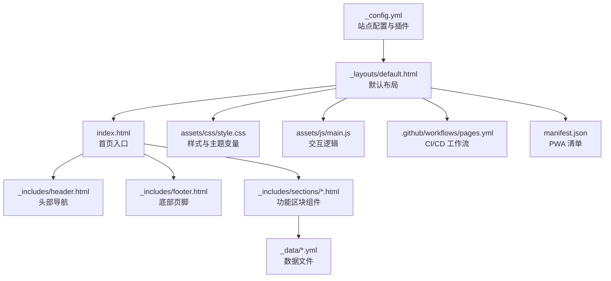

**图表来源**
- [_config.yml:1-133](file://_config.yml#L1-L133)
- [_layouts/default.html:1-152](file://_layouts/default.html#L1-L152)
- [index.html:1-17](file://index.html#L1-L17)
- [_includes/header.html:1-116](file://_includes/header.html#L1-L116)
- [_includes/footer.html:1-49](file://_includes/footer.html#L1-L49)
- [_includes/sections/hero.html:1-56](file://_includes/sections/hero.html#L1-L56)
- [_data/projects.yml:1-45](file://_data/projects.yml#L1-L45)
- [assets/css/style.css:1-1015](file://assets/css/style.css#L1-L1015)
- [assets/js/main.js:1-279](file://assets/js/main.js#L1-L279)
- [.github/workflows/pages.yml:1-50](file://.github/workflows/pages.yml#L1-L50)
- [manifest.json:1-79](file://manifest.json#L1-L79)

**章节来源**
- [README.md:26-63](file://README.md#L26-L63)
- [_config.yml:1-133](file://_config.yml#L1-L133)
- [index.html:1-17](file://index.html#L1-L17)

## 核心组件
- 数据驱动内容管理：通过 _data 下的 YAML 文件集中管理项目、技能、证书、社交链接等数据，实现内容与展示解耦，便于非技术用户维护。
- 组件化页面结构：使用 _includes/sections 下的功能区块组件（如 hero、projects、skills 等），在页面中以 include 方式组合，提高复用性与一致性。
- 主题与样式系统：基于 CSS 变量的统一设计令牌，支持浅色/深色主题切换与一键切换 UI 更新；暗色模式通过 data-theme 属性与 CSS 变量覆盖实现。
- 原生交互与无障碍：使用原生 JavaScript 实现主题切换、回到顶部、滚动进度条、平滑滚动、滚动动画与移动端菜单；遵循 WCAG 标准，提供 skip link、ARIA 属性与键盘导航。
- 多语言支持：通过页面 front matter 与 _config.yml 的 languages/default_lang 配置，实现中英双语内容渲染与语言切换。
- SEO 与结构化数据：默认布局集成 jekyll-seo-tag 插件，输出 Open Graph、Twitter Card、JSON-LD 结构化数据与 hreflang 多语言链接。
- PWA 支持：提供 manifest.json、Service Worker（sw.js）、offline.html 与在线/离线状态提示，增强离线可用性与安装体验。
- CI/CD 自动化：GitHub Actions 在推送主分支时自动构建并部署到 GitHub Pages，支持定时构建与权限控制。

**章节来源**
- [README.md:65-79](file://README.md#L65-L79)
- [_config.yml:62-133](file://_config.yml#L62-L133)
- [assets/css/style.css:10-145](file://assets/css/style.css#L10-L145)
- [assets/js/main.js:27-75](file://assets/js/main.js#L27-L75)
- [_layouts/default.html:1-152](file://_layouts/default.html#L1-L152)
- [manifest.json:1-79](file://manifest.json#L1-L79)
- [.github/workflows/pages.yml:1-50](file://.github/workflows/pages.yml#L1-L50)

## 架构总览
整体架构围绕“静态生成 + 原生前端 + 数据驱动”的思路展开，强调性能与可维护性。Jekyll 在构建阶段读取 _data 与 _includes，结合 _layouts 输出纯静态 HTML/CSS/JS；运行时由 assets/js/main.js 提供轻量交互；GitHub Actions 实现自动化部署。

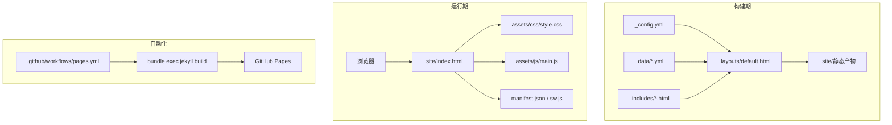

**图表来源**
- [_config.yml:1-133](file://_config.yml#L1-L133)
- [_layouts/default.html:1-152](file://_layouts/default.html#L1-L152)
- [_data/projects.yml:1-45](file://_data/projects.yml#L1-L45)
- [_data/skills.yml:1-41](file://_data/skills.yml#L1-L41)
- [_data/socials.yml:1-20](file://_data/socials.yml#L1-L20)
- [assets/css/style.css:1-1015](file://assets/css/style.css#L1-L1015)
- [assets/js/main.js:1-279](file://assets/js/main.js#L1-L279)
- [manifest.json:1-79](file://manifest.json#L1-L79)
- [.github/workflows/pages.yml:1-50](file://.github/workflows/pages.yml#L1-L50)

## 详细组件分析

### 主题管理系统
主题系统通过 data-theme 属性与 CSS 变量实现，支持自动检测系统偏好、手动切换与持久化存储。切换时同步更新 UI 图标与按钮状态，并通过 ARIA 属性反馈当前状态。

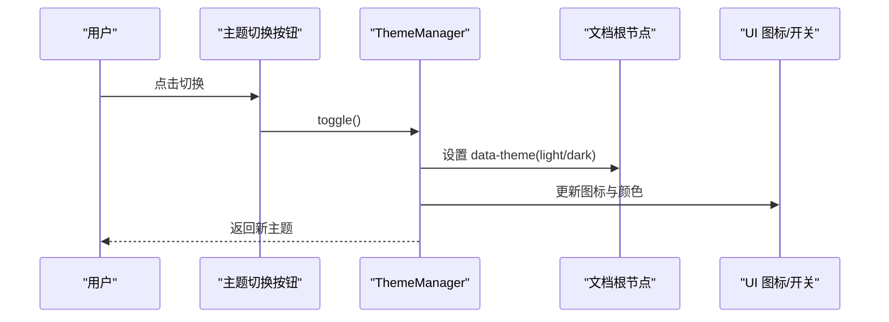

**图表来源**
- [assets/js/main.js:27-75](file://assets/js/main.js#L27-L75)
- [_layouts/default.html:59-67](file://_layouts/default.html#L59-L67)
- [assets/css/style.css:110-145](file://assets/css/style.css#L110-L145)

**章节来源**
- [assets/js/main.js:27-75](file://assets/js/main.js#L27-L75)
- [_layouts/default.html:59-67](file://_layouts/default.html#L59-L67)
- [assets/css/style.css:110-145](file://assets/css/style.css#L110-L145)

### 导航与多语言切换
导航组件提供桌面端与移动端两套菜单，支持语言切换、主题切换、搜索入口与社交链接。语言切换通过相对路径与 hreflang 标签实现 SEO 友好切换。

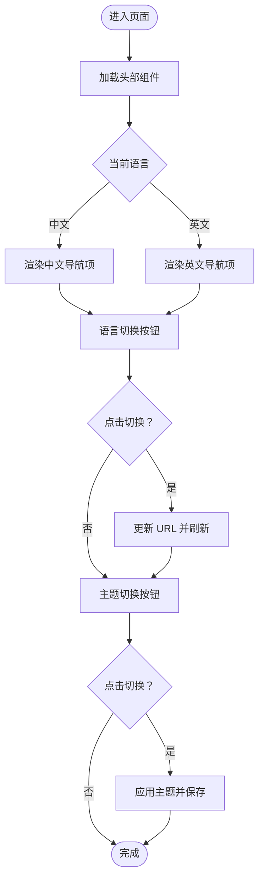

**图表来源**
- [_includes/header.html:1-116](file://_includes/header.html#L1-L116)
- [_config.yml:62-76](file://_config.yml#L62-L76)
- [_layouts/default.html:17-26](file://_layouts/default.html#L17-L26)

**章节来源**
- [_includes/header.html:1-116](file://_includes/header.html#L1-L116)
- [_config.yml:62-76](file://_config.yml#L62-L76)
- [_layouts/default.html:17-26](file://_layouts/default.html#L17-L26)

### 组件化页面区块
首页通过 include 将多个功能区块组合，每个区块独立维护，便于按需替换与扩展。典型区块包括 Hero、About、Projects、Skills、Logs、GitHub Stats、Certificates、Contact 等。

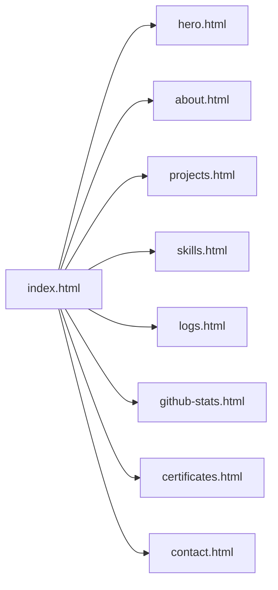

**图表来源**
- [index.html:7-16](file://index.html#L7-L16)
- [_includes/sections/hero.html:1-56](file://_includes/sections/hero.html#L1-L56)
- [_includes/sections/projects.html:1-50](file://_includes/sections/projects.html#L1-L50)
- [_includes/sections/skills.html:1-61](file://_includes/sections/skills.html#L1-L61)

**章节来源**
- [index.html:7-16](file://index.html#L7-L16)
- [_includes/sections/hero.html:1-56](file://_includes/sections/hero.html#L1-L56)
- [_includes/sections/projects.html:1-50](file://_includes/sections/projects.html#L1-L50)
- [_includes/sections/skills.html:1-61](file://_includes/sections/skills.html#L1-L61)

### 数据驱动与内容管理
项目通过 _data 下的 YAML 文件集中管理内容，如项目列表、技能标签、社交链接等。页面通过 Liquid 语法读取这些数据，实现内容与展示的完全分离。

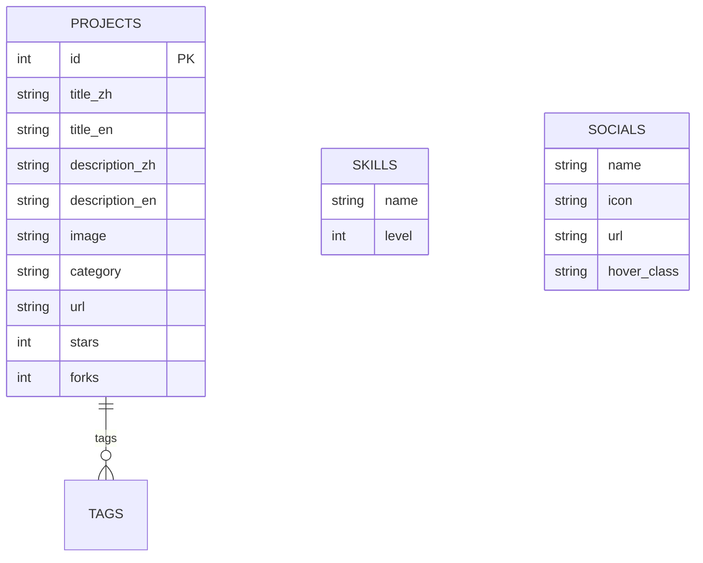

**图表来源**
- [_data/projects.yml:1-45](file://_data/projects.yml#L1-L45)
- [_data/skills.yml:1-41](file://_data/skills.yml#L1-L41)
- [_data/socials.yml:1-20](file://_data/socials.yml#L1-L20)

**章节来源**
- [_data/projects.yml:1-45](file://_data/projects.yml#L1-L45)
- [_data/skills.yml:1-41](file://_data/skills.yml#L1-L41)
- [_data/socials.yml:1-20](file://_data/socials.yml#L1-L20)

### 原生交互与无障碍优化
原生 JavaScript 提供主题切换、回到顶部、滚动进度条、平滑滚动、滚动动画与移动端菜单等交互；同时遵循无障碍标准，提供 skip link、ARIA 属性与键盘导航支持。

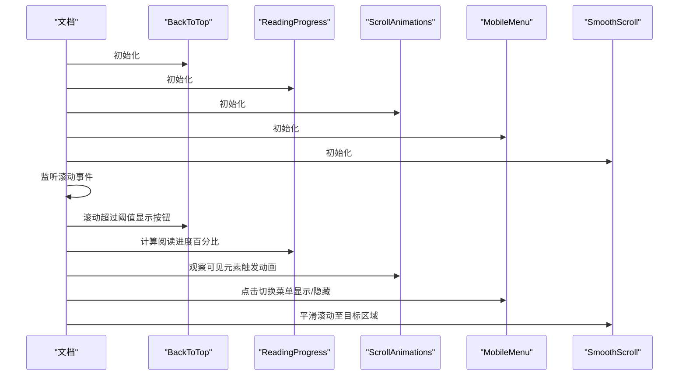

**图表来源**
- [assets/js/main.js:80-116](file://assets/js/main.js#L80-L116)
- [assets/js/main.js:121-142](file://assets/js/main.js#L121-L142)
- [assets/js/main.js:147-165](file://assets/js/main.js#L147-L165)
- [assets/js/main.js:170-207](file://assets/js/main.js#L170-L207)
- [assets/js/main.js:212-230](file://assets/js/main.js#L212-L230)

**章节来源**
- [assets/js/main.js:80-116](file://assets/js/main.js#L80-L116)
- [assets/js/main.js:121-142](file://assets/js/main.js#L121-L142)
- [assets/js/main.js:147-165](file://assets/js/main.js#L147-L165)
- [assets/js/main.js:170-207](file://assets/js/main.js#L170-L207)
- [assets/js/main.js:212-230](file://assets/js/main.js#L212-L230)

### SEO 与结构化数据
默认布局集成 jekyll-seo-tag，自动注入 Open Graph、Twitter Card、关键词与 hreflang 多语言链接；同时输出 JSON-LD 结构化数据，提升搜索引擎友好度。

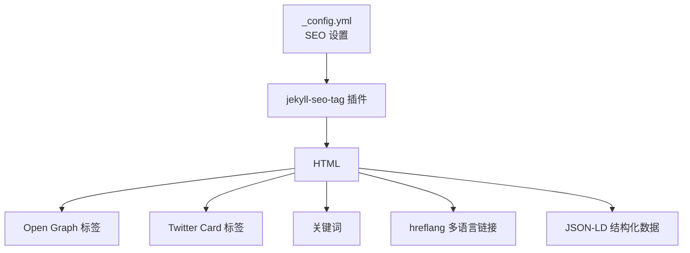

**图表来源**
- [_config.yml:46-61](file://_config.yml#L46-L61)
- [_layouts/default.html:12-116](file://_layouts/default.html#L12-L116)

**章节来源**
- [_config.yml:46-61](file://_config.yml#L46-L61)
- [_layouts/default.html:12-116](file://_layouts/default.html#L12-L116)

### PWA 与离线体验
通过 manifest.json 提供应用清单，sw.js 实现 Service Worker 缓存策略，结合 offline.html 与在线/离线状态提示，提供类原生应用的安装与离线浏览体验。

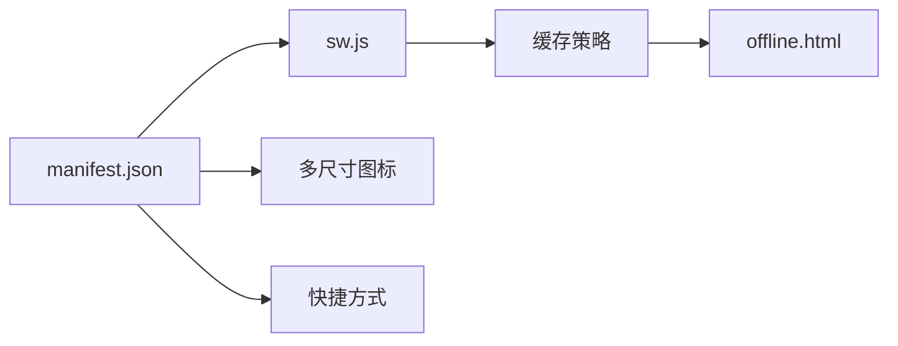

**图表来源**
- [manifest.json:1-79](file://manifest.json#L1-L79)
- [assets/js/main.js:258](file://assets/js/main.js#L258)

**章节来源**
- [manifest.json:1-79](file://manifest.json#L1-L79)
- [assets/js/main.js:258](file://assets/js/main.js#L258)

### CI/CD 自动化部署
GitHub Actions 在推送主分支时自动执行构建与部署，支持定时构建与并发控制，确保发布流程稳定可靠。

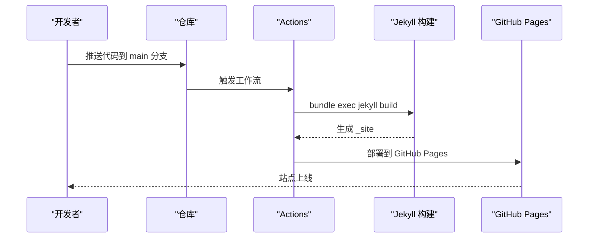

**图表来源**
- [.github/workflows/pages.yml:1-50](file://.github/workflows/pages.yml#L1-L50)

**章节来源**
- [.github/workflows/pages.yml:1-50](file://.github/workflows/pages.yml#L1-L50)

## 依赖关系分析
- 构建工具链：Ruby + Jekyll（版本约束见 Gemfile），配合 jekyll-feed、jekyll-sitemap、jekyll-seo-tag 等插件
- 运行时依赖：Font Awesome 4.7（CDN 引入）、Google Analytics（可选）、PWA 相关资源
- 部署平台：GitHub Pages，通过 GitHub Actions 自动化构建与发布

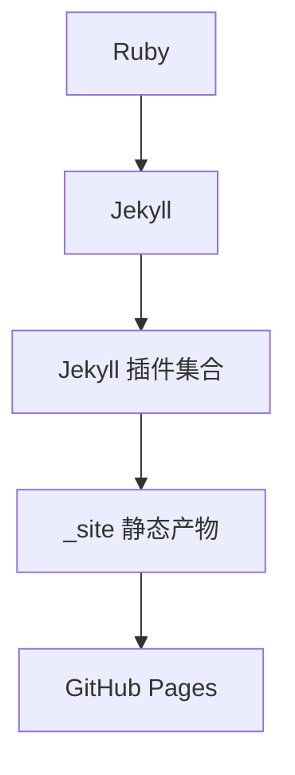

**图表来源**
- [Gemfile:1-12](file://Gemfile#L1-L12)
- [_config.yml:110-114](file://_config.yml#L110-L114)
- [.github/workflows/pages.yml:32-38](file://.github/workflows/pages.yml#L32-L38)

**章节来源**
- [Gemfile:1-12](file://Gemfile#L1-L12)
- [_config.yml:110-114](file://_config.yml#L110-L114)
- [.github/workflows/pages.yml:32-38](file://.github/workflows/pages.yml#L32-L38)

## 性能考量
- 轻量化与零依赖：原生 JavaScript，无重型框架；移除外部 CSS 框架，仅使用 CSS 变量与基础样式
- 加载优化：预连接外部资源、延迟加载图片、减少首屏脚本体积
- 交互优化：防抖处理滚动事件、IntersectionObserver 优化滚动动画与进度条
- 主题切换：避免重绘与回流，通过 CSS 变量与 data-theme 属性实现即时切换
- SEO 与可访问性：遵循 WCAG 标准，提供键盘导航与屏幕阅读器支持，提升 Core Web Vitals

[本节为通用性能指导，无需特定文件引用]

## 故障排除指南
- 主题切换无效：检查 data-theme 属性是否正确设置、CSS 变量覆盖是否生效、localStorage 是否被禁用
- 语言切换后链接异常：确认 _config.yml 中 languages 与默认语言配置、页面 front matter 的 lang 设置与 hreflang 标签
- 滚动动画不触发：确认浏览器支持 IntersectionObserver，或降级为直接显示
- PWA 无法安装：检查 manifest.json 字段完整性、Service Worker 注册与缓存策略
- GitHub Pages 部署失败：查看 Actions 日志中的构建错误、Gemfile 版本冲突与插件兼容性

**章节来源**
- [assets/js/main.js:27-75](file://assets/js/main.js#L27-L75)
- [_config.yml:62-76](file://_config.yml#L62-L76)
- [_layouts/default.html:17-26](file://_layouts/default.html#L17-L26)
- [manifest.json:1-79](file://manifest.json#L1-L79)
- [.github/workflows/pages.yml:1-50](file://.github/workflows/pages.yml#L1-L50)

## 结论
halfism.github.io 以“数据驱动 + 组件化 + 渐进增强 + 性能优先 + 无障碍”为核心理念，结合 Jekyll 静态生成与 GitHub Pages 自动化部署，构建了一个现代化、可维护、高性能且具备良好用户体验的个人作品集网站。其简洁的架构与清晰的职责划分，既适合初学者快速上手，也为有经验的开发者提供了良好的扩展空间与技术决策参考。

[本节为总结性内容，无需特定文件引用]

## 附录
- 快速开始：安装 Ruby 与 Bundler，执行 bundle install 与 bundle exec jekyll serve
- 自定义配置：编辑 _config.yml 中作者信息、社交链接、主题设置、SEO 与评论系统
- 添加新页面：在根目录创建 HTML 文件并设置 layout: default 与多语言 front matter
- 创建新组件：在 _includes/sections 下创建 .html 文件并通过 include 引入

**章节来源**
- [README.md:80-123](file://README.md#L80-L123)